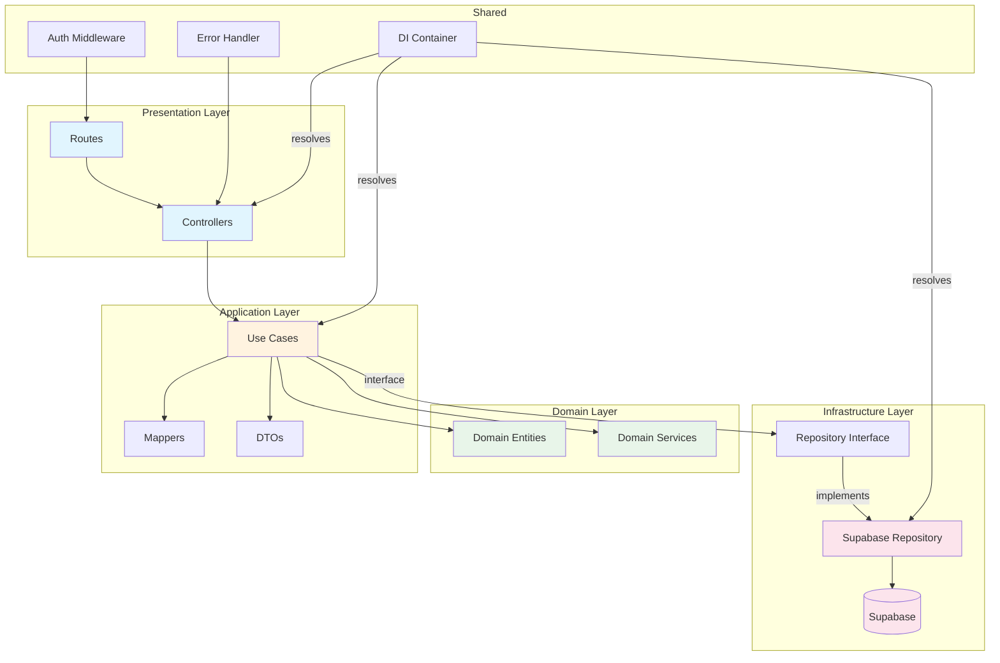
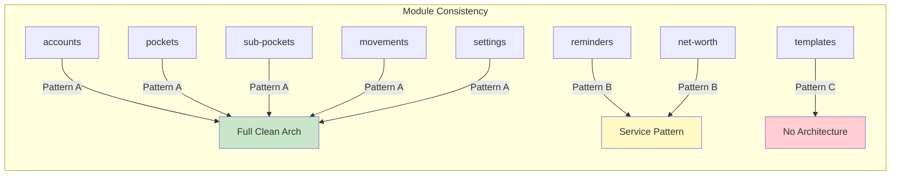

# Backend Architecture Audit

**Date**: 2026-05-21  
**Scope**: `backend/src/` — all modules, shared infrastructure, server setup  
**Verdict**: Structurally sound with significant inconsistencies between modules and several critical gaps

---

## Executive Summary

The backend follows a clean architecture pattern with proper layer separation in most modules (accounts, pockets, sub-pockets, movements, settings). However, two modules (reminders, net-worth) use completely different patterns, there are N+1 query issues, no input validation library, every repository creates its own Supabase client instance, and the template routes bypass architecture entirely.

### Severity Breakdown

| Severity | Count | Description |
|----------|-------|-------------|
| Critical | 3 | N+1 queries, no transactions, multiple Supabase clients |
| High | 4 | Inconsistent module patterns, no input validation, template routes bypass architecture, missing userId checks |
| Medium | 4 | God-container (manageable), TODO debt, inconsistent error handling, balance recalculation design |
| Low | 2 | Duplicate DI registration, controller boilerplate |

---

## 1. Clean Architecture Layer Separation

**Verdict: Mostly clean, with exceptions**

### Proper modules (accounts, pockets, sub-pockets, movements, settings)

```
presentation/ → application/useCases/ → domain/ → infrastructure/
     ↓                    ↓                           ↓
  Controllers         Use Cases                  Repositories
  Routes              DTOs/Mappers               Supabase impl
```

- Presentation depends on application (correct)
- Application depends on domain + infrastructure interfaces (correct)
- Infrastructure implements interfaces (correct)
- Domain has zero external dependencies (correct)

### Violations

| Module | Issue | Severity |
|--------|-------|----------|
| `net-worth` | Routes file manually instantiates repository and service — bypasses DI entirely | High |
| `reminders` | Controller lives in `interfaces/` not `presentation/` — naming inconsistency | Medium |
| `movements/templateRoutes.ts` | Entire route file talks directly to Supabase — no controller, no use case, no domain | High |

**net-worth routes.ts** creates dependencies inline:
```typescript
// WRONG: Manual instantiation bypasses DI container
const repository = new SupabaseNetWorthSnapshotRepository();
const service = new NetWorthSnapshotService(repository);
const controller = new NetWorthSnapshotController(service);
```

**templateRoutes.ts** is a 280-line file that is effectively a fat controller + repository in one file. It creates its own Supabase client, does validation, queries the DB, and returns responses — all in route handlers.

---

## 2. Use Case Complexity

**Verdict: Mostly appropriate, one is doing too much**

### `CreateMovementUseCase` — doing too much

This use case handles:
1. Input validation
2. Reference verification (account, pocket, sub-pocket existence)
3. Domain entity creation
4. Persistence
5. Balance recalculation for account, pocket, AND sub-pocket

The balance recalculation logic (`recalculateBalances`) fetches ALL movements for the account and pocket, then recalculates from scratch. This is:
- Expensive (fetches entire movement history on every create)
- Should be a separate use case or domain service operation
- Could be replaced with incremental balance updates

### `DeleteAccountCascadeUseCase` — N+1 pattern (see section 4)

### `GetAllAccountsUseCase` — N+1 pattern (see section 4)

### Other use cases

Most are appropriately scoped (single responsibility). The CRUD use cases are thin wrappers which is fine.

---

## 3. DI Container Structure

**Verdict: God file, but well-organized internally**

`shared/container/index.ts` is **18KB / ~300 lines** with:
- 100+ import statements
- 6 module registration functions
- 1 initialization function

### Positives
- Logically grouped by module (`registerAccountModule`, `registerPocketModule`, etc.)
- Uses tsyringe properly with interface tokens
- Single entry point (`initializeContainer()`)

### Issues

| Issue | Severity |
|-------|----------|
| All registrations in one file — any module change touches this file | Medium |
| `DeleteGroupUseCase` registered twice (line duplication) | Low |
| `GetCurrentStockPriceUseCase` registered both as itself AND as `'StockPriceService'` — confusing dual identity | Medium |
| Reminders module uses `useFactory` while all others use `useClass` — inconsistent | Low |

### Recommendation

Split into per-module registration files:
```
shared/container/
  index.ts              → calls all register functions
  accounts.module.ts    → registerAccountModule()
  movements.module.ts   → registerMovementModule()
  ...
```

---

## 4. N+1 Query Patterns

**Verdict: CRITICAL — multiple N+1 patterns exist**

### `GetAllAccountsUseCase.execute()`

```typescript
const accountsWithBalances = await Promise.all(
  accounts.map(async (account) => {
    // For EACH normal account, fetches ALL its pockets
    const pockets = await this.pocketRepo.findByAccountId(account.id, userId);
    // For EACH investment account, fetches stock price
    await this.stockPriceService.execute(account.stockSymbol);
  })
);
```

If user has 10 accounts: 1 query for accounts + 10 queries for pockets + N queries for stock prices = **11-20 queries** instead of 2.

**Fix**: Fetch all pockets in one query, group by accountId in memory.

### `DeleteAccountCascadeUseCase.execute()`

```typescript
for (const pocket of pockets) {
  if (pocket.type === 'fixed') {
    const subPockets = await this.subPocketRepo.findByPocketId(pocket.id, userId);
    for (const subPocket of subPockets) {
      await this.subPocketRepo.delete(subPocket.id, userId);  // N deletes
    }
  }
  await this.pocketRepo.delete(pocket.id, userId);  // N deletes
}
```

For an account with 5 pockets (1 fixed with 3 sub-pockets): 1 + 5 + 1 + 3 + 5 = **15 queries** instead of 3 bulk operations.

### `CreateMovementUseCase.recalculateBalances()`

```typescript
const accountMovements = await this.movementRepo.findByAccountId(...);  // ALL movements
const pocketMovements = await this.movementRepo.findByPocketId(...);    // ALL movements again
// Then fetches account, pocket, sub-pocket individually
```

Creates a movement, then fetches the ENTIRE movement history to recalculate balance. For a user with 1000 movements, this fetches 1000+ rows on every single movement creation.

---

## 5. Inconsistent Patterns Between Modules

**Verdict: HIGH — three distinct architectural patterns coexist**

### Pattern A: Full Clean Architecture (accounts, pockets, sub-pockets, movements, settings)
```
presentation/Controller.ts → application/useCases/XxxUseCase.ts → domain/ → infrastructure/
```
- Uses `@injectable()` decorators
- DI via tsyringe container
- Proper error propagation via `next(error)`

### Pattern B: Service Pattern (reminders, net-worth)
```
interfaces/Controller.ts → application/XxxService.ts → infrastructure/
```
- Uses a single `Service` class instead of individual use cases
- Controller uses arrow function methods (`.getAll = async (req, res) => {}`)
- Error handling: catches and returns 500 directly (no `next()`)
- No `NextFunction` parameter in handlers

### Pattern C: No Architecture (movement templates)
```
templateRoutes.ts (route handlers talk directly to Supabase)
```
- Creates its own Supabase client
- Inline validation
- No domain model, no use case, no repository interface

### Comparison Table

| Aspect | Pattern A | Pattern B | Pattern C |
|--------|-----------|-----------|-----------|
| Error handling | `next(error)` → global handler | `catch → res.status(500)` | `next(error)` → global handler |
| Auth check | `if (!userId)` in each method | `req.user!.id` (assumes present) | `req.user!.id` (assumes present) |
| DI | tsyringe container | tsyringe (reminders) / manual (net-worth) | None |
| Validation | In use case | None | Inline helpers |
| Domain model | Rich entities | Thin/anemic | None |

---

## 6. Error Handling Consistency

**Verdict: Inconsistent across modules**

### Pattern A modules (accounts, pockets, sub-pockets, movements, settings, currency)
```typescript
async method(req, res, next) {
  try {
    // ... logic
  } catch (error) {
    next(error);  // Delegates to global errorHandler
  }
}
```
Global handler distinguishes `AppError` (operational) from unexpected errors. Returns structured `{ status: 'error', message }`.

### Pattern B modules (reminders, net-worth)
```typescript
method = async (req, res) => {
  try {
    // ... logic
  } catch (error) {
    console.error('Error in method:', error);
    res.status(500).json({ error: error instanceof Error ? error.message : 'Unknown error' });
  }
}
```

**Problems**:
- Always returns 500 regardless of error type (validation errors should be 400, not-found should be 404)
- Leaks error messages to client (no production/dev distinction)
- Bypasses the global error handler entirely
- Different response shape (`{ error }` vs `{ status, message }`)
- `console.error` with emoji prefixes (`📝`, `✅`, `❌`) — debug logging left in production code

### Reminder `update` and `delete` — no userId verification

```typescript
update = async (req: Request, res: Response) => {
  const { id } = req.params;
  const reminder = await this.reminderService.updateReminder(id, req.body);
  // ⚠️ No userId check — any authenticated user could update any reminder
};
```

The `updateReminder` and `deleteReminder` methods don't verify ownership. They pass the ID directly to the repository which doesn't filter by `user_id`.

---

## 7. Auth Middleware Application

**Verdict: Consistently applied at router level, but ownership checks are inconsistent**

### Router-level auth: ALL routes are protected

Every route file applies `router.use(authMiddleware)` before defining routes. No unprotected routes exist (except `/health` and `/api` info endpoints, which is correct).

### Ownership verification gaps

| Module | Issue |
|--------|-------|
| Reminders | `update`, `delete`, `markAsPaid`, `createException` don't verify the reminder belongs to `req.user.id` |
| Net-worth | `update` and `delete` don't verify the snapshot belongs to `req.user.id` |
| Movement templates | Properly scoped — all queries include `.eq('user_id', userId)` |

The reminders and net-worth modules rely solely on the `id` parameter without checking ownership. An authenticated user could modify another user's reminders or snapshots by guessing IDs.

---

## 8. God Controllers

**Verdict: No god controllers, but one god route file**

All controllers properly delegate to use cases/services. They only:
1. Extract userId from request
2. Extract params/body
3. Call use case
4. Return response

**Exception**: `templateRoutes.ts` is a god route file — it contains validation logic, database queries, DTO mapping, and response formatting all in one place. It's 280 lines doing what should be split across 4 layers.

`MovementController` is large (17 injected dependencies, 13 methods) but each method is thin delegation. It's a wide controller, not a fat one.

---

## 9. Input Validation

**Verdict: HIGH — no validation library, inconsistent manual validation**

### Current state

| Module | Validation approach |
|--------|-------------------|
| Accounts | Use case validates (CreateAccountUseCase checks name, currency, type) |
| Movements | Use case validates (CreateMovementUseCase checks amount, type, accountId, pocketId, date) |
| Pockets | Use case validates |
| Sub-pockets | Use case validates |
| Settings | Use case validates |
| Currency | Controller validates query params |
| Reminders | **No validation** — `req.body` passed directly to service/repository |
| Net-worth | **No validation** — `req.body` passed directly to service/repository |
| Templates | Inline validation helpers in route file |

### Problems

1. **No schema validation library** (no zod, joi, yup, or class-validator)
2. Request bodies are typed via TypeScript `as` casts — no runtime enforcement
3. Malformed JSON payloads reach use cases/repositories without sanitization
4. No protection against extra fields (mass assignment risk)
5. Reminders accept arbitrary JSON and pass it to Supabase

### Example — reminders create:
```typescript
create = async (req: Request, res: Response) => {
  const reminder = await this.reminderService.createReminder(userId, req.body);
  // req.body could contain ANY fields — no validation whatsoever
};
```

---

## 10. Memory Leaks

**Verdict: No obvious leaks, but wasteful client creation**

- No unclosed connections (Supabase JS client manages its own HTTP connections)
- No growing caches (no in-memory caching implemented)
- No event listener accumulation
- No uncleared intervals/timeouts

The Supabase JS client (`@supabase/supabase-js`) uses `fetch` under the hood — no persistent connections to leak.

---

## 11. Supabase Client Management

**Verdict: CRITICAL — every repository creates its own client instance**

### Current pattern (repeated in EVERY repository + templateRoutes):
```typescript
constructor() {
  this.supabase = createClient(supabaseUrl, supabaseKey);
}
```

### Count of `createClient` calls:
- `SupabaseAccountRepository` — 1 instance
- `SupabaseStockPriceRepository` — 1 instance
- `SupabasePocketRepository` — 1 instance
- `SupabaseSubPocketRepository` — 1 instance
- `SupabaseFixedExpenseGroupRepository` — 1 instance
- `SupabaseMovementRepository` — 1 instance
- `SupabaseSettingsRepository` — 1 instance
- `SupabaseExchangeRateRepository` — 1 instance
- `SupabaseNetWorthSnapshotRepository` — 1 instance
- `SupabaseReminderRepository` — 1 instance
- `templateRoutes.ts` — 1 instance
- `authMiddleware.ts` — 1 instance

**Total: 12 separate Supabase client instances** in a single process.

### Impact
- Each `createClient()` initializes its own GoTrue auth client, realtime subscription manager, and HTTP headers
- Wastes memory (~12x overhead)
- Makes it impossible to implement connection pooling or request-scoped clients
- Duplicated env-var checking boilerplate in every file

### Fix
Register a single Supabase client in the DI container:
```typescript
container.registerInstance('SupabaseClient', createClient(url, key));
```
Inject it into all repositories.

---

## 12. TODO Comments (Incomplete Work)

**5 TODOs found:**

| File | TODO | Status |
|------|------|--------|
| `CreateAccountUseCase.ts:96` | "For investment accounts, create default pockets (will be implemented in Phase 2)" | Stale — Phase 2 is done |
| `GetPocketByIdUseCase.ts:38` | "Calculate balance when Movement and SubPocket modules are implemented" | Stale — both modules exist |
| `GetPocketsByAccountUseCase.ts:39` | "Calculate balances when Movement and SubPocket modules are implemented" | Stale — both modules exist |
| `GetSubPocketsByPocketUseCase.ts:43` | "In Phase 4, fetch movements and calculate balances" | Stale — Phase 4 is done |
| `CreateTransferUseCase.ts:88` | "Wrap in transaction if supported by repository/infrastructure" | Active — transfers are NOT atomic |

### Critical: Transfer atomicity

`CreateTransferUseCase` saves two movements sequentially without a transaction:
```typescript
await this.movementRepo.save(expense, userId);
await this.movementRepo.save(income, userId);
// If second save fails, expense exists without matching income
```

This can leave the system in an inconsistent state (money disappears from source but never arrives at target).

---

## Additional Findings

### Duplicate DI Registration
```typescript
// In registerFixedExpenseGroupModule():
container.register(DeleteGroupUseCase, { useClass: DeleteGroupUseCase });
container.register(DeleteGroupUseCase, { useClass: DeleteGroupUseCase });  // DUPLICATE
```

### Inconsistent ID Generation
- Most modules use `generateId()` from `shared/utils/idGenerator.ts`
- `CreateTransferUseCase` uses `crypto.randomUUID()` directly
- `templateRoutes.ts` uses `generateId()`

### `GetAllAccountsUseCase` re-defines interfaces locally
```typescript
// Defines its own IPocketRepository and IStockPriceService interfaces
// instead of importing the actual ones from their modules
interface IPocketRepository { ... }
interface IStockPriceService { ... }
```
This creates a maintenance risk — if the real interface changes, this local copy won't update.

### Reminders module has `interfaces/` directory
Only module using `interfaces/` for controller + repository interface. All other modules put:
- Controllers in `presentation/`
- Repository interfaces in `infrastructure/`

---

## Priority Remediation Plan

### P0 — Critical (fix immediately)
1. **Single Supabase client** — register once in DI, inject everywhere
2. **Transfer atomicity** — use Supabase RPC or database function for atomic transfers
3. **Ownership checks** — add `user_id` filtering to reminders update/delete and net-worth update/delete

### P1 — High (fix this sprint)
4. **N+1 in GetAllAccounts** — batch-fetch all pockets, group in memory
5. **N+1 in DeleteAccountCascade** — use bulk delete operations
6. **Input validation library** — add zod schemas at controller level
7. **Normalize reminders/net-worth** — migrate to Pattern A (use cases + proper error handling)
8. **templateRoutes.ts** — extract into proper controller/use-case/repository layers

### P2 — Medium (next sprint)
9. **Split DI container** — one registration file per module
10. **Remove stale TODOs** — implement or delete
11. **Balance recalculation** — replace full-history recalc with incremental updates
12. **Consistent error handling** — all modules use `next(error)` pattern

### P3 — Low (backlog)
13. **Remove duplicate DI registration**
14. **Standardize ID generation** — always use `generateId()`
15. **Remove local interface re-definitions** in GetAllAccountsUseCase
16. **Rename reminders `interfaces/`** to `presentation/` for consistency

---

## Architecture Diagram




