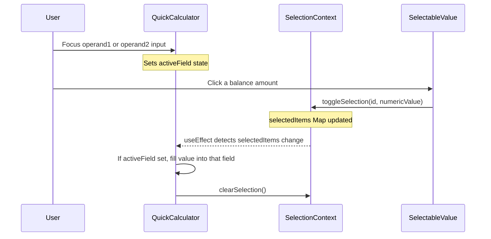

# Research: Make Account Details Panel Amounts Clickable for Calculator

## Summary

The app already has a complete "click-to-fill" system using `SelectableValue` + `SelectionContext` + `QuickCalculator`. The `AccountContextPanel` currently renders all balances as plain text. The fix is to wrap those amounts in `<SelectableValue>` — no new props, callbacks, or wiring needed.

## How the Existing Clickable Pattern Works



### Components involved:

| Component | Role |
|-----------|------|
| `SelectionContext` (`contexts/SelectionContext.tsx`) | Global state: `Map<string, number>` of selected values |
| `SelectableValue` (`components/ui/SelectableValue.tsx`) | Wrapper that makes any amount clickable; calls `toggleSelection(id, value)` on click |
| `QuickCalculator` (`components/movements/QuickCalculator.tsx`) | Watches `selectedItems` via `useSelection()`; when a value appears and a field is focused, fills it in |

### Key detail:
- `SelectionProvider` wraps the entire app in `App.tsx`, so context is available inside the `MovementFormPanel` modal where `AccountContextPanel` lives.
- No prop-drilling or callback passing is needed — `SelectableValue` communicates with `QuickCalculator` purely through context.

## Current State: What's Clickable vs Not

### Already clickable (use `SelectableValue`):
- Account balances on **Summary page** cards (`AccountSummaryCard`, `AccountSummaryCardCompact`)
- Pocket balances on **Summary page** cards
- Investment totals/gains (`InvestmentCard`, `InvestmentCardCompact`)
- CD balances/principals (`CDSummaryCard`, `CDSummaryCardCompact`)
- Fixed expense sub-pocket balances (`FixedExpensesSummary`)
- Net worth totals (`TotalsSummary`)
- Account balances on **Accounts page** cards (`AccountCard`, `CDAccountCard`)

### NOT clickable (plain text in `AccountContextPanel`):
- **Account total balance** (header area)
- **Individual pocket balances** (pocket list items)
- **Sub-pocket balances** (fixed expense sub-pockets)
- **Balance deltas / projected balances** (the "next" value after applying movement)

All of these are rendered via `renderBalancePreview()` which outputs raw `<p>` tags with `formatCurrency()`.

## Implementation Plan

### File to modify: `frontend/src/components/movements/AccountContextPanel.tsx`

### Changes needed:

#### 1. Add import

```tsx
import SelectableValue from '../ui/SelectableValue';
```

#### 2. Refactor `renderBalancePreview` to wrap amounts in `SelectableValue`

The function currently renders plain `<p>` elements. Each numeric amount should be wrapped in `<SelectableValue>` with a unique `id` and the numeric `value`.

**Current signature:**
```tsx
const renderBalancePreview = (current: number, delta: number, currency: string, isSmall = false)
```

**Needs an additional `id` parameter** to generate unique SelectableValue IDs:
```tsx
const renderBalancePreview = (current: number, delta: number, currency: string, id: string, isSmall = false)
```

#### 3. Updated `renderBalancePreview` implementation

```tsx
const renderBalancePreview = (current: number, delta: number, currency: string, id: string, isSmall = false) => {
  if (!delta || delta === 0) {
    return (
      <SelectableValue id={id} value={current} currency={currency as Currency}>
        <p className={`${isSmall ? 'text-sm font-semibold' : 'text-2xl font-bold text-blue-600 dark:text-blue-400'}`}>
          {formatCurrency(current, currency)}
        </p>
      </SelectableValue>
    );
  }

  const next = current + delta;
  const isIncrease = delta > 0;

  return (
    <div className="flex flex-col items-end">
      <SelectableValue id={`${id}-current`} value={current} currency={currency as Currency}>
        <p className="text-[11px] text-gray-400 dark:text-gray-500 line-through leading-none mb-1">
          {formatCurrency(current, currency)}
        </p>
      </SelectableValue>
      <SelectableValue id={`${id}-projected`} value={next} currency={currency as Currency}>
        <p className={`
          ${isSmall ? 'text-sm font-bold' : 'text-2xl font-bold'}
          ${isIncrease ? 'text-emerald-600 dark:text-emerald-400' : 'text-red-600 dark:text-red-400'}
          leading-none
        `}>
          {formatCurrency(next, currency)}
        </p>
      </SelectableValue>
    </div>
  );
};
```

#### 4. Update all call sites to pass `id`

**Account header balance:**
```tsx
{renderBalancePreview(account.balance, accountDelta, account.currency, `ctx-acct-${accountId}`)}
```

**Pocket balances:**
```tsx
{renderBalancePreview(
  pocket.balance,
  deltas?.pocketDeltas[pocket.id] || 0,
  pocket.currency,
  `ctx-pocket-${pocket.id}`,
  true
)}
```

**Sub-pocket balances:**
```tsx
{renderBalancePreview(
  subPocket.balance,
  deltas?.subPocketDeltas[subPocket.id] || 0,
  pocket.currency,
  `ctx-subpocket-${subPocket.id}`,
  true
)}
```

#### 5. Add `Currency` type import

```tsx
import type { Currency } from '../../types';
```

### That's it — no other files need changes.

The `QuickCalculator` already watches `selectedItems` from context and fills the active field. Once `AccountContextPanel` uses `SelectableValue`, clicking any balance in the panel will automatically work with the calculator.

## Visual Behavior After Implementation

1. User opens movement form → right panel shows account details
2. User clicks a calculator input field (operand1 or operand2) → field highlights blue
3. User clicks any balance in the Account Details panel → value fills into the focused calculator field
4. Clicked balance shows a brief blue highlight (existing `SelectableValue` styling)
5. Works for: account balance, pocket balances, sub-pocket balances, current values, and projected values

## Edge Cases

- **Delta = 0**: Only one `SelectableValue` rendered (the current balance)
- **Delta != 0**: Two clickable values — the struck-through current and the projected next value
- **No active calculator field**: Clicking a balance toggles its "selected" state visually but doesn't fill anything (existing behavior from `SelectableValue` — harmless)
