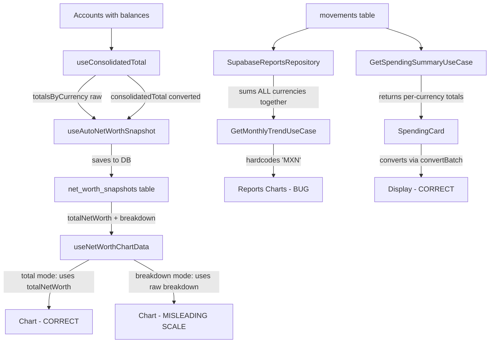

# Currency Consolidation Bug Analysis

## Executive Summary

The net worth timeline shows inflated totals because **the snapshot saves raw (unconverted) per-currency balances in the `breakdown` field, and the chart renders those raw values directly without converting them to the primary currency**. Additionally, the **reports module hardcodes `currency: 'MXN'`** and sums amounts across currencies without conversion.

**Root Causes Found:**
1. **Net Worth Chart (`useNetWorthChartData`)** — In `breakdown` mode, renders raw per-currency amounts on the same Y-axis without conversion. In `total` mode, uses `totalNetWorth` which IS correctly converted.
2. **Net Worth Snapshot (`useAutoNetWorthSnapshot`)** — The `breakdown` field stores **unconverted native-currency balances** (e.g., `{ USD: 5000, COP: 5000000, MXN: 50000 }`). This is correct for breakdown display but the chart doesn't convert these when computing totals.
3. **Reports Module** — Hardcodes `currency: 'MXN'` and sums movement amounts across all currencies without conversion.

---

## Detailed Analysis Per File

### 1. `frontend/src/hooks/useConsolidatedTotal.ts`

**What it does:** Computes a single consolidated total across all accounts by converting each currency's subtotal to the primary currency via `currencyService.convertBatch`.

**Is it correct?** YES — This is properly implemented:
- Groups accounts by currency
- Sums balances within each currency group
- Skips conversion for amounts already in primary currency
- Calls `convertBatch` for cross-currency amounts
- Adds converted results to the total

**No bug here.** The consolidated total displayed on the summary page is correct.

---

### 2. `frontend/src/components/summary/SpendingCard.tsx`

**What it does:** Fetches spending summary (multi-currency totals per period) and converts each period's totals to primary currency using `convertPeriodTotal()`.

**Is it correct?** YES — Properly implemented:
- Separates same-currency totals from other-currency totals
- Converts foreign amounts via `currencyService.convertBatch`
- Sums base + converted totals

**No bug here.**

---

### 3. `frontend/src/hooks/useAutoNetWorthSnapshot.ts`

**What it does:** Auto-creates a net worth snapshot on app load. Saves:
- `totalNetWorth`: the consolidated total (already converted to primary currency)
- `baseCurrency`: the user's primary currency
- `breakdown`: `totalsByCurrency` — raw per-currency subtotals (NOT converted)

**Is it correct?** PARTIALLY:
- `totalNetWorth` is correct — it's the output of `useConsolidatedTotal` which properly converts everything.
- `breakdown` stores native amounts per currency (e.g., `{ USD: 5000, MXN: 50000, COP: 5000000 }`). This is **intentional** — it preserves the original per-currency breakdown for historical reference.

**The data saved is correct.** The bug is in how the chart READS this data.

---

### 4. `frontend/src/hooks/useNetWorthChartData.ts` — BUG #1 (PRIMARY)

**What it does:** Transforms snapshot data into chart datums for Recharts.

**BUG: In `breakdown` mode, raw native-currency amounts are placed on the same chart without conversion.**

```typescript
// Line 130-133 — the problematic code:
if (snapshot.breakdown) {
    Object.entries(snapshot.breakdown).forEach(([currency, value]) => {
        data[currency] = value; // Native amount — no conversion
    });
}
```

This means:
- `data['USD'] = 5000` (5,000 USD)
- `data['COP'] = 5000000` (5,000,000 COP)
- `data['MXN'] = 50000` (50,000 MXN)

All plotted on the same Y-axis as if they were the same unit. The chart shows COP values dwarfing everything else because 5,000,000 COP ≈ 24,000 MXN but displays as 5,000,000 on the axis.

**In `total` mode**, the chart uses `snapshot.totalNetWorth` which IS the correctly converted consolidated total. So `total` mode works fine.

**Impact:** The "By Currency" breakdown view shows misleading absolute values. If the user is looking at the breakdown chart, the visual scale is completely wrong because currencies have vastly different unit values.

**However**, this may be intentional design — showing each currency in its native denomination. The real question is: **does the `total` line in the chart show the wrong number?**

Looking at the `total` mode: it uses `snapshot.totalNetWorth` directly, which is the pre-computed consolidated total from `useConsolidatedTotal`. This IS correct.

**So the bug scenario described (showing millions when it should show thousands) would only happen if:**
1. The user is viewing "breakdown" mode and mentally summing the raw values, OR
2. The `totalNetWorth` saved in the snapshot was computed incorrectly at save time

Let me check scenario 2 more carefully...

**Wait — there's a subtle timing issue in `useAutoNetWorthSnapshot`:**

```typescript
const totalRef = useRef(consolidatedTotal);
// ...
totalRef.current = consolidatedTotal;
// ...
mutationRef.current.mutate({
    totalNetWorth: totalRef.current,  // Uses ref value at mutation time
    // ...
});
```

If `isConsolidatedReady` becomes `true` before the actual conversion completes (race condition), `totalRef.current` could still hold `0` or a partial value. But looking at `useConsolidatedTotal`, it only sets `isConsolidatedReady = true` AFTER the conversion settles. So this should be safe.

**Actual fix needed:** The breakdown mode should either:
- Convert all currencies to primary before plotting (so the Y-axis is meaningful), OR
- Only show percentage variation (which it already does when `showVariation` is checked)

---

### 5. `frontend/src/services/currencyService.ts`

**What it does:** Provides sync and async currency conversion. `convertBatch` calls the backend `/api/currency/convert-batch` endpoint.

**Is it correct?** YES — The service correctly:
- Sends `{ amount, from, to }` to the backend
- Returns `{ convertedAmount, rate }` per item
- Caches rates for subsequent sync lookups
- Falls back to mock rates only when cache is empty

**No bug here.**

---

### 6. `backend/src/modules/settings/presentation/CurrencyController.ts`

**What it does:** Handles `/api/currency/convert-batch` — validates input, runs each conversion via `ConvertCurrencyUseCase`, returns results in order.

**Is it correct?** YES — Properly maps `from`/`to` from the request to `fromCurrency`/`toCurrency` for the use case.

**No bug here.**

---

### 7. `backend/src/modules/settings/application/useCases/ConvertCurrencyUseCase.ts`

**What it does:** Converts amounts using exchange rates. For non-major currency pairs (e.g., MXN→COP), converts via USD as intermediate.

**Is it correct?** YES — Logic is sound:
- Same currency → rate 1.0
- Major-to-major or USD-involved → direct conversion
- Otherwise → convert via USD (source→USD→target)

**No bug here.** The conversion math is correct.

---

### 8. `backend/src/modules/movements/application/useCases/GetSpendingSummaryUseCase.ts`

**What it does:** Sums expenses by period, grouped by currency. Returns `{ currency, amount }[]` per period.

**Is it correct?** YES for its purpose — it returns per-currency totals and lets the frontend handle conversion. The `SpendingCard` component correctly converts these.

**No bug here.**

---

### 9. `backend/src/modules/reports/` — BUG #2 (SECONDARY)

**What it does:** Three use cases for analytics:
- `GetSpendingByCategoryUseCase` — aggregates expenses by category
- `GetMonthlyTrendUseCase` — aggregates income/expenses by month
- `GetCategoryTrendUseCase` — tracks a single category over months

**BUG: All three sum amounts across currencies without conversion and hardcode `currency: 'MXN'`.**

```typescript
// GetMonthlyTrendUseCase.ts line 20:
return { data, currency: 'MXN' };

// GetSpendingByCategoryUseCase.ts line 30:
return { data, totalExpenses, currency: 'MXN' };

// GetCategoryTrendUseCase.ts line 18:
return { data: rows, category, currency: 'MXN' };
```

The repository (`SupabaseReportsRepository`) queries ALL movements regardless of currency and sums their `amount` fields directly:

```typescript
// aggregateByCategory:
entry.total += row.amount;  // No currency check!

// aggregateMonthly:
entry.income += row.amount;   // Mixing USD + MXN + COP amounts
entry.expenses += row.amount; // as if they're all the same currency
```

**Impact:** If a user has:
- A $100 USD expense
- A $5,000,000 COP expense
- A $50,000 MXN expense

The monthly trend shows `expenses: 5,050,100` labeled as "MXN" — which is the exact bug described.

**Fix needed:** Either:
- Filter by currency and return per-currency breakdowns (like `GetSpendingSummaryUseCase` does), OR
- Convert all amounts to primary currency before summing (requires injecting `ConvertCurrencyUseCase`)

---

## Summary of Bugs

| # | Location | Severity | Issue | Fix |
|---|----------|----------|-------|-----|
| 1 | `useNetWorthChartData.ts` (breakdown mode) | Medium | Raw native-currency amounts plotted on same axis without conversion | Convert breakdown values to primary currency before charting, OR clearly label each line's currency unit |
| 2 | `GetMonthlyTrendUseCase.ts` | **HIGH** | Sums amounts across all currencies without conversion, hardcodes 'MXN' | Group by currency and return per-currency totals, or convert to primary currency |
| 3 | `GetSpendingByCategoryUseCase.ts` | **HIGH** | Same as above — sums cross-currency amounts | Same fix as #2 |
| 4 | `GetCategoryTrendUseCase.ts` | **HIGH** | Same as above — sums cross-currency amounts | Same fix as #2 |
| 5 | `SupabaseReportsRepository.ts` | **HIGH** | No currency awareness in any aggregation query | Add currency column to queries, group by currency |

---

## What Works Correctly

| Location | Why It's Correct |
|----------|-----------------|
| `useConsolidatedTotal.ts` | Properly converts all currencies to primary via `convertBatch` |
| `SpendingCard.tsx` | Uses `convertPeriodTotal` which correctly converts per-currency totals |
| `useAutoNetWorthSnapshot.ts` | Saves correctly-converted `totalNetWorth` + raw `breakdown` |
| `currencyService.ts` | `convertBatch` correctly calls backend and caches rates |
| `ConvertCurrencyUseCase.ts` | Conversion math is correct (direct or via USD) |
| `GetSpendingSummaryUseCase.ts` | Returns per-currency totals (frontend converts) |
| Net Worth chart in `total` mode | Uses pre-converted `totalNetWorth` from snapshot |

---

## Recommended Fixes

### Fix 1: Reports Module (HIGH PRIORITY)

The reports repository needs to include currency in its queries and the use cases need to either:

**Option A (Recommended):** Return per-currency breakdowns like `GetSpendingSummaryUseCase` does, and let the frontend convert.

**Option B:** Accept `primaryCurrency` as a parameter, inject `ConvertCurrencyUseCase`, and convert server-side before summing.

Option A is simpler and consistent with the existing pattern in `GetSpendingSummaryUseCase`.

```typescript
// SupabaseReportsRepository.ts — add currency to select and group by it
const { data, error } = await this.supabase
  .from('movements')
  .select('type, amount, displayed_date, currency')  // ADD currency
  // ...

// Then group by (month, currency) instead of just month
```

### Fix 2: Net Worth Chart Breakdown Mode (MEDIUM PRIORITY)

Two options:
- **Option A:** In breakdown mode, convert each currency's value to primary currency before plotting. This makes the Y-axis meaningful but loses the "how much do I have in each currency" information.
- **Option B (Recommended):** Keep breakdown mode as-is but add clear per-line currency labels (e.g., "USD ($5,000)", "COP ($5,000,000)") and use a secondary Y-axis or normalized view. The existing "Show Variation (%)" toggle already handles this correctly by showing percentage changes.

The variation mode is actually the correct way to compare cross-currency performance. The absolute breakdown mode is inherently misleading when currencies have different scales — this might be a UX issue rather than a code bug.

---

## Data Flow Diagram



---

## Reproduction Steps

1. Have accounts in USD, MXN, and COP
2. Set primary currency to MXN
3. Record expenses in all three currencies
4. Open the reports/analytics page showing monthly trends
5. Observe: totals show raw sum (e.g., 100 + 50000 + 5000000 = 5,050,100 "MXN")
6. Expected: all amounts converted to MXN first (100 USD × 18.26 = 1,826 MXN + 50,000 MXN + 5,000,000 COP × 0.00477 = 23,850 MXN = ~75,676 MXN)

---

## Sources

- `frontend/src/hooks/useConsolidatedTotal.ts` — reviewed 2026-05-21
- `frontend/src/components/summary/SpendingCard.tsx` — reviewed 2026-05-21
- `frontend/src/hooks/useAutoNetWorthSnapshot.ts` — reviewed 2026-05-21
- `frontend/src/hooks/useNetWorthChartData.ts` — reviewed 2026-05-21
- `frontend/src/services/currencyService.ts` — reviewed 2026-05-21
- `backend/src/modules/settings/presentation/CurrencyController.ts` — reviewed 2026-05-21
- `backend/src/modules/settings/application/useCases/ConvertCurrencyUseCase.ts` — reviewed 2026-05-21
- `backend/src/modules/movements/application/useCases/GetSpendingSummaryUseCase.ts` — reviewed 2026-05-21
- `backend/src/modules/reports/` (all files) — reviewed 2026-05-21
