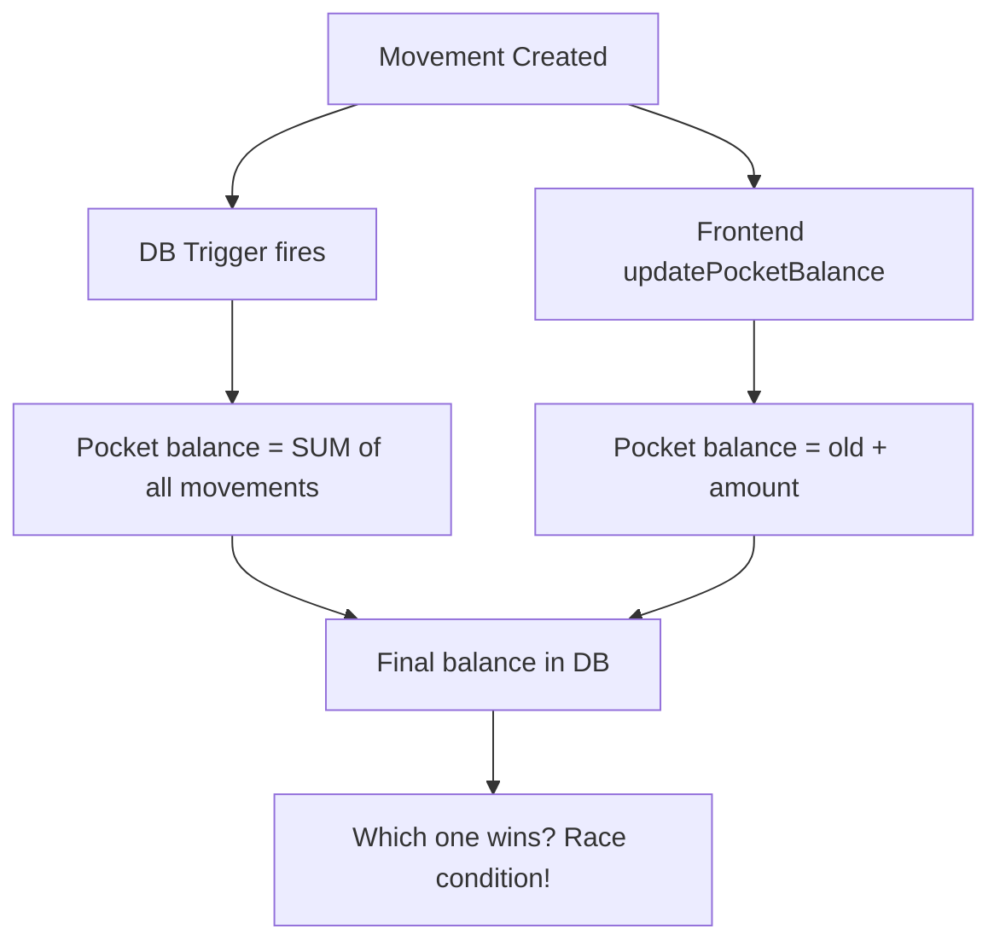
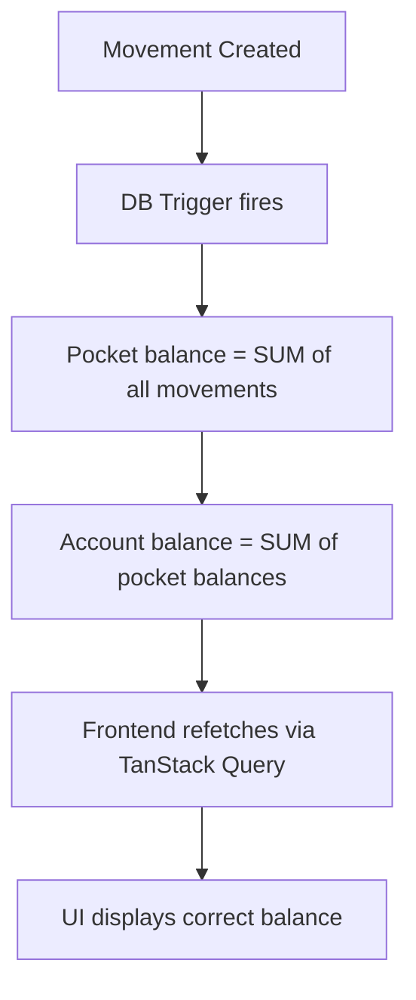

# Data Layer Code Review - Finance App

## Executive Summary

This is a comprehensive review of the data layer for a personal finance app (React 19 + TypeScript + Vite + Supabase). The codebase has **critical architectural flaws** that cause data corruption, race conditions, and security gaps. The most severe issue is a **dual balance management system** where both database triggers AND frontend code attempt to manage balances, guaranteeing data drift.

**Total findings: 47**
- Critical: 12
- High: 16
- Medium: 13
- Low: 6

---

## 1. SCHEMA BUGS

### 1.1 [CRITICAL] Dual Balance Management - Triggers vs Frontend Code

**Files**: `backend/migrations/001_balance_calculation.sql`, `backend/migrations/002_fix_pending_balance.sql`, `frontend/src/services/movementService.ts` (lines 195-220)

**Description**: The database has triggers (`calculate_pocket_balance`, `calculate_account_balance`) that automatically recalculate balances on every movement INSERT/UPDATE/DELETE. However, the frontend `movementService` ALSO manually updates balances via `updatePocketBalance()` and `updateSubPocketBalance()`. This means:

1. Frontend inserts a movement → trigger fires and recalculates balance
2. Frontend ALSO calls `updatePocketBalance()` which sets balance again
3. These two writes race against each other and can produce incorrect values

The trigger recalculates from ALL movements. The frontend does incremental `+amount` or `-amount`. If they execute out of order, the balance is wrong.

**Correct implementation**: Remove ALL manual balance updates from the frontend. Trust the database triggers exclusively. The frontend should only insert/update/delete movements and then refetch the pocket/account data.

---

### 1.2 [CRITICAL] Balance Trigger Ignores SubPocket Movements

**File**: `backend/migrations/002_fix_pending_balance.sql` (lines 10-25)

**Description**: The `calculate_pocket_balance` trigger sums movements by `pocket_id`. But for fixed expense movements, the movement has BOTH a `pocket_id` (the fixed pocket) AND a `sub_pocket_id`. The trigger counts these movements toward the pocket balance. Meanwhile, the frontend's `updateSubPocketBalance()` updates the sub_pocket balance separately. This means:

- The fixed pocket's balance (from trigger) = sum of ALL movements in that pocket (including sub-pocket ones)
- But the frontend expects fixed pocket balance = sum of sub-pocket balances

These are different calculations that produce different numbers.

**Correct implementation**: The trigger should either skip movements that have a `sub_pocket_id` (letting sub-pocket balances be managed separately), or the schema should be redesigned so sub-pocket movements don't reference the parent pocket.

---

### 1.3 [CRITICAL] No Base Schema - Migrations Are Only Patches

**File**: `backend/migrations/` (all files)

**Description**: There is NO migration that creates the base tables (`accounts`, `pockets`, `sub_pockets`, `movements`, `settings`, `reminders`, `exchange_rates`, `budget_entries`, `movement_templates`). The 10 migration files only ALTER existing tables. This means:

- The schema was created manually in Supabase dashboard
- There is no version-controlled source of truth for the schema
- No way to recreate the database from scratch
- No way to verify column types, constraints, or indexes

**Correct implementation**: Create a `000_initial_schema.sql` migration that defines all tables with proper constraints, indexes, foreign keys, and RLS policies.

---

### 1.4 [HIGH] Missing RLS Policies on Most Tables

**File**: `backend/migrations/004_net_worth_snapshots.sql` (only table with RLS)

**Description**: Only `net_worth_snapshots` has Row Level Security enabled. The tables `accounts`, `pockets`, `sub_pockets`, `movements`, `settings`, `reminders`, `exchange_rates`, `budget_entries`, `movement_templates`, `reminder_exceptions` have NO RLS policies defined in any migration. The frontend manually filters by `user_id` in every query, but without RLS, any authenticated user could access other users' data by crafting direct Supabase requests.

**Correct implementation**: Enable RLS on ALL tables and create policies like:
```sql
ALTER TABLE accounts ENABLE ROW LEVEL SECURITY;
CREATE POLICY "Users can only access own accounts" ON accounts
  FOR ALL USING (auth.uid() = user_id);
```

---

### 1.5 [HIGH] Missing Foreign Key Constraints

**File**: Schema (inferred from service code)

**Description**: Based on the service code, there are no foreign key constraints between:
- `movements.account_id` → `accounts.id`
- `movements.pocket_id` → `pockets.id`
- `movements.sub_pocket_id` → `sub_pockets.id`
- `pockets.account_id` → `accounts.id`
- `sub_pockets.pocket_id` → `pockets.id`
- `movement_templates.account_id` → `accounts.id`
- `movement_templates.pocket_id` → `pockets.id`

Evidence: The `deleteAccountDirect` method manually checks for pockets before deleting, and the orphan system exists because CASCADE DELETE doesn't work. If FKs existed with proper ON DELETE behavior, orphaned movements wouldn't be possible.

**Correct implementation**: Add foreign keys with appropriate ON DELETE behavior (CASCADE for pockets→accounts, SET NULL or custom handling for movements).

---

### 1.6 [HIGH] No CHECK Constraints on Movement Types

**File**: Schema (inferred from types)

**Description**: The `movements.type` column has no CHECK constraint. The valid values are `'IngresoNormal' | 'EgresoNormal' | 'IngresoFijo' | 'EgresoFijo'` but the trigger in migration 001 also references `'InvestmentIngreso'` which is NOT in the TypeScript type definition. This means:
- Invalid movement types can be inserted
- The trigger handles a type that the frontend doesn't know about

**Correct implementation**: Add `CHECK (type IN ('IngresoNormal', 'EgresoNormal', 'IngresoFijo', 'EgresoFijo'))` and remove the phantom `InvestmentIngreso` type from the trigger, or add it to the TypeScript types.

---

### 1.7 [HIGH] `InvestmentIngreso` Type in Trigger But Not in TypeScript

**File**: `backend/migrations/001_balance_calculation.sql` (line 22), `backend/migrations/002_fix_pending_balance.sql` (line 18)

**Description**: The balance trigger treats `'InvestmentIngreso'` as income, but this type doesn't exist in the TypeScript `MovementType` union. If investment movements are created with one of the four valid types, the trigger may miscalculate. If they're created with `InvestmentIngreso`, the frontend can't display them properly.

**Correct implementation**: Either add `'InvestmentIngreso' | 'InvestmentEgreso'` to the TypeScript types, or remove them from the trigger and use `'IngresoNormal'` for investment income.

---

### 1.8 [MEDIUM] `maturity_date` Column Uses TIMESTAMP Instead of DATE

**File**: `backend/migrations/008_add_cd_support.sql` (line 16)

**Description**: `maturity_date TIMESTAMP DEFAULT NULL` - A maturity date is a calendar date, not a point in time. Using TIMESTAMP introduces timezone confusion. The frontend stores it as an ISO string which includes time components that are meaningless for a maturity date.

**Correct implementation**: Use `DATE` type instead of `TIMESTAMP`.

---

### 1.9 [MEDIUM] No Index on `movements.pocket_id`

**File**: Schema (inferred)

**Description**: The balance trigger queries `SELECT ... FROM movements WHERE pocket_id = X` on every movement change. Without an index on `pocket_id`, this becomes a full table scan as movements grow. Similarly, `movements.account_id` likely has no index.

**Correct implementation**: 
```sql
CREATE INDEX idx_movements_pocket_id ON movements(pocket_id);
CREATE INDEX idx_movements_account_id ON movements(account_id);
CREATE INDEX idx_movements_is_pending ON movements(is_pending) WHERE is_pending = true;
```

---

### 1.10 [MEDIUM] `exchange_rates` Table Has No User Isolation

**File**: `backend/migrations/007_fix_exchange_rates_id.sql`

**Description**: The migration adds a default UUID to `exchange_rates.id` but there's no `user_id` column visible. If exchange rates are shared across users, that's fine. But if they're per-user cached rates, there's no isolation.

**Correct implementation**: Clarify whether exchange rates are global or per-user and add appropriate constraints.

---

### 1.11 [LOW] Migration 005 Changes Precision for ALL Movements

**File**: `backend/migrations/005_shares_precision.sql`

**Description**: Changes `movements.amount` to `DECIMAL(20, 6)` for ALL movements to support fractional shares. This means normal currency movements now store 6 decimal places when they only need 2. This wastes storage and can cause display issues with floating point artifacts.

**Correct implementation**: Keep currency amounts at `DECIMAL(15, 2)` and use a separate column or table for share quantities.


---

## 2. DATA CORRECTNESS

### 2.1 [CRITICAL] Frontend Manually Updates Balances That Triggers Also Update

**File**: `frontend/src/services/movementService.ts` (lines 195-220, 230-245)

**Description**: `createMovementDirect()` does:
1. `SupabaseStorageService.insertMovement(movement)` → This fires the DB trigger which recalculates pocket balance
2. Then calls `this.updatePocketBalance(pocketId, amount, isIncome)` → This does `pocket.balance + amount` and writes it

The trigger's calculation (sum of all movements) is correct. The frontend's incremental update overwrites it with a potentially stale value (if the pocket balance it read was outdated). This is a **guaranteed data corruption bug** under concurrent usage or if the cached pocket balance is stale.

**Correct implementation**: Remove lines 195-220 entirely. After inserting a movement, just invalidate the queries and let the UI refetch the trigger-calculated balance.

---

### 2.2 [CRITICAL] `updateMovementDirect` Reverses and Reapplies Balances Manually

**File**: `frontend/src/services/movementService.ts` (lines 280-310)

**Description**: When updating a movement, the code:
1. Reverts the old balance change manually
2. Applies the new balance change manually
3. Updates the movement in DB (which fires the trigger that recalculates from scratch)

Steps 1-2 are completely redundant and harmful because step 3's trigger already does the correct calculation. The manual revert/apply uses stale pocket balances and creates race conditions.

**Correct implementation**: Just update the movement record. The trigger handles everything.

---

### 2.3 [CRITICAL] `deleteMovementDirect` Reverts Balance Then Trigger Also Reverts

**File**: `frontend/src/services/movementService.ts` (lines 330-350)

**Description**: Same pattern - manually reverts balance, then deletes the movement which fires the trigger that recalculates. Double-reversal = balance is wrong.

**Correct implementation**: Just delete the movement. Trust the trigger.

---

### 2.4 [HIGH] `saveAccounts` Upserts Balance Field, Overwriting Trigger-Calculated Value

**File**: `frontend/src/services/supabaseStorageService.ts` (lines 80-100)

**Description**: `saveAccounts()` includes `balance: account.balance` in the upsert. This overwrites the trigger-calculated balance with whatever stale value the frontend has cached. Used by `reorderAccounts` mutation which sends ALL account data including potentially stale balances.

**Correct implementation**: Never include `balance` in upsert/update operations. It should be a computed column or at minimum excluded from writes.

---

### 2.5 [HIGH] `savePockets` Upserts Balance Field

**File**: `frontend/src/services/supabaseStorageService.ts` (lines 165-180)

**Description**: Same issue as 2.4. `savePockets()` includes `balance: pocket.balance` in the upsert, overwriting trigger-calculated values. Used by `reorderPockets` mutation.

**Correct implementation**: Exclude `balance` from pocket upserts. Only write name, display_order, etc.

---

### 2.6 [HIGH] `recalculateAllPocketBalances` Fights With Database Triggers

**File**: `frontend/src/services/movementService.ts` (lines 400-460)

**Description**: This method manually recalculates all pocket balances from movements and writes them. But the database triggers are ALSO maintaining these balances. This creates a situation where:
- Trigger sets balance to X (correct, based on all movements)
- Frontend recalculates and sets balance to Y (potentially different if it has stale movement data)

The frontend fetches ALL movements into memory, filters, and sums them. If any movement was created between the fetch and the write, the balance will be wrong.

**Correct implementation**: This entire method should not exist. If balances are wrong, fix the trigger. Don't have two systems fighting over the same data.

---

### 2.7 [HIGH] Budget Entries Use Delete-All-Then-Insert Pattern

**File**: `frontend/src/services/supabaseStorageService.ts` (lines 340-360)

**Description**: `saveBudgetEntries()` does:
```typescript
await supabase.from('budget_entries').delete().eq('user_id', userId);
// then inserts all entries
```

This is not atomic. If the insert fails after the delete, all budget data is lost. There's also a race condition if two tabs are open.

**Correct implementation**: Use upsert with a transaction, or at minimum wrap in a Supabase RPC function that handles atomicity.

---

### 2.8 [MEDIUM] Orphaned Movement Restoration Doesn't Recalculate Balances

**File**: `frontend/src/services/movementService.ts` (`restoreOrphanedMovements` method)

**Description**: When restoring orphaned movements, the code updates `accountId`, `pocketId`, and `isOrphaned` flag, but doesn't trigger balance recalculation. The DB trigger WILL fire on the update, but it recalculates based on `pocket_id` - and since we're changing `pocket_id`, the OLD pocket's balance won't be updated (there is no OLD pocket since it was deleted).

Actually, the trigger handles this correctly for the NEW pocket. But the mutation hook doesn't invalidate `subPockets` query, so if the movement had a sub-pocket, the UI will show stale sub-pocket balances.

**Correct implementation**: The `restoreOrphanedMovements` mutation should also invalidate `['subPockets']`.

---

### 2.9 [MEDIUM] `insertMovement` Doesn't Set `is_orphaned` Field

**File**: `frontend/src/services/supabaseStorageService.ts` (line 270)

**Description**: `insertMovement` sets `is_pending: movement.isPending || false` but doesn't set `is_orphaned`. If the column has no DEFAULT, this could insert NULL instead of false, which the trigger's `is_pending IS NULL OR is_pending = FALSE` handles but is semantically wrong.

**Correct implementation**: Always set `is_orphaned: false` on insert.

---

### 2.10 [MEDIUM] Account Balance Calculation for Investments Calls External API

**File**: `frontend/src/services/accountService.ts` (`calculateAccountBalance` method, lines 160-180)

**Description**: For investment accounts, `calculateAccountBalance` calls `investmentService.getCurrentPrice(stockSymbol)` which hits an external API. This means:
- Account balance depends on network availability
- Balance calculation is non-deterministic
- If the API is down, balance shows as 0
- This is called during `recalculateAllBalances` which could hit rate limits

**Correct implementation**: Store the last known price and use it for balance calculation. Update prices on a separate schedule, not during balance recalculation.


---

## 3. TYPE SAFETY

### 3.1 [HIGH] Three Divergent Type Definitions

**Files**: 
- `frontend/src/types/index.ts`
- `shared/types/index.ts`
- `shared/types/index.d.ts`

**Description**: There are THREE copies of the type definitions that have drifted apart:

| Field | `frontend/src/types` | `shared/types` | `shared/types/index.d.ts` |
|-------|---------------------|----------------|--------------------------|
| `Account.type` | `'normal' \| 'investment' \| 'cd'` | `'normal' \| 'investment'` | `'normal' \| 'investment'` |
| `InvestmentType` | exists | missing | missing |
| `CDInvestmentAccount` | exists | missing | missing |
| `SnapshotFrequency` | exists | missing | missing |
| `AccountCardDisplaySettings` | exists | missing | missing |
| `MovementTemplate.updatedAt` | `string` (required) | `string?` (optional) | `string?` (optional) |
| `FixedExpenseGroup.displayOrder` | `number` (required) | missing | missing |
| Type guards (`isInvestmentAccount`, etc.) | exist | missing | missing |

The `shared/types` package is completely outdated and doesn't know about CDs, investment types, or display settings.

**Correct implementation**: Delete `shared/types/index.d.ts` (it's a generated file). Make `shared/types/index.ts` the single source of truth. Import from there in the frontend.

---

### 3.2 [HIGH] `any` Types in Service Layer

**Files**: 
- `frontend/src/services/supabaseStorageService.ts` (line 330: `const settingsData: any = {`)
- `frontend/src/services/accountService.ts` (line 280: `as any` cast)
- `frontend/src/services/movementService.ts` (lazy getter caches typed as `any`)

**Description**: Critical data paths use `any`, bypassing TypeScript's safety:
- Settings save uses `any` object, so typos in column names won't be caught
- CD account update uses `as any` to bypass type checking
- All lazy service caches are `any`, so method calls on them have no type checking

**Correct implementation**: Define proper interfaces for DB row shapes. Use generics for the lazy caches. Remove all `any` usage.

---

### 3.3 [MEDIUM] No Runtime Validation on Data from Supabase

**File**: `frontend/src/services/supabaseStorageService.ts` (all methods)

**Description**: Data from Supabase is cast directly to TypeScript types with no runtime validation:
```typescript
return (data || []).map(account => ({
  id: account.id,
  name: account.name,
  // ... direct property access with no null checks
}));
```

If the database has NULL in a non-nullable field, or a string where a number is expected, the app will crash at an unpredictable later point.

**Correct implementation**: Use a validation library (Zod, Valibot) to validate data at the boundary.

---

### 3.4 [MEDIUM] `parseFloat` on Potentially Null Values

**File**: `frontend/src/services/supabaseStorageService.ts` (lines 45-55)

**Description**: 
```typescript
balance: parseFloat(account.balance || 0),
```
`parseFloat(0)` returns `0`, but `account.balance || 0` will also replace `"0"` with `0` (falsy string). More critically, if `account.balance` is `null`, `parseFloat(null || 0)` = `parseFloat(0)` = `0` which is correct by accident. But `parseFloat(undefined || 0)` also works by accident.

The real issue: `montoInvertido: account.monto_invertido ? parseFloat(account.monto_invertido) : undefined` - if `monto_invertido` is the string `"0"`, this returns `undefined` instead of `0` because `"0"` is falsy... wait, no, `"0"` is truthy in JS. But `0` (number) is falsy. If the DB returns number `0`, this returns `undefined`.

**Correct implementation**: Use explicit null checks: `account.monto_invertido != null ? parseFloat(String(account.monto_invertido)) : undefined`

---

### 3.5 [MEDIUM] `accountCardDisplay` Double-Serialization

**File**: `frontend/src/services/supabaseStorageService.ts` (lines 320-330)

**Description**: 
```typescript
// Reading:
accountCardDisplay: data.account_card_display ? 
  (typeof data.account_card_display === 'string' ? 
    JSON.parse(data.account_card_display) : 
    data.account_card_display) : undefined,

// Writing:
settingsData.account_card_display = JSON.stringify(settings.accountCardDisplay);
```

The column is `JSONB` which Supabase returns as a parsed object. But the code `JSON.stringify`s on write and then checks if it needs to `JSON.parse` on read. This suggests the data might be double-stringified in the DB (a JSON string inside a JSONB column).

**Correct implementation**: For JSONB columns, just pass the object directly. Supabase handles serialization. Remove the `JSON.stringify` on write and the `typeof === 'string'` check on read.

---

### 3.6 [LOW] `useAccountMutations` Has Dead Code Comments

**File**: `frontend/src/hooks/queries/useAccountMutations.ts` (lines 50-65)

**Description**: The `reorderAccounts` mutation contains a massive block of stream-of-consciousness comments about implementation uncertainty. This is dead code that should have been resolved before committing.

**Correct implementation**: Remove the comments. The implementation works (imports SupabaseStorageService dynamically).


---

## 4. QUERY PATTERNS

### 4.1 [CRITICAL] Fetches ALL Movements Into Memory for Every Operation

**File**: `frontend/src/services/movementService.ts` (multiple methods)

**Description**: Nearly every method calls `this.getAllMovements()` which fetches ALL movements from the database, then filters in JavaScript:
- `getActiveMovements()` → fetches all, filters `!m.isOrphaned`
- `getOrphanedMovementsDirect()` → fetches all, filters `m.isOrphaned`
- `getMovementsByAccountDirect()` → fetches all, filters by accountId
- `getMovementsByPocketDirect()` → fetches all, filters by pocketId
- `getMovementsByMonthDirect()` → fetches all, filters by date
- `getMovementCountByAccount()` → fetches all, counts
- `deleteMovementsByAccount()` → fetches all, filters, deletes one by one
- `recalculateAllPocketBalances()` → fetches all movements MULTIPLE TIMES (once per pocket)

For a user with 1000+ movements, this means every single operation downloads the entire movement history. The `recalculateAllPocketBalances` method fetches ALL movements N times (once per pocket).

**Correct implementation**: Use Supabase query filters:
```typescript
supabase.from('movements').select('*').eq('account_id', accountId).eq('is_orphaned', false)
```

---

### 4.2 [HIGH] `useMovementsQuery` Fetches ALL Movements With No Pagination

**File**: `frontend/src/hooks/queries/useMovementsQuery.ts`

**Description**: `useMovementsQuery` calls `movementService.getActiveMovements()` which loads ALL non-orphaned movements into memory. The `useInfiniteMovementsQuery` exists but still calls `movementService.getAllMovements(pageParam, limit)` which... fetches ALL movements and slices in JS (see `getAllMovementsDirect`).

The "pagination" is fake - it downloads everything and returns a slice.

**Correct implementation**: Implement real server-side pagination:
```typescript
supabase.from('movements').select('*')
  .eq('is_orphaned', false)
  .order('displayed_date', { ascending: false })
  .range(offset, offset + limit - 1)
```

---

### 4.3 [HIGH] No Optimistic Updates - Full Refetch After Every Mutation

**File**: `frontend/src/hooks/queries/useMovementMutations.ts` (all mutations)

**Description**: Every mutation invalidates `['movements']`, `['accounts']`, `['pockets']`, and `['subPockets']`. This triggers 4 full refetches after every single operation. Combined with issue 4.1 (fetching all movements), a single "create movement" operation triggers:
1. Insert movement (1 API call)
2. Manual balance update (1 API call) 
3. Refetch all movements (1 API call returning ALL data)
4. Refetch all accounts (1 API call)
5. Refetch all pockets (1 API call)
6. Refetch all sub-pockets (1 API call)

That's 6 API calls for creating one movement, with massive data transfer.

**Correct implementation**: Use optimistic updates for mutations. Only invalidate the specific queries that are affected. Use query key granularity (e.g., `['pockets', accountId]`).

---

### 4.4 [HIGH] `usePocketsByAccountQuery` Cache Key Doesn't Invalidate Properly

**File**: `frontend/src/hooks/queries/usePocketsQuery.ts`

**Description**: There are two pocket queries:
- `usePocketsQuery` with key `['pockets']`
- `usePocketsByAccountQuery` with key `['pockets', 'account', accountId]`

But mutations only invalidate `['pockets']`. TanStack Query's `invalidateQueries({ queryKey: ['pockets'] })` DOES match `['pockets', 'account', accountId]` because it uses prefix matching. So this actually works correctly. However, the inverse is a problem: if something only invalidated the specific account query, the "all pockets" query would be stale.

Actually, this is fine due to prefix matching. **Downgrading to informational.**

---

### 4.5 [MEDIUM] `useAutoNetWorthSnapshot` Has Race Condition

**File**: `frontend/src/hooks/useAutoNetWorthSnapshot.ts`

**Description**: The hook checks `hasRun.current` to prevent double execution, but:
1. It depends on `accounts`, `settings`, `latestSnapshot`, and `loadingSnapshot`
2. The `useEffect` dependency array includes `createMutation` which is a new object on every render
3. If any dependency changes after the first run, the effect re-runs but `hasRun.current` prevents it

The `createMutation` in the dependency array is problematic - it's recreated on every render of the parent component, potentially causing the effect to re-evaluate (though `hasRun` guards it).

More critically: the async `calculateNetWorth()` function captures `accounts` from closure. If accounts change while the async function is running, it uses stale data.

**Correct implementation**: Remove `createMutation` from deps (use a ref instead). Use the latest accounts value via a ref.

---

### 4.6 [MEDIUM] `useMovementsFilter` Recreates `getDateRange` on Every Filter Change

**File**: `frontend/src/hooks/useMovementsFilter.ts`

**Description**: `getDateRange()` is defined inside the component and called inside `useMemo`, but it's not memoized itself. The `useMemo` dependency array includes all filter states, so `filteredMovements` recalculates on any filter change (which is correct). But `getDateRange` creates new `Date` objects on every call, and the `ranges` object is recreated every time.

This is a minor performance issue but not a bug.

**Correct implementation**: Move `getDateRange` inside the `useMemo` or memoize it with `useCallback`.

---

### 4.7 [MEDIUM] Stale Data in `updateMovementDirect`

**File**: `frontend/src/services/movementService.ts` (`updateMovementDirect` method)

**Description**: The method does:
1. `const movements = await this.getAllMovementsDirect()` - fetches all
2. Finds the movement by index
3. Reverts old balance
4. Applies new balance
5. `await SupabaseStorageService.updateMovement(id, updates)`

Between step 1 and step 5, another tab or the same user could have modified the movement. The balance revert in step 3 uses the stale `oldMovement` data. If the movement was already updated elsewhere, the balance revert is wrong.

**Correct implementation**: Use database-level operations. Don't read-modify-write from the frontend.

---

### 4.8 [LOW] Console Logging in Production Query Hooks

**File**: `frontend/src/hooks/queries/useAccountsQuery.ts`

**Description**: The accounts query function contains extensive `console.log` statements that log every account's details on every fetch. This leaks sensitive financial data to the browser console in production.

**Correct implementation**: Remove all console.log statements or gate them behind a development flag.

---

### 4.9 [LOW] `useSettingsQuery` Exported Twice in Index

**File**: `frontend/src/hooks/queries/index.ts` (lines 5 and 16)

**Description**: `export * from './useSettingsQuery'` appears twice in the index file. This doesn't cause an error but indicates copy-paste sloppiness.

**Correct implementation**: Remove the duplicate export.


---

## 5. AUTH / SECURITY

### 5.1 [CRITICAL] Frontend Directly Accesses Database - No Backend Validation

**File**: `frontend/src/services/supabaseStorageService.ts` (entire file)

**Description**: The frontend uses the Supabase anon key to directly read/write the database. There is NO server-side validation of:
- Movement amounts (could insert negative amounts bypassing frontend validation)
- Account ownership (relies on manual `user_id` filtering, not RLS)
- Business rules (only one fixed pocket, unique account names, etc.)
- Data integrity (orphan handling, balance consistency)

A malicious user can open browser DevTools, get the Supabase URL and anon key from the bundle, and:
- Read/write any user's data (if RLS is not enabled)
- Insert invalid data that bypasses frontend validation
- Corrupt balances by directly modifying pocket/account balance columns

**Correct implementation**: All writes should go through a backend API that validates business rules. The Supabase anon key should only have SELECT permissions, with writes going through RPC functions or a proper backend.

---

### 5.2 [HIGH] Auth Token Stored in Supabase Client - No Refresh Handling

**File**: `frontend/src/contexts/AuthContext.tsx`, `frontend/src/lib/supabase.ts`

**Description**: The auth context listens for `onAuthStateChange` but the Supabase client is created once at module level. If the token expires during a long session:
- Supabase client auto-refreshes (this is handled by the library)
- But the `getUserId()` calls in `SupabaseStorageService` call `supabase.auth.getUser()` on every operation

Actually, Supabase JS client handles token refresh automatically. The real issue is that `getUserId()` makes a network call (`getUser()`) on EVERY database operation. This adds latency to every single query.

**Correct implementation**: Cache the user ID after initial auth. Use `supabase.auth.getSession()` (local, no network call) instead of `getUser()` (network call) for getting the user ID.

---

### 5.3 [HIGH] `signUp` Creates Settings Without Error Handling

**File**: `frontend/src/contexts/AuthContext.tsx` (lines 45-55)

**Description**: After signup, the code tries to create default settings:
```typescript
await supabase.from('settings').insert({
  user_id: data.user.id,
  primary_currency: 'USD',
});
```
If this fails (caught and logged as warning), the user has no settings row. Later, `getSettings()` returns `null` and the app may crash or behave unexpectedly when accessing `settings.primaryCurrency`.

**Correct implementation**: Use a database trigger or RPC function to create default settings on user creation. Or handle the null settings case gracefully throughout the app.

---

### 5.4 [MEDIUM] API Key Stored in Database

**File**: `frontend/src/services/supabaseStorageService.ts` (settings methods)

**Description**: The `alpha_vantage_api_key` is stored in the `settings` table. If RLS is not properly configured, other users could read this API key. Even with RLS, storing third-party API keys in a client-accessible database is risky.

**Correct implementation**: Store API keys server-side only. Proxy API calls through a backend function.

---

### 5.5 [MEDIUM] No Rate Limiting on Direct Supabase Calls

**File**: `frontend/src/services/supabaseStorageService.ts`

**Description**: Every service method makes direct Supabase calls with no rate limiting. A bug in the UI (infinite re-render loop, rapid clicking) could hammer the database with thousands of requests.

**Correct implementation**: Add request deduplication and rate limiting at the service layer. TanStack Query's `staleTime` helps for reads but not for mutations.

---

### 5.6 [LOW] Supabase Credentials Logged to Console

**File**: `frontend/src/lib/supabase.ts`, `frontend/src/services/accountService.ts`

**Description**: The account service logs `VITE_API_URL` and the supabase module logs auth events. While not directly exposing the anon key, the verbose logging in production could leak information.

**Correct implementation**: Remove all console logging in production builds.

---

## 6. ARCHITECTURE

### 6.1 [HIGH] Duplicate Context Directories

**Files**: 
- `frontend/src/contexts/AuthContext.tsx`
- `frontend/src/context/SelectionContext.tsx`

**Description**: There are TWO context directories: `contexts/` (plural) and `context/` (singular). This is confusing and indicates the codebase was built without consistent conventions.

**Correct implementation**: Consolidate into one directory (`contexts/`). Move `SelectionContext.tsx` there.

---

### 6.2 [HIGH] Mutations in `queries/` Directory

**File**: `frontend/src/hooks/queries/useMovementMutations.ts`, `useAccountMutations.ts`, `usePocketMutations.ts`, `useSubPocketMutations.ts`, `useFixedExpenseGroupMutations.ts`

**Description**: Mutation hooks are in the `queries/` directory. There's also a separate `mutations/` directory that only contains `useSettingsMutations.ts`. This is inconsistent - mutations are split across two directories with no clear reason.

**Correct implementation**: Move all mutation hooks to `mutations/` directory. Keep `queries/` for read-only hooks.

---

### 6.3 [HIGH] Service Layer Does Too Much - God Object Pattern

**File**: `frontend/src/services/movementService.ts` (500+ lines)

**Description**: `MovementService` is responsible for:
- CRUD operations
- Balance calculations
- Investment account syncing
- Orphan management
- Pagination (fake)
- Transfer creation
- Bulk operations

This violates single responsibility. The balance management should be entirely in the database (triggers). The orphan logic should be separate. The investment syncing should be in `investmentService`.

**Correct implementation**: Split into focused services. Remove balance management from frontend entirely.

---

### 6.4 [MEDIUM] Circular Dependencies Solved With Dynamic Imports

**Files**: `frontend/src/services/movementService.ts`, `accountService.ts`, `pocketService.ts`

**Description**: All three services have circular dependencies on each other, solved with lazy dynamic imports:
```typescript
let pocketServiceCache: any = null;
const getPocketService = async () => {
  if (!pocketServiceCache) {
    const module = await import('./pocketService');
    pocketServiceCache = module.pocketService;
  }
  return pocketServiceCache;
};
```

This is a code smell indicating the architecture is wrong. Services shouldn't need to call each other in circles.

**Correct implementation**: Extract shared logic into a separate module. Or better: move balance calculation to the database and remove the need for services to cross-reference.

---

### 6.5 [MEDIUM] Feature Flags With No Consistent Pattern

**File**: `frontend/src/services/movementService.ts` (line 40)

**Description**: Each service has its own feature flag (`VITE_USE_BACKEND_MOVEMENTS`, `VITE_USE_BACKEND_ACCOUNTS`, `VITE_USE_BACKEND_POCKETS`) with identical try/catch fallback patterns duplicated across every method. This is massive code duplication.

**Correct implementation**: Create a single service factory or proxy that handles the backend/direct switching in one place.

---

### 6.6 [MEDIUM] `useConfirm` Hook Uses Global Window Property

**File**: `frontend/src/hooks/useConfirm.ts` (lines 30-35)

**Description**: 
```typescript
(window as any).__confirmResolve = resolve;
```
Stores the Promise resolve function on the global `window` object. If two confirm dialogs are opened simultaneously (unlikely but possible), the second overwrites the first's resolve function, causing the first to never resolve.

**Correct implementation**: Store the resolve function in a ref or state, not on window.

---

### 6.7 [LOW] `useToast` Is a Zustand Store Disguised as a Hook

**File**: `frontend/src/hooks/useToast.ts`

**Description**: `useToast` is created with `create` from Zustand, making it a global store. But it's in the `hooks/` directory and named like a hook. This is misleading - it's not a custom hook that uses React hooks internally.

**Correct implementation**: Move to `store/` directory and rename to `toastStore.ts`.

---

## 7. MIGRATIONS

### 7.1 [HIGH] Migration 008 Has No Idempotency Guards

**File**: `backend/migrations/008_add_cd_support.sql`

**Description**: All `ALTER TABLE accounts ADD COLUMN` statements will fail if run twice (column already exists). Unlike migrations 001/002 which use `DO $$ BEGIN IF NOT EXISTS ... END $$`, migration 008 has no guards.

**Correct implementation**: Wrap each ALTER in an IF NOT EXISTS check:
```sql
DO $$ BEGIN
  IF NOT EXISTS (SELECT 1 FROM information_schema.columns 
    WHERE table_name = 'accounts' AND column_name = 'principal') THEN
    ALTER TABLE accounts ADD COLUMN principal DECIMAL(20, 2) DEFAULT NULL;
  END IF;
END $$;
```

---

### 7.2 [HIGH] Migration 009 Drops Constraint Without Checking Existence

**File**: `backend/migrations/009_update_account_type_constraint.sql`

**Description**: Uses `DROP CONSTRAINT IF EXISTS accounts_type_check` which is safe, but then `ADD CONSTRAINT accounts_type_check` without checking if it already exists. Running this migration twice will fail on the ADD.

**Correct implementation**: Drop and recreate in a single idempotent block, or check existence before adding.

---

### 7.3 [MEDIUM] Migration 007 Assumes Column Exists

**File**: `backend/migrations/007_fix_exchange_rates_id.sql`

**Description**: `ALTER TABLE exchange_rates ALTER COLUMN id SET DEFAULT gen_random_uuid()` assumes the `exchange_rates` table and `id` column exist. No existence check.

**Correct implementation**: Wrap in existence check.

---

### 7.4 [MEDIUM] No Migration for `reminder_exceptions` RLS

**File**: `backend/migrations/003_reminder_exceptions.sql`

**Description**: Creates the `reminder_exceptions` table but doesn't enable RLS or create any policies. This table is accessible to any authenticated user.

**Correct implementation**: Add RLS policy similar to `net_worth_snapshots`.

---

### 7.5 [LOW] Migrations Not Numbered Sequentially With Timestamps

**File**: `backend/migrations/` (all files)

**Description**: Migrations use simple numeric prefixes (001, 002, ...) instead of timestamps. This can cause conflicts if multiple developers create migrations simultaneously.

**Correct implementation**: Use timestamp-based naming: `20250519_001_initial_schema.sql`.

---

## Summary of Most Critical Issues to Fix First

1. **Remove all manual balance updates from frontend** (Issues 2.1, 2.2, 2.3, 2.4, 2.5, 2.6) - The database triggers handle this. The frontend fighting with triggers is the #1 source of data corruption.

2. **Fix the trigger to handle sub-pocket movements correctly** (Issue 1.2) - The trigger doesn't distinguish between pocket-level and sub-pocket-level movements.

3. **Enable RLS on all tables** (Issue 1.4) - Without this, any authenticated user can access all data.

4. **Create the base schema migration** (Issue 1.3) - You have no reproducible database definition.

5. **Stop fetching all movements into memory** (Issue 4.1) - Use server-side filtering and pagination.

6. **Resolve the `InvestmentIngreso` type mismatch** (Issues 1.6, 1.7) - The trigger and TypeScript disagree on valid movement types.

---

## Architectural Recommendation

The fundamental problem is that this app has **two competing balance management systems**:



The correct architecture:



Remove ALL balance manipulation from the frontend. The database is the source of truth. The frontend should only:
1. Insert/update/delete movements
2. Invalidate queries
3. Display whatever the database returns

