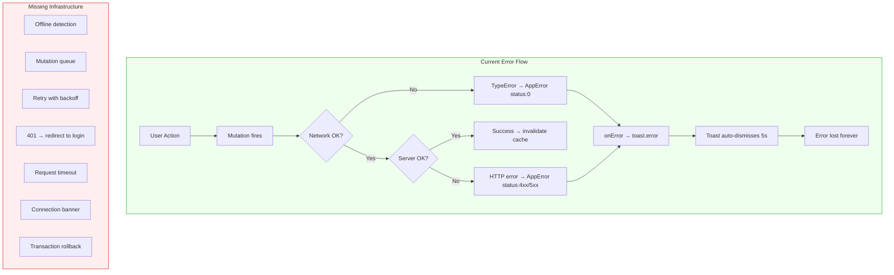

# Error Recovery & Resilience Audit

## Executive Summary

The finance app has **minimal resilience infrastructure**. Error handling exists at the mutation layer (toast notifications), but there is no offline detection, no request timeouts, no optimistic update rollback, no auth token expiry handling, and no graceful degradation. The app is fragile under adverse network conditions and will silently break or show cryptic errors when the backend is unreachable or auth expires.

**Severity**: High — data integrity risks exist in multi-step operations, and the user experience degrades sharply under any network instability.

---

## Detailed Findings

### 1. Network Drop Mid-Operation

**Finding: No offline detection whatsoever.**

- Zero usage of `navigator.onLine`, no `online`/`offline` event listeners, no connection monitoring.
- If the network drops mid-mutation, the `fetch` call throws a `TypeError` which `apiClient.ts` wraps into an `AppError(0, "network error — unable to reach server")`.
- The mutation's `onError` handler shows a toast with this message, then the toast auto-dismisses after 5 seconds.
- **No queuing**: Mutations do not queue for retry. The operation is simply lost.
- **No user awareness**: There's no persistent indicator that the app is offline. The user may continue interacting with stale cached data without knowing.

**Risk**: User performs actions thinking they're saved, but they're silently dropped.

---

### 2. Retry Mechanisms

**Finding: Minimal retry — queries only, not mutations.**

```typescript
// queryClient.ts
export const queryClient = new QueryClient({
    defaultOptions: {
        queries: {
            staleTime: 1000 * 60 * 5,
            gcTime: 1000 * 60 * 30,
            refetchOnWindowFocus: false,
            retry: 1, // Only 1 retry for queries
        },
    },
});
```

- **Queries**: Retry once on failure (default TanStack behavior with `retry: 1`). No exponential backoff configured.
- **Mutations**: No retry configured at all (TanStack Query defaults mutations to `retry: 0`). Every failed mutation is a permanent failure.
- **No `networkMode` configuration**: TanStack Query's `networkMode: 'offlineFirst'` or `'online'` is not set, meaning mutations fire regardless of connectivity state.

**Risk**: Transient network blips cause permanent data loss for write operations.

---

### 3. Partial Success in Multi-Step Operations

**Finding: Transfer operations have NO atomicity guarantee.**

The `CreateTransferUseCase` in the backend explicitly acknowledges this:

```typescript
// CreateTransferUseCase.ts
// 5. Save both movements
// TODO: Wrap in transaction if supported by repository/infrastructure
await this.movementRepo.save(expense, userId);
await this.movementRepo.save(income, userId);
```

If the first `save` succeeds but the second fails (network drop, server crash, timeout):
- The expense movement exists in the database
- The income movement does not
- **Money disappears** from the source pocket with no corresponding credit to the target
- The frontend shows a generic error toast that auto-dismisses in 5 seconds
- No rollback mechanism exists
- The user has no way to know which half succeeded

**Batch movement creation** (`handleBatchSave`) is also non-atomic — it loops sequentially:

```typescript
for (const row of rows) {
    await createMovement.mutateAsync({ ... });
}
```

If row 3 of 5 fails, rows 1-2 are committed and rows 3-5 are lost. The user sees a single error toast with no indication of partial success.

**Bulk actions** (`useMovementBulkActions`) use `Promise.allSettled` and DO report partial failures:
```typescript
toast.error(`${succeeded} ${pastVerb.toLowerCase()}, ${failed} failed`);
```
This is the only place in the codebase with partial-failure awareness.

**Risk**: Data corruption — money can vanish from accounts with no recovery path.

---

### 4. Error State Recovery Without Refresh

**Finding: Partially recoverable.**

- **Toast errors**: Auto-dismiss after 5 seconds. User can dismiss manually. These are transient notifications, not persistent error states.
- **Query errors**: Pages like `SummaryPage` show a full-page error state with a "Refresh Page" button that calls `window.location.reload()` — a full page reload, not a targeted refetch.
- **ErrorBoundary**: Has a "Try Again" button that clears the error state and re-renders children. This works for render-time crashes but not for data-fetching failures.
- **Mutation errors**: After a failed mutation, the form remains open (the `catch` block in `handleSubmit` calls `formState.setShowForm(true)`). The user can retry by resubmitting.
- **No "retry" button on failed mutations**: The user must manually re-trigger the action.

**Risk**: Medium — users can retry most operations manually, but the UX is poor and there's no guided recovery.

---

### 5. Optimistic Update Rollback

**Finding: Zero optimistic updates in the entire codebase.**

- No `onMutate` callbacks anywhere (grep confirms zero matches for the optimistic update pattern).
- No `cancelQueries` or `setQueryData` calls for optimistic cache manipulation.
- The only `keepPreviousData` usage is in `useMovementsQuery` for pagination smoothness — not optimistic updates.
- All mutations follow a fire-and-wait pattern: UI shows loading state → server responds → cache invalidated → UI updates.

**Impact**: Every mutation causes a visible loading state and potential UI flicker. Not a correctness issue, but a UX gap. The absence of optimistic updates means there's also no rollback complexity to worry about.

---

### 6. Auth Token Expiry Mid-Session

**Finding: No handling whatsoever.**

The `AuthContext` listens to `onAuthStateChange`:
```typescript
supabase.auth.onAuthStateChange((_event, session) => {
    setSession(session);
    setUser(session?.user ?? null);
});
```

However:
- The `_event` parameter is **ignored** — `TOKEN_REFRESHED`, `SIGNED_OUT`, and other events are not differentiated.
- If the token expires and Supabase's auto-refresh fails, `session` becomes `null`, `user` becomes `null`.
- `ProtectedRoute` checks `if (!user)` and redirects to `/login` — but this only triggers on re-render.
- **Mid-flight requests**: If a token expires while a request is in-flight, `apiClient.ts` calls `supabase.auth.getSession()` which returns the stale/expired token. The server returns a 401/403.
- **No 401 interceptor**: The `apiClient` does NOT check for 401 responses to trigger re-auth or redirect. It just wraps the error as `AppError(401, "...")` and the mutation shows a cryptic toast like "POST /api/movements failed: Unauthorized".
- **No proactive token refresh**: No mechanism to refresh the token before it expires.

**Risk**: High — users see cryptic "Unauthorized" errors with no guidance. They must manually navigate to login or refresh the page.

---

### 7. Loading Timeouts

**Finding: No timeouts configured anywhere.**

- `apiClient.ts` uses raw `fetch()` with no `AbortController`, no `signal`, no timeout wrapper.
- TanStack Query has no `queryFn` timeout configuration.
- If the backend hangs (e.g., Supabase is slow, DNS resolution stalls), the request hangs indefinitely.
- The UI shows a loading spinner forever with no escape hatch.
- No "taking too long" message or cancel button.

**Risk**: Users stare at infinite spinners with no recourse except refreshing the page.

---

### 8. Connection Status Indicator

**Finding: None exists.**

- No online/offline badge anywhere in the UI.
- No `navigator.onLine` checks.
- No `window.addEventListener('online'/'offline')` listeners.
- No TanStack Query `onlineManager` integration.
- The user has zero visibility into whether the app can reach the backend.

**Risk**: Users perform actions without knowing the app is disconnected, leading to silent failures.

---

### 9. Backend Down / Supabase Unavailable

**Finding: Partial graceful degradation, mostly white-screen territory.**

- **Initial load**: If Supabase is down during initial auth check, `getSession()` may throw or return null. The app redirects to login. If login itself fails, the user sees a form error.
- **After auth**: If the backend goes down, all queries fail after 1 retry. Pages show either:
  - A full-page error state with "Refresh Page" button (SummaryPage pattern)
  - Or nothing — many pages don't have explicit error states for their queries
- **No cached fallback**: `refetchOnWindowFocus: false` prevents aggressive refetching, but there's no "show stale data with a warning banner" pattern.
- **No health check polling**: The `apiClient` has a `healthCheck()` method but it's never called proactively.
- **ErrorBoundary**: Catches render crashes but not data-fetching failures (those are handled by TanStack Query's error states, which many components don't check).

**Risk**: Depending on which page the user is on, they may see a helpful error or a broken/empty page.

---

### 10. Race Conditions in Error Handling

**Finding: Low risk due to TanStack Query's design, but some edge cases exist.**

TanStack Query inherently handles most race conditions:
- Each query/mutation has its own `isError`/`error` state scoped to that specific operation.
- Stale responses from cancelled queries are discarded.

However:
- **SummaryPage combines multiple query errors**: It OR's together 5 different `isError` flags and shows whichever `error` object is truthy first. If accounts succeed but settings fail, the user sees a settings error blocking the entire page — even though account data loaded fine.
- **Toast flooding**: If multiple mutations fail simultaneously (e.g., batch save), each fires its own error toast. With 5+ toasts stacking, the UI becomes noisy.
- **No error deduplication**: The same network error can produce multiple toasts if multiple queries/mutations fail from the same cause.

**Risk**: Low for data correctness, medium for UX confusion.

---

## Summary Table

| Area | Status | Severity |
|------|--------|----------|
| Offline detection | Missing | High |
| Mutation retry | Missing | High |
| Transfer atomicity | Missing (TODO in code) | Critical |
| Batch partial failure | Partially handled (bulk only) | High |
| Optimistic updates | Missing | Low (UX only) |
| Auth token expiry | No handling | High |
| Request timeouts | Missing | Medium |
| Connection indicator | Missing | Medium |
| Backend-down graceful degradation | Partial | Medium |
| Race conditions | Mostly safe | Low |

---

## Recommended Fixes (Priority Order)

### P0 — Data Integrity
1. **Wrap transfers in a database transaction** — the backend TODO must be resolved. A failed half-transfer corrupts financial data.
2. **Make batch saves atomic or report partial results** — either wrap in a transaction or use `Promise.allSettled` with per-row status reporting (like bulk actions already do).

### P1 — Auth & Connectivity
3. **Add a 401 interceptor in `apiClient.ts`** — on 401 response, clear the session and redirect to login with a "session expired" message.
4. **Add request timeouts** — wrap `fetch` with `AbortController` and a 30-second timeout. Show "request timed out" instead of hanging forever.
5. **Add offline detection** — use `navigator.onLine` + event listeners + TanStack Query's `onlineManager` to pause mutations when offline and show a banner.

### P2 — User Experience
6. **Add a connection status indicator** — small badge in the header showing online/offline/reconnecting state.
7. **Add mutation retry for transient failures** — configure `retry: 2` with exponential backoff for mutations, but only for network errors (status 0), not 4xx.
8. **Improve error recovery UX** — replace "Refresh Page" buttons with targeted `refetch()` calls. Add "Retry" buttons on failed mutations.
9. **Handle auth events properly** — differentiate `SIGNED_OUT` vs `TOKEN_REFRESHED` in `onAuthStateChange` to show appropriate UI.

### P3 — Polish
10. **Deduplicate error toasts** — if the same error message is already showing, don't add another.
11. **Add "taking too long" indicators** — after 10 seconds of loading, show a message with a cancel option.
12. **Partial page rendering on error** — don't block the entire SummaryPage if only one of 5 queries fails. Show the data that loaded and an inline error for the failed section.

---

## Architecture Diagram



---

## Files Audited

- `frontend/src/lib/queryClient.ts` — retry config (queries only, retry:1)
- `frontend/src/services/apiClient.ts` — error wrapping, no timeout, no 401 handling
- `frontend/src/contexts/AuthContext.tsx` — ignores auth events, no token expiry handling
- `frontend/src/components/ErrorBoundary.tsx` — render-error only, has reset button
- `frontend/src/components/ProtectedRoute.tsx` — redirects on null user, no proactive check
- `frontend/src/hooks/queries/useMovementMutations.ts` — no optimistic updates, toast on error
- `frontend/src/hooks/queries/useAccountMutations.ts` — same pattern
- `frontend/src/hooks/queries/usePocketMutations.ts` — same pattern
- `frontend/src/hooks/useMovementSubmit.ts` — sequential batch save, no partial failure handling
- `frontend/src/hooks/useMovementBulkActions.ts` — only place with Promise.allSettled + partial reporting
- `frontend/src/hooks/useToast.ts` — Zustand store, 5s auto-dismiss
- `frontend/src/components/Toast.tsx` — auto-dismiss timer, manual close
- `frontend/src/pages/SummaryPage.tsx` — OR'd error states, full-page error with reload button
- `backend/src/modules/movements/application/useCases/CreateTransferUseCase.ts` — non-atomic dual save

## Sources

- Local codebase analysis — accessed 2026-05-21
