# Inline Amount Editing — Functional Proposal

## Executive Summary

**Recommended: Option 2 (Edit icon on hover)** — but with a twist. The current codebase already has `InlineEditableAmount` wired up on movement amounts with single-click-to-edit, and `SelectableValue` is only used in the `AccountContextPanel` (the side panel in the movement modal), NOT on the movement list amounts. So the real question is: **should we ADD SelectableValue to movement list amounts, and if so, how do both coexist?**

The answer is Option 2 modified: wrap the amount in `SelectableValue` (single click = calculator fill), and show a pencil icon on hover for inline editing.

## Current State Analysis

### What's Actually Happening Now

| Element | Location | Click Behavior |
|---------|----------|----------------|
| Movement amount | `MovementList.tsx` → `InlineEditableAmount` | Single click = opens inline edit input |
| Account balances | `AccountContextPanel.tsx` → `SelectableValue` | Single click = toggles selection for calculator |
| Pocket balances | `AccountContextPanel.tsx` → `SelectableValue` | Single click = toggles selection for calculator |

**Key finding**: There is currently NO SelectableValue on movement list amounts. The "conflict" is about adding it.

### The Two Systems

```mermaid
graph TD
    subgraph "SelectableValue System (SelectionContext)"
        A[Click amount] --> B[toggleSelection in context]
        B --> C[Value added to selectedItems Map]
        C --> D[Calculator/sum bar uses values]
    end

    subgraph "InlineEditableAmount System"
        E[Click amount] --> F[startEditing]
        F --> G[Input field replaces text]
        G --> H[onSave calls API]
    end

    subgraph "Bulk Selection System (useBulkSelection)"
        I[Click checkbox] --> J[toggleSelection by ID]
        J --> K[Floating stats bar shows sum/avg]
    end
```



### The Actual Conflict

If we want movement amounts to be both:
1. Clickable to fill the calculator (SelectableValue pattern) — useful when the movement form is open
2. Clickable to inline-edit the amount — useful for quick corrections

Then both can't use single click on the same element.

## Options Evaluation

### Option 1: Double-click to edit

- Single click = SelectableValue (calculator fill)
- Double-click = opens inline edit

| Criteria | Score |
|----------|-------|
| Discoverability | Poor — users won't find double-click |
| Mobile compat | Bad — no double-tap convention |
| Implementation | Simple — `onDoubleClick` handler |
| Conflict resolution | Complete |

**Verdict: Reject.** User uses PC primarily but wants mobile compatibility. Double-click fails on mobile.

### Option 2: Edit icon appears on hover (RECOMMENDED)

- Amount wrapped in SelectableValue (single click = calculator fill)
- Tiny pencil icon appears on hover to the right
- Clicking pencil = opens inline edit

| Criteria | Score |
|----------|-------|
| Discoverability | Excellent — visible icon on hover |
| Mobile compat | Good — icon always visible on touch (no hover) |
| Conflict resolution | Complete — separate click targets |
| Implementation | Moderate — restructure InlineEditableAmount |

**Verdict: Best option.** Clear separation of concerns, discoverable, works on both platforms.

### Option 3: Context-dependent behavior

- When movement form is OPEN: click = SelectableValue
- When movement form is CLOSED: click = inline edit

| Criteria | Score |
|----------|-------|
| Discoverability | Medium — behavior changes contextually |
| Mobile compat | Good |
| Conflict resolution | Complete |
| Implementation | Moderate — needs form-open state piped down |

**Verdict: Strong second choice.** Natural mental model (you only need calculator fill when the form is open), but the changing behavior could confuse users who don't understand why clicking sometimes edits and sometimes selects.

### Option 4: Long press to edit

- Single click = SelectableValue
- Long press (500ms) = opens inline edit

| Criteria | Score |
|----------|-------|
| Discoverability | Poor |
| Mobile compat | Acceptable — long press is a mobile convention |
| Conflict resolution | Complete |
| Implementation | Simple — `onMouseDown` timer |

**Verdict: Reject.** Not discoverable on desktop where user primarily works.

## Recommended Implementation: Option 2 (Hover Pencil)

### Design

```
Normal state:     +$1,500.00
Hover state:      +$1,500.00 ✏️
Click amount:     → SelectableValue toggles (calculator fill)
Click pencil:     → InlineEditableAmount opens input
Editing state:    +$ [1500.00____] ⏳
```

On mobile (no hover), the pencil icon is always visible at reduced opacity.

### Interaction with Bulk Selection

The bulk selection system uses **checkboxes** (completely separate DOM element). No conflict:

- Checkbox click = bulk select (useBulkSelection)
- Amount click = calculator fill (SelectionContext)
- Pencil click = inline edit (InlineEditableAmount)

All three coexist on the same row without interference.

When items ARE bulk-selected (floating stats bar visible), all three still work independently. The floating bar shows sum/average from checkbox selection, while SelectableValue feeds the calculator in the movement form.

### Files to Modify

#### 1. `frontend/src/components/ui/InlineEditableAmount.tsx` — Refactor

Transform from "click amount to edit" into "click pencil icon to edit". The amount text itself becomes a slot for SelectableValue.

```tsx
interface InlineEditableAmountProps {
    amount: number;
    isIncome: boolean;
    onSave: (newAmount: number) => Promise<void>;
    selectableId?: string;        // NEW: if provided, wraps in SelectableValue
}
```

**Changes:**
- Remove `onClick={startEditing}` from the amount `<span>`
- Add a pencil icon button that calls `startEditing`
- Wrap the amount text in `SelectableValue` when `selectableId` is provided
- Keep the editing input mode unchanged

**New structure (non-editing state):**
```tsx
<span className="group/edit inline-flex items-center gap-1">
    {selectableId ? (
        <SelectableValue id={selectableId} value={amount} currency={currency}>
            <span className={`text-lg font-bold ${colorClass}`}>
                {isIncome ? '+' : '-'}${amount.toLocaleString()}
            </span>
        </SelectableValue>
    ) : (
        <span className={`text-lg font-bold ${colorClass}`}>
            {isIncome ? '+' : '-'}${amount.toLocaleString()}
        </span>
    )}
    <button
        onClick={startEditing}
        className="opacity-0 group-hover/edit:opacity-60 hover:!opacity-100 transition-opacity p-0.5 rounded"
        aria-label="Edit amount"
    >
        <Pencil className="w-3.5 h-3.5 text-gray-400" />
    </button>
</span>
```

#### 2. `frontend/src/components/movements/MovementList.tsx` — Pass selectableId

In `MovementRow`, pass the movement ID as `selectableId`:

```tsx
<InlineEditableAmount
    amount={movement.amount}
    isIncome={isIncome}
    onSave={(newAmount) => onUpdateAmount(movement.id, newAmount)}
    selectableId={`movement-amount-${movement.id}`}
/>
```

#### 3. No changes needed to:
- `SelectableValue.tsx` — works as-is
- `SelectionContext.tsx` — works as-is
- `useBulkSelection.ts` — completely independent system
- `AccountContextPanel.tsx` — already uses SelectableValue correctly

### Mobile Handling

On touch devices (no hover), the pencil icon should be visible at low opacity always:

```css
/* In the pencil button classes */
opacity-0 group-hover/edit:opacity-60 hover:!opacity-100
/* Add for mobile: */
sm:opacity-0 opacity-40
```

This makes the pencil always subtly visible on mobile but hidden-until-hover on desktop.

### Edge Cases

1. **User clicks amount while editing** — Input is already shown, SelectableValue is not rendered during edit mode. No conflict.
2. **User clicks pencil while amount is selected (blue highlight from SelectableValue)** — Edit opens normally, selection state preserved in context.
3. **Rapid clicking** — `e.stopPropagation()` on pencil button prevents SelectableValue from also firing.
4. **Keyboard navigation** — Tab to amount = SelectableValue (Enter toggles), Tab to pencil = edit (Enter opens input).

## Implementation Effort

| Task | Time | Files |
|------|------|-------|
| Refactor InlineEditableAmount | 20 min | 1 file |
| Update MovementList to pass selectableId | 5 min | 1 file |
| Mobile CSS adjustments | 5 min | 1 file |
| Update InlineEditableAmount tests | 15 min | 1 file |
| Manual QA (desktop + mobile) | 10 min | — |
| **Total** | **~55 min** | **3 files** |

## Alternative: Hybrid Option 2+3

If the user wants even less visual clutter, combine Options 2 and 3:

- When movement form is **CLOSED**: click amount = inline edit (current behavior, no pencil needed)
- When movement form is **OPEN**: click amount = SelectableValue (calculator fill), pencil appears for edit

This eliminates the pencil icon entirely when the form is closed (most of the time), and only shows it when there's actual ambiguity. Implementation requires piping `isFormOpen` state down to `InlineEditableAmount`.

**Trade-off**: Slightly more complex state management, but cleaner UI in the common case.

## Final Recommendation

**Go with pure Option 2** (pencil icon on hover). Reasons:

1. Consistent behavior regardless of form state — no "why did clicking do something different?" confusion
2. The pencil icon is tiny and only appears on hover — minimal visual impact
3. SelectableValue on amounts is useful even when the form is closed (for the floating stats bar pattern or future calculator features)
4. Simplest mental model: "click amount = select for math, click pencil = edit value"
