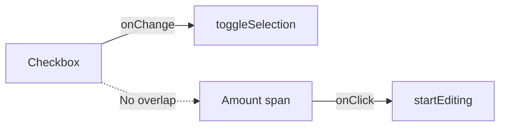
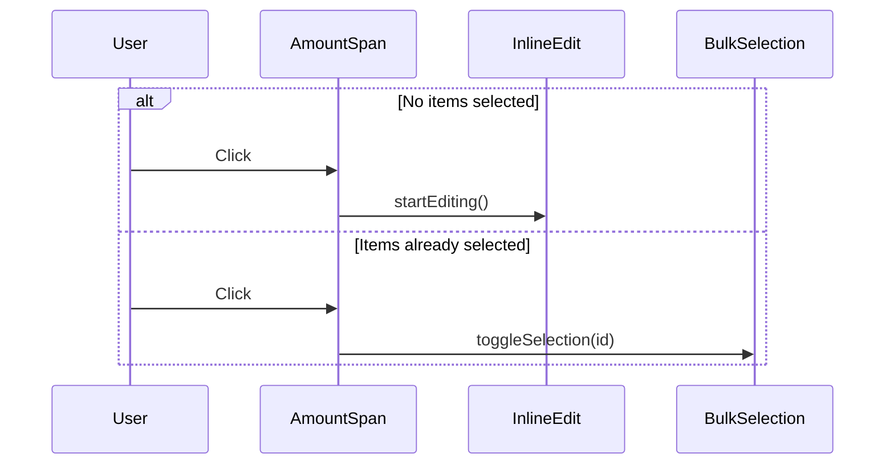

# Inline Amount Edit vs Select-to-Sum: Conflict Analysis

## Summary

The movements page currently has **no conflict** between these features because selection uses **checkboxes** and inline editing uses **clicking the amount text**. They already coexist cleanly. However, there's a minor UX friction point: when a user is in "bulk selection mode" mentally, they might accidentally click the amount and trigger editing instead of expecting it to select. Below is the full analysis and a recommendation for making the coexistence more intentional.

## Current Implementation

### Bulk Selection: Checkbox-Based

Selection is triggered exclusively via a **checkbox input** on each movement row:

```tsx
// MovementList.tsx — MovementRow component
<input
    type="checkbox"
    checked={isSelected}
    onChange={() => onToggleSelection(movement.id)}
    className="w-5 h-5 text-blue-600 rounded border-gray-300 focus:ring-blue-500"
/>
```

The `useBulkSelection` hook is a pure state container — it exposes `toggleSelection(id)` which is only called by the checkbox `onChange`. No click handler on the row itself triggers selection.

### Inline Edit: Click on Amount Text

`InlineEditableAmount` renders the amount as a clickable `<span>` with `cursor-pointer` and `hover:underline`. Clicking it transforms it into an inline `<input>`:

```tsx
// InlineEditableAmount.tsx
<span
    className={`text-lg font-bold ${colorClass} cursor-pointer hover:underline`}
    onClick={startEditing}
    role="button"
    tabIndex={0}
>
    {isIncome ? '+' : '-'}${amount.toLocaleString()}
</span>
```

### Floating Stats Bar

When `selectedMovementIds.size > 0`, a floating bar appears at the bottom showing count, sum, and average of selected movements. This is purely driven by checkbox state.

### Bulk Actions Toolbar

`BulkActionsToolbar` renders above the list when items are selected, offering Apply Pending, Mark as Pending, and Delete actions.

## Conflict Assessment



**There is no direct conflict.** The two interactions target different DOM elements:
- Checkbox (left side of row) → selection
- Amount text (right side of row) → inline edit

They can both be active simultaneously without interference.

## Potential UX Friction

Despite no technical conflict, there's a subtle UX issue:

1. **Accidental edits during bulk selection** — A user rapidly selecting movements might mis-click the amount instead of the checkbox, triggering an unwanted edit mode.
2. **Discoverability** — New users may not realize the amount is editable (only visual cue is `cursor-pointer` and `hover:underline`).
3. **Mobile touch targets** — On mobile, the checkbox and amount are close together, increasing mis-tap risk.

## Options Analysis

### Option A: Current State (Checkbox + Click Amount) — ALREADY IMPLEMENTED

| Aspect | Assessment |
|--------|-----------|
| Conflict | None — separate UI elements |
| Discoverability | Medium — underline on hover hints editability |
| Mobile UX | Acceptable — checkbox has 44px min touch target |
| Complexity | Zero — already working |

**Verdict**: This is already the implementation. No changes needed unless friction is observed.

### Option B: Toggle Between Modes (Bulk Mode Button)

A dedicated "Select" button would switch the page into bulk mode where clicking anywhere on a row selects it, and inline editing is disabled.

| Aspect | Assessment |
|--------|-----------|
| Conflict | Eliminated by mode separation |
| Discoverability | High — explicit mode switch |
| Mobile UX | Good — larger tap targets in bulk mode |
| Complexity | Medium — requires mode state, conditional rendering |

**Verdict**: Overkill. The checkbox approach already works and is more standard.

### Option C: Double-Click = Inline Edit, Single Click = Select

| Aspect | Assessment |
|--------|-----------|
| Conflict | Eliminated |
| Discoverability | Low — double-click is not discoverable on web |
| Mobile UX | Bad — no double-tap convention on mobile |
| Complexity | Low |

**Verdict**: Poor UX. Double-click is a desktop-only convention that most users won't discover.

### Option D: Pencil Icon for Edit, Click Amount = Select

| Aspect | Assessment |
|--------|-----------|
| Conflict | Eliminated |
| Discoverability | High — explicit icon |
| Mobile UX | Good — clear tap targets |
| Complexity | Low — swap click handler, add icon |

**Verdict**: Would work but changes the current behavior where clicking the amount edits it. Also adds visual clutter (another icon per row alongside Edit and Delete buttons that already exist).

## Recommendation: Keep Current Implementation (Option A)

The current design is already the correct solution:

1. **Checkbox** (left side) = select for bulk sum/actions
2. **Click amount** (right side) = inline edit
3. **No mode switching needed** — both work simultaneously

### Minor Enhancements (Optional)

If friction is observed in practice, these small tweaks would help:

1. **Suppress inline edit when in bulk selection mode** — If `selectedIds.size > 0`, clicking the amount could toggle selection instead of editing. This gives a natural "mode" without an explicit toggle button:

```tsx
// In MovementRow — conditional behavior
<InlineEditableAmount
    amount={movement.amount}
    isIncome={isIncome}
    onSave={(newAmount) => onUpdateAmount(movement.id, newAmount)}
    disabled={hasActiveSelection}  // New prop
/>
```

When `disabled`, clicking the amount would call `onToggleSelection` instead of `startEditing`.

2. **Add a subtle edit indicator** — Show a tiny pencil icon on hover next to the amount to make editability more discoverable without adding permanent visual clutter:

```tsx
<span className="group/amount inline-flex items-center gap-1">
    <span onClick={startEditing} className="cursor-pointer hover:underline">
        {isIncome ? '+' : '-'}${amount.toLocaleString()}
    </span>
    <Edit2 className="w-3 h-3 opacity-0 group-hover/amount:opacity-50 transition-opacity" />
</span>
```

3. **Increase checkbox touch target on mobile** — Already at 44px min, but could add more padding on small screens.

## Implementation Plan (If Enhancement #1 Is Desired)



### Changes Required

1. **`InlineEditableAmount.tsx`** — Add `disabled?: boolean` and `onDisabledClick?: () => void` props
2. **`MovementList.tsx`** — Pass `disabled={selectedMovementIds.size > 0}` and `onDisabledClick={() => onToggleSelection(movement.id)}`
3. **No other files affected**

### Estimated Effort

- Enhancement #1 (context-aware click): ~15 minutes, 2 files changed
- Enhancement #2 (hover pencil icon): ~10 minutes, 1 file changed
- Both together: ~20 minutes

## Conclusion

The current codebase already implements the cleanest solution (Option A) with checkboxes for selection and click-to-edit for amounts. No architectural changes are needed. The optional enhancement of suppressing inline edit when items are already selected would add a nice contextual behavior but is not required for the features to coexist.
