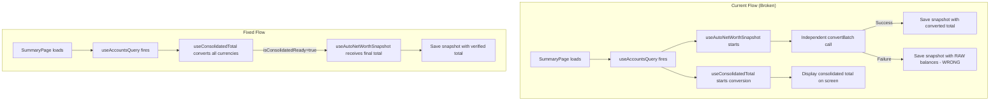

# Net Worth Timeline Feature Audit

## Summary

The net worth timeline has three confirmed problems:

1. **Race condition in auto-snapshot**: The snapshot fires before currency conversions complete, capturing partial/incorrect totals
2. **No readiness gate**: The auto-snapshot hook doesn't wait for the consolidated total to stabilize
3. **Missing per-currency graphs**: The "breakdown" view converts all currencies to the primary currency before charting — it doesn't show each currency's native total over time

---

## Problem 1: Snapshot Captures Partial Currency Conversions

### Symptom

Net worth drops significantly in snapshots because the `totalNetWorth` value saved is computed with incomplete or fallback exchange rates.

### Root Cause

In `useAutoNetWorthSnapshot.ts`, the `calculateNetWorth` function:

```typescript
// Line ~60-90 in useAutoNetWorthSnapshot.ts
const results = await currencyService.convertBatch(conversions);
for (let i = 0; i < results.length; i += 1) {
    totalNetWorth += jobs[i].sign * results[i].convertedAmount;
}
```

The `convertBatch` call goes to the backend `/api/currency/convert-batch` endpoint. If this call **fails** (network error, timeout, rate limit), the catch block falls back to raw unconverted balances:

```typescript
} catch {
    // Falls back to raw (unconverted) balances
    for (const job of jobs) {
        totalNetWorth += job.rawBalance;
    }
}
```

This means if you have 100,000 MXN (~$5,500 USD), a failed conversion adds 100,000 to the total as if it were USD, or conversely if the fallback mock rates are stale, the total is wildly wrong.

### Secondary Issue: Timing

The hook runs inside a `useEffect` that depends on `accounts` data from TanStack Query. The `accounts` query returns `account.balance` which is the sum of pocket balances. However:

- The hook fires as soon as `accounts.length > 0` and `settings` are loaded
- It does NOT wait for `useConsolidatedTotal` (which lives in `SummaryPage.tsx`) to finish its own conversion
- The hook performs its OWN independent currency conversion, completely separate from the one `useConsolidatedTotal` does

This means there are **two independent conversion paths** that can produce different results:
- `useConsolidatedTotal` → used for display on the summary page
- `useAutoNetWorthSnapshot` → used for persisting the snapshot

### Why It's Wrong

The auto-snapshot should use the **same** consolidated total that the user sees on screen, not compute its own. The two can diverge because:
1. They fire at different times
2. They use different conversion strategies (batch vs individual)
3. One can fail while the other succeeds

### Fix

The auto-snapshot hook should:
1. Accept the consolidated total and `isConsolidatedReady` flag from `useConsolidatedTotal` as inputs
2. Only fire the snapshot AFTER `isConsolidatedReady === true`
3. Use the already-computed `consolidatedTotal` and `totalsByCurrency` instead of recalculating

```
useAutoNetWorthSnapshot({
  consolidatedTotal,
  totalsByCurrency,
  isConsolidatedReady,
  primaryCurrency,
})
```

This eliminates the race condition entirely — the snapshot waits for the display value to stabilize, then persists exactly what the user sees.

---

## Problem 2: No Readiness Gate Before Saving

### Symptom

Even when conversion doesn't fail, the snapshot can save a stale value because there's no mechanism to ensure all async work is done.

### Root Cause

The `useEffect` in `useAutoNetWorthSnapshot.ts` has this dependency array:

```typescript
}, [accounts, settings, latestSnapshot, loadingSnapshot, createMutation]);
```

It runs as soon as `accounts` and `settings` are available. But `accounts` arrives from the query cache potentially before the currency service has fetched live rates. The hook then:

1. Calls `currencyService.convertBatch()` which hits the backend
2. The backend may return rates from its own cache (which could be stale)
3. Immediately calls `createMutation.mutate()` with whatever value came back

There is no coordination with:
- The `useConsolidatedTotal` hook's `isConsolidatedReady` state
- The `useNetWorthChartData` hook's rate-fetching effect
- Any loading/pending state from the currency service

### The `hasRun` Ref Problem

```typescript
const hasRun = useRef(false);
// ...
if (shouldTakeSnapshot()) {
    hasRun.current = true;
    calculateNetWorth(); // fire-and-forget async function
}
```

Once `hasRun.current = true`, the snapshot will never retry even if the conversion failed. The user gets one shot per session, and if that shot happens during a slow network moment, the snapshot is permanently wrong until manually edited.

### Fix

1. Don't set `hasRun.current = true` until the mutation succeeds
2. Gate on `isConsolidatedReady` before attempting the snapshot
3. If the conversion fails, leave `hasRun` as false so it retries on next effect cycle

---

## Problem 3: Missing Per-Currency Native Graphs

### Symptom

The "By Currency" breakdown view shows each currency's value **converted to the primary currency**, not the native amount in that currency over time.

### Root Cause

In `useNetWorthChartData.ts`, the breakdown mode processes snapshots like this:

```typescript
// Line ~170-180
if (snapshot.breakdown) {
    Object.entries(snapshot.breakdown).forEach(([currency, value]) => {
        const rate = rates[currency] || 1;
        data[currency] =
            currency === primaryCurrency ? value : value * rate;
    });
}
```

Every currency's value is multiplied by the exchange rate to the primary currency. So if you have 100,000 MXN, the chart shows ~$5,500 (the USD equivalent), not 100,000.

This means:
- The "By Currency" view is just a decomposition of the total into currency-sourced contributions
- It does NOT show how your MXN holdings move over time in MXN terms
- Exchange rate fluctuations make the lines jump even if the underlying balance didn't change

### What the User Wants

Per-currency graphs showing the **native** total in each currency over time. For example:
- MXN line: 80,000 → 90,000 → 100,000 (in MXN)
- USD line: 3,000 → 3,500 → 4,000 (in USD)
- COP line: 5,000,000 → 5,200,000 (in COP)

Each line uses its own Y-axis scale (or a normalized view).

### Data Availability

The `breakdown` field in each snapshot already stores native amounts:
```typescript
breakdown: Record<string, number>  // { "USD": 5000, "MXN": 100000 }
```

The data is there — it's just being converted before charting.

### Fix

Add a third view mode (or modify "breakdown" behavior):

**Option A: New "native" view mode**
- `viewMode: 'total' | 'breakdown' | 'native'`
- "native" mode charts `snapshot.breakdown[currency]` directly without conversion
- Requires either multiple Y-axes or a normalized percentage view since scales differ wildly (MXN in thousands vs USD in hundreds)

**Option B: Modify "breakdown" to show native values**
- Remove the `value * rate` conversion in breakdown mode
- Use a dual-axis or separate mini-charts per currency
- The variation (%) toggle already handles scale normalization — in variation mode, each currency shows its % change from baseline, which works regardless of absolute scale

**Recommended: Option B with variation as default for breakdown**

When `viewMode === 'breakdown'`:
- Chart each currency in its native amount
- Default to `showVariation = true` so the Y-axis is percentage-based (solves the scale problem)
- When variation is off, use separate Y-axes or show a note that scales differ

Implementation changes in `useNetWorthChartData.ts`:

```typescript
// In breakdown mode, use native values (no conversion)
if (snapshot.breakdown) {
    Object.entries(snapshot.breakdown).forEach(([currency, value]) => {
        data[currency] = value; // native amount, no rate multiplication
    });
}
```

The variation calculation already works correctly with native values since it computes percentage change from baseline.

---

## Architecture Diagram



---

## File-by-File Summary

| File | Role | Issues |
|------|------|--------|
| `useAutoNetWorthSnapshot.ts` | Triggers auto-save on app load | Race condition: fires before conversions complete; fallback uses raw balances; `hasRun` prevents retry |
| `useConsolidatedTotal.ts` | Computes display total with proper async handling | Well-implemented with `isConsolidatedReady` flag, but not connected to snapshot logic |
| `useNetWorthChartData.ts` | Shapes snapshot data for chart rendering | Breakdown mode converts to primary currency instead of showing native values |
| `NetWorthTimelineWidget.tsx` | UI orchestrator | Clean, no bugs — just passes data through |
| `NetWorthChart.tsx` | Recharts rendering | Clean, no bugs — pure rendering layer |
| `netWorthSnapshotService.ts` | API client for CRUD | Clean, simple pass-through |
| Backend `NetWorthSnapshotService.ts` | Business logic layer | Thin pass-through, no validation of totals |
| Backend `SupabaseNetWorthSnapshotRepository.ts` | DB access | Uses upsert on `(user_id, snapshot_date)` — correct behavior |
| `currencyService.ts` | Currency conversion with caching | Mock fallback rates are hardcoded and will drift from reality over time |

---

## Recommended Fix Priority

1. **Critical**: Wire `useAutoNetWorthSnapshot` to consume `useConsolidatedTotal`'s output instead of computing its own total. This fixes the race condition and the wrong-value problem.

2. **Important**: Add retry logic — don't set `hasRun = true` until mutation succeeds. If `isConsolidatedReady` flips back to false (e.g., accounts change), allow re-snapshot.

3. **Feature**: Change breakdown mode to show native currency values. Default to variation (%) view when in breakdown mode to handle scale differences.

4. **Nice-to-have**: Replace hardcoded mock rates in `currencyService.ts` with rates from the last successful API call persisted to localStorage, so the fallback is at least recent.

---

## Sources

- `frontend/src/hooks/useAutoNetWorthSnapshot.ts` — auto-snapshot trigger logic
- `frontend/src/hooks/useConsolidatedTotal.ts` — consolidated total with readiness flag
- `frontend/src/hooks/useNetWorthChartData.ts` — chart data shaping and rate fetching
- `frontend/src/services/currencyService.ts` — conversion service with mock fallback
- `frontend/src/components/net-worth/NetWorthTimelineWidget.tsx` — UI orchestrator
- `frontend/src/components/net-worth/NetWorthChart.tsx` — Recharts rendering
- `frontend/src/services/netWorthSnapshotService.ts` — API client
- `backend/src/modules/net-worth/` — backend CRUD (controller, service, repository, domain)
