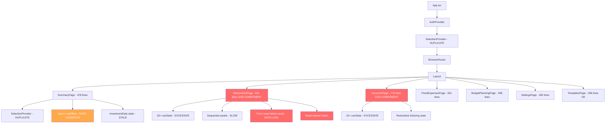

# Pages Code Review - Comprehensive Analysis

**Date**: 2026-05-19  
**Scope**: All page components in `frontend/src/pages/`  
**Verdict**: Severe quality issues across the board. Multiple bugs, god-components, missing error handling, and architectural violations.

---

## Executive Summary

| Severity | Count |
|----------|-------|
| Critical | 8 |
| High | 19 |
| Medium | 24 |
| Low | 12 |

The codebase suffers from:
- **God components** (MovementsPage: 941 lines, AccountsPage: 779 lines)
- **Incorrect financial calculations** (SummaryPage consolidated total)
- **Race conditions** in async operations
- **Sequential awaits** in loops destroying performance
- **Missing error boundaries** and incomplete error handling
- **Stale closure bugs** in useEffect dependencies
- **Dead code and console.logs** left in production

---

## 1. CRITICAL BUGS

### 1.1 SummaryPage: Consolidated Total Calculation is Async Inside useEffect with Stale Dependencies

**File**: `SummaryPage.tsx` ~lines 180-220  
**Severity**: Critical  
**Category**: BUG

The `calculateTotal` useEffect depends on `getTotalByCurrency` which itself depends on `investmentData` state. But `getTotalByCurrency` is not in the dependency array — it's a function recreated every render. The effect lists `[accounts, primaryCurrency, investmentData]` but `getTotalByCurrency` also reads `accountsByCurrency` which is derived from `accounts`. The real issue: `getTotalByCurrency` is called inside an async function that may resolve after state has changed, writing a stale total.

**What's wrong**: The consolidated total can be incorrect because:
1. `getTotalByCurrency` captures stale `investmentData` from the closure
2. The async currency conversion can resolve out of order (no cancellation)
3. Multiple rapid state changes cause race conditions in the total

**Correct implementation**: Use `useMemo` with a synchronous calculation, or use a proper async hook with cancellation (AbortController / ignore flag). Better yet, pre-compute exchange rates and make the calculation synchronous.

---

### 1.2 SummaryPage: `getAccountBalance` Uses investmentData State That May Not Be Loaded

**File**: `SummaryPage.tsx` ~lines 145-175  
**Severity**: Critical  
**Category**: BUG

`getAccountBalance` for investment accounts returns `data.totalValue` from `investmentData` map. But `investmentData` is populated asynchronously in a separate `useEffect`. During initial render and before investment prices load, it falls back to `account.balance || 0`. This means:
- The consolidated total first renders with wrong values
- Then updates when investments load
- But the useEffect for consolidated total may have already run with the wrong values

**Correct implementation**: The consolidated total calculation should explicitly depend on `investmentData` being fully loaded, or show a loading state until all data is ready.

---

### 1.3 MovementsPage: Batch Operations Use Sequential Awaits Without Error Recovery

**File**: `MovementsPage.tsx` ~lines 350-400 (bulk actions), ~lines 280-300 (handleBatchSave)  
**Severity**: Critical  
**Category**: BUG

```typescript
for (const id of selectedMovementIds) {
  await applyPendingMovement.mutateAsync(id);
}
```

If the 3rd of 10 operations fails, the first 2 are already committed. There's no rollback, no indication of which succeeded, and the UI shows a generic error. The user has no idea what state their data is in.

**Correct implementation**: Use `Promise.allSettled()` or implement a transaction-like pattern that reports partial success: "Applied 2/10 movements. 8 failed: [reason]".

---

### 1.4 MovementsPage: Form State Reset Before Async Operation Completes

**File**: `MovementsPage.tsx` ~lines 220-270 (handleSubmit)  
**Severity**: Critical  
**Category**: BUG

```typescript
if (editingMovement) {
  resetFormState(); // ← Resets BEFORE the mutation completes
  await updateMovement.mutateAsync({...});
}
```

The form is reset optimistically before the mutation succeeds. If the mutation fails, the catch block sets `setShowForm(true)` but all form data is already gone. The user loses their input on error.

**Correct implementation**: Only reset form state in the success path (after await), or store form data in a ref that survives the reset.

---

### 1.5 MovementsPage: `handleDelete` Never Resets `deletingId` on Success

**File**: `MovementsPage.tsx` ~lines 300-320  
**Severity**: Critical  
**Category**: BUG

```typescript
const handleDelete = async (id: string) => {
  // ...
  setDeletingId(id);
  try {
    await deleteMovement.mutateAsync(id);
    toast.success('Movement deleted successfully!');
    // ← deletingId is NEVER reset to null on success
  } catch (err: any) {
    // ...
  }
};
```

After a successful delete, `deletingId` remains set to the deleted movement's ID. This could cause UI issues if the same component re-renders (e.g., loading spinner stuck).

**Correct implementation**: Add `finally { setDeletingId(null); }` like `handleApplyPending` does.

---

### 1.6 BudgetPlanningPage: `calculateEntryAmount` Uses Stale `remaining` in useEffect

**File**: `BudgetPlanningPage.tsx` ~lines 130-155  
**Severity**: Critical  
**Category**: BUG

```typescript
useEffect(() => {
  const convertAmounts = async () => {
    for (const entry of distributionEntries) {
      const amount = calculateEntryAmount(entry.percentage); // captures `remaining` from closure
    }
  };
  convertAmounts();
}, [distributionEntries, remaining, showConversion, budgetCurrency, primaryCurrency]);
```

`calculateEntryAmount` is defined outside the effect and captures `remaining` from the component scope. While `remaining` IS in the dependency array, the function reference itself isn't stable. More critically, if `remaining` changes while the async conversion is in progress, the results will be inconsistent — some entries converted with old `remaining`, some with new.

**Correct implementation**: Pass `remaining` as a parameter to the conversion function, or compute all amounts synchronously first, then convert.

---

### 1.7 SummaryPage: Console.logs in Production Code

**File**: `SummaryPage.tsx` ~lines 185-210  
**Severity**: Critical  
**Category**: CODE QUALITY / SECURITY

```typescript
console.log('💰 ===== CONSOLIDATED TOTAL CALCULATION =====');
// ... logs all currency breakdowns with actual financial data
console.log(`💵 Final Consolidated Total: ${currencyService.formatCurrency(total, primaryCurrency)}`);
```

Financial data is being logged to the browser console in production. This is a security concern — anyone with DevTools open can see the user's complete financial breakdown.

**Correct implementation**: Remove all console.logs or gate them behind `import.meta.env.DEV`.

---

### 1.8 FixedExpensesPage: Restore Button Has Empty Try/Catch (Dead Feature)

**File**: `MovementsPage.tsx` ~lines 330-360 (orphaned movements restore)  
**Severity**: Critical  
**Category**: BUG

The "Restore" button for orphaned movements has a completely empty `try` block with just comments. The feature is broken — clicking it does nothing.

```typescript
try {
  // We need the account ID and pocket ID...
  // Actually, the store method took...
  // This implies we restore TO an existing account/pocket?
  // ...
} catch (err) {
  console.error(err);
}
```

**Correct implementation**: Either implement the restore logic or remove the button entirely. A button that does nothing is worse than no button.


---

## 2. HIGH SEVERITY ISSUES

### 2.1 MovementsPage: God Component (941 Lines, 30+ State Variables)

**File**: `MovementsPage.tsx` (entire file)  
**Severity**: High  
**Category**: ARCHITECTURE

This single component manages:
- Movement CRUD
- Batch movement creation
- Template selection
- Orphaned movements display
- Bulk selection/actions
- Month collapsing
- Filtering and sorting
- Form state (12+ fields)
- Batch form state
- URL parameter handling
- Balance preview calculations

**Correct implementation**: Extract into at minimum:
- `useMovementFormState` hook (form fields + handlers)
- `useBatchMovementState` hook
- `useURLActions` hook (URL parameter handling)
- `OrphanedMovementsPanel` component
- `BulkActionsToolbar` component
- `MovementFormModal` component

---

### 2.2 AccountsPage: God Component (779 Lines, Similar Issues)

**File**: `AccountsPage.tsx` (entire file)  
**Severity**: High  
**Category**: ARCHITECTURE

Manages accounts, pockets, CD accounts, cascade deletion, migration — all in one component with 15+ state variables.

**Correct implementation**: Extract `AccountDetailPanel`, `PocketManagement`, `CDAccountManagement` as separate components. Extract `useAccountActions` and `usePocketActions` hooks.

---

### 2.3 All Pages: Sequential Awaits in Loops (O(n) Network Calls)

**File**: `MovementsPage.tsx`, `FixedExpensesPage.tsx`, `BudgetPlanningPage.tsx`  
**Severity**: High  
**Category**: PERFORMANCE

Every batch operation uses:
```typescript
for (const row of rows) {
  await createMovement.mutateAsync({...});
}
```

10 movements = 10 sequential network calls. With 200ms latency each, that's 2 seconds of blocking.

**Correct implementation**: Use `Promise.allSettled()` for parallel execution, or better yet, implement a batch API endpoint on the backend.

---

### 2.4 SummaryPage: Investment Price Loading in useEffect Creates Waterfall

**File**: `SummaryPage.tsx` ~lines 60-100  
**Severity**: High  
**Category**: PERFORMANCE

```typescript
for (const account of investmentAccounts) {
  const data = await investmentService.updateInvestmentAccount(accountWithCorrectValues);
}
```

Sequential API calls for each investment account. 5 investments = 5 sequential network requests.

**Correct implementation**: Use `Promise.all()` to fetch all prices in parallel.

---

### 2.5 SummaryPage: Entire Page Re-renders on Every Investment Price Refresh

**File**: `SummaryPage.tsx` ~lines 100-170 (handleRefreshPrice)  
**Severity**: High  
**Category**: PERFORMANCE

The triple-click detection logic with `clickCounts`, `lastForceRefresh`, and `refreshingPrices` state causes the entire 478-line component to re-render on every click, even for unrelated UI.

**Correct implementation**: Extract investment refresh logic into a custom hook or child component with its own state.

---

### 2.6 MovementsPage: useEffect Dependencies Missing/Incorrect

**File**: `MovementsPage.tsx` ~lines 130-170  
**Severity**: High  
**Category**: BUG

```typescript
useEffect(() => {
  // ... uses setFilters methods
}, [location.search, navigate]); // Don't include setFilters in dependencies
```

The comment explicitly acknowledges missing dependencies. If `setFilters` is not stable (not wrapped in useCallback), this could cause stale closures. The comment suggests the developer hit an infinite loop and "fixed" it by removing the dependency.

**Correct implementation**: Ensure `setFilters` methods are stable (memoized), then include them properly. Or use a ref to avoid the dependency.

---

### 2.7 MovementsPage: Second useEffect Has Excessive Dependencies

**File**: `MovementsPage.tsx` ~lines 170-210  
**Severity**: High  
**Category**: BUG / PERFORMANCE

```typescript
useEffect(() => {
  // handles URL action=new
}, [location.search, navigate, subPockets, pockets, movementTemplates, templatesLoading]);
```

This effect re-runs every time `subPockets`, `pockets`, or `movementTemplates` arrays change (which is every query refetch since arrays are new references). It checks `action === 'new'` which is only true once, but the effect still runs on every data change.

**Correct implementation**: Use a ref to track if the action has been processed, and only run the logic once.

---

### 2.8 SummaryPage: `error` Variable is Hardcoded to `null`

**File**: `SummaryPage.tsx` ~line 58  
**Severity**: High  
**Category**: ERROR HANDLING

```typescript
const error = null; // TanStack Query handles errors internally
```

Then later:
```typescript
if (error) {
  return <div>Error Loading Data: {error}</div>;
}
```

This error UI is dead code — it can never render. TanStack Query errors are NOT handled. If any query fails, the page silently shows empty data.

**Correct implementation**: Extract `isError` and `error` from the query hooks and display meaningful error states.

---

### 2.9 SettingsPage: Direct Service Calls Bypass TanStack Query Cache

**File**: `SettingsPage.tsx` ~lines 65-95 (handleExportData)  
**Severity**: High  
**Category**: ARCHITECTURE / STATE MANAGEMENT

```typescript
const accounts = await accountService.getAllAccounts();
const pockets = await pocketService.getAllPockets();
```

These bypass the TanStack Query cache entirely, making redundant network calls. The data is already cached from the queries used elsewhere.

**Correct implementation**: Use `queryClient.getQueryData(['accounts'])` to read from cache, or use the existing query hooks.

---

### 2.10 BudgetPlanningPage: LocalStorage Persistence on Every Keystroke

**File**: `BudgetPlanningPage.tsx` ~lines 75-80  
**Severity**: High  
**Category**: PERFORMANCE

```typescript
useEffect(() => {
  StorageService.saveBudgetPlanning({
    initialAmount,
    distributionEntries,
    scenarios,
  });
}, [initialAmount, distributionEntries, scenarios]);
```

Every character typed in the "Initial Amount" input triggers a localStorage write (JSON.stringify of potentially large data). This blocks the main thread.

**Correct implementation**: Debounce the save (e.g., 500ms), or save only on blur/navigation.

---

### 2.11 App.tsx: Nested SelectionProvider (Duplicate Context)

**File**: `App.tsx` ~line 25, `SummaryPage.tsx` ~line 380  
**Severity**: High  
**Category**: ARCHITECTURE

`SelectionProvider` wraps the entire app in `App.tsx`, AND `SummaryPage` wraps its content in another `SelectionProvider`. This creates a nested context where the inner provider shadows the outer one, potentially causing bugs where other pages can't access the selection state set in SummaryPage.

**Correct implementation**: Remove the duplicate `SelectionProvider` from `SummaryPage.tsx`. The app-level one is sufficient.

---

### 2.12 MovementsPage: Loading ALL Movements Client-Side

**File**: `MovementsPage.tsx` ~line 38  
**Severity**: High  
**Category**: PERFORMANCE

```typescript
// Load ALL movements (no pagination) - grouping by month happens client-side
const { data: movements = EMPTY_MOVEMENTS, isLoading: movementsLoading } = useMovementsQuery();
```

The comment acknowledges this loads ALL movements. For a user with years of data (thousands of transactions), this fetches everything on page load.

**Correct implementation**: Implement server-side pagination or at minimum lazy-load older months. Default to showing only the current month.

---

### 2.13 FixedExpensesPage: Console.logs Left in Delete Handler

**File**: `FixedExpensesPage.tsx` ~lines 175-195  
**Severity**: High  
**Category**: CODE QUALITY

```typescript
const handleDelete = async (id: string) => {
  console.log('🚀 handleDelete called with id:', id);
  console.log('📦 Found subPocket:', subPocket);
  console.log('✅ Confirmation result:', confirmed);
  console.log('🔄 Calling deleteSubPocket.mutateAsync...');
  console.log('✅ Delete successful');
  console.error('❌ Delete failed:', err);
};
```

Debug logging left in production code.

**Correct implementation**: Remove all console.log statements.

---

### 2.14 AccountsPage: `isSaving` State is Redundant with Mutation State

**File**: `AccountsPage.tsx` ~lines 60, 130-160  
**Severity**: High  
**Category**: STATE MANAGEMENT

```typescript
const [isSaving, setIsSaving] = useState(false);
// ...
setIsSaving(true);
await createAccount.mutateAsync({...});
setIsSaving(false);
```

TanStack Query mutations already provide `isPending` state. The manual `isSaving` state is redundant and can get out of sync (e.g., if the component unmounts during the operation).

**Correct implementation**: Use `createAccount.isPending || updateAccount.isPending` directly.

---

### 2.15 SummaryPage: Investment useEffect Has No Cleanup/Cancellation

**File**: `SummaryPage.tsx` ~lines 60-100  
**Severity**: High  
**Category**: BUG

```typescript
useEffect(() => {
  const loadInvestmentPrices = async () => {
    // ... multiple awaits
    setInvestmentData(newData);
  };
  loadInvestmentPrices();
}, [accounts, pockets]);
```

No cleanup function. If `accounts` or `pockets` change rapidly (e.g., during initial load), multiple instances of this async function run concurrently, all calling `setInvestmentData`. The last one to finish wins, which may not be the most recent.

**Correct implementation**: Use an `ignore` flag pattern or AbortController:
```typescript
useEffect(() => {
  let ignore = false;
  const load = async () => { if (!ignore) setInvestmentData(data); };
  load();
  return () => { ignore = true; };
}, [accounts, pockets]);
```

---

### 2.16 BudgetPlanningPage: `handleCreateMovements` Matches Pockets by Name (Fragile)

**File**: `BudgetPlanningPage.tsx` ~lines 155-185  
**Severity**: High  
**Category**: BUG

```typescript
const matchedPocket = pockets.find(p => 
  p.name.trim().toLowerCase() === entry.name.trim().toLowerCase()
);
```

Distribution entries are matched to pockets by name comparison. If a user renames a pocket, all their budget distribution entries break silently (movements created with empty accountId/pocketId).

**Correct implementation**: Store `pocketId` and `accountId` directly in `DistributionEntry`. Match by ID, not name.

---

### 2.17 LoginPage/SignUpPage: No Rate Limiting or Brute Force Protection

**File**: `LoginPage.tsx`, `SignUpPage.tsx`  
**Severity**: High  
**Category**: SECURITY

No client-side rate limiting on login attempts. While Supabase may have server-side protection, there's no UI feedback about lockouts, no CAPTCHA, and no exponential backoff.

**Correct implementation**: Add attempt counting with exponential backoff UI, or integrate a CAPTCHA after N failed attempts.

---

### 2.18 MovementsPage: `balanceDeltas` useMemo Recalculates on Every Keystroke

**File**: `MovementsPage.tsx` ~lines 95-125  
**Severity**: High  
**Category**: PERFORMANCE

```typescript
const balanceDeltas = useMemo(() => {
  // ...
}, [showBatchForm, showForm, batchRows, selectedType, selectedAccountId, selectedPocketId, selectedSubPocketId, amount]);
```

The `amount` state changes on every keystroke in the amount input. This triggers the entire balance delta recalculation on every character typed.

**Correct implementation**: Debounce the amount value used in the calculation, or compute deltas only on blur/submit.

---

### 2.19 AccountsPage: `handleCreateAccount` Redirects to CD Form Mid-Submit

**File**: `AccountsPage.tsx` ~lines 100-120  
**Severity**: High  
**Category**: UX / BUG

```typescript
const handleCreateAccount = async (e: React.FormEvent<HTMLFormElement>) => {
  // ...
  if (accountType === 'cd') {
    setShowAccountForm(false);
    setShowCDForm(true);
    setIsSaving(false);
    return;
  }
```

If user selects "cd" type in the account form and submits, the form closes and a different form opens. This is confusing UX — the type selection should prevent submission and show the CD form inline, or the CD option should be a separate button.

**Correct implementation**: Show CD form as a separate creation path (separate button), not as a form submission side-effect.


---

## 3. MEDIUM SEVERITY ISSUES

### 3.1 All Pages: `err: any` Type Assertions

**File**: Multiple files  
**Severity**: Medium  
**Category**: CODE QUALITY

```typescript
} catch (err: any) {
  const errorMessage = err.message || 'Failed to delete movement';
```

Used in: MovementsPage (5x), FixedExpensesPage (4x), BudgetPlanningPage (1x).

Some handlers correctly use `err instanceof Error ? err.message : '...'` while others use `err: any`. Inconsistent and type-unsafe.

**Correct implementation**: Always use `catch (err: unknown)` with proper type narrowing.

---

### 3.2 SummaryPage: Triple-Click Force Refresh is Undiscoverable UX

**File**: `SummaryPage.tsx` ~lines 100-170  
**Severity**: Medium  
**Category**: UX

The triple-click-to-force-refresh pattern with cooldown timers is completely undiscoverable. Users will never know this feature exists. The implementation is also 70+ lines of complex state management for a debug feature.

**Correct implementation**: Add a visible "Force Refresh" button (perhaps behind a long-press or context menu), or move to Settings/Debug section.

---

### 3.3 FixedExpensesPage: Duplicate Derived Data

**File**: `FixedExpensesPage.tsx` ~lines 50-55, 290-300  
**Severity**: Medium  
**Category**: CODE QUALITY

```typescript
// First calculation (line ~50)
const fixedSubPockets = useMemo(() => 
  subPockets.filter(sp => fixedPockets.some(fp => fp.id === sp.pocketId)), ...);

// Duplicate calculation (line ~290)
const consolidatedFixedPockets = pockets.filter((p) => p.type === 'fixed');
const consolidatedFixedSubPockets = subPockets.filter(sp => 
  consolidatedFixedPockets.some(fp => fp.id === sp.pocketId));
```

The same filtering logic is computed twice with different variable names.

**Correct implementation**: Use the already-computed `fixedSubPockets` and `fixedPockets` variables.

---

### 3.4 SummaryPage: `setLoadingInvestments` State is Set But Never Read

**File**: `SummaryPage.tsx` ~line 45  
**Severity**: Medium  
**Category**: CODE QUALITY (Dead Code)

```typescript
const [, setLoadingInvestments] = useState(false);
```

The state value is destructured away (never read). Only the setter is used. This state serves no purpose.

**Correct implementation**: Remove the state entirely, or use it to show a loading indicator on investment cards.

---

### 3.5 BudgetPlanningPage: Initial State from localStorage on Every Render

**File**: `BudgetPlanningPage.tsx` ~lines 55-60  
**Severity**: Medium  
**Category**: PERFORMANCE

```typescript
const savedData = StorageService.getBudgetPlanning();
const [initialAmount, setInitialAmount] = useState<number>(savedData.initialAmount || 0);
```

`StorageService.getBudgetPlanning()` is called on every render (it's outside useState's initializer). Only the first call matters (useState ignores subsequent initial values), but the localStorage read + JSON.parse still happens every render.

**Correct implementation**: Use lazy initialization:
```typescript
const [initialAmount, setInitialAmount] = useState<number>(() => {
  const saved = StorageService.getBudgetPlanning();
  return saved.initialAmount || 0;
});
```

---

### 3.6 MovementsPage: Orphaned Movements Grouped by String Split

**File**: `MovementsPage.tsx` ~lines 340-360  
**Severity**: Medium  
**Category**: BUG

```typescript
const key = `${movement.orphanedAccountName}|${movement.orphanedAccountCurrency}`;
// ...
const [accountName, currency] = key.split('|');
```

If an account name contains `|`, the split will produce incorrect results. Unlikely but possible.

**Correct implementation**: Use a proper composite key (object/tuple) or encode the separator.

---

### 3.7 All Pages: No Error Boundaries

**File**: `App.tsx`  
**Severity**: Medium  
**Category**: ERROR HANDLING

No React Error Boundaries anywhere. If any component throws during render (e.g., accessing `.balance` on undefined), the entire app crashes with a white screen.

**Correct implementation**: Add error boundaries around each route/page, with a fallback UI that allows recovery.

---

### 3.8 SettingsPage: `handleExportData` Doesn't Handle Large Datasets

**File**: `SettingsPage.tsx` ~lines 65-95  
**Severity**: Medium  
**Category**: PERFORMANCE

```typescript
const movements = await movementService.getAllMovements();
const blob = new Blob([JSON.stringify(exportData, null, 2)], ...);
```

For users with thousands of movements, this creates a massive JSON string in memory (pretty-printed with 2-space indent). Could cause OOM on mobile devices.

**Correct implementation**: Use streaming JSON serialization, or at minimum don't pretty-print (`null, 2` → just `null`). Consider chunked export for large datasets.

---

### 3.9 MovementsPage: Form Modal Doesn't Trap Focus

**File**: `MovementsPage.tsx` ~lines 400-500 (modal implementation)  
**Severity**: Medium  
**Category**: UX / ACCESSIBILITY

The movement form modal is a custom implementation (not using the `Modal` component used elsewhere). It lacks:
- Focus trapping (Tab can escape the modal)
- Escape key handling
- `aria-modal="true"`
- `role="dialog"`

**Correct implementation**: Use the existing `Modal` component, or add proper focus trap and ARIA attributes.

---

### 3.10 LoginPage/SignUpPage: No Input Validation Before Submit

**File**: `LoginPage.tsx`, `SignUpPage.tsx`  
**Severity**: Medium  
**Category**: UX

SignUpPage validates password length only on submit. No real-time feedback. LoginPage has zero client-side validation — empty strings are sent to Supabase.

**Correct implementation**: Add real-time validation (password strength indicator, email format check) and disable submit button until valid.

---

### 3.11 SummaryPage: Currency Conversion in useEffect Creates Flicker

**File**: `SummaryPage.tsx` ~lines 180-220  
**Severity**: Medium  
**Category**: UX

The consolidated total starts at 0, then updates asynchronously after currency conversion. Users see a flash of "$0.00" before the real total appears.

**Correct implementation**: Show a skeleton/loading state for the total until conversion completes, or cache exchange rates to make conversion synchronous.

---

### 3.12 AccountsPage: Deep Linking useEffect Runs on Every accounts Change

**File**: `AccountsPage.tsx` ~lines 45-55  
**Severity**: Medium  
**Category**: PERFORMANCE

```typescript
useEffect(() => {
  const params = new URLSearchParams(location.search);
  const id = params.get('id');
  if (id && accounts.length > 0) {
    const accountExists = accounts.some(a => a.id === id);
    if (accountExists) setSelectedAccountId(id);
  }
}, [location.search, accounts]);
```

This runs every time `accounts` array reference changes (every refetch). Should only run once when the URL parameter is first detected.

**Correct implementation**: Use a ref to track if the deep link has been processed.

---

### 3.13 FixedExpensesPage: `calculateTotalFijosMes` Not Memoized

**File**: `FixedExpensesPage.tsx` ~lines 200-215  
**Severity**: Medium  
**Category**: PERFORMANCE

```typescript
const calculateTotalFijosMes = () => { ... };
const totalFijosMes = calculateTotalFijosMes();
```

This function is recreated and called on every render. It iterates all fixed sub-pockets and performs calculations.

**Correct implementation**: Wrap in `useMemo`:
```typescript
const totalFijosMes = useMemo(() => calculateTotalFijosMes(), [fixedSubPockets]);
```

---

### 3.14 BudgetPlanningPage: Scenario Toggle Doesn't Persist

**File**: `BudgetPlanningPage.tsx` ~lines 60-65  
**Severity**: Medium  
**Category**: UX

```typescript
const [activeScenarioIds, setActiveScenarioIds] = useState<Set<string>>(new Set());
```

Active scenario selection is not persisted to localStorage (unlike `scenarios` themselves). Refreshing the page loses the active selection.

**Correct implementation**: Include `activeScenarioIds` in the `StorageService.saveBudgetPlanning()` call.

---

### 3.15 MovementsPage: `selectedPocketBalance` useMemo Has Wrong Dependency

**File**: `MovementsPage.tsx` ~line 195  
**Severity**: Medium  
**Category**: BUG

```typescript
const selectedPocketBalance = useMemo(() => {
  const pocket = pockets.find(p => p.id === activePocketId);
  return pocket ? pocket.balance : null;
}, [pockets, activePocketId]);
```

`activePocketId` is derived from `showBatchForm ? batchActivePocketId : selectedPocketId`. But `showBatchForm` is not in the dependency array of the useMemo. When `showBatchForm` changes, `activePocketId` changes, but the memo may not recompute if `pockets` and the old `activePocketId` haven't changed.

Wait — actually `activePocketId` is a local variable that changes when `showBatchForm` changes, so the dependency `activePocketId` will reflect the new value. This is actually fine. Downgrading concern — the real issue is that `activePocketId` is recomputed every render without memoization.

**Correct implementation**: Memoize `activePocketId` or inline the logic.

---

### 3.16 All Pages: No Optimistic Updates for Better UX

**File**: All mutation handlers  
**Severity**: Medium  
**Category**: UX

All mutations wait for server response before updating UI. For operations like reordering, toggling, or deleting, this creates noticeable lag.

**Correct implementation**: Implement optimistic updates via TanStack Query's `onMutate` / `onError` / `onSettled` pattern.

---

### 3.17 SummaryPage: `accountsByCurrency` Recalculated Every Render

**File**: `SummaryPage.tsx` ~lines 175-180  
**Severity**: Medium  
**Category**: PERFORMANCE

```typescript
const accountsByCurrency = accounts.reduce((acc, account) => { ... }, {});
```

Not memoized. Recalculated on every render (including when unrelated state like `clickCounts` changes).

**Correct implementation**: Wrap in `useMemo(() => ..., [accounts])`.

---

### 3.18 FixedExpensesPage: `pocketAccountMap` Recalculates When Any Account Changes

**File**: `FixedExpensesPage.tsx` ~lines 55-60  
**Severity**: Medium  
**Category**: PERFORMANCE

```typescript
const pocketAccountMap = useMemo(() => { ... }, [fixedPockets, accounts]);
```

This is correctly memoized, but `accounts` is a new array reference on every query refetch (TanStack Query default). Consider using `structuralSharing` or selecting only needed fields.

**Correct implementation**: Use `select` in the query to return only the fields needed, reducing unnecessary re-renders.

---

### 3.19 MovementsPage: `EMPTY_*` Constants Prevent Unnecessary Re-renders (Good Pattern, Incomplete)

**File**: `MovementsPage.tsx` ~lines 28-33  
**Severity**: Medium  
**Category**: CODE QUALITY

```typescript
const EMPTY_ACCOUNTS: Account[] = [];
const EMPTY_POCKETS: Pocket[] = [];
```

Good pattern to avoid new array references. But `SummaryPage`, `BudgetPlanningPage`, and others use inline `= []` defaults which create new references on every render.

**Correct implementation**: Apply the `EMPTY_*` constant pattern consistently across all pages.

---

### 3.20 AccountsPage: Cascade Delete Dialog Doesn't Show What Will Be Deleted

**File**: `AccountsPage.tsx` ~lines 500-550  
**Severity**: Medium  
**Category**: UX

The cascade delete dialog asks "delete everything" but doesn't show a preview of what will be deleted (how many pockets, how many movements, total amount affected).

**Correct implementation**: Fetch and display a summary before confirmation: "This will delete: 3 pockets, 47 movements totaling $1,234.56".

---

### 3.21 SummaryPage: `sortedCurrencies` Not Memoized

**File**: `SummaryPage.tsx` ~lines 240-250  
**Severity**: Medium  
**Category**: PERFORMANCE

```typescript
const sortedCurrencies = Object.keys(accountsByCurrency).sort((a, b) => { ... });
```

Derived from `accountsByCurrency` which is also not memoized. Both recalculate every render.

**Correct implementation**: Memoize both `accountsByCurrency` and `sortedCurrencies`.

---

### 3.22 SettingsPage: Dynamic Import for Sync Feature

**File**: `SettingsPage.tsx` ~lines 280-290  
**Severity**: Medium  
**Category**: CODE QUALITY

```typescript
onClick={async () => {
  const { syncAllInvestmentAccounts } = await import('../utils/syncInvestmentAccounts');
  await syncAllInvestmentAccounts();
}}
```

Dynamic import in a click handler. This means the first click has extra latency (downloading the chunk). No loading indicator during the import phase.

**Correct implementation**: Either statically import (it's a settings page, not performance-critical) or show loading state during the dynamic import.

---

### 3.23 BudgetPlanningPage: `remaining` Can Be Negative But UI Doesn't Handle It Well

**File**: `BudgetPlanningPage.tsx` ~line 120  
**Severity**: Medium  
**Category**: UX

```typescript
const remaining = initialAmount - totalFijosMes;
// ...
{remaining > 0 && <BudgetDistribution ... />}
```

If fixed expenses exceed income, the distribution section simply disappears. No warning, no explanation. User might think the app is broken.

**Correct implementation**: Show a warning: "Your fixed expenses ($X) exceed your income ($Y). You're over budget by $Z."

---

### 3.24 App.tsx: Nested Suspense Boundaries May Cause Layout Shift

**File**: `App.tsx` ~lines 40-60  
**Severity**: Medium  
**Category**: UX

```typescript
<Suspense fallback={<PageLoader />}>
  <Routes>
    <Route path="/*" element={
      <ProtectedRoute>
        <Layout>
          <Suspense fallback={<PageLoader />}>
            <Routes>...</Routes>
          </Suspense>
        </Layout>
      </ProtectedRoute>
    } />
  </Routes>
</Suspense>
```

Two nested Suspense boundaries. The outer one shows `PageLoader` without the Layout wrapper, causing a layout shift when the inner content loads (no sidebar/nav during outer suspense).

**Correct implementation**: The outer Suspense should show a full-page skeleton that includes the layout structure, or only use the inner Suspense.


---

## 4. LOW SEVERITY ISSUES

### 4.1 All Pages: Inconsistent Error Display Pattern

**File**: Multiple  
**Severity**: Low  
**Category**: CODE QUALITY

Some pages use inline error state (`{error && <div>...`), some use only toast notifications, some use both. No consistent pattern.

**Correct implementation**: Standardize on one approach. Toasts for transient errors (network), inline for form validation errors.

---

### 4.2 MovementsPage: Unused `setError` Calls Alongside Toast

**File**: `MovementsPage.tsx` ~lines 300-320  
**Severity**: Low  
**Category**: CODE QUALITY

```typescript
setError(errorMessage);
toast.error(errorMessage);
```

Error is both stored in state AND shown as toast. The inline error banner persists until the next action, while the toast auto-dismisses. Confusing dual feedback.

**Correct implementation**: Pick one. Toast for transient feedback, remove the `error` state.

---

### 4.3 TemplatesPage: `getMovementTypeLabel` and `getMovementTypeColor` Should Be Shared Utils

**File**: `TemplatesPage.tsx` ~lines 95-120  
**Severity**: Low  
**Category**: CODE QUALITY

These helper functions are likely duplicated in other components that display movement types.

**Correct implementation**: Move to a shared `utils/movementTypeUtils.ts` file.

---

### 4.4 SignUpPage: Password Validation is Minimal

**File**: `SignUpPage.tsx` ~lines 25-30  
**Severity**: Low  
**Category**: SECURITY

Only checks `password.length < 6`. No complexity requirements, no common password check.

**Correct implementation**: Add password strength indicator and basic complexity rules (mix of characters). Supabase may enforce its own rules server-side, but client feedback is important.

---

### 4.5 LoginPage: No "Forgot Password" Flow

**File**: `LoginPage.tsx`  
**Severity**: Low  
**Category**: UX

No password reset link. Users who forget their password have no recovery path from the UI.

**Correct implementation**: Add a "Forgot password?" link that triggers Supabase's password reset email.

---

### 4.6 AccountsPage: `let name` and `let type` in handleCreatePocket Are Unnecessary

**File**: `AccountsPage.tsx` ~lines 240-250  
**Severity**: Low  
**Category**: CODE QUALITY

```typescript
let name = formData.get('name') as string;
let type = (formData.get('type') as any) || 'normal';
```

Using `let` but never reassigning. Should be `const`.

**Correct implementation**: Change to `const`.

---

### 4.7 FixedExpensesPage: `summaryCurrency` Fallback Logic

**File**: `FixedExpensesPage.tsx` ~line 58  
**Severity**: Low  
**Category**: BUG (Minor)

```typescript
const summaryCurrency = fixedPockets[0]?.currency || 'USD';
```

If the user has fixed pockets in multiple currencies, only the first pocket's currency is used for the summary. This could show totals in the wrong currency.

**Correct implementation**: Use the user's primary currency from settings, or show per-currency totals.

---

### 4.8 All Pages: No `key` Prop Warnings Potential

**File**: Multiple (SortableList usage)  
**Severity**: Low  
**Category**: CODE QUALITY

```typescript
renderItem={(account) => (
  <SortableItem key={account.id} id={account.id}>
```

Keys are on `SortableItem` inside `renderItem`. If `SortableList` also maps with keys, there could be redundant key assignments. Not a bug, but worth verifying.

---

### 4.9 SummaryPage: Hardcoded Pocket Names for Investment Lookup

**File**: `SummaryPage.tsx` ~lines 70-80  
**Severity**: Low  
**Category**: BUG (Fragile)

```typescript
const investedPocket = pockets.find(p => p.accountId === account.id && p.name === 'Invested Money');
const sharesPocket = pockets.find(p => p.accountId === account.id && p.name === 'Shares');
```

Magic strings. If a user renames these pockets, investment tracking breaks silently.

**Correct implementation**: Use pocket `type` field or a dedicated field on the account to reference these pockets by ID.

---

### 4.10 MovementsPage: `format` Import from date-fns Used Only Once

**File**: `MovementsPage.tsx` ~line 25  
**Severity**: Low  
**Category**: CODE QUALITY

`format` from `date-fns` is imported but only used in one place (expandedMonths initialization). Could use native `toISOString().slice(0, 7)` instead.

**Correct implementation**: Minor — either is fine, but if date-fns isn't used elsewhere in this file, prefer native.

---

### 4.11 SettingsPage: No Confirmation Before Recalculate Balances

**File**: `SettingsPage.tsx` ~lines 55-65  
**Severity**: Low  
**Category**: UX

"Recalculate Balances" is a potentially destructive operation (overwrites all pocket balances). No confirmation dialog.

**Correct implementation**: Add a confirmation dialog explaining what will happen.

---

### 4.12 BudgetPlanningPage: `handleBatchSave` Doesn't Re-throw Error

**File**: `BudgetPlanningPage.tsx` ~lines 175-190  
**Severity**: Low  
**Category**: BUG (Minor)

```typescript
const handleBatchSave = async (rows: BatchMovementRow[]) => {
  try {
    // ...
  } catch (err: unknown) {
    toast.error(errorMessage);
    // Does NOT re-throw, unlike FixedExpensesPage's version
  }
};
```

The `BatchMovementForm` component may expect the promise to reject on error (to show its own error state). Without re-throwing, the form thinks the save succeeded.

**Correct implementation**: Add `throw err;` after the toast, consistent with other pages.

---

## 5. ARCHITECTURE DIAGRAM



---

## 6. PRIORITY REMEDIATION PLAN

### Phase 1: Fix Critical Bugs (Immediate)
1. Fix MovementsPage form reset race condition (1.4)
2. Fix deletingId never resetting (1.5)
3. Remove/gate all console.logs (1.7, 2.13)
4. Fix or remove dead restore button (1.8)
5. Add ignore flag to SummaryPage async effects (1.1, 1.2, 2.15)

### Phase 2: Fix High-Impact Issues (This Sprint)
1. Add error handling to SummaryPage queries (2.8)
2. Fix batch operations to use Promise.allSettled (2.3)
3. Remove duplicate SelectionProvider (2.11)
4. Fix BudgetPlanningPage pocket matching by name (2.16)
5. Add `finally` blocks to all mutation handlers

### Phase 3: Refactor God Components (Next Sprint)
1. Extract MovementsPage into 5-6 smaller components/hooks
2. Extract AccountsPage into 3-4 smaller components/hooks
3. Standardize error handling pattern across all pages
4. Add Error Boundaries

### Phase 4: Performance (Backlog)
1. Implement server-side pagination for movements
2. Parallelize investment price fetching
3. Debounce localStorage writes
4. Add optimistic updates for common mutations
5. Memoize derived calculations in SummaryPage

---

## Sources

- Direct code review of files in `/local/home/jdrami/finance-app/frontend/src/pages/` — accessed 2026-05-19
- [React Documentation - useEffect cleanup](https://react.dev/reference/react/useEffect#fetching-data) — accessed 2026-05-19
- [TanStack Query - Optimistic Updates](https://tanstack.com/query/latest/docs/framework/react/guides/optimistic-updates) — accessed 2026-05-19
