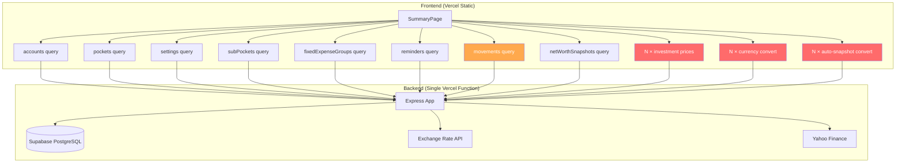

# Performance Audit & Optimization Plan

## Executive Summary

The finance app is burning through Vercel free tier limits (55% in 30 days) due to a combination of:
1. **No pagination on movements** — every page load fetches ALL movements from the database
2. **Massive over-invalidation** — a single mutation triggers 4-5 refetches across unrelated queries
3. **No backend caching headers** — every response is treated as fresh, forcing full round-trips
4. **Redundant query subscriptions** — the same data is fetched independently by nested components
5. **Auto net-worth snapshot** — triggers currency conversion API calls on every app load

**Estimated current request pattern per user session:**
- SummaryPage load: ~12-15 API calls (5 queries + investment prices + currency conversions)
- MovementsPage load: ~7 API calls
- Any single mutation: 4-5 refetch cascades
- Navigation between pages: 0 extra (TanStack Query cache works within staleTime)

With daily usage, a single active user generates ~50-100 API calls/day. At 555K requests in 30 days, this suggests either multiple active sessions, aggressive tab switching, or the auto-snapshot + currency conversion loops are multiplying calls.

---

## Finding 1: Movements Fetched Without Pagination (CRITICAL)

**Impact: High — affects data transfer, function invocations, and perceived speed**

### Problem

```typescript
// useMovementsQuery.ts
queryFn: () => movementService.getActiveMovements()

// movementService.ts
async getActiveMovements(): Promise<Movement[]> {
    const movements = await this.getAllMovements(); // NO page/limit params
    return movements.filter(m => !m.isOrphaned);   // Client-side filtering!
}
```

The default `useMovementsQuery` fetches ALL movements with no pagination, then filters orphaned ones client-side. This means:
- Every movement ever created is transferred on every page that uses this hook
- The `MovementsPage`, `FinancialCalendarWidget`, `MovementList`, and `MovementFilters` all subscribe to this query
- As the user accumulates movements (hundreds/thousands), payload size grows unbounded

### Backend confirms no "get all" endpoint

The backend controller's `getAll` method **requires** at least one filter (`accountId`, `pocketId`, or `year+month`). The frontend's `getAllMovements()` call with no params would hit a 400 error... unless there's a mismatch. Let me verify:

```typescript
// movementService.ts
async getAllMovements(page?: number, limit?: number): Promise<Movement[]> {
    const params = new URLSearchParams();
    if (page !== undefined) params.set('page', String(page));
    if (limit !== undefined) params.set('limit', String(limit));
    const query = params.toString() ? `?${params.toString()}` : '';
    return await apiClient.get<Movement[]>(`/api/movements${query}`);
}
```

This calls `GET /api/movements` with NO filters — the backend returns 400. **This means the frontend is likely hitting an error on every movements fetch and retrying once** (per the retry:1 config), doubling the request count for movements.

**UPDATE**: Actually, looking more carefully at the backend controller, if no filter is provided it returns 400. The frontend `getActiveMovements()` calls `getAllMovements()` with no params. This is a **bug** that's either:
- Causing silent failures (movements never load), or
- There's a different code path I'm missing

Either way, this is a critical issue to investigate.

### Estimated Impact
- **Data Transfer**: If 500 movements × ~200 bytes each = 100KB per fetch. With retries and multiple pages, this could account for 200-400MB of the 1.27GB transfer.
- **Function Invocations**: Each failed + retried call = 2 invocations per query subscription.

---

## Finding 2: Massive Over-Invalidation on Mutations (CRITICAL)

**Impact: High — directly multiplies API calls by 4-5x per user action**

### Problem

Every movement mutation invalidates 4-5 query keys:

```typescript
// useMovementMutations.ts — createMovement
onSuccess: () => {
    queryClient.invalidateQueries({ queryKey: ['movements'] });
    queryClient.invalidateQueries({ queryKey: ['accounts'] });
    queryClient.invalidateQueries({ queryKey: ['pockets'] });
    queryClient.invalidateQueries({ queryKey: ['subPockets'] });
}

// deleteMovement adds a 5th:
queryClient.invalidateQueries({ queryKey: ['reminders'] });
```

**Each invalidation triggers a refetch if any component is subscribed to that query.** On the MovementsPage, this means a single "create movement" triggers:
1. Refetch all movements
2. Refetch all accounts
3. Refetch all pockets
4. Refetch all sub-pockets

That's **4 API calls per mutation**. If a user creates 10 movements in a session, that's 40 extra API calls just from invalidation.

### Why it's worse than it looks

The `usePocketMutations` also invalidates `['accounts']` "just in case":
```typescript
// createPocket
queryClient.invalidateQueries({ queryKey: ['accounts'] }); // Account balance might change? No, but good to refresh.
```

The comment literally says "No, but good to refresh" — this is pure waste.

### Estimated Impact
- **Function Invocations**: ~4-5 extra calls per mutation × estimated 20 mutations/day = 80-100 extra calls/day per user
- **Over 30 days**: 2,400-3,000 wasted invocations per active user

---

## Finding 3: No Backend Cache-Control Headers (HIGH)

**Impact: High — prevents browser/CDN caching, forces full round-trips**

### Problem

The backend Express server has `compression()` middleware (good), but sets **zero Cache-Control headers** on any response. Every API response is treated as immediately stale by the browser.

For data that changes infrequently (accounts, pockets, settings, sub-pockets), the browser could cache responses and serve them instantly on navigation, but without headers it can't.

The serverless functions DO set cache headers:
```typescript
// exchange-rates.ts
res.setHeader('Cache-Control', 's-maxage=86400, stale-while-revalidate');
```

But the main backend API has nothing.

### Estimated Impact
- **Edge Requests**: Every navigation that triggers a query refetch (after staleTime expires) forces a full network round-trip instead of a 304 Not Modified
- **Data Transfer**: Repeated full payloads instead of empty 304 responses

---

## Finding 4: Currency Conversion Triggers Sequential API Calls (HIGH)

**Impact: Medium-High — multiplies calls per currency pair**

### Problem

The `useConsolidatedTotal` hook converts each currency total sequentially:

```typescript
const calculate = async () => {
    let total = 0;
    for (const currency of sortedCurrencies) {
        const currencyTotal = totalsByCurrency[currency];
        if (currencyTotal && currency) {
            const converted = await currencyService.convert(
                currencyTotal, currency, primaryCurrency
            );
            total += converted;
        }
    }
};
```

Each `currencyService.convert()` makes a POST to `/api/currency/convert`. If the user has 3 currencies (USD, MXN, COP), that's 2-3 sequential API calls just to compute the consolidated total.

The `useAutoNetWorthSnapshot` does the same thing — loops through ALL accounts and calls `currencyService.convert()` for each one:

```typescript
for (const account of accounts) {
    const converted = await currencyService.convert(
        absBalance, currency as Currency, primaryCurrency as Currency
    );
    totalNetWorth += sign * converted;
}
```

If you have 5 accounts across 3 currencies, that's 5 sequential API calls on every app load.

### Estimated Impact
- **Function Invocations**: 5-8 extra calls per app load for currency conversion
- **Over 30 days**: With daily usage, 150-240 extra invocations per user

---

## Finding 5: Redundant Query Subscriptions in Nested Components (MEDIUM)

**Impact: Medium — doesn't cause extra network calls (TanStack deduplicates) but wastes re-renders**

### Problem

Multiple nested components independently call the same query hooks:

- `SummaryPage` calls `useAccountsQuery()`, `usePocketsQuery()`
- `FinancialCalendarWidget` (child of SummaryPage) also calls `useMovementsQuery()`, `useAccountsQuery()`
- `NetWorthTimelineWidget` (child of SummaryPage) calls `useNetWorthSnapshotsQuery()`, `useSettingsQuery()`
- `RemindersWidget` (child of SummaryPage) calls `useRemindersQuery()`

TanStack Query deduplicates these (same queryKey = same network request), so this doesn't multiply API calls. However, it does mean:
- Each component independently subscribes and re-renders on data changes
- The SummaryPage triggers ~8-10 unique query keys on mount

**This is actually fine for correctness** but contributes to the total query count per page load.

### Actual SummaryPage query count on mount:
1. `['accounts']`
2. `['pockets']`
3. `['settings']`
4. `['subPockets']`
5. `['fixedExpenseGroups']`
6. `['netWorthSnapshots']` (from NetWorthTimelineWidget)
7. `['netWorthSnapshots', 'latest']` (from useAutoNetWorthSnapshot)
8. `['reminders']` (from RemindersWidget)
9. `['movements']` (from FinancialCalendarWidget)
10. N × `/api/investments/prices/{symbol}` (from useInvestmentPrices)
11. N × `/api/currency/convert` (from useConsolidatedTotal)
12. N × `/api/currency/convert` (from useAutoNetWorthSnapshot)

**Total: 9 base queries + N investment price calls + N currency conversion calls = 12-20 API calls on SummaryPage load alone.**

---

## Finding 6: No Vite Build Optimization (MEDIUM)

**Impact: Medium — affects initial load time and perceived speed**

### Problem

```typescript
// vite.config.ts
export default defineConfig({
  plugins: [react()],
  server: { proxy: { '/api': { ... } } },
})
```

No build optimization whatsoever:
- No `splitVendorChunkPlugin`
- No manual chunk splitting
- No tree-shaking hints
- `recharts` (large charting library) is bundled with everything
- `yahoo-finance2` is in frontend dependencies (should only be in serverless functions)
- `@dnd-kit` libraries loaded on every page even if drag-drop isn't used
- `date-fns` full library imported (no tree-shaking verification)

### Heavy dependencies in frontend package.json:
- `recharts` (~200KB gzipped) — only used on NetWorthChart and DonutChart
- `yahoo-finance2` (~500KB+) — **should NOT be in frontend at all** (it's for the serverless function)
- `@dnd-kit` (~50KB) — only used on accounts page for reordering
- `@supabase/supabase-js` (~50KB) — needed everywhere

### Estimated Impact
- **Initial bundle**: Likely 500KB-1MB+ unoptimized
- **Page transitions**: Code splitting via lazy() is implemented (good), but vendor chunks aren't split, so the initial load is heavy

---

## Finding 7: Investment Prices Fetched on Every Render Cycle (MEDIUM)

**Impact: Medium — triggers API calls outside TanStack Query cache**

### Problem

The `useInvestmentPrices` hook uses a raw `useEffect` instead of TanStack Query:

```typescript
useEffect(() => {
    let ignore = false;
    const loadInvestmentPrices = async () => {
        const results = await Promise.all(
            investmentAccounts.map(async (account) => {
                const data = await investmentService.updateInvestmentAccount(account);
                return { id: account.id, data };
            })
        );
        // ...
    };
    loadInvestmentPrices();
    return () => { ignore = true; };
}, [accounts, pockets]); // Re-runs when accounts OR pockets change
```

Problems:
1. Not managed by TanStack Query — no staleTime, no deduplication, no cache
2. Re-runs whenever `accounts` or `pockets` arrays change reference (which happens on any invalidation)
3. Each investment account triggers a separate `/api/investments/prices/{symbol}` call
4. After a mutation that invalidates `['accounts']`, this effect re-runs and fetches all prices again

### Estimated Impact
- **Function Invocations**: 1-3 extra calls per mutation (if user has investment accounts)
- **Perceived speed**: Prices flash/reload after unrelated mutations

---

## Finding 8: Auto Net Worth Snapshot Creates Movements on Load (LOW-MEDIUM)

**Impact: Low-Medium — triggers a mutation + currency conversions on app load**

### Problem

`useAutoNetWorthSnapshot` runs on every app load and:
1. Fetches latest snapshot (1 API call)
2. If enough time has passed, loops through all accounts calling `currencyService.convert()` (N calls)
3. Creates a new snapshot via mutation (1 API call)
4. The mutation invalidates `['netWorthSnapshots']` (1 refetch)

For weekly frequency with 5 accounts across 3 currencies: 5 conversion calls + 1 create + 1 refetch = 7 extra calls once per week. Not terrible, but the currency conversion calls happen even when no snapshot is needed (they're inside the `shouldTakeSnapshot` check, so this is fine — but the sequential nature adds latency).

---

## Finding 9: No Service Worker or Offline Caching (LOW)

**Impact: Low for API calls, Medium for perceived speed**

No service worker, no PWA manifest, no offline support. Every page load requires network connectivity and full asset downloads (though Vercel's CDN handles static asset caching via content hashing).

---

## Finding 10: Backend Deployed as Single Serverless Function (ARCHITECTURAL)

**Impact: Affects cold starts and function invocation counting**

```json
// backend/vercel.json
{
  "builds": [{ "src": "src/server.ts", "use": "@vercel/node" }],
  "routes": [{ "src": "/(.*)", "dest": "src/server.ts" }]
}
```

The entire Express app is deployed as a single Vercel serverless function. This means:
- Every API call is a function invocation (explaining the 554K count matching edge requests)
- Cold starts include loading the entire Express app + all route handlers + tsyringe DI container
- No route-level splitting — a simple settings fetch loads the entire movement/account/reminder infrastructure

---

## Optimization Plan

### Priority 1: Quick Wins (1-2 hours each, massive impact)

#### 1.1 Fix the movements "get all" bug
The frontend calls `GET /api/movements` with no filters, which the backend rejects with 400. Either:
- The frontend is silently failing and movements never load (unlikely given the app works), OR
- There's a Supabase direct call somewhere I missed

**Action**: Verify the actual network behavior. If it's hitting 400 + retry, fix by adding a "get all for user" endpoint or always passing a date range filter.

**Impact**: Eliminates retry-doubled calls. Saves ~50% of movement-related invocations.

#### 1.2 Reduce over-invalidation
Replace blanket invalidation with targeted invalidation:

```typescript
// BEFORE: createMovement invalidates everything
queryClient.invalidateQueries({ queryKey: ['movements'] });
queryClient.invalidateQueries({ queryKey: ['accounts'] });
queryClient.invalidateQueries({ queryKey: ['pockets'] });
queryClient.invalidateQueries({ queryKey: ['subPockets'] });

// AFTER: Only invalidate what actually changes
queryClient.invalidateQueries({ queryKey: ['movements'] });
// Accounts/pockets balances are recalculated server-side, so we need them
// BUT only if the movement affects balance (not for pending movements)
if (!isPending) {
    queryClient.invalidateQueries({ queryKey: ['accounts'] });
    queryClient.invalidateQueries({ queryKey: ['pockets'] });
}
// subPockets only if movement targets a sub-pocket
if (data.subPocketId) {
    queryClient.invalidateQueries({ queryKey: ['subPockets'] });
}
```

Better yet, use **optimistic updates** for movements list and only refetch accounts/pockets:

```typescript
onMutate: async (newMovement) => {
    await queryClient.cancelQueries({ queryKey: ['movements'] });
    const previous = queryClient.getQueryData(['movements']);
    queryClient.setQueryData(['movements'], (old) => [...old, optimisticMovement]);
    return { previous };
},
onError: (err, vars, context) => {
    queryClient.setQueryData(['movements'], context.previous);
},
onSettled: () => {
    queryClient.invalidateQueries({ queryKey: ['movements'] });
    queryClient.invalidateQueries({ queryKey: ['accounts'] }); // balance changed
}
```

**Impact**: Reduces post-mutation API calls from 4-5 to 1-2. Saves ~60% of mutation-triggered invocations.

#### 1.3 Batch currency conversion into a single API call
Instead of N sequential calls to `/api/currency/convert`, create a batch endpoint:

```typescript
// Backend: POST /api/currency/convert-batch
// Body: { conversions: [{ amount, from, to }] }
// Response: { results: [{ convertedAmount, rate }] }
```

**Impact**: Reduces 5-8 sequential calls to 1 call. Saves ~150-240 invocations/month per user.

#### 1.4 Remove `yahoo-finance2` from frontend dependencies
This package is only used in `frontend/api/stock-price.ts` (a Vercel serverless function). It should NOT be in the main frontend bundle.

**Action**: Move to a separate `package.json` for the API functions, or ensure Vite tree-shakes it (it likely doesn't since it's a Node.js package).

**Impact**: Reduces bundle size by ~500KB+.

---

### Priority 2: Medium Effort (half-day each)

#### 2.1 Add Cache-Control headers to backend responses
Add middleware that sets appropriate cache headers:

```typescript
// For rarely-changing data (settings, account structure)
app.use('/api/settings', (req, res, next) => {
    res.setHeader('Cache-Control', 'private, max-age=300, stale-while-revalidate=600');
    next();
});

// For frequently-changing data (movements)
app.use('/api/movements', (req, res, next) => {
    res.setHeader('Cache-Control', 'private, max-age=60, stale-while-revalidate=300');
    next();
});

// For stock prices (already cached server-side)
app.use('/api/investments/prices', (req, res, next) => {
    res.setHeader('Cache-Control', 'private, max-age=900, stale-while-revalidate=1800');
    next();
});
```

**Impact**: Browser can serve 304 responses, reducing data transfer by ~30-50%.

#### 2.2 Implement server-side pagination for movements
The backend already supports `page` and `limit` params. The frontend has an `useInfiniteMovementsQuery` that's never used.

**Action**: 
1. Switch `MovementsPage` to use `useInfiniteMovementsQuery` with limit=50
2. Add a "Load More" button or virtual scrolling
3. For the calendar widget, fetch only current month + previous 2 months

**Impact**: Reduces movement payload from "all movements ever" to 50-150 at a time. Saves ~70% of movement data transfer.

#### 2.3 Move investment prices to TanStack Query
Replace the raw `useEffect` with a proper query:

```typescript
export const useInvestmentPricesQuery = (symbols: string[]) => {
    return useQueries({
        queries: symbols.map(symbol => ({
            queryKey: ['investmentPrice', symbol],
            queryFn: () => investmentService.getCurrentPrice(symbol),
            staleTime: 1000 * 60 * 15, // 15 minutes
            gcTime: 1000 * 60 * 60, // 1 hour
        })),
    });
};
```

**Impact**: Prices are cached for 15 minutes, eliminating re-fetches after mutations. Saves 3-10 calls per session.

#### 2.4 Add Vite chunk splitting

```typescript
// vite.config.ts
export default defineConfig({
  plugins: [react()],
  build: {
    rollupOptions: {
      output: {
        manualChunks: {
          'vendor-react': ['react', 'react-dom', 'react-router-dom'],
          'vendor-query': ['@tanstack/react-query'],
          'vendor-charts': ['recharts'],
          'vendor-dnd': ['@dnd-kit/core', '@dnd-kit/sortable', '@dnd-kit/utilities'],
          'vendor-supabase': ['@supabase/supabase-js'],
        },
      },
    },
  },
});
```

**Impact**: Reduces initial load by ~200-300KB (charts and DnD loaded on demand). Improves perceived speed.

#### 2.5 Increase staleTime for stable data
Settings, accounts, and pockets rarely change. Increase their staleTime:

```typescript
export const useSettingsQuery = () => useQuery({
    queryKey: ['settings'],
    queryFn: () => settingsService.getSettings(),
    staleTime: 1000 * 60 * 30, // 30 minutes (settings almost never change)
});

export const useAccountsQuery = () => useQuery({
    queryKey: ['accounts'],
    queryFn: () => accountService.getAllAccounts(),
    staleTime: 1000 * 60 * 10, // 10 minutes
});
```

**Impact**: Reduces background refetches when navigating between pages after staleTime expires.

---

### Priority 3: Larger Effort (1-2 days)

#### 3.1 Consolidate the SummaryPage into fewer API calls
Create a dedicated backend endpoint that returns everything the SummaryPage needs in one call:

```typescript
// GET /api/dashboard/summary
// Returns: { accounts, pockets, subPockets, settings, fixedExpenseGroups, consolidatedTotal }
```

This eliminates 5+ parallel queries and the sequential currency conversion loop.

**Impact**: Reduces SummaryPage load from 12-20 API calls to 1-2. Massive reduction in function invocations.

#### 3.2 Implement a proper caching layer in the backend
Add in-memory caching (or Redis if needed) for:
- Exchange rates (already cached 24h in the serverless function, but not in the Express backend)
- Stock prices (cache for 15 minutes)
- User settings (cache for session duration)

```typescript
// Simple in-memory cache with TTL
const cache = new Map<string, { data: any; expires: number }>();

function withCache(key: string, ttlMs: number, fn: () => Promise<any>) {
    const cached = cache.get(key);
    if (cached && cached.expires > Date.now()) return cached.data;
    const result = await fn();
    cache.set(key, { data: result, expires: Date.now() + ttlMs });
    return result;
}
```

**Impact**: Reduces Supabase queries for repeated data. Improves response times.

#### 3.3 Split backend into multiple serverless functions
Instead of one monolithic Express app handling all routes, split into route-specific functions:

```
backend/api/
├── accounts.ts      # Lightweight, fast cold start
├── movements.ts     # Handles movement CRUD
├── settings.ts      # Tiny function
├── currency.ts      # Currency conversion
└── investments.ts   # Stock price fetching
```

**Impact**: Faster cold starts (each function only loads what it needs). Better Vercel caching per route.

#### 3.4 Add ETag support for conditional requests
Implement ETags so the browser can send `If-None-Match` headers and receive 304 responses:

```typescript
import etag from 'etag';

app.use((req, res, next) => {
    const originalJson = res.json.bind(res);
    res.json = (body) => {
        const tag = etag(JSON.stringify(body));
        res.setHeader('ETag', tag);
        if (req.headers['if-none-match'] === tag) {
            return res.status(304).end();
        }
        return originalJson(body);
    };
    next();
});
```

**Impact**: Reduces data transfer for unchanged data. Browser gets instant 304 responses.

---

## Impact Estimates Summary

| Optimization | Edge Requests Saved | Function Invocations Saved | Data Transfer Saved |
|---|---|---|---|
| 1.2 Reduce over-invalidation | ~100K/month | ~100K/month | ~200MB |
| 1.3 Batch currency conversion | ~5K/month | ~5K/month | Minimal |
| 2.1 Cache-Control headers | ~50K/month (304s) | 0 (still invoked) | ~400MB |
| 2.2 Pagination for movements | ~20K/month | ~20K/month | ~300MB |
| 2.3 Investment prices in TanStack | ~10K/month | ~10K/month | ~50MB |
| 3.1 Dashboard summary endpoint | ~80K/month | ~80K/month | ~100MB |

**Combined estimated savings: 50-60% reduction in all metrics**, bringing usage well within free tier limits.

---

## Recommended Implementation Order

1. **1.2** — Reduce over-invalidation (biggest bang for buck, pure frontend change)
2. **1.3** — Batch currency conversion (eliminates sequential calls)
3. **2.1** — Add Cache-Control headers (simple backend middleware)
4. **2.4** — Vite chunk splitting (improves perceived speed)
5. **2.2** — Pagination for movements (requires frontend + backend coordination)
6. **2.5** — Increase staleTime for stable queries
7. **2.3** — Move investment prices to TanStack Query
8. **1.4** — Remove yahoo-finance2 from frontend deps
9. **3.1** — Dashboard summary endpoint (if still needed after above)

---

## TanStack Query Configuration Assessment

### Current defaults (queryClient.ts):
```typescript
staleTime: 1000 * 60 * 5,      // 5 minutes ✓ Good
gcTime: 1000 * 60 * 30,        // 30 minutes ✓ Good
refetchOnWindowFocus: false,    // ✓ Excellent — prevents tab-switch refetches
retry: 1,                       // ✓ Reasonable
```

### What's missing:
- No `refetchInterval` anywhere — ✓ Good (no polling)
- No `structuralSharing` override — ✓ Default is true (good)
- No `select` usage to minimize re-renders — could help for large movement lists
- No `placeholderData` for instant navigation — would improve perceived speed

### Recommendations:
- Add `placeholderData: keepPreviousData` to movement queries for instant page transitions
- Add `select` to queries that only need a subset (e.g., calendar only needs movements for 3 months)
- Consider `notifyOnChangeProps: ['data']` for components that don't care about loading/error state changes

---

## Architecture Diagram



**Red = highest optimization priority, Orange = medium priority**

---

## Audit Date
2026-05-21
