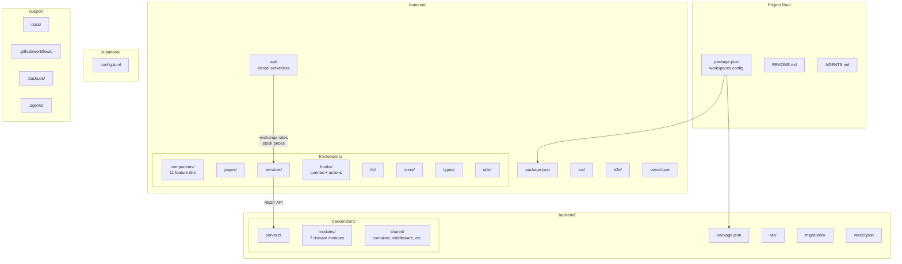

# Project Structure & Organization Audit

**Date**: 2026-05-21
**Branch**: refactor/full-codebase-cleanup
**Scope**: Full project root-to-leaf review

## Executive Summary

The project structure is **mostly well-organized** after the refactoring work. The frontend follows a clean feature-based component architecture, and the backend uses proper clean architecture with domain modules. However, there are several issues ranging from dead references to structural inconsistencies that should be addressed.

**Critical issues**: 5
**Medium issues**: 8
**Low/cosmetic issues**: 6

---

## 1. Root Level

### Current State

```
finance-app/
├── .agents/              # AI assistant analysis & task breakdowns
├── .backups/             # SQL database backups
├── .git/
├── .github/workflows/    # CI pipeline
├── backend/              # Express API server
├── docs/                 # Project documentation
├── frontend/             # React SPA
├── node_modules/         # Hoisted workspace deps
├── supabase/             # Supabase CLI config
├── AGENTS.md             # AI assistant guide
├── README.md             # Project readme
├── package.json          # Workspace root
└── package-lock.json
```

### Findings

| # | Finding | Problem | Proposed Change | Risk |
|---|---------|---------|-----------------|------|
| 1 | **Ghost `shared` workspace symlink** | `node_modules/finance-app-shared -> ../shared` exists but `/shared` directory does NOT exist. The root `package.json` only declares `["frontend", "backend"]` workspaces, so this is a stale npm artifact. | Delete the dangling symlink. Run `npm install` to regenerate clean `node_modules`. | None — it's already broken |
| 2 | **`.backups/` in repo** | Contains 6 SQL dump files (280KB+). These are operational artifacts, not source code. They bloat the repo and could contain sensitive data. | Add `.backups/` to `.gitignore`. Keep the directory locally but don't track it. | None — deployment unaffected |
| 3 | **`.agents/` directory** | Contains ~400KB of analysis/task markdown. Useful for AI-assisted development but not needed for the app to function. Currently gitignored via `.kiro/` pattern but `.agents/` itself is tracked. | Keep tracked — it's your project knowledge base. Consider adding a README inside explaining its purpose. | None |
| 4 | **No `shared/` workspace** | Frontend and backend both define their own types independently. The `backend/src/shared/types/index.ts` has 358 bytes of types, while `frontend/src/types/index.ts` has 7.7KB. No shared contract. | For now, this is fine — the backend types are DB-facing and frontend types are UI-facing. A shared package would only make sense if you add API contract validation (e.g., shared Zod schemas). Not urgent. | N/A |
| 5 | **Root `package.json` is clean** | Workspaces config is correct. Scripts are well-organized. Only `concurrently` and `typescript` as root devDeps. | No change needed. | N/A |

---

## 2. Monorepo Structure

### Current State

```
workspaces: ["frontend", "backend"]
```

Frontend and backend are separate npm workspaces with independent `package.json`, `tsconfig.json`, and build tooling.

### Findings

| # | Finding | Problem | Proposed Change | Risk |
|---|---------|---------|-----------------|------|
| 6 | **No shared types package** | Types are duplicated between frontend and backend. Frontend has comprehensive types (202 lines), backend has minimal types (358 bytes). | Low priority. The backend uses Zod for validation and the frontend uses its own TypeScript interfaces. They're different concerns. If you ever want to share API contracts, create a `shared/` workspace with Zod schemas that both consume. | N/A |
| 7 | **Inconsistent TypeScript versions** | Root: `^5.9.3`, Frontend: `~5.9.3`, Backend: `^5.3.3`. Backend is significantly behind. | Update backend to `~5.9.3` to match. | Low — may surface new type errors |
| 8 | **Inconsistent ESLint versions** | Frontend: ESLint 9 with flat config. Backend: ESLint 8 with legacy config (`.eslintrc`-style via `--ext`). | Upgrade backend ESLint to v9 with flat config for consistency. | Low |

---

## 3. Frontend Internal Structure

### Current State

```
frontend/src/
├── assets/          # Empty directory
├── components/      # 11 feature subdirectories
│   ├── accounts/
│   ├── budget/
│   ├── feedback/
│   ├── fixed-expenses/
│   ├── layout/
│   ├── movements/
│   ├── net-worth/
│   ├── reminders/
│   ├── settings/
│   ├── summary/
│   └── ui/
├── constants/       # App constants (categories, currencies, etc.)
├── contexts/        # React contexts (Auth, Confirm, Selection)
├── errors/          # AppError class
├── hooks/           # Custom hooks
│   ├── actions/     # Action hooks (mutations + logic)
│   ├── queries/     # TanStack Query hooks
│   └── __tests__/   # Hook tests
├── lib/             # Infrastructure (queryClient, supabase, crossTabSync)
├── pages/           # Route pages
│   └── __tests__/
├── services/        # API service layer
├── store/           # Zustand stores
├── test/            # Test utilities and mocks
├── types/           # TypeScript type definitions
└── utils/           # Utility functions
```

### Findings

| # | Finding | Problem | Proposed Change | Risk |
|---|---------|---------|-----------------|------|
| 9 | **`assets/` directory is empty** | No files inside. Likely leftover from Vite scaffold. | Delete it. If you need static assets later, use `public/` or re-create it. | None |
| 10 | **`commit_ui_updates.sh` in frontend root** | A one-off shell script for committing UI changes. Not part of the build. Dead file from earlier development. | Delete it. | None |
| 11 | **Test files co-located with source in `services/`** | Service tests (`.test.ts`) live alongside service files in `services/`. But hook tests are in `hooks/__tests__/`. Inconsistent pattern. | Pick one pattern. Recommendation: co-locate tests next to source (the `services/` pattern) and move `hooks/__tests__/` contents to sit alongside their hooks. Or consolidate all in `__tests__/` subdirs. Either way, be consistent. | None |
| 12 | **`store/useThemeStore.test.ts` in store dir** | Test file mixed with source. Inconsistent with `__tests__/` pattern used elsewhere. | Move to `store/__tests__/useThemeStore.test.ts` or keep co-located — just be consistent with the chosen pattern. | None |
| 13 | **`errors/` has single file** | `AppError.ts` is the only file. A whole directory for one file is overkill. | Move `AppError.ts` to `lib/AppError.ts` or `utils/AppError.ts` and delete the `errors/` directory. | None |
| 14 | **Component structure is excellent** | Feature-based organization with barrel exports (`index.ts`) in each subdirectory. Clean separation of concerns. | No change needed. Well done. | N/A |
| 15 | **Hooks organization is excellent** | Clear separation: `queries/` for data fetching, `actions/` for mutations, root for utility hooks. Barrel exports present. | No change needed. | N/A |

---

## 4. Backend Internal Structure

### Current State

```
backend/src/
├── server.ts              # Express app setup & route registration
├── modules/               # Domain modules (clean architecture)
│   ├── accounts/
│   │   ├── application/   # Use cases
│   │   ├── domain/        # Entities & interfaces
│   │   ├── infrastructure/# Repository implementations
│   │   └── presentation/  # Express routes/controllers
│   ├── movements/
│   ├── net-worth/
│   ├── pockets/
│   ├── reminders/
│   ├── settings/
│   └── sub-pockets/
└── shared/
    ├── container/         # DI container modules (tsyringe)
    ├── errors/            # AppError
    ├── infrastructure/    # Supabase client
    ├── middleware/        # Express middleware
    ├── types/             # Shared types
    └── utils/             # Utilities
```

### Findings

| # | Finding | Problem | Proposed Change | Risk |
|---|---------|---------|-----------------|------|
| 16 | **Clean architecture is well-implemented** | Each module follows domain/application/infrastructure/presentation layers consistently. | No change needed. | N/A |
| 17 | **`shared/container/index.test.ts` is 34KB** | A massive test file (34,497 bytes) in the container directory. This is the only test file in the entire backend `src/` tree (all others would be in a separate test dir or co-located). | Consider splitting into per-module test files or moving to a `__tests__/` directory. | None |
| 18 | **Missing modules** | No `investments` or `currency` module in backend, yet frontend has `investmentService.ts` and `currencyService.ts`. These services call Vercel serverless functions (`frontend/api/`) directly, bypassing the backend. | This is intentional — stock prices and exchange rates use Vercel Edge Functions. Document this architectural decision. | N/A |
| 19 | **`shared/types/index.ts` is minimal** | Only 358 bytes. Most type definitions live in domain layers of each module. | This is correct for clean architecture. The shared types should only contain cross-cutting concerns. | N/A |

---

## 5. Configuration Files

### Findings

| # | Finding | Problem | Proposed Change | Risk |
|---|---------|---------|-----------------|------|
| 20 | **No Tailwind config file** | Using Tailwind CSS v4 with `@tailwindcss/postcss` plugin. Tailwind v4 doesn't require a config file — it uses CSS-based configuration via `@theme` directives in `index.css`. | Correct for Tailwind v4. No change needed. | N/A |
| 21 | **`postcss.config.js` is correct** | Minimal config pointing to `@tailwindcss/postcss`. | No change needed. | N/A |
| 22 | **Frontend has 3 tsconfig files** | `tsconfig.json` (references), `tsconfig.app.json` (app code), `tsconfig.node.json` (vite config). This is standard Vite setup. | No change needed. | N/A |
| 23 | **Backend `tsconfig.json` has path aliases** | `@modules/*` and `@shared-backend/*` defined but `jest.config.js` has matching `moduleNameMapper`. Consistent. | No change needed. | N/A |
| 24 | **`frontend/vercel.json`** | Simple SPA rewrite rule. Correct for client-side routing. | No change needed. | N/A |
| 25 | **`backend/vercel.json`** | Routes all requests to `src/server.ts` using `@vercel/node`. Correct for Express on Vercel. | No change needed. | N/A |
| 26 | **`.env.test` in frontend** | Contains test Supabase URL/key. Correctly gitignored pattern would miss this since it's `.env.test` not `.env`. Check if it's tracked. | Verify it's in `.gitignore`. The current `.gitignore` only has `.env` — `.env.test` with dummy values is fine to track. | None |

---

## 6. Vercel/Supabase Deployment Constraints

### Vercel Frontend

- **Build command**: `npm run build --workspace=frontend` → runs `tsc -b && vite build`
- **Output**: `frontend/dist/`
- **Serverless functions**: `frontend/api/` directory (exchange-rates.ts, stock-price.ts)
- **Config**: `frontend/vercel.json` handles SPA routing

**Constraint**: Vercel expects the frontend to be the root of its project, or configured with a root directory setting. The `frontend/api/` directory is correctly placed for Vercel's serverless function detection.

### Vercel Backend

- **Build**: `@vercel/node` compiles `src/server.ts`
- **Config**: `backend/vercel.json` routes everything to the server

**Constraint**: Backend is deployed as a separate Vercel project. The `vercel.json` in backend root is correct.

### Supabase

- **Config**: `supabase/config.toml` at project root
- **Migrations**: `backend/migrations/` (NOT in `supabase/migrations/`)

| # | Finding | Problem | Proposed Change | Risk |
|---|---------|---------|-----------------|------|
| 27 | **Migrations in `backend/migrations/` not `supabase/migrations/`** | Supabase CLI expects migrations in `supabase/migrations/` by default. Your migrations are in `backend/migrations/`. This means `supabase db push` won't find them without `--db-url` flag or manual linking. | Either move migrations to `supabase/migrations/` (standard) or document the manual push process. Since you push manually anyway, this is low priority. | Medium — moving would require updating any scripts |
| 28 | **Migration numbering gap: 022 → 028** | Migrations jump from `022_additional_indexes.sql` to `028_snapshot_unique_per_day.sql`. Missing 023-027. | Either these were deleted/squashed or never existed. Not a functional problem but confusing for new developers. Document or renumber. | None — SQL migrations run by name order |

---

## 7. Documentation

### Findings

| # | Finding | Problem | Proposed Change | Risk |
|---|---------|---------|-----------------|------|
| 29 | **README references non-existent files** | Links to `QUICK_START.md`, `DEPLOYMENT_GUIDE.md`, `DEPLOYMENT_SUMMARY.md`, and `docs/PENDING_MOVEMENTS.md` — none of these exist. | Remove dead links from README or create the referenced docs. | None |
| 30 | **README project structure is outdated** | Shows a flat `src/` structure that doesn't reflect the actual `frontend/` + `backend/` monorepo layout. | Update to show actual monorepo structure. | None |
| 31 | **`AGENTS.md` is comprehensive** | 15KB guide for AI assistants. Well-structured and accurate. | Keep as-is. | N/A |
| 32 | **`docs/` directory** | Contains `FEATURE_ROADMAP.md`, `PROJECT_SPEC.md`, `qol.md`. All from initial project setup (May 19). May be outdated after refactoring. | Review and update or mark as historical. | None |
| 33 | **No CONTRIBUTING.md** | No contribution guide. Fine for a personal project. | Optional — create one if you plan to open-source or collaborate. | N/A |

---

## 8. Dead Files & Directories

| # | File/Directory | Status | Action | Risk |
|---|----------------|--------|--------|------|
| 34 | `frontend/src/assets/` | Empty directory | Delete | None |
| 35 | `frontend/commit_ui_updates.sh` | Dead shell script from earlier dev | Delete | None |
| 36 | `node_modules/finance-app-shared` symlink | Points to non-existent `../shared` | Run `npm install` to clean, or manually delete | None |
| 37 | `frontend/dist/` | Build output tracked? Should be gitignored | Verify in `.gitignore` — frontend `.gitignore` has `dist` so this should be fine | None |
| 38 | `backend/dist/` | Build output | Same — verify gitignored | None |
| 39 | `supabase/.temp/` | Supabase CLI temp files | Already in `supabase/.gitignore` | None |

---

## Priority Action Plan

### Immediate (no risk, quick wins)

1. Delete `frontend/src/assets/` (empty)
2. Delete `frontend/commit_ui_updates.sh` (dead script)
3. Add `.backups/` to root `.gitignore`
4. Fix README dead links (remove references to non-existent docs)
5. Delete dangling `node_modules/finance-app-shared` symlink (or just `rm -rf node_modules && npm install`)

### Short-term (low risk, improves clarity)

6. Move `frontend/src/errors/AppError.ts` to `frontend/src/lib/AppError.ts`
7. Standardize test file location pattern (co-locate or `__tests__/` — pick one)
8. Update README project structure section to reflect monorepo reality
9. Update backend TypeScript to `~5.9.3`
10. Document the migration numbering gap (023-027)

### Medium-term (some coordination needed)

11. Consider moving `backend/migrations/` to `supabase/migrations/` for CLI compatibility
12. Upgrade backend ESLint to v9 flat config
13. Review and update `docs/` content post-refactoring

### Not recommended (unnecessary complexity)

- Moving to `packages/` or `src/` wrapper — current `frontend/` + `backend/` at root is standard and works with Vercel
- Creating a `shared/` workspace — the frontend and backend have different type needs; forced sharing would create coupling
- Restructuring the monorepo — it's already well-organized for its deployment targets

---

## Architecture Diagram



---

## Verdict

**Overall grade: B+**

The project structure is solid for a personal finance app. The frontend component organization is excellent (feature-based with barrel exports), the backend clean architecture is well-implemented, and the monorepo setup works correctly with Vercel deployment.

The main issues are cosmetic: dead files, outdated README, inconsistent test patterns, and a dangling symlink. None of these affect functionality or deployment. The immediate action items are all safe, zero-risk cleanups that would take 10 minutes total.
