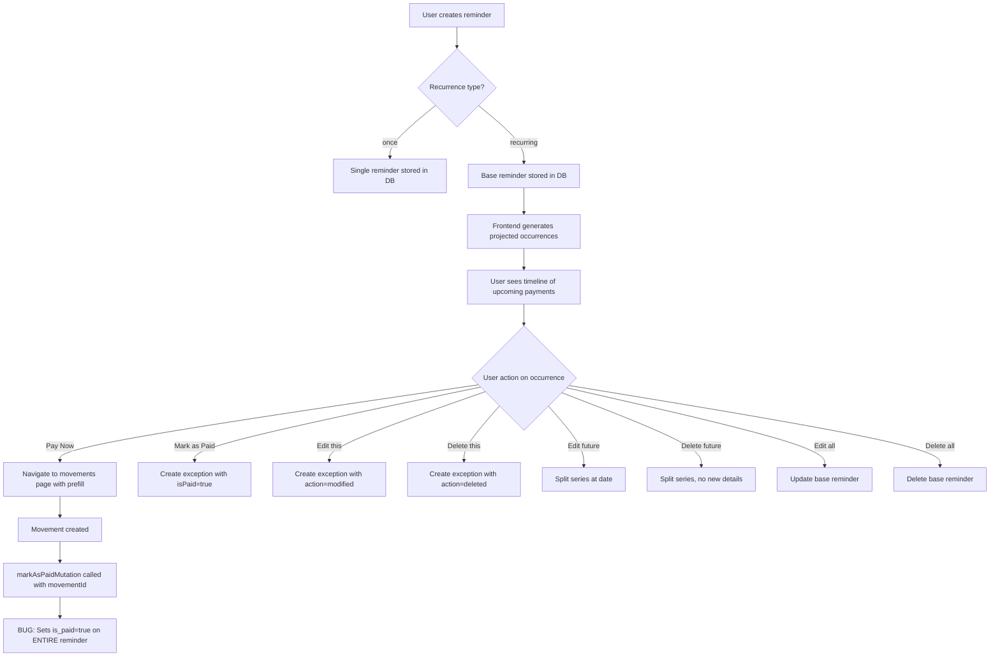

# Reminders Feature Deep-Dive

## Executive Summary

The reminders system supports one-time and recurring payment reminders with a projection-based occurrence model. Occurrences are **computed on-the-fly** in the frontend — the database only stores the base reminder and per-occurrence exceptions. Three critical bugs exist:

1. **"Pay Now" marks the entire reminder as paid** (via `MarkReminderAsPaidUseCase`) instead of creating a per-occurrence exception — breaking recurring reminders.
2. **Projected occurrences can't be interacted with properly** because the `markAsPaid` backend endpoint operates on the reminder-level `is_paid` flag, not on individual occurrences.
3. **The `linked_movement_id` on the `reminders` table is a single column** — it can only track one movement for the entire series, not per-occurrence.

---

## 1. Full Lifecycle of a Reminder



### Database Tables

**`reminders`** — stores the base reminder definition:
- `id`, `user_id`, `title`, `amount`, `due_date`
- `is_paid` — whether the reminder is globally paid (only meaningful for `once` type)
- `recurrence_type`, `recurrence_interval`, `recurrence_days_of_week`, `recurrence_end_type`, `recurrence_end_count`, `recurrence_end_date`
- `linked_movement_id` — FK to `movements(id)`, single value for entire reminder
- `fixed_expense_id`, `template_id`

**`reminder_exceptions`** — per-occurrence overrides:
- `id`, `reminder_id`, `original_date` (UNIQUE together)
- `action`: `'deleted'` | `'modified'`
- `new_title`, `new_amount`, `new_date`
- `is_paid`, `linked_movement_id`

---

## 2. How Recurring Occurrences Are Generated

Occurrences are **computed entirely on the frontend** in `frontend/src/utils/reminderProjections.ts`:

1. `groupRemindersByMonth()` iterates all reminders
2. For each recurring reminder, calls `generateProjectedOccurrences(reminder, monthsAhead)`
3. Starting from `reminder.dueDate`, advances by the recurrence interval
4. For each projected date, checks `reminder.exceptions[]` for that date:
   - If exception with `action: 'deleted'` → skip
   - If exception with `action: 'modified'` → use modified values (title, amount, date, isPaid, linkedMovementId)
   - Otherwise → create a projected occurrence with `isProjected: true`
5. The base occurrence (occurrence 0) is also checked against exceptions

**Key detail**: Projected occurrences get synthetic IDs like `${reminder.id}_projected_${dateStr}` and carry `originalReminderId: reminder.id`.

### Occurrence Status Logic (`getReminderStatus`)

```
isPaid → 'paid'
dueDate < today → 'overdue'
isProjected → 'projected'
dueDate === today → 'today'
dueDate < 7 days → 'this-week'
else → 'upcoming'
```

**Critical observation**: A projected occurrence that has `isPaid: false` (default) and whose date is in the past will show as `'overdue'` — NOT as `'projected'`. This is correct behavior but means the `isProjected` check in `getReminderStatus` is only reached for future dates.

---

## 3. "Pay Now" Flow — What Actually Happens

### Frontend (`useReminderActions.handlePayNow`)

1. Builds URL params: `amount`, `notes` (title), `date`, `templateId`, `fixedExpenseId`, `reminderId`
2. Navigates to `/movements?action=new&...`

### Movements Page (`useURLActions`)

1. Reads `reminderId` from URL params
2. Calls `formState.setReminderId(reminderIdParam)` — stores it in state
3. Opens the movement creation form with prefilled values

### On Movement Submit (`useMovementSubmit.handleSubmit`)

1. Creates the movement via `createMovement.mutateAsync()`
2. If `wasReminderId` is set:
   ```typescript
   await markAsPaidMutation.mutateAsync({
     id: wasReminderId,
     movementId: newMovement?.id,
   });
   ```
3. This calls `POST /api/reminders/:id/pay` with `{ movementId }`

### Backend (`MarkReminderAsPaidUseCase.execute`)

```typescript
return this.reminderRepo.update(id, { isPaid: true, linkedMovementId: movementId });
```

**BUG**: This sets `is_paid = true` and `linked_movement_id` on the **entire reminder row**. For recurring reminders, this marks the whole series as paid and only stores one movement link.

---

## 4. Why the Next Occurrence Is Not Interactable

### Root Cause

When `MarkReminderAsPaidUseCase` sets `is_paid = true` on the base reminder, the frontend's `getReminderStatus()` returns `'paid'` for the **base occurrence**. However, projected occurrences are generated with `isPaid: false` by default (line 75 of `reminderProjections.ts`), so they still appear.

The real problem is subtler: after "Pay Now" marks the base reminder as paid:
- The base occurrence shows as paid (correct for that one occurrence)
- But `reminder.isPaid = true` propagates to the domain object
- The `groupRemindersByMonth` function still adds the base reminder to `allReminders` with `isPaid: true`
- Future projected occurrences are generated with `isPaid: false` (hardcoded in projection logic)

**The actual interactability issue**: The `ReminderCard` component hides Pay Now and Mark as Paid buttons when `isPaid` is true OR when `isProjected` is true:

```tsx
{!isPaid && !isProjected && (
    <>
        <button onClick={() => onPayNow(reminder)}>Pay Now</button>
        <button onClick={() => onMarkAsPaid(reminder)}>Mark as Paid</button>
    </>
)}
```

So projected occurrences (future recurring instances) **never show Pay Now or Mark as Paid buttons**. They only show Edit and no Delete. This is the reported bug — you can only edit projected occurrences, not pay them.

---

## 5. Relationship Between Reminders and Movements

### Current Design

- `reminders.linked_movement_id` — single FK, one movement per entire reminder
- `reminder_exceptions.linked_movement_id` — FK per occurrence exception
- `movements` table has **no `reminder_id` column** — the link is one-directional from reminders to movements

### Reverse Lookup

`SupabaseReminderRepository.findByLinkedMovementId()` queries `reminders` table where `linked_movement_id = movementId`. This is used by `DeleteMovementUseCase` to un-pay a reminder when its linked movement is deleted.

**Gap**: There's no reverse lookup for `reminder_exceptions.linked_movement_id`. If a movement linked via an exception is deleted, the exception still shows `isPaid: true` with a dangling reference.

---

## 6. The `reminder_exceptions` Table

### Purpose

Tracks per-occurrence modifications to a recurring series without altering the base reminder. Uses a UNIQUE constraint on `(reminder_id, original_date)` — one exception per occurrence date.

### How It Tracks Paid/Dismissed Occurrences

- **Paid**: `action: 'modified'`, `is_paid: true`, optionally `linked_movement_id`
- **Dismissed/Skipped**: `action: 'deleted'` (occurrence disappears from projections)
- **Modified**: `action: 'modified'`, with `new_title`, `new_amount`, `new_date`

### Upsert Behavior

The repository uses `upsert` with `onConflict: 'reminder_id,original_date'`, so marking the same occurrence as paid twice just updates the existing exception row.

---

## 7. Correct Behavior for Each Action

| Action | One-time Reminder | Recurring Reminder (this occurrence) |
|--------|-------------------|--------------------------------------|
| **Pay Now** | Navigate to movements, create movement, mark reminder `isPaid=true` with `linkedMovementId` | Navigate to movements, create movement, create exception with `isPaid=true` + `linkedMovementId` |
| **Mark as Paid** | Set `isPaid=true`, optionally link existing movement | Create exception with `isPaid=true`, optionally link existing movement |
| **Dismiss/Skip** | N/A (delete instead) | Create exception with `action: 'deleted'` |
| **Edit (this)** | Update reminder directly | Create exception with `action: 'modified'` + new values |
| **Edit (future)** | N/A | Split series at date, create new series with new values |
| **Edit (all)** | Update reminder directly | Update base reminder |
| **Delete (this)** | Delete reminder | Create exception with `action: 'deleted'` |
| **Delete (future)** | N/A | Split series (end original at day before) |
| **Delete (all)** | Delete reminder | Delete reminder (cascades exceptions) |

---

## Identified Bugs & Fixes

### Bug 1: "Pay Now" Marks Entire Recurring Reminder as Paid

**Symptom**: After paying one occurrence via "Pay Now", the entire series shows as paid or behaves incorrectly.

**Root Cause**: `useMovementSubmit.ts` line 119 calls `markAsPaidMutation` which hits `POST /api/reminders/:id/pay` → `MarkReminderAsPaidUseCase` → sets `is_paid = true` on the base reminder row.

**Fix**: The "Pay Now" flow for recurring reminders should create an exception instead of updating the base reminder.

**Frontend fix** (`useMovementSubmit.ts`):
```typescript
if (wasReminderId) {
  // Determine if this is a recurring reminder occurrence
  const wasReminderDate = formState.reminderDate; // Need to store the occurrence date
  
  if (wasReminderDate) {
    // Recurring: create exception for this occurrence
    await createExceptionMutation.mutateAsync({
      id: wasReminderId,
      data: {
        originalDate: toDateOnly(wasReminderDate),
        action: 'modified',
        isPaid: true,
        linkedMovementId: newMovement?.id,
      },
    });
  } else {
    // One-time: mark the whole reminder as paid
    await markAsPaidMutation.mutateAsync({
      id: wasReminderId,
      movementId: newMovement?.id,
    });
  }
  formState.setReminderId(null);
}
```

**Required changes**:
1. Store the occurrence date in `formState` alongside `reminderId` (add `reminderDate` to `useMovementFormState`)
2. Pass the occurrence date from `handlePayNow` via URL params (already passes `date` but that's the due date which IS the occurrence date)
3. In `useURLActions`, also store the date as `reminderDate`
4. In `useMovementSubmit`, use `createExceptionMutation` for recurring reminders

**Backend**: The `MarkReminderAsPaidUseCase` should remain for one-time reminders. Alternatively, make it smarter:
- Accept an optional `occurrenceDate` parameter
- If provided and reminder is recurring → create exception
- If not provided or reminder is `once` → update base reminder

### Bug 2: Projected Occurrences Can't Be Paid (Only Edited)

**Symptom**: Future occurrences of recurring reminders only show the Edit button, not Pay Now or Mark as Paid.

**Root Cause**: `ReminderCard.tsx` line:
```tsx
{!isPaid && !isProjected && (
```

The `!isProjected` condition hides action buttons for all projected (future recurring) occurrences.

**Fix**: Remove the `!isProjected` guard from Pay Now and Mark as Paid buttons. Projected occurrences should be payable — that's the whole point of reminders.

```tsx
{!isPaid && (
    <>
        <button onClick={() => onPayNow(reminder)}>Pay Now</button>
        <button onClick={() => onMarkAsPaid(reminder)}>Mark as Paid</button>
    </>
)}
{/* Keep isProjected guard only for Delete since you can't delete a projection directly */}
```

The Edit button for projected occurrences should trigger the recurrence action modal (edit this/future/all) just like non-projected ones. Currently it shows "Create from Template" which is confusing.

### Bug 3: "Mark as Paid" on Recurring Reminder Doesn't Persist Correctly

**Symptom**: After marking a recurring occurrence as paid, it reverts to unpaid on refresh.

**Root Cause**: The `handleConfirmMarkAsPaid` in `useReminderActions.ts` correctly creates an exception for recurring reminders:
```typescript
await createExceptionMutation.mutateAsync({
  id: originalId,
  data: {
    originalDate: toDateOnly(markAsPaidReminder.dueDate),
    action: 'modified',
    isPaid: true,
    linkedMovementId: movementId,
  },
});
```

However, the projection logic in `generateProjectedOccurrences` only checks exceptions for occurrences where `occurrenceCount > 0` (line 52). The **base occurrence** (occurrence 0) is handled separately in `groupRemindersByMonth`. Let's trace:

In `groupRemindersByMonth`:
```typescript
const baseDateStr = toDateOnly(baseDateISO);
const baseException = reminder.exceptions?.find(e => e.originalDate === baseDateStr);
```

This correctly applies exceptions to the base occurrence. So if the base date has an exception with `isPaid: true`, it shows as paid.

**Actual issue**: The `dueDate` stored on the reminder is the **start date of the series**. If the user marks a future projected occurrence as paid, the `originalDate` in the exception is the projected date (e.g., `2025-06-15`). The projection logic at line 52 checks:
```typescript
const exception = reminder.exceptions?.find(e => e.originalDate === currentDateStr);
```

This should work. Let me re-examine... The issue might be a date format mismatch. `toDateOnly()` normalizes to `YYYY-MM-DD`, but `format(currentDate, 'yyyy-MM-dd')` also produces `YYYY-MM-DD`. These should match.

**Possible real issue**: The `markAsPaidReminder.dueDate` for a projected occurrence is already in `YYYY-MM-DD` format (set during projection generation). But `toDateOnly()` might strip timezone info differently. Need to verify `toDateOnly` handles both ISO datetime strings and date-only strings correctly.

### Bug 4: Reverse Link Cleanup Missing for Exceptions

**Symptom**: If a movement linked to a reminder exception is deleted, the exception still shows `isPaid: true`.

**Root Cause**: `DeleteMovementUseCase` only checks `reminders.linked_movement_id` via `findByLinkedMovementId()`. It doesn't check `reminder_exceptions.linked_movement_id`.

**Fix**: Add a `findExceptionByLinkedMovementId` method to the repository and update `DeleteMovementUseCase` to also un-pay exceptions when their linked movement is deleted.

### Bug 5: `MarkReminderAsPaidUseCase` Used Incorrectly in "Pay Now" Flow

**Symptom**: The "Pay Now" flow calls `markAsPaidMutation` which uses the `/pay` endpoint. For recurring reminders, this endpoint sets `is_paid = true` on the whole reminder.

**Root Cause**: The `useMovementSubmit` hook doesn't distinguish between one-time and recurring reminders. It always calls `markAsPaidMutation`.

**Fix**: Same as Bug 1 — the submit hook needs to know whether the reminder is recurring and use the exception path instead.

---

## Proposed Fix Implementation Plan

### Phase 1: Allow Projected Occurrences to Be Paid (Quick Win)

**File**: `frontend/src/components/reminders/ReminderCard.tsx`

Remove `!isProjected` from the Pay Now and Mark as Paid button visibility condition.

### Phase 2: Fix "Pay Now" for Recurring Reminders

**Files to modify**:
1. `frontend/src/hooks/useMovementFormState.ts` — add `reminderDate` state
2. `frontend/src/hooks/useURLActions.ts` — read and store `reminderDate` from URL (can reuse existing `date` param)
3. `frontend/src/hooks/actions/useMovementSubmit.ts` — branch on recurring vs one-time:
   - One-time: use `markAsPaidMutation` (existing behavior)
   - Recurring: use `createExceptionMutation` with the occurrence date
4. `frontend/src/hooks/actions/useReminderActions.ts` — ensure `handlePayNow` passes the occurrence date (already does via `date` param)

**Alternative (simpler)**: Make the backend `POST /api/reminders/:id/pay` endpoint smarter:
1. Accept optional `occurrenceDate` in the body
2. If reminder is recurring AND `occurrenceDate` is provided → create exception
3. Otherwise → update base reminder

### Phase 3: Fix Reverse Link Cleanup

**Files to modify**:
1. `backend/src/modules/reminders/infrastructure/IReminderRepository.ts` — add `findExceptionByLinkedMovementId`
2. `backend/src/modules/reminders/infrastructure/SupabaseReminderRepository.ts` — implement it
3. `backend/src/modules/movements/application/useCases/DeleteMovementUseCase.ts` — also check and un-pay exceptions

### Phase 4: Improve Projected Occurrence UX

- Change "Create from Template" tooltip on Edit button for projected occurrences to "Edit Occurrence"
- When editing a projected occurrence, trigger the recurrence action modal (this/future/all)
- Consider adding a "Skip" action (creates `action: 'deleted'` exception)

---

## Architecture Observations

### Strengths
- Exception-based model is correct for recurring events (Google Calendar uses the same pattern)
- Upsert on `(reminder_id, original_date)` prevents duplicate exceptions
- Frontend projection is efficient — no need to store thousands of occurrence rows
- Clean separation: base reminder defines the rule, exceptions override individual instances

### Weaknesses
- `is_paid` on the base `reminders` table is ambiguous for recurring reminders — it should only apply to `once` type
- `linked_movement_id` on the base `reminders` table can only hold one movement — useless for recurring
- No backend validation that `MarkReminderAsPaidUseCase` shouldn't be called for recurring reminders
- The frontend has the correct logic for "Mark as Paid" (uses exceptions) but the "Pay Now" flow bypasses it
- `DeleteMovementUseCase` doesn't handle exception-linked movements

### Recommended Schema Improvement

Consider deprecating `is_paid` and `linked_movement_id` on the `reminders` table for recurring reminders. For `once` type reminders, these fields work fine. For recurring, all paid state should live in `reminder_exceptions`.

Alternatively, add a constraint or backend guard:
```sql
-- Prevent setting is_paid on recurring reminders
ALTER TABLE reminders ADD CONSTRAINT chk_paid_only_once 
  CHECK (is_paid = false OR recurrence_type = 'once');
```

---

## Sources

- `backend/src/modules/reminders/` — all backend reminder code
- `frontend/src/components/reminders/` — all frontend reminder components
- `frontend/src/hooks/actions/useReminderActions.ts` — action orchestration
- `frontend/src/hooks/actions/useMovementSubmit.ts` — movement creation + reminder linking
- `frontend/src/utils/reminderProjections.ts` — occurrence generation logic
- `frontend/src/hooks/queries/useReminderQueries.ts` — TanStack Query hooks
- `frontend/src/services/reminderService.ts` — API client
- `backend/migrations/000_initial_schema.sql` — reminders table schema
- `backend/migrations/003_reminder_exceptions.sql` — exceptions table schema
