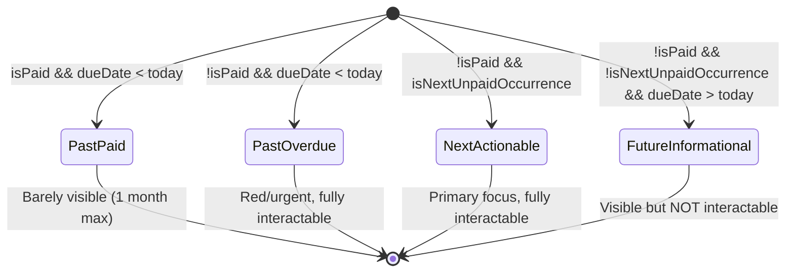

# Reminder State Machine — Complete Analysis

## Summary

The reminder system uses a **base reminder + projected occurrences** model. A recurring reminder is stored as a single DB row with a `dueDate` (the first occurrence). Future occurrences are computed client-side by `generateProjectedOccurrences()`. The `isProjected` flag means "this occurrence was computed from the recurrence rule, not stored in the DB." The current bug is that `isProjected` is used as the sole guard for interactability, but it conflates two different concepts: "computed occurrence" and "future occurrence beyond the next one."

---

## Question 1: What exactly is `isProjected`?

`isProjected` means **"this occurrence was generated by the projection algorithm, not the base DB row."**

In `reminderProjections.ts`:
- The base reminder (the actual DB row) always has `isProjected: false`
- Every computed future occurrence from `generateProjectedOccurrences()` has `isProjected: true`

**Critical insight**: `isProjected` does NOT mean "far-future occurrence." It means "any occurrence beyond the first one in a recurring series." The SECOND occurrence of a monthly reminder is `isProjected: true` even if it's due tomorrow.

This is why the previous fix (removing `!isProjected`) was wrong — it made ALL projected occurrences interactable, including ones 2 months out.

---

## Question 2: How are occurrences generated?

Occurrences are computed **entirely client-side** in `groupRemindersByMonth()`:

```
1. For each reminder in the DB:
   a. Add the base reminder (isProjected: false), applying any exception for its date
   b. If recurring, call generateProjectedOccurrences(reminder, monthsAhead)
      - Iterates from baseDate forward using getNextOccurrence()
      - Skips occurrence 0 (that's the base)
      - For each future date: checks exceptions array for modifications/deletions
      - Generates ProjectedReminder objects with isProjected: true
      - Stops at endRange (monthsAhead + 1 months from now)
2. All reminders (base + projected) are bucketed into MonthGroup objects
3. Each month's reminders are sorted by dueDate
```

**There is no list of concrete dates stored.** The DB stores only:
- The base reminder with its first `dueDate`
- The `recurrence` config (type, interval, end conditions)
- An `exceptions` array for per-occurrence overrides (paid, deleted, modified)

---

## Question 3: What's the difference between "base" reminder and projected occurrences?

| Aspect | Base Reminder | Projected Occurrence |
|--------|--------------|---------------------|
| Storage | Real DB row | Computed client-side |
| `isProjected` | `false` | `true` |
| `id` | Real UUID | `{reminderId}_projected_{date}` |
| `originalReminderId` | `undefined` | Points to base reminder's ID |
| `isPaid` | From DB field | From exception or `false` |
| Deletable | Yes (deletes entire series) | No (would need exception) |
| Editable | Yes (edits series) | Via exception or split |

**Key**: When you "mark as paid" a projected occurrence, the system creates a `ReminderException` with `action: 'modified'` and `isPaid: true` keyed to that occurrence's date. The base reminder stays unchanged.

---

## Question 4: How far back does the widget show paid reminders?

Controlled by the `monthsBack` parameter in `groupRemindersByMonth()`:

```typescript
// In RemindersWidget.tsx:
const monthGroups = useMemo(
    () => groupRemindersByMonth(reminders, 1, 2),  // 1 month back, 2 months ahead
    [reminders]
);
```

**However**, there's an override for overdue reminders:

```typescript
// In groupRemindersByMonth():
allReminders.forEach(r => {
    if (getReminderStatus(r) === 'overdue') {
        const rMonth = startOfMonth(parseISO(r.dueDate));
        if (isBefore(rMonth, startMonth)) {
            startMonth = rMonth;  // Extends window back to include overdue
        }
    }
});
```

**Problem**: If a reminder from 3 months ago is still `isPaid: false`, the window extends back to include it. But there's NO mechanism to hide old PAID reminders — they show as long as they fall within the `monthsBack` window. The `monthsBack: 1` should limit paid history to 1 month, but the base reminder's `dueDate` might be old (for a one-time reminder that was paid late).

**The real issue**: For recurring reminders, the base reminder's `dueDate` is the FIRST occurrence ever. If someone created a monthly reminder 6 months ago, the base reminder (with its original date) still shows up if it falls within the window. The `isPaid` on the base row gets set to `true` when paid, but it stays visible.

---

## Question 5: What's the correct logic for which occurrences should be interactable?

Current logic in `ReminderCard.tsx`:

```typescript
const isProjected = status === 'projected';
// ...
{!isPaid && (
    <>
        <button onClick={() => onPayNow(reminder)}>Pay Now</button>
        <button onClick={() => onMarkAsPaid(reminder)}>Mark as Paid</button>
    </>
)}
```

The Pay Now and Mark as Paid buttons show for ALL non-paid reminders regardless of `isProjected`. The only thing `isProjected` controls is:
1. The Delete button is hidden (`!isProjected`)
2. The Edit button says "Create from Template" instead of "Edit"
3. Visual styling (dashed border, "projected" badge)

**Wait — re-reading the code**: The `!isPaid` check is the ONLY guard on Pay Now / Mark as Paid. The `isProjected` flag does NOT gate these buttons. So the previous fix that "removed `!isProjected`" must have been about something else, or the code has already been modified.

**Current state**: ALL unpaid occurrences (base AND projected) can be paid/marked-as-paid. The issue is purely about the `getReminderStatus()` function:

```typescript
export function getReminderStatus(reminder: ReminderWithProjection, advanceDays: number = 7): ReminderStatus {
    if (reminder.isPaid) return 'paid';
    // ... overdue check ...
    if (reminder.isProjected) return 'projected';  // <-- THIS LINE
    // ... today, this-week, upcoming checks ...
}
```

The `projected` status is returned AFTER the overdue check but BEFORE the today/this-week/upcoming checks. This means:
- A projected occurrence that's overdue → returns `'overdue'` (correct, interactable)
- A projected occurrence due today → returns `'projected'` (WRONG — should be `'today'`)
- A projected occurrence due this week → returns `'projected'` (WRONG — should be `'this-week'`)

**This is the root bug.** The `isProjected` check in `getReminderStatus()` short-circuits the temporal classification. A projected occurrence due tomorrow gets styled as "projected" (gray, dashed, informational) instead of "this-week" (yellow, urgent).

---

## The 4-State Mental Model Mapped to Code



### State Definitions

| State | Condition | Interactable | Visual |
|-------|-----------|-------------|--------|
| Past & Paid | `isPaid && dueDate < today` | No (already resolved) | Faded, line-through |
| Past & Overdue | `!isPaid && dueDate < today` | Yes (Pay Now, Mark Paid) | Red, urgent badge |
| Next/Current | `!isPaid && isNextUnpaid` | Yes (Pay Now, Mark Paid, Dismiss) | Normal/highlighted |
| Future | `!isPaid && !isNextUnpaid && dueDate > today` | No (just informational) | Gray, dashed, "projected" badge |

---

## The Correct Fix

### Problem Statement

Two separate issues:
1. **`getReminderStatus()` short-circuits on `isProjected`** — the next projected occurrence due tomorrow shows as "projected" instead of "this-week"
2. **No concept of "next unpaid occurrence"** — the system treats all unpaid future occurrences the same

### Fix: Replace `isProjected` with temporal + position logic

#### Change 1: `getReminderStatus()` in `reminderProjections.ts`

The `isProjected` check must be moved AFTER temporal checks, and only apply to occurrences that are NOT the next actionable one.

```typescript
export function getReminderStatus(
    reminder: ReminderWithProjection,
    advanceDays: number = 7,
    isNextActionable: boolean = false
): ReminderStatus {
    if (reminder.isPaid) return 'paid';

    const now = new Date();
    const dueDate = parseISO(reminder.dueDate);
    const today = new Date();
    today.setHours(0, 0, 0, 0);
    const dueDateNormalized = new Date(dueDate);
    dueDateNormalized.setHours(0, 0, 0, 0);

    // Overdue: always interactable regardless of projection status
    if (dueDateNormalized < today) {
        return 'overdue';
    }

    // Future projected occurrences that are NOT the next actionable one
    // get the "projected" (informational-only) treatment
    if (reminder.isProjected && !isNextActionable) {
        return 'projected';
    }

    // From here: either base reminder, or the next actionable projected occurrence
    if (dueDateNormalized.getTime() === today.getTime()) {
        return 'today';
    }

    const advanceWindow = addDays(now, advanceDays);
    if (isBefore(dueDate, advanceWindow)) {
        return 'this-week';
    }

    return 'upcoming';
}
```

#### Change 2: Compute `isNextActionable` per reminder series

In `groupRemindersByMonth()`, after generating all occurrences, mark the first unpaid occurrence per series as "next actionable":

```typescript
// After allReminders is fully populated, mark next actionable per series
const nextActionableIds = new Set<string>();
const seriesMap = new Map<string, ReminderWithProjection[]>();

// Group by series (originalReminderId or own id for base)
allReminders.forEach(r => {
    const seriesId = r.originalReminderId || r.id;
    if (!seriesMap.has(seriesId)) seriesMap.set(seriesId, []);
    seriesMap.get(seriesId)!.push(r);
});

// For each series, find the first unpaid occurrence (sorted by date)
const today = new Date();
today.setHours(0, 0, 0, 0);

seriesMap.forEach(occurrences => {
    const sorted = occurrences
        .filter(r => !r.isPaid)
        .sort((a, b) => parseISO(a.dueDate).getTime() - parseISO(b.dueDate).getTime());

    if (sorted.length > 0) {
        // The first unpaid occurrence is the "next actionable" one
        nextActionableIds.add(sorted[0].id);
    }
});

// Attach the flag
allReminders.forEach(r => {
    (r as any).isNextActionable = nextActionableIds.has(r.id);
});
```

#### Change 3: Update `ReminderCard.tsx` action button visibility

```typescript
const isProjected = status === 'projected';
const isInteractable = !isPaid && !isProjected;
// Overdue, today, this-week, upcoming (for next actionable) = interactable
// Projected = NOT interactable (view only)

// Action buttons:
{isInteractable && (
    <>
        <button onClick={() => onPayNow(reminder)}>Pay Now</button>
        <button onClick={() => onMarkAsPaid(reminder)}>Mark as Paid</button>
    </>
)}
```

#### Change 4: Limit paid reminder history

In `groupRemindersByMonth()`, filter out paid reminders older than 1 month:

```typescript
// After assigning reminders to months, filter paid history
const oneMonthAgo = addMonths(today, -1);

months.forEach(month => {
    month.reminders = month.reminders.filter(r => {
        if (r.isPaid) {
            const dueDate = parseISO(r.dueDate);
            return isAfter(dueDate, oneMonthAgo);
        }
        return true; // Keep all unpaid
    });
});
```

---

## Type Changes Required

Add `isNextActionable` to the `ReminderWithProjection` type:

```typescript
export type ReminderWithProjection = Reminder & {
    isProjected?: boolean;
    originalReminderId?: string;
    isNextActionable?: boolean;
};
```

Update `getReminderStatus` signature to accept the flag, and update all call sites.

---

## Summary of Changes

| File | Change |
|------|--------|
| `reminderProjections.ts` | Add `isNextActionable` computation in `groupRemindersByMonth()`, update `getReminderStatus()` signature and logic, add paid-history filter |
| `ReminderCard.tsx` | Gate Pay Now / Mark as Paid buttons behind `!isProjected` (status-based, which now correctly classifies next-actionable projected occurrences as non-projected) |
| Type definition | Add `isNextActionable` to `ReminderWithProjection` |

**No backend changes needed.** The backend correctly handles exceptions for any occurrence date — the fix is purely about frontend classification and UI gating.

---

## Edge Cases to Handle

1. **All occurrences overdue**: If someone hasn't paid 3 months of a monthly reminder, ALL overdue occurrences should be interactable (they all need resolution)
2. **Base reminder is paid but projections aren't**: The base `isPaid` only applies to the first occurrence. Projected occurrences default to `isPaid: false` unless an exception marks them paid
3. **One-time reminders**: Never projected, always interactable if unpaid, always the "next actionable" by definition
4. **Disabled reminders**: Not currently in the model — all reminders are active. If added later, disabled reminders should not generate projections

---

## Testing Scenarios

1. Monthly reminder created 3 months ago, first 2 occurrences paid via exceptions, 3rd (this month) unpaid → 3rd should be "next actionable" with full buttons, 4th and 5th should be "projected" (no buttons)
2. Monthly reminder with overdue occurrence from last month + current month unpaid → BOTH should be interactable (overdue + next actionable)
3. One-time reminder paid last week → should show faded in current month section only
4. One-time reminder paid 3 months ago → should NOT appear at all
5. Weekly reminder with next occurrence tomorrow → should show as "this-week" with full buttons, NOT as "projected"
