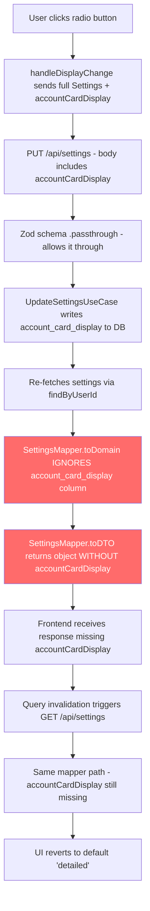

# Settings Update Bug: Account Card Display Not Persisting

## Summary

**Root Cause**: The `SettingsMapper` (both `toDTO` and `toDomain`) only maps `id`, `userId`, `primaryCurrency`, and `alphaVantageApiKey`. The `accountCardDisplay` and `snapshotFrequency` fields are successfully written to the database but **never read back** — they're stripped from both the GET response and the PUT response.

**Impact**: Both `accountCardDisplay` and `snapshotFrequency` settings silently fail to persist from the user's perspective. The write succeeds, the toast fires, but the refetch returns data without these fields, so the UI reverts to defaults.

---

## Complete Data Flow Trace

### Step 1: Frontend Component (PreferencesSection.tsx)

Radio button `onChange` calls `onDisplayChange(kind, mode)` where:
- `kind` = `'normal' | 'investment' | 'cd'`
- `mode` = `'compact' | 'detailed'`

### Step 2: Frontend Action (useSettingsActions.ts)

```typescript
const handleDisplayChange = async (kind, mode) => {
  const current = settings.accountCardDisplay || DEFAULT_DISPLAY;
  await updateMutation.mutateAsync({
    ...settings,
    accountCardDisplay: { ...current, [kind]: mode },
  });
  toast.success(`${kind} account display updated to ${mode}`);
};
```

**What's sent**: The full `Settings` object spread + updated `accountCardDisplay` object:
```json
{
  "primaryCurrency": "USD",
  "alphaVantageApiKey": "...",
  "accountCardDisplay": { "normal": "compact", "investment": "detailed", "cd": "detailed" }
}
```

Note: The toast fires AFTER `mutateAsync` resolves, so the toast only shows on success.

### Step 3: Frontend Service (settingsService.ts)

```typescript
async updateSettings(updates: Partial<Settings>): Promise<Settings> {
  return await apiClient.put<Settings>('/api/settings', updates);
}
```

Sends the full object as JSON body via PUT `/api/settings`.

### Step 4: Backend Schema Validation (schemas.ts)

```typescript
export const updateSettingsSchema = z.object({
  primaryCurrency: currency.optional(),
  alphaVantageApiKey: z.string().min(1).optional(),
  snapshotFrequency: z.enum(['daily', 'weekly', 'monthly', 'manual']).optional(),
}).passthrough();  // <-- allows accountCardDisplay through unvalidated
```

**Result**: `accountCardDisplay` passes through because of `.passthrough()`. No validation on its shape.

### Step 5: Backend Controller (SettingsController.ts)

```typescript
const dto: UpdateSettingsDTO = req.body;
const settings = await this.updateSettingsUseCase.execute(userId, dto);
```

Passes the full body (including `accountCardDisplay`) to the use case. The `UpdateSettingsDTO` type only declares `primaryCurrency` and `alphaVantageApiKey`, but TypeScript doesn't strip extra properties at runtime.

### Step 6: Backend Use Case (UpdateSettingsUseCase.ts)

```typescript
// Save additional fields directly
const extraFields: Record<string, unknown> = {};
if ('accountCardDisplay' in dto) extraFields.account_card_display = dto.accountCardDisplay;
if ('snapshotFrequency' in dto) extraFields.snapshot_frequency = dto.snapshotFrequency;
if (Object.keys(extraFields).length > 0) {
  await this.settingsRepository.updateFields(userId, extraFields);
}
```

**WRITE SUCCEEDS** — `account_card_display` is correctly written to the DB as JSONB.

Then:
```typescript
const updated = await this.settingsRepository.findByUserId(userId);
return SettingsMapper.toDTO(updated!);  // <-- BUG: strips accountCardDisplay
```

### Step 7: Backend Repository (SupabaseSettingsRepository.ts)

`findByUserId` does `select('*')` — it fetches ALL columns including `account_card_display` and `snapshot_frequency`.

### Step 8: Backend Mapper — THE BUG

**`toDomain` only maps 4 fields:**
```typescript
static toDomain(data): Settings {
  return new Settings(
    data.id,
    data.user_id,
    data.primary_currency as Currency,
    data.alpha_vantage_api_key ?? undefined
    // account_card_display — IGNORED
    // snapshot_frequency — IGNORED
  );
}
```

**`toDTO` only returns 4 fields:**
```typescript
static toDTO(settings: Settings): SettingsResponseDTO {
  return {
    id: settings.id,
    userId: settings.userId,
    primaryCurrency: settings.primaryCurrency,
    alphaVantageApiKey: settings.alphaVantageApiKey,
    // accountCardDisplay — MISSING
    // snapshotFrequency — MISSING
  };
}
```

### Step 9: Frontend Receives Incomplete Response

The PUT response and subsequent GET refetch both return:
```json
{
  "id": "...",
  "userId": "...",
  "primaryCurrency": "USD",
  "alphaVantageApiKey": "..."
}
```

No `accountCardDisplay`, no `snapshotFrequency`. The frontend falls back to defaults.

---

## Where It Breaks



**The break point is in `SettingsMapper`** — both `toDomain` and `toDTO` ignore the extra fields.

---

## The Fix

The fix requires changes across 4 files in the backend. The domain entity needs to be extended to include these fields since they ARE user settings (not some ephemeral preference).

### 1. Extend the Domain Entity (`Settings.ts`)

Add `accountCardDisplay` and `snapshotFrequency` as optional properties:

```typescript
export class Settings {
  constructor(
    public readonly id: string,
    public readonly userId: string,
    public primaryCurrency: Currency,
    public alphaVantageApiKey?: string,
    public accountCardDisplay?: AccountCardDisplaySettings,
    public snapshotFrequency?: SnapshotFrequency
  ) {
    this.validate();
  }

  updateAccountCardDisplay(display: AccountCardDisplaySettings): void {
    this.accountCardDisplay = display;
  }

  updateSnapshotFrequency(frequency: SnapshotFrequency): void {
    this.snapshotFrequency = frequency;
    this.validate();
  }

  private validate(): void {
    // ... existing validations ...
    
    if (this.snapshotFrequency) {
      const valid: SnapshotFrequency[] = ['daily', 'weekly', 'monthly', 'manual'];
      if (!valid.includes(this.snapshotFrequency)) {
        throw new Error(`Invalid snapshot frequency`);
      }
    }
  }
}
```

Types needed:
```typescript
type AccountCardDisplayMode = 'compact' | 'detailed';
interface AccountCardDisplaySettings {
  normal: AccountCardDisplayMode;
  investment: AccountCardDisplayMode;
  cd: AccountCardDisplayMode;
}
type SnapshotFrequency = 'daily' | 'weekly' | 'monthly' | 'manual';
```

### 2. Update the Mapper (`SettingsMapper.ts`)

```typescript
static toDTO(settings: Settings): SettingsResponseDTO {
  return {
    id: settings.id,
    userId: settings.userId,
    primaryCurrency: settings.primaryCurrency,
    alphaVantageApiKey: settings.alphaVantageApiKey,
    accountCardDisplay: settings.accountCardDisplay,
    snapshotFrequency: settings.snapshotFrequency,
  };
}

static toDomain(data): Settings {
  return new Settings(
    data.id,
    data.user_id,
    data.primary_currency as Currency,
    data.alpha_vantage_api_key ?? undefined,
    data.account_card_display ?? undefined,
    data.snapshot_frequency ?? undefined
  );
}

static toPersistence(settings: Settings) {
  return {
    id: settings.id,
    user_id: settings.userId,
    primary_currency: settings.primaryCurrency,
    alpha_vantage_api_key: settings.alphaVantageApiKey ?? null,
    account_card_display: settings.accountCardDisplay ?? null,
    snapshot_frequency: settings.snapshotFrequency ?? null,
    updated_at: new Date().toISOString(),
  };
}
```

### 3. Update the DTO (`SettingsDTO.ts`)

```typescript
export interface SettingsResponseDTO {
  id: string;
  userId: string;
  primaryCurrency: Currency;
  alphaVantageApiKey?: string;
  accountCardDisplay?: AccountCardDisplaySettings;
  snapshotFrequency?: SnapshotFrequency;
}

export interface UpdateSettingsDTO {
  primaryCurrency?: Currency;
  alphaVantageApiKey?: string;
  accountCardDisplay?: AccountCardDisplaySettings;
  snapshotFrequency?: SnapshotFrequency;
}
```

### 4. Simplify the Use Case (`UpdateSettingsUseCase.ts`)

Once the domain entity handles all fields, remove the `updateFields` bypass:

```typescript
async execute(userId: string, dto: UpdateSettingsDTO): Promise<SettingsResponseDTO> {
  const settings = await this.settingsRepository.findByUserId(userId);
  if (!settings) throw new NotFoundError('Settings not found for user');

  if (dto.primaryCurrency !== undefined) {
    settings.updatePrimaryCurrency(dto.primaryCurrency);
  }
  if ('alphaVantageApiKey' in dto) {
    settings.updateAlphaVantageApiKey(dto.alphaVantageApiKey);
  }
  if (dto.accountCardDisplay !== undefined) {
    settings.updateAccountCardDisplay(dto.accountCardDisplay);
  }
  if (dto.snapshotFrequency !== undefined) {
    settings.updateSnapshotFrequency(dto.snapshotFrequency);
  }

  await this.settingsRepository.update(settings);

  const updated = await this.settingsRepository.findByUserId(userId);
  return SettingsMapper.toDTO(updated!);
}
```

### 5. Update the Zod Schema (`schemas.ts`)

Add proper validation instead of relying on `.passthrough()`:

```typescript
const accountCardDisplayMode = z.enum(['compact', 'detailed']);

export const updateSettingsSchema = z.object({
  primaryCurrency: currency.optional(),
  alphaVantageApiKey: z.string().min(1).optional(),
  snapshotFrequency: z.enum(['daily', 'weekly', 'monthly', 'manual']).optional(),
  accountCardDisplay: z.object({
    normal: accountCardDisplayMode,
    investment: accountCardDisplayMode,
    cd: accountCardDisplayMode,
  }).optional(),
}).strict();
```

Change `.passthrough()` to `.strict()` to reject unknown fields.

---

## Should the Domain Entity Be Extended?

**Yes.** These are legitimate user settings that:
- Are persisted in the same `settings` table
- Have defined valid values (enum-like constraints)
- Are read and written through the same API
- Belong to the same bounded context

The current approach of bypassing the domain entity via `updateFields` was a shortcut that caused this bug. Bringing them into the domain entity ensures the full read/write cycle works through the same mapper path.

---

## Secondary Issues Found

1. **No validation on `accountCardDisplay` shape**: The Zod schema uses `.passthrough()` so any garbage object would be written to the DB. Fix: add explicit schema validation.

2. **Frontend sends full `Settings` object on every update**: `handleDisplayChange` spreads `{ ...settings, accountCardDisplay: ... }`. This means every update also re-sends `primaryCurrency` etc. Not a bug per se, but the backend should handle partial updates cleanly (which it does via `in` checks).

3. **`useUpdateSettings` mutation type is `Settings` not `Partial<Settings>`**: The mutation function signature is `(settings: Settings) => ...` but the service accepts `Partial<Settings>`. This works because TypeScript structural typing allows it, but it's misleading.

---

## Files to Modify

| File | Change |
|------|--------|
| `backend/src/modules/settings/domain/Settings.ts` | Add `accountCardDisplay` and `snapshotFrequency` properties + update methods |
| `backend/src/modules/settings/application/mappers/SettingsMapper.ts` | Map all fields in `toDTO`, `toDomain`, `toPersistence` |
| `backend/src/modules/settings/application/dtos/SettingsDTO.ts` | Add fields to both DTOs |
| `backend/src/modules/settings/application/useCases/UpdateSettingsUseCase.ts` | Use domain methods instead of `updateFields` bypass |
| `backend/src/modules/settings/presentation/schemas.ts` | Add `accountCardDisplay` validation, switch to `.strict()` |
| `backend/src/modules/settings/domain/Settings.test.ts` | Add tests for new fields |
| `backend/src/modules/settings/application/useCases/UpdateSettingsUseCase.property.test.ts` | Update tests |
