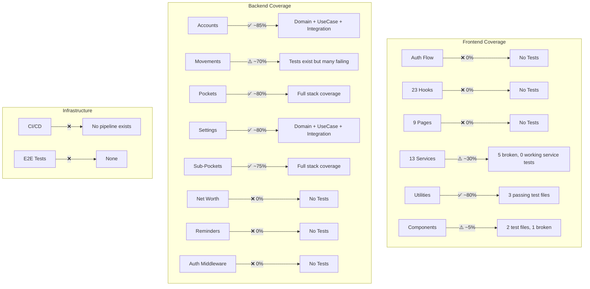

# Testing Gaps Audit

**Date**: 2026-05-21
**Project**: finance-app

## Executive Summary

| Metric | Frontend | Backend |
|--------|----------|---------|
| Framework | Vitest + jsdom | Jest + ts-jest |
| Total Tests | 60 | 764 |
| Passing | 59 | 616 |
| Failing | 1 | 8 |
| Skipped | 0 | 140 |
| Test Files | 13 | 68 |
| Pass Rate | 98.3% | 80.6% |
| CI Pipeline | None | None |
| E2E Tests | None | None |

**Verdict**: Backend has solid coverage with property-based and integration tests but 26 test files fail to compile (mostly due to code drift). Frontend tests are largely broken — 5 of 6 failing test files crash because they import `apiClient` which requires Supabase env vars at module load time. No CI exists to catch regressions. Zero E2E tests. All 23 frontend hooks are untested. Auth flow is completely untested on both sides.

---

## 1. Test Frameworks

### Frontend: Vitest
- **Config**: `frontend/vitest.config.ts`
- **Environment**: jsdom
- **Setup file**: `frontend/src/test/setup.ts` (cleanup, localStorage mock)
- **Coverage**: v8 provider configured but not enforced
- **Test utilities**: Custom render with BrowserRouter wrapper (`testUtils.tsx`)
- **Mock data**: Comprehensive mock accounts, pockets, movements (`mockData.ts`)

### Backend: Jest
- **Config**: `backend/jest.config.js`
- **Preset**: ts-jest with decorator support
- **Module aliases**: @shared, @modules, @shared-backend
- **Coverage**: lcov + html reporters configured

---

## 2. Test Counts & Pass Rates

### Frontend (Vitest)
```
Test Files:  6 failed | 7 passed (13 total)
Tests:       1 failed | 59 passed (60 total)
Duration:    4.72s
```

### Backend (Jest)
```
Test Suites: 26 failed | 8 skipped | 34 passed (60 of 68 total)
Tests:       8 failed | 140 skipped | 616 passed (764 total)
Duration:    10.6s
```

---

## 3. What's Broken

### Frontend Failures

| File | Root Cause |
|------|-----------|
| `services/accountService.test.ts` | Imports `apiClient` which throws at load: "Missing Supabase environment variables" |
| `services/movementService.test.ts` | Same — Supabase env var crash |
| `services/pocketService.test.ts` | Same |
| `services/subPocketService.test.ts` | Same |
| `components/calendar/FinancialCalendarWidget.test.tsx` | Same |
| `components/Modal.test.tsx` | 1 assertion failure: `onClose` not called on backdrop click (likely event propagation issue) |

**Root cause**: The `apiClient.ts` module throws at import time if `VITE_SUPABASE_URL` or `VITE_SUPABASE_ANON_KEY` are missing. Tests don't mock this module or provide env vars. This means **5 of 13 test files are dead code** — they haven't passed since the migration from localStorage to API client.

### Backend Failures

| Category | Count | Root Cause |
|----------|-------|-----------|
| TypeScript compilation errors | ~18 | Code evolved but tests weren't updated (e.g., `MovementController` now takes 17 args, test provides 11) |
| Domain logic mismatches | 5 | `Movement` entity validation changed (negative vs non-positive), tests assert old behavior |
| Missing mock methods | 3 | `pocketRepo.existsFixedPocketInAccount` added but not mocked in tests |

**Key failing suites**:
- `MovementController.integration.test.ts` — constructor signature drift
- `DeleteAccountCascadeUseCase.test.ts` — missing new dependencies
- `AccountMapper.test.ts` — mapping changes not reflected
- `CreatePocketUseCase.test.ts` — new validation logic not mocked
- `FixedExpenseGroupController.integration.test.ts` — dependency changes
- Several property tests for movements — domain rule changes

---

## 4. Test Type Breakdown

### Backend (well-structured)
| Type | Count | Description |
|------|-------|-------------|
| Unit tests | 24 | Domain entities, mappers, use cases |
| Property-based tests | 28 | Randomized input testing (fast-check style) |
| Integration tests | 16 | Controller-level with mocked repos |
| Skipped tests | 10 | Intentionally disabled |

### Frontend (sparse)
| Type | Count | Description |
|------|-------|-------------|
| Service unit tests | 5 | Test CRUD operations (but broken) |
| Component tests | 3 | Modal, ThemeProvider, Calendar |
| Utility tests | 3 | dateUtils, fixedExpenseUtils, idGenerator |
| Store tests | 1 | useThemeStore |
| Integration tests | 1 | Placeholder (disabled, says "TODO: rewrite") |

### Missing entirely
- **E2E tests**: Zero. No Playwright, Cypress, or similar.
- **Frontend hook tests**: Zero. All 23 hooks untested.
- **Auth flow tests**: Zero on both sides.
- **API client tests**: Zero.

---

## 5. Coverage Gaps — Critical Untested Paths

### Frontend: Completely Untested

#### Auth Flow (HIGH RISK)
- `contexts/AuthContext.tsx` — no tests
- `pages/LoginPage.tsx` — no tests
- `pages/SignUpPage.tsx` — no tests
- Session management, token refresh, logout — untested

#### All 23 Hooks (HIGH RISK)
```
useAccountActions       useAutoNetWorthSnapshot  useBalanceDeltas
useBudgetActions        useBudgetPersistence     useBulkSelection
useConfirm              useConsolidatedTotal     useFixedExpenseActions
useInvestmentPrices     useMovementBulkActions   useMovementFormState
useMovementRowActions   useMovementsFilter       useMovementsSort
useMovementSubmit       useNetWorthChartData     useOrphanedRestore
usePocketActions        useReminderActions       useSettingsActions
useToast                useURLActions
```

#### All Pages (MEDIUM RISK)
```
AccountsPage    BudgetPlanningPage    FixedExpensesPage
LoginPage       MovementsPage         SettingsPage
SignUpPage       SummaryPage           TemplatesPage
```

#### Critical Services Without Tests
- `currencyService.ts` — currency conversion logic
- `fixedExpenseGroupService.ts` — fixed expense management
- `investmentService.ts` — stock price fetching
- `movementTemplateService.ts` — template CRUD
- `netWorthSnapshotService.ts` — snapshot creation
- `reminderService.ts` — reminder management
- `settingsService.ts` — user settings

#### API Client
- `apiClient.ts` — zero tests, crashes other tests at import

### Backend: Untested Modules

| Module | Status |
|--------|--------|
| `net-worth` | Zero tests — no domain, use case, or controller tests |
| `reminders` | Zero tests — no domain, use case, or controller tests |
| `authMiddleware.ts` | Zero tests — JWT verification untested |
| Error handling middleware | Not tested in isolation |

---

## 6. Test Quality Assessment

### Frontend Service Tests: Testing the Wrong Thing
The service tests (accountService, movementService, etc.) were written when services used **localStorage**. They now use `apiClient` (HTTP calls to backend), but the tests:
- Don't mock `apiClient`
- Don't provide env vars
- Crash at import time
- Were never updated for the architecture change

**Verdict**: These tests are dead. They test a pattern that no longer exists.

### Backend Tests: Mostly Good, But Drifting
- **Property tests**: Excellent — test domain invariants with randomized inputs
- **Integration tests**: Good — test controller routing with mocked dependencies
- **Domain tests**: Good — test entity validation and business rules
- **Problem**: Code evolves faster than tests. 26 files fail due to signature/API drift.

### Frontend Utility Tests: Appropriate
- `dateUtils.test.ts`, `fixedExpenseUtils.test.ts`, `idGenerator.test.ts` — these test pure functions correctly.

---

## 7. Test Infrastructure

### Setup Files
- `frontend/src/test/setup.ts` — afterEach cleanup, localStorage mock, `@testing-library/jest-dom/vitest`
- `frontend/src/test/testUtils.tsx` — custom render with BrowserRouter wrapper
- `frontend/src/test/mockData.ts` — comprehensive mock entities (accounts, pockets, movements, sub-pockets)

### What's Missing
- No `apiClient` mock (needed for all service tests)
- No `AuthContext` mock/wrapper in `testUtils.tsx`
- No TanStack Query wrapper in `testUtils.tsx` (needed for hook tests)
- No MSW (Mock Service Worker) setup for API mocking
- No test database or seed scripts for backend integration tests
- No `.env.test` file for frontend

---

## 8. CI/CD

**Status: None exists.**

- No `.github/` directory
- No `.github/workflows/` directory
- No `vercel.json` with build checks
- No pre-commit hooks running tests
- No branch protection requiring passing tests

**Impact**: Tests can break silently. The 26 failing backend test files and 5 broken frontend test files prove this — they've been broken for an unknown period with no one noticing.

---

## 9. Priority Recommendations

### P0 — Fix Immediately
1. **Create `.env.test`** for frontend with dummy Supabase values, OR mock `apiClient` module globally in setup
2. **Fix `MovementController` integration test** — update constructor args
3. **Add CI workflow** — even a basic `npm test` on push would catch regressions

### P1 — Critical Gaps
4. **Auth flow tests** — login, signup, session expiry, token refresh
5. **apiClient tests** — error handling, retry logic, token attachment
6. **Hook tests** — at minimum: `useConsolidatedTotal`, `useMovementSubmit`, `useBalanceDeltas`
7. **Backend net-worth module** — zero coverage on a financial calculation module
8. **Backend reminders module** — zero coverage

### P2 — Important
9. **Add TanStack Query + AuthContext to testUtils.tsx** wrapper
10. **Set up MSW** for frontend API mocking
11. **E2E tests** for critical flows: login → create account → add movement → verify balance
12. **Backend authMiddleware tests** — JWT validation, expired tokens, missing headers

### P3 — Nice to Have
13. **Visual regression tests** for key pages
14. **Performance tests** for balance calculation with many movements
15. **Coverage thresholds** enforced in CI

---

## 10. Test File Inventory

### Frontend (13 files)
```
src/components/calendar/FinancialCalendarWidget.test.tsx  ❌ BROKEN (env vars)
src/components/Modal.test.tsx                             ⚠️  1 failure
src/components/ThemeProvider.test.tsx                     ✅
src/services/accountService.test.ts                      ❌ BROKEN (env vars)
src/services/cdCalculationService.test.ts                ✅
src/services/movementService.test.ts                     ❌ BROKEN (env vars)
src/services/pocketService.test.ts                       ❌ BROKEN (env vars)
src/services/subPocketService.test.ts                    ❌ BROKEN (env vars)
src/store/useThemeStore.test.ts                          ✅
src/test/integration.test.ts                             ✅ (placeholder only)
src/utils/dateUtils.test.ts                              ✅
src/utils/fixedExpenseUtils.test.ts                      ✅
src/utils/idGenerator.test.ts                            ✅
```

### Backend (68 files, showing failed only)
```
modules/accounts/application/mappers/AccountMapper.test.ts                    ❌ TS error
modules/accounts/application/useCases/DeleteAccountCascadeUseCase.test.ts     ❌ TS error
modules/accounts/application/useCases/DeleteAccountCascadeUseCase.property    ❌ TS error
modules/movements/application/useCases/ApplyPendingMovementUseCase.property   ❌ TS error
modules/movements/application/useCases/CreateMovementUseCase.property         ❌ TS error
modules/movements/application/useCases/MarkAsPendingUseCase.property          ❌ TS error
modules/movements/domain/Movement.test.ts                                     ❌ Logic mismatch
modules/movements/presentation/MovementController.integration.test.ts         ❌ Constructor drift
modules/pockets/application/useCases/CreatePocketUseCase.test.ts              ❌ Missing mock
modules/sub-pockets/presentation/FixedExpenseGroupController.integration      ❌ TS error
+ ~16 more with TS compilation errors (not shown in grep output)
```

---

## Diagram: Test Coverage Map



---

## Summary

The backend has a **strong testing architecture** (property tests, integration tests, clean separation) but has suffered from code drift — tests weren't updated as the codebase evolved. The frontend testing is **fundamentally broken** — the migration from localStorage to API client invalidated all service tests, and no new testing patterns were established for the hook-based architecture.

The biggest risks are:
1. **No CI** — broken tests go unnoticed indefinitely
2. **Auth flow untested** — security-critical path with zero coverage
3. **Balance calculations untested** — financial accuracy depends on `useConsolidatedTotal`, `useBalanceDeltas`, and backend net-worth module, all untested
4. **Frontend service tests are dead code** — they test a pattern that no longer exists
