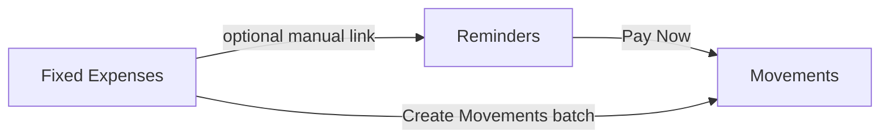
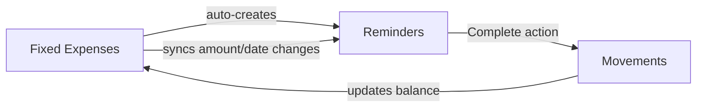

# UX/Logic Review — Part 2

## Executive Summary

This analysis covers Fixed Expenses & Sub-Pockets, Reminders, Net Worth Timeline, and Settings. The most significant UX friction points are: (1) the fixed expenses mental model is confusing — "periodicity months" doesn't map to how people think about bills, (2) reminders and fixed expenses are disconnected systems that should be tightly linked, (3) net worth auto-snapshot is well-implemented but lacks goal-setting, and (4) settings are minimal but missing quick-access for daily-use preferences.

---

## 5. Fixed Expenses & Sub-Pockets

### Current Behavior

- Fixed expenses live inside "fixed pockets" which are special pockets within accounts (type: `'fixed'`).
- Each fixed expense is a "SubPocket" with: name, `valueTotal`, `periodicityMonths`, balance, enabled flag, and optional group assignment.
- Monthly contribution = `valueTotal / periodicityMonths` (adjusted down if balance is close to goal).
- Groups organize expenses visually (e.g., "Housing", "Transportation") with color coding and drag-and-drop reordering.
- A "Create Movements" button batch-generates movements for all enabled expenses at once.
- The form asks for "Total Value" and "Periodicity (Months)" — the user must mentally translate their bill into these terms.

### UX Friction Points

**1. The "Total Value / Periodicity Months" model is unintuitive (HIGH)**

The current model asks: "What's the total amount, and over how many months should I divide it?" This works for savings goals (save $6000 over 12 months = $500/month) but is confusing for recurring bills:

- Rent of $1500/month: User must enter valueTotal=1500, periodicityMonths=1. But then the progress bar goes 0→100% every month and resets? No — the balance accumulates, which makes no sense for a monthly bill.
- Annual insurance of $3600: User enters valueTotal=3600, periodicityMonths=12. This works well — save $300/month toward the annual payment.
- Quarterly gym membership of $150: User enters valueTotal=150, periodicityMonths=3. Reasonable, but the label "Periodicity (Months)" doesn't clearly communicate this.

The fundamental confusion: **is this a savings goal toward a future payment, or a recurring bill tracker?** The current model conflates both.

**2. No concept of "due date" or "payment date" on fixed expenses (HIGH)**

Fixed expenses have no date field. The user can't see WHEN a payment is due — only how much they need to save monthly. This means:
- No way to know "insurance is due in March"
- No automatic connection to the reminders system
- The "Create Movements" button creates movements for the current moment with no date context

**3. Balance tracking is confusing for monthly bills (MEDIUM)**

For a monthly rent of $1500 (valueTotal=1500, periodicityMonths=1):
- After contributing $1500, progress = 100%. Then what?
- The balance stays at $1500 until the user manually creates a movement to "pay" it
- There's no reset mechanism for the next cycle

For annual insurance ($3600 over 12 months):
- This works perfectly — accumulate $300/month, pay $3600 when due, balance resets to 0

The system works well for **sinking funds** but poorly for **monthly recurring bills**.

**4. "Sub-pocket within a fixed pocket" is architecturally confusing (MEDIUM)**

Users must first create a "fixed pocket" in the Accounts page, then come to the Fixed Expenses page to add sub-pockets. The empty state says "Please create a fixed expenses pocket in the Accounts page first." This is a two-step setup that could be automated.

**5. No handling of non-monthly periodicities in a user-friendly way (LOW)**

The form says "Periodicity (Months)" with helper text "How many months to divide this expense over." For quarterly expenses, the user enters 3. For annual, 12. For biweekly... there's no option. The system only supports month-based periods.

### Proposed Improvements

| # | Improvement | Priority |
|---|---|---|
| 1 | **Split into two modes**: "Sinking Fund" (save toward a future lump payment) and "Recurring Bill" (fixed monthly amount, tracks if paid this cycle). Sinking funds keep the current model. Recurring bills get a simpler "amount per period" + "due date" model. | HIGH |
| 2 | **Add a due date field** to fixed expenses. This enables: calendar integration, automatic reminder creation, and "days until due" indicators. | HIGH |
| 3 | **Auto-link to reminders**: When a fixed expense has a due date, offer to auto-create a recurring reminder. When a reminder is marked paid, update the fixed expense balance. | HIGH |
| 4 | **Replace "Periodicity (Months)" with a frequency picker**: "Monthly", "Quarterly", "Semi-annual", "Annual", "Custom (every N months)". Internally still stores months but the UI is friendlier. | MEDIUM |
| 5 | **Auto-create the fixed pocket**: If no fixed pocket exists, the Fixed Expenses page should offer a one-click "Set up fixed expenses" that creates the pocket automatically in a default account. | MEDIUM |
| 6 | **Add a "reset cycle" mechanism** for monthly bills: After the user pays rent, the balance resets to 0 and the progress bar starts over for the next month. | MEDIUM |
| 7 | **Support non-monthly periods**: Add "biweekly" and "weekly" options for expenses like biweekly loan payments. | LOW |

---

## 6. Reminders System

### Current Behavior

- Reminders are standalone entities with: title, amount, due date, recurrence config, and optional links to fixed expenses or movement templates.
- Recurrence supports: once, daily, weekly (with day-of-week selection), monthly, yearly, custom (every N days/weeks/months/years).
- End conditions: never, after N occurrences, on a specific date.
- Projected occurrences are generated client-side for display (up to 2 months ahead).
- Two payment flows:
  - **"Pay Now"** (`onPayNow`): Creates a new movement (opens movement form pre-filled).
  - **"Mark as Paid"** (`onMarkAsPaid`): Opens a modal with two options: (a) just mark as paid without linking, or (b) link to an existing movement within ±15 days of due date.
- Reminders can be linked to fixed expenses and templates (optional, manual selection in form).
- The widget shows reminders grouped by month with overdue alerts, color-coded status (overdue/today/this-week/upcoming/paid/projected).
- Exception system handles individual occurrence modifications (delete/modify a single instance of a recurring series).

### UX Friction Points

**1. Reminders and fixed expenses are disconnected (HIGH)**

The link between reminders and fixed expenses is optional and manual. A user who sets up "Car Insurance" as a fixed expense ($3600/12 months) must SEPARATELY create a reminder for the annual payment date. There's no automatic connection. The `fixedExpenseId` field on reminders exists but:
- It only auto-fills the amount from the fixed expense
- It doesn't update the fixed expense balance when the reminder is paid
- It doesn't auto-create the reminder when the fixed expense is created

**2. "Pay Now" vs "Mark as Paid" distinction is unclear (MEDIUM)**

The two buttons on each reminder card are:
- Dollar sign icon = "Pay Now (create movement)"
- Checkmark icon = "Mark as Paid (no new movement)"

The distinction is subtle. Users who already recorded the payment manually need "Mark as Paid + Link." Users who haven't paid yet need "Pay Now." But the icons don't clearly communicate this. A user might click "Mark as Paid" thinking it means "I paid this" when they actually want to create a movement.

**3. The recurrence UI is comprehensive but the "custom" option is confusing (LOW)**

The custom recurrence uses `interval` + `customPeriod` (e.g., "every 3 weeks"). But the form shows "Every [number] [Days/Weeks/Months/Years]" which overlaps with the built-in daily/weekly/monthly/yearly options. When would someone use "custom: every 1 month" vs "monthly"? The custom option should only appear for non-standard intervals (every 2 weeks, every 3 months, etc.).

**4. No notification/push mechanism (MEDIUM)**

Reminders are purely visual — they show up in the widget with color coding. There's no:
- Browser notification on due date
- Email reminder
- Push notification (if PWA)

The "overdue" banner is only visible when the user opens the app. If they don't check for a week, they miss the reminder entirely.

**5. Projected occurrences can't be pre-paid (LOW)**

Projected (future) occurrences show an "Edit" button labeled "Create from Template" but can't be directly paid. If a user wants to pay next month's rent early, they can't do it from the projected card — they'd need to create a manual movement.

### Proposed Improvements

| # | Improvement | Priority |
|---|---|---|
| 1 | **Auto-create reminders from fixed expenses**: When a fixed expense has a due date and recurrence, automatically generate a linked reminder. Changes to the expense propagate to the reminder. | HIGH |
| 2 | **Bidirectional sync**: When a linked reminder is marked paid, automatically update the fixed expense balance (deduct the payment amount or reset the cycle). | HIGH |
| 3 | **Merge "Pay Now" and "Mark as Paid" into a single "Complete" flow**: One button opens a modal asking "Did you already pay this?" → Yes: link to existing movement. No: create new movement. This eliminates the confusing two-button pattern. | MEDIUM |
| 4 | **Add browser notifications**: Use the Notification API to alert users on due dates. Respect a "notifications enabled" setting. | MEDIUM |
| 5 | **Simplify custom recurrence**: Remove the "custom" option and instead allow any frequency to have a custom interval. E.g., "Monthly → every [1] month(s)" where the interval defaults to 1 but can be changed to 2, 3, etc. | LOW |
| 6 | **Allow pre-paying projected occurrences**: Add a "Pay Early" action on projected cards that creates the movement and marks that future occurrence as paid. | LOW |

---

## 7. Net Worth Timeline

### Current Behavior

- Auto-snapshot on app load based on frequency setting (daily/weekly/monthly/manual).
- Frequency is configurable in Settings (default: weekly).
- Snapshots store: total net worth, base currency, and per-currency breakdown.
- The hook `useAutoNetWorthSnapshot` fires once per app load, checks if enough time has passed since the last snapshot, and creates one if needed.
- Backend uses upsert with unique constraint on (user_id, snapshot_date) to handle multi-tab race conditions.
- Chart shows total or per-currency breakdown with date range filters (30d/6m/1y/all).
- Clicking a chart point opens an edit modal (change total value or delete snapshot).
- "Show Variation (%)" toggle shows percentage change between points.
- No manual "take snapshot now" button on the chart widget itself.
- No goal-setting or target line.

### UX Friction Points

**1. No manual snapshot trigger from the widget (MEDIUM)**

The auto-snapshot is smart, but if a user makes a large transaction and wants to capture the new state immediately, they have no button to do so. They'd need to:
- Change settings to "daily" temporarily, or
- Reload the app and hope the timing works, or
- There's simply no way to force a snapshot from the UI

The edit modal only edits existing snapshots — it doesn't create new ones.

**2. No goal-setting or target visualization (MEDIUM)**

Users can't set a target like "I want to reach $50,000 by December 2026." There's no:
- Target line on the chart
- Progress toward goal indicator
- Projected trajectory based on current savings rate
- Milestone celebrations

**3. Currency breakdown view has limited utility (LOW)**

The "By Currency" view shows separate lines per currency. This is useful for users with significant holdings in multiple currencies, but:
- The Y-axis shows raw amounts, making it hard to compare currencies with very different magnitudes (e.g., $5000 USD vs $100,000 MXN)
- There's no option to show all currencies converted to the primary currency for a true comparison
- The variation (%) toggle helps here but isn't the default

**4. Chart readability with many data points (LOW)**

With daily snapshots over a year, the chart would have 365 points. The current implementation:
- Uses date range filters (30d/6m/1y/all) which helps
- Shows dots on every point, which could get cluttered at daily frequency
- No data aggregation (e.g., show weekly averages when viewing "all time")

**5. Edit modal only allows changing total — not breakdown (LOW)**

When clicking a snapshot to edit, the user can only change `totalNetWorth`. They can't correct individual currency amounts in the breakdown. If the auto-snapshot captured a wrong exchange rate, the user can't fix the per-currency values.

### Proposed Improvements

| # | Improvement | Priority |
|---|---|---|
| 1 | **Add "Take Snapshot Now" button** on the widget header. Creates an immediate snapshot regardless of frequency setting. | MEDIUM |
| 2 | **Goal-setting feature**: Allow users to set a target net worth + target date. Show as a dashed line on the chart. Show a "projected" line based on average monthly growth. Display "X months to goal at current rate." | MEDIUM |
| 3 | **Smart dot density**: When viewing "all time" with many points, aggregate to weekly/monthly averages and only show dots at those intervals. Keep daily granularity for 30d view. | LOW |
| 4 | **Allow editing breakdown in edit modal**: Show per-currency fields so users can correct individual amounts. Recalculate total automatically. | LOW |
| 5 | **Add milestone markers**: When net worth crosses round numbers ($10k, $25k, $50k, $100k), show a small celebration indicator on the chart. | LOW |

---

## 8. Settings & Customization

### Current Behavior

The Settings page contains three sections:

**PreferencesSection** (left column):
1. **Primary Currency** — radio grid of supported currencies (USD, MXN, COP, EUR, GBP)
2. **Account Card Display** — per-account-type (normal/investment/CD) choice between "compact" and "detailed" view
3. **Net Worth Snapshots** — frequency picker (daily/weekly/monthly/manual)

**ExportImportSection** (right column):
- Export data button (downloads JSON)

**DangerZoneSection** (right column):
- Presumably account deletion or data wipe

**Not in Settings but scattered elsewhere:**
- Theme (dark/light) — controlled by ThemeProvider, toggled from... somewhere (likely the layout/nav)
- Date format — not configurable at all
- Number format/locale — not configurable
- Default account for new movements — not configurable
- Reminder notification preferences — don't exist

### UX Friction Points

**1. Theme toggle is not in Settings (MEDIUM)**

The ThemeProvider exists and the app supports dark mode, but the toggle isn't in the Settings page. It's likely in the navigation/sidebar. This is fine for quick access but inconsistent — users looking for "appearance settings" won't find them on the Settings page.

**2. No date/number format preferences (MEDIUM)**

The app handles multiple currencies and presumably users in different locales (Mexico, Colombia, US, Europe). But there's no way to configure:
- Date format (DD/MM/YYYY vs MM/DD/YYYY vs YYYY-MM-DD)
- Number format (1,000.00 vs 1.000,00)
- First day of week (Sunday vs Monday — relevant for the calendar widget and weekly reminders)

The app uses `toLocaleString()` in some places which respects browser locale, but this isn't explicit or configurable.

**3. Missing "default account" preference (LOW)**

When creating a new movement, the user must select an account every time. If they have a primary checking account they use for 80% of transactions, there's no way to set it as default.

**4. No quick-access for frequently changed settings (LOW)**

Primary currency and theme are "set once" preferences. But snapshot frequency might change (e.g., "manual" during a vacation, "daily" during active tracking). Currently requires navigating to the full Settings page.

**5. API key management is hidden (LOW)**

The `Settings` type includes `alphaVantageApiKey` for stock prices, but there's no visible UI for managing it in the PreferencesSection. It might be in the debug sections (`DebugStockPrice`, `DebugExchangeRate`) which aren't user-facing.

### Proposed Improvements

| # | Improvement | Priority |
|---|---|---|
| 1 | **Add theme toggle to Settings page** as well as keeping it in the nav. Settings should be the canonical place for all preferences, with shortcuts elsewhere for convenience. | MEDIUM |
| 2 | **Add locale/format preferences**: Date format, number format, first day of week. Apply consistently across the app. | MEDIUM |
| 3 | **Add "default account" setting**: Pre-select this account in movement forms. Allow override per-form. | LOW |
| 4 | **Move API key management to Settings**: Create a proper "Integrations" section for Alpha Vantage key and any future API keys. Remove from debug-only views. | LOW |
| 5 | **Quick-settings in nav/header**: Add a small gear dropdown in the top nav with: theme toggle, snapshot frequency, and primary currency. Full Settings page for everything else. | LOW |
| 6 | **Add notification preferences**: When browser notifications are implemented for reminders, add enable/disable + quiet hours settings here. | LOW (future) |

---

## Priority Summary

### High Priority
| Area | Issue |
|------|-------|
| Fixed Expenses | Split into "Sinking Fund" vs "Recurring Bill" modes |
| Fixed Expenses | Add due date field to fixed expenses |
| Fixed Expenses | Auto-link fixed expenses to reminders |
| Reminders | Auto-create reminders from fixed expenses with due dates |
| Reminders | Bidirectional sync between reminders and fixed expense balances |

### Medium Priority
| Area | Issue |
|------|-------|
| Fixed Expenses | Replace "Periodicity (Months)" with frequency picker |
| Fixed Expenses | Auto-create fixed pocket on first use |
| Fixed Expenses | Add cycle reset mechanism for monthly bills |
| Reminders | Merge "Pay Now" / "Mark as Paid" into single "Complete" flow |
| Reminders | Add browser notifications |
| Net Worth | Add "Take Snapshot Now" button |
| Net Worth | Goal-setting with target line on chart |
| Settings | Add theme toggle to Settings page |
| Settings | Add locale/format preferences |

### Low Priority
| Area | Issue |
|------|-------|
| Fixed Expenses | Support non-monthly periods (biweekly, weekly) |
| Reminders | Simplify custom recurrence UI |
| Reminders | Allow pre-paying projected occurrences |
| Net Worth | Smart dot density for large datasets |
| Net Worth | Allow editing per-currency breakdown |
| Net Worth | Milestone markers |
| Settings | Default account preference |
| Settings | Move API keys to proper Integrations section |
| Settings | Quick-settings dropdown in nav |

---

## Key Architectural Insight

The biggest systemic issue across these four areas is that **Fixed Expenses and Reminders are parallel systems that should be deeply integrated**. Currently:

The ideal flow should be:

This bidirectional integration would eliminate the need for users to maintain two separate systems for what is conceptually one thing: "I have a recurring bill, I need to save for it, and I need to be reminded to pay it."
