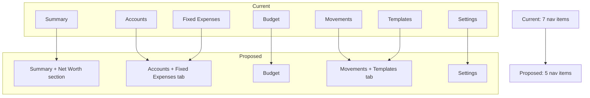

# UX/Logic Review Part 3: Interaction Patterns & Workflows

## Executive Summary

The app has solid foundational UX patterns (URL-driven actions, QuickActionsFAB, templates, batch entry) but suffers from excessive friction in the most common workflows. Recording a simple expense takes 6-8 interactions minimum, spending analysis requires navigating to a separate page and configuring filters, and the transfer flow demands selecting 4 dropdowns. The information architecture splits related concepts across too many pages, and several micro-interaction patterns (loading states, success feedback, error recovery) are inconsistent.

---

## 9. Common Workflows — Step-by-Step Analysis

### Workflow A: "I just bought coffee for $5"

**Current path (desktop):**
1. Click "Movements" in sidebar (or already there)
2. Click "New Movement" button
3. Full-screen modal opens with form
4. Select Type dropdown (default: EgresoNormal — good)
5. Date defaults to today (good)
6. Select Account dropdown
7. Select Pocket dropdown (cascading, waits for account)
8. Type "5" in Amount
9. Optionally type "Coffee" in Notes
10. Click "Create Movement"

**Total interactions: 6-8 clicks/taps + 2 text inputs**

**Current path (mobile):**
1. Tap FAB (+) button
2. Tap "New Movement" (navigates to `/movements?action=new`)
3. Same form as desktop opens
4. Steps 4-10 same as above

**Total interactions: 8-10 taps + 2 text inputs**

**Problems identified:**
- No "last used account/pocket" memory — user re-selects the same account every time
- The cascading account → pocket selection is 2 sequential interactions that could be 1
- No quick-entry mode for simple expenses (amount + notes only)
- The full modal with side panels (calculator, account details) is overkill for a $5 coffee
- Template loading is available but requires pre-setup; no auto-suggestion from history

**Ideal target: 3-4 interactions** (tap FAB → type amount → confirm, with smart defaults)

### Workflow B: "How much did I spend this week?"

**Current path:**
1. Navigate to Movements page
2. Click "Filters" button to expand filter panel
3. Change "Date Range" dropdown to "Last 7 Days"
4. Visually scan the movement list grouped by month
5. No automatic total shown — user must mentally sum or use FloatingStatsBar by clicking individual items

**Total interactions: 3 clicks + mental math**

**Problems identified:**
- No spending summary/total visible on the Movements page itself
- The FloatingStatsBar (sum/average) only works when you manually select items — it's a calculator, not an automatic summary
- The FinancialCalendarWidget on Summary page shows daily income/expenses but requires navigating back to Summary
- No "this week" or "this month" spending total prominently displayed anywhere
- The filter panel is a 4-column grid that's overwhelming for a simple date filter

**Ideal target: 0-1 interactions** (visible on Summary page or Movements page header)

### Workflow C: "I want to move $500 from savings to checking"

**Current path:**
1. Navigate to Movements page (or use FAB → "New Transfer")
2. Open form
3. Select Type → "Transfer" (changes form layout)
4. Select Source Account
5. Select Source Pocket
6. Select Target Account (new dropdown appears)
7. Select Target Pocket (new dropdown appears)
8. Type "500" in Amount
9. Click "Transfer Funds"

**Total interactions: 7 clicks + 1 text input**

**Problems identified:**
- 4 dropdown selections is excessive for a transfer
- No "recent transfers" or "frequent transfer pairs" suggestion
- Source and target could be combined into a single "from → to" selector
- The form dynamically shows/hides the target section based on type selection, which is good but adds a step
- No confirmation screen showing "You're about to move $500 from X to Y"

**Ideal target: 4-5 interactions** (select from, select to, enter amount, confirm)

### Workflow D: "My rent is due in 3 days"

**Current path for awareness:**
1. User opens app → lands on Summary page
2. RemindersWidget is visible in the right column (desktop) showing "Upcoming Payments"
3. Overdue banner shows count if any are overdue
4. Monthly timeline shows upcoming reminders with due dates

**Total interactions: 0 (passive awareness) — this works well**

**Current path for action (pay now):**
1. See reminder in widget
2. Click "Pay Now" on the reminder card
3. MarkAsPaidModal opens with two options:
   - "Just Mark as Paid" (1 click)
   - "Link to existing movement" (search + click)
4. OR click "Pay Now" which navigates to `/movements?action=new&amount=X&notes=Y&reminderId=Z`

**Total interactions: 2-3 clicks — this is well-designed**

**Problems identified:**
- No push notification or email reminder (web-only awareness)
- The RemindersWidget is in a fixed 400px height container that may clip content
- No distinction between "due soon" (warning) and "overdue" (critical) in the card styling beyond the banner
- The "Pay Now" flow that pre-fills the movement form is excellent UX

### Workflow E: "What's my net worth trend?"

**Current path:**
1. Open app → Summary page
2. Scroll down past accounts, past calendar widget
3. NetWorthTimelineWidget is visible with chart
4. Toggle date range (30d/6m/1y/All)
5. Toggle view mode (Total/By Currency)
6. Click any point to edit/delete snapshot

**Total interactions: 0-1 for viewing (scroll), 1-2 for customizing**

**Problems identified:**
- Widget is buried below the fold on Summary page — requires scrolling past accounts and calendar
- No dedicated Net Worth page for deeper analysis
- The widget is compact and functional but lacks trend indicators (up/down arrow, % change from last month)
- Auto-snapshot happens on page load (good) but user has no control over snapshot frequency

---

## 10. Data Entry Friction

### Required Fields Analysis

**Movement Form (the most-used form):**
| Field | Required | Should Be Required | Notes |
|-------|----------|-------------------|-------|
| Type | Yes | Yes | Default "EgresoNormal" is good |
| Date | Yes | Yes | Defaults to today — correct |
| Account | Yes | Yes | No smart default — friction |
| Pocket | Yes | Yes | No smart default — friction |
| Amount | Yes | Yes | No calculator-style input |
| Notes | No | No | Good |
| isPending | No | No | Good |
| Sub-Pocket | Conditional | Conditional | Only for fixed types — correct |

**Verdict: 5 required fields for a simple expense is 2 too many.** Account and Pocket should have smart defaults (last used, most frequent, or user-configured default).

### Auto-Suggestion Gaps

**What exists:**
- Template loading (dropdown at top of form) — pre-fills account/pocket/type/amount/notes
- URL-driven prefill from reminders and fixed expenses
- QuickCalculator for amount computation

**What's missing:**
- No "last used account/pocket" memory
- No auto-complete on Notes field based on history
- No "frequent combinations" suggestion (e.g., "You usually record coffee in Checking → Daily")
- No amount suggestion based on template or history ("Last time this was $4.50")
- Templates require explicit creation — no automatic pattern detection

### Date Selection

**Current implementation:** HTML `<input type="date">` with default value `format(new Date(), 'yyyy-MM-dd')`

**Assessment:**
- Defaults to today — correct for 90% of use cases
- Native date picker is functional but not optimized for "yesterday" or "2 days ago" quick picks
- No relative date shortcuts ("today", "yesterday", "last Friday")
- The `toDateOnly` utility properly handles timezone issues

**Recommendation:** Add quick-pick buttons above the date input: "Today" (default), "Yesterday", "Custom" (reveals picker).

### Calculator-Style Input

**Current implementation:** The QuickCalculator is a separate panel (only visible on desktop, in the side panel of the movement form). It supports `operand1 ± operand2` and a "Use as Amount" button.

**Assessment:**
- Only 2-operand calculator (no chaining like "500+200+100")
- Only visible on large screens (hidden on mobile via `hidden lg:flex`)
- Requires clicking between calculator and amount field
- The "click a balance to fill operand" feature is clever but non-obvious

**Recommendation:** Support inline expressions in the amount field itself (parse "500+200" on blur) — this is the pattern used by Splitwise and other finance apps.

---

## 11. Information Architecture

### Current Navigation Structure

**Desktop Sidebar (7 items):**
1. Summary (Home) — dashboard with totals, accounts, calendar, net worth, reminders, fixed expenses
2. Accounts — account CRUD + pocket management
3. Fixed Expenses — sub-pocket management for recurring bills
4. Budget — income distribution planning
5. Movements — transaction log + entry
6. Templates — saved movement patterns
7. Settings — preferences, debug tools, export/import

**Mobile Bottom Bar (4 items + Menu):**
1. Home (Summary)
2. Movements
3. Accounts
4. Budget
5. Menu (drawer with all 7)

### Discoverability Issues

| Feature | Location | Discoverable? | Problem |
|---------|----------|---------------|---------|
| Quick Actions FAB | Mobile only, bottom-right | Medium | Only visible on mobile; desktop has no equivalent shortcut |
| Batch Movement Entry | Movements page header button | Low | Small "Batch Add" button, no tooltip explaining what it does |
| Templates | Separate page + dropdown in form | Medium | Two access points is good, but the page feels disconnected |
| Net Worth | Embedded in Summary | Low | No nav item; buried below fold |
| Reminders | Embedded in Summary | Medium | Widget is visible but creating requires finding the + button |
| Orphaned Movements | Movements page, conditional button | Low | Only shows when orphans exist; no explanation of what "orphaned" means |
| FloatingStatsBar | Summary page, requires selection | Very Low | Users must know to click account balances to trigger it |
| Financial Calendar | Summary page | Medium | Useful but no way to navigate to specific day's movements directly... wait, it does navigate via `?date=` — good |

### Pages That Should Be Merged

**1. Templates → Movements page**
- Templates are only useful in the context of creating movements
- The separate Templates page adds a nav item for a feature that's secondary
- Better: collapsible "My Templates" section within the Movements page, or a tab

**2. Fixed Expenses could be a tab within Accounts**
- Fixed expenses are sub-pockets within accounts — they're not a separate domain
- The current separation forces users to context-switch between "where is my money" (Accounts) and "what are my bills" (Fixed Expenses)
- Counter-argument: Fixed Expenses has enough complexity (groups, monthly calculations, batch pay) to warrant its own page

**3. Net Worth deserves its own page (or at least a nav item)**
- Currently buried in Summary with no direct navigation
- Users who care about net worth tracking have to scroll past everything else
- A dedicated page could show more history, allow manual snapshot creation, and show breakdown tables

### Navigation Depth Issues

| Action | Clicks from any page |
|--------|---------------------|
| Record a movement | 2-3 (nav + button + form) |
| Check account balance | 1 (Summary shows all) |
| See spending this month | 2-3 (Movements + filter) |
| Pay a reminder | 2 (Summary → click Pay Now) |
| Create a new account | 2 (Accounts + New Account) |
| Edit a fixed expense | 2-3 (Fixed Expenses + find + click) |
| Check net worth | 1 (scroll on Summary) |
| Use a template | 3 (Movements + New + select template) |

**The most common action (record movement) takes the most steps.** This is backwards.

---

## 12. Visual Feedback & Micro-interactions

### Success Feedback

**After creating a movement:**
- Toast notification appears (bottom-right, 5s duration): "Movement created successfully!" (type: success)
- Form closes (modal disappears)
- Movement list updates (TanStack Query invalidation)
- No animation on the new item appearing in the list

**After creating an account:**
- Toast: "Account created successfully!"
- Modal closes
- Account appears in list

**Assessment:**
- Toast system is well-implemented (4 variants: success/error/info/warning)
- Toast has enter/exit animations
- Missing: no highlight/flash on the newly created item in the list
- Missing: no "undo" option in the toast for destructive actions

### Loading States

**Page-level loading:**
- Skeleton components exist (SkeletonAccountCard, SkeletonTable, SkeletonList, SkeletonStats)
- Each page has a loading state that renders skeletons matching the expected layout
- SlowQueryIndicator shows after a delay if loading takes too long

**Form submission:**
- Buttons show `loading` state (spinner + disabled)
- Forms disable during submission
- No optimistic updates — user waits for server response

**Infinite scroll (Movements):**
- "Load More" button with loading state
- Shows "Showing X of Y movements" count
- No skeleton for incoming items

**Assessment:**
- Skeleton loading is good and layout-aware
- The SlowQueryIndicator and ConnectionBanner are thoughtful additions
- Missing: optimistic updates for common operations (create movement should appear immediately)
- Missing: progress indication for batch operations

### Error Messages

**Form validation errors:**
- Inline red text below fields: "Amount is required", "Account is required"
- Uses react-hook-form with `mode: 'onBlur'` — errors show after leaving field
- Clear, actionable messages

**API errors:**
- Red banner at page top: generic error message
- QueryErrorCard component with retry button for failed queries
- Toast notifications for mutation failures

**Assessment:**
- Validation errors are clear and well-positioned
- API errors could be more specific (currently just shows the error message string)
- No contextual help or suggestions for fixing errors
- The ErrorBoundary provides a "Try Again" button — good recovery pattern

### Destructive Action Guards

**Delete account:**
- CascadeDeleteDialog: custom dialog explaining what will be deleted
- Option to also delete associated movements or orphan them
- Requires explicit confirmation

**Delete movement:**
- ConfirmDialog with danger variant (red icon, "Delete" button)
- Shows title and message explaining the action

**Delete reminder (recurring):**
- RecurrenceActionModal: asks "Delete this occurrence only?" or "Delete all future occurrences?"
- Smart handling of recurring vs. one-time

**Assessment:**
- Destructive actions are well-guarded with appropriate severity levels
- The cascade delete dialog is particularly well-designed (explains consequences)
- Missing: no "undo" capability after deletion (would require soft-delete)
- Missing: no bulk-delete confirmation showing count ("Delete 5 movements?")... actually BulkActionsToolbar exists but confirmation is via the generic confirm dialog

---

## 13. Concrete Improvement Proposals

### Priority 1: Reduce Movement Entry Friction (High Impact)

**P1.1 — Smart Defaults for Account/Pocket**
- Remember last-used account+pocket combination per movement type
- Store in localStorage or user settings
- Pre-select on form open; user can override
- Expected reduction: -2 interactions per movement entry

**P1.2 — Inline Amount Expressions**
- Parse mathematical expressions in the amount field on blur
- Support: `500+200`, `1000-350`, `500*2`, `1200/4`
- Show computed result below the field before submission
- Remove dependency on the side-panel calculator for basic math

**P1.3 — Quick Entry Mode (Mobile)**
- New FAB action: "Quick Expense" → minimal form (amount + notes only)
- Uses smart defaults for account/pocket/type/date
- Single-screen, no scrolling, large touch targets
- "More options" link expands to full form if needed

**P1.4 — Date Quick-Picks**
- Add pill buttons above date input: "Today" | "Yesterday" | "Pick date"
- Default to "Today" (already works), but make "Yesterday" one-tap
- Covers 95% of use cases without opening a date picker

### Priority 2: Surface Spending Insights (High Impact)

**P2.1 — Spending Summary on Movements Page**
- Add a collapsible stats bar at the top of MovementsPage
- Show: "This week: $X spent | This month: $Y spent | vs last month: +/-Z%"
- Updates automatically based on active filters
- No extra clicks needed

**P2.2 — Summary Page Spending Widget**
- Add a "Recent Spending" card to Summary page (alongside calendar)
- Show: today's total, this week's total, this month's total
- Tap to navigate to Movements with appropriate date filter pre-set

**P2.3 — Movement List Running Total**
- Show cumulative total at the bottom of each month group header
- "March 2025 — 47 movements — $2,340 spent / $5,000 earned"
- Already have the data; just need to display it

### Priority 3: Streamline Navigation (Medium Impact)

**P3.1 — Merge Templates into Movements Page**
- Remove Templates from main navigation
- Add a "Templates" tab or collapsible section within Movements page
- Keep the template dropdown in the movement form (already exists)
- Reduces nav items from 7 to 6

**P3.2 — Add Net Worth to Navigation**
- Either as its own page (with expanded history, manual snapshot, breakdown table)
- Or as a clearly labeled section on Summary with an anchor link in nav
- Currently invisible to users who don't scroll

**P3.3 — Desktop Quick Actions**
- The FAB only exists on mobile (`md:hidden`)
- Add a persistent "+" button in the sidebar or page header for desktop
- Or: keyboard shortcut (Ctrl+N for new movement, Ctrl+T for transfer)

### Priority 4: Improve Transfer UX (Medium Impact)

**P4.1 — Unified "From → To" Selector**
- Replace 4 separate dropdowns with a visual "from" and "to" card
- Show account name + pocket name + current balance in each card
- Tap card to change selection (opens a picker)
- Visual arrow between cards showing direction

**P4.2 — Recent/Frequent Transfers**
- Show "Recent transfers" section when transfer mode is selected
- One-tap to repeat a previous transfer (pre-fills everything)
- Based on movement history where type includes transfer

### Priority 5: Micro-interaction Polish (Lower Impact)

**P5.1 — Optimistic Updates**
- When creating a movement, immediately add it to the list (with pending indicator)
- Roll back on error with toast explanation
- Reduces perceived latency from ~500ms to instant

**P5.2 — New Item Highlight**
- After creating/editing an item, briefly highlight it in the list (flash animation)
- Scroll to the item if it's not in view
- Helps user confirm "yes, my action worked and here's the result"

**P5.3 — Undo Toast for Deletions**
- After deleting a movement/account/reminder, show toast with "Undo" button
- 5-second window to reverse the action
- Requires soft-delete on backend (or optimistic local state)

**P5.4 — Mobile Calculator in Amount Field**
- On mobile, when amount field is focused, show a custom numeric keypad
- Include +, -, =, and common amounts ($5, $10, $20, $50, $100)
- Replaces the hidden desktop-only QuickCalculator panel

---

## 14. Workflow Timing Summary

| Workflow | Current Steps | Target Steps | Gap |
|----------|:---:|:---:|:---:|
| Record simple expense | 8-10 | 3-4 | -5 to -6 |
| Check weekly spending | 3 + mental math | 0-1 | -3 |
| Transfer between accounts | 8 | 4-5 | -3 |
| Know about upcoming bill | 0 (passive) | 0 | None |
| View net worth trend | 1 (scroll) | 1 | None |
| Use a template | 3 | 2 | -1 |
| Batch-enter movements | 3 (open) + N×4 (per row) | 2 + N×3 | -1 per row |

---

## 15. Information Architecture Recommendation

**Rationale:**
- Fewer nav items = less cognitive load and faster navigation
- Related features grouped together reduce context-switching
- Mobile bottom bar can show all 5 items without a "Menu" overflow
- Each page becomes richer but more cohesive

**Alternative (less disruptive):** Keep 7 items but add Net Worth as item 6, move Templates into Movements as a tab, resulting in the same 7 items but better organized.

---

## 16. Key Strengths to Preserve

1. **URL-driven actions** (`?action=new&amount=X&reminderId=Y`) — excellent deep-linking pattern
2. **QuickActionsFAB** on mobile — right pattern, just needs desktop equivalent
3. **Template system** — good concept, needs better discoverability
4. **Reminder → Pay Now flow** — seamless connection between awareness and action
5. **FinancialCalendar → Movement date filter** — clicking a day navigates with `?date=`
6. **Batch entry mode** — power-user feature that's well-implemented
7. **Skeleton loading states** — layout-aware, prevents content shift
8. **CascadeDeleteDialog** — explains consequences clearly before destructive action
9. **ErrorBoundary per-route** — crash isolation prevents white screens
10. **FloatingStatsBar** — clever selection-based calculator for ad-hoc analysis
