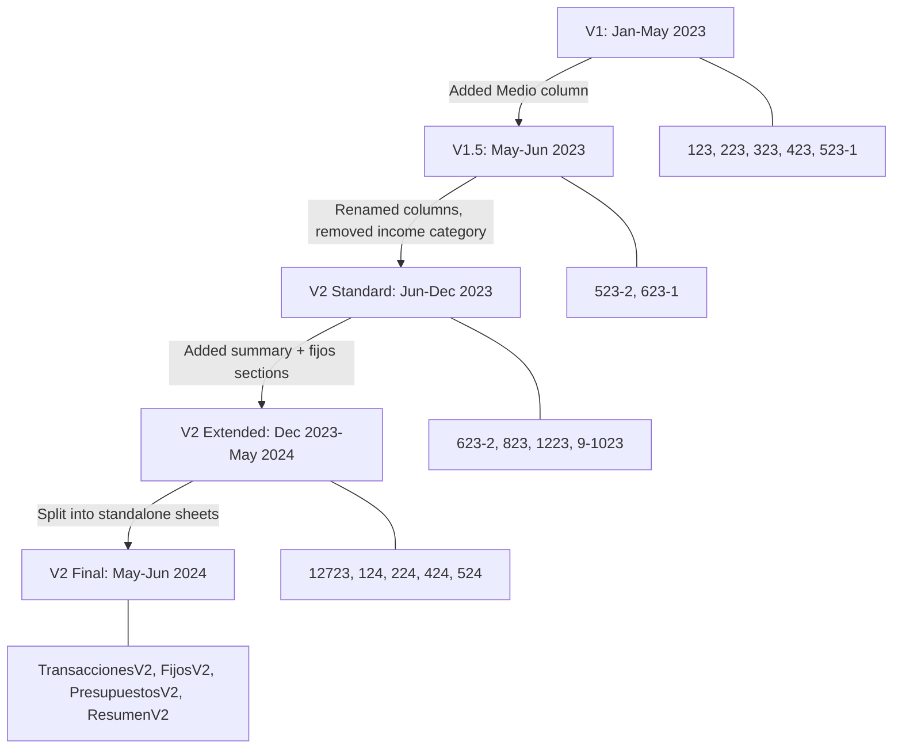

# Analysis: Presupuesto mensual.xlsx (File 1 - Oldest)

## Summary

- **Period**: January 2023 – June 2024 (with some data referencing back to June 2020)
- **Currency**: COP (Colombian Peso)
- **Location**: Colombia
- **Total sheets**: 24
- **Sheets with transaction data**: 18 (6 are summary/utility/empty)
- **Structure evolved** through 4 distinct formats over the period

The file uses a **dual-column layout** throughout: Gastos (expenses) on the left side, Ingresos (income) on the right side, separated by an empty column (G or similar).

---

## Structural Variants

### Variant 1: V1 Old Format (Jan–Apr 2023)

**Sheets**: `123`, `223`, `323`, `423`, `523 - 1`

**Header row**: Row 5 (123, 223, 323) or Row 2 (423, 523-1)

**Column layout**:
```
GASTOS (Left side)              | INGRESOS (Right side)
A: Day number                   |
B: Fecha                        | G: Fecha
C: Importe (amount)             | H: Importe (amount)
D: Descripción                  | I: Descripción
E: Categoría                    | J: Categoría
                                | K: (sometimes a number, unclear)
```

**Key characteristics**:
- NO "Medio" (account) column — cannot determine which account was used
- Has "Saldo inicial" and "Saldo final" rows above headers (rows 0-1) in 123, 223, 323
- Column A contains just the day number (not full date)
- Section labels: "Gastos" and "Ganancias" (row 2)
- "Gastos personales" appears as a category in section markers

**Balance info** (only in 123, 223, 323):
```
Row 0: C:"Saldo inicial"  D:2245838
Row 1: C:"Saldo final"    D:1605000
Row 2: B:"Gastos"         G:"Ganancias"
Row 3: C:1545838 (total expenses)  H:905000 (total income)
```

**Sample data (sheet 123)**:
```
A    B(Fecha)      C(Importe)  D(Descripción)       E(Categoría)  | G(Fecha)      H(Importe)  I(Descripción)  J(Categoría)
4    2023-01-04    10200       Viaje cami a casa    Transporte    | 2023-01-10    204000                      Mesada
4    2023-01-04    23518       Plantillas           Salud         | 2023-01-06    54000       Cami bbq        Comida
5    2023-01-05    31500       Clap cumple alejo    Comida        | 2023-01-08    10000       Fajitas         Comida
```

**Date range per sheet**:
- `123`: Jan 2023 (some dates from 2020 likely errors)
- `223`: Jan–Feb 2023
- `323`: Feb–Mar 2023
- `423`: Apr 2023
- `523 - 1`: May 1–8, 2023

**Data rows**: 16–68 per sheet

---

### Variant 2: V1.5 Transition Format (May–Jun 2023)

**Sheets**: `523 - 2`, `623 - 1`

**Header row**: Row 2

**Column layout**:
```
GASTOS (Left side)              | INGRESOS (Right side)
A: Day number                   |
B: Fecha                        | H: Fecha
C: Importe                      | I: Importe
D: Descripción                  | J: Descripción
E: Categoría                    | K: Categoría
F: Medio ← NEW!                | L: Medio ← NEW!
```

**Key characteristics**:
- First appearance of "Medio" (account/payment method) column
- Still uses "Importe" and "Descripción" naming
- Medio values are sparse (not always filled)
- Transition period where user started tracking payment methods

**Sample data (sheet 523 - 2)**:
```
A   B(Fecha)      C(Importe)  D(Descripción)                    E(Categoría)  F(Medio)  | H(Fecha)      I(Importe)  J(Descripción)           K(Categoría)  L(Medio)
24  2023-05-24    0           Pago poliza viaje MELI (0.246M)   Viajes                  | 2023-05-24    0           Salario Meli (3M)        Sueldo
25  2023-05-25    6000        helado                            Comida        Tarjeta   | 2023-05-28    56100       Comida donde alonso rata Me pagaron    Tarjeta
```

**Medio values seen**: Tarjeta, Nequi, Efectivo (sparse)

**Date range**:
- `523 - 2`: May 24–31, 2023
- `623 - 1`: Jun 3–23, 2023

**Data rows**: 33–40 per sheet

---

### Variant 3: V2 Standard Format (Jun 2023 – Jan 2024)

**Sheets**: `623 - 2`, `823`, `1223`, `9-1023`

**Header row**: Row 2

**Column layout**:
```
GASTOS (Left side)              | INGRESOS (Right side)
B: Fecha                        | H: Fecha
C: Costo ← renamed             | I: Costo
D: Notas ← renamed             | J: Notas (often empty for income)
E: Categoria ← no accent       | K: Medio ← NO category for income!
F: Medio                        |
```

**Key characteristics**:
- Renamed: "Importe" → "Costo", "Descripción" → "Notas", "Categoría" → "Categoria"
- Column A no longer has day number
- Income side has NO category column — only Medio
- "Medio" now represents account/pocket names, not just payment methods
- First appearance of "Reset" entries in income side
- 823 has an extra "Ahorros" label in header row (col F header says "Ahorros" but data uses it as Medio)

**Sample data (sheet 1223)**:
```
B(Fecha)      C(Costo)  D(Notas)            E(Categoria)  F(Medio)              | H(Fecha)      I(Costo)   J(Notas)  K(Medio)
2023-12-10    19000     Helados antioquai   Comida        Efectivo para Gastar  | 2023-12-07    2883000    Reset     Viajes
2023-12-12    6000      guadalupe           Comida        Efectivo para Gastar  | 2023-12-07    411000     Reset     Para gastar
2023-12-17    36000     invitada a helados  Comida        Para gastar           | 2023-12-07    43000      Reset     Efectivo para Gastar
```

**Reset entries**: These appear in the INCOME side with "Reset" as the Notas value. They represent opening balances for each account/pocket at the start of the period. All share the same date (period start date).

**823 special structure**: Has a second section starting at row 17 with its own header for a different account (Nequi/Efectivo transactions). The first section header includes "Ahorros" as col F label.

**9-1023 special structure**: Has additional columns (M onwards) with a separate fixed expenses tracking grid:
```
M: Fecha    N: Costo    O: Categoria (fixed expense name)
Q: Fecha    R: Costo    S: Categoria
U: Fecha    V: Costo    W: Categoria
```
These track fixed expense payments like CELULAR, BARBERIA, LAVADO CARRO, GASOLINA, PROTEINA, SHEA MOISTURE.

**Medio values**: Para gastar, Efectivo para Gastar, Ahorros, Viajes, CDT, Nequi, Tarjeta de Alimentacion, Efectivo, Copagos & medicamentos

**Date ranges**:
- `623 - 2`: Jun 23–28, 2023
- `823`: Jun 18 – Aug 2023 (extended period)
- `9-1023`: Aug 25 – Nov 6, 2023
- `1223`: Dec 2023 – Jan 2024

**Data rows**: 39–178 per sheet

---

### Variant 4: V2 Extended / Multi-Section Format (Jan–Jun 2024)

**Sheets**: `124`, `224`, `424`, `524`, `12723`

**Header rows**: Multiple (typically rows 1-3 for summary, row 30-37 for transactions, row 75-95 for fixed expenses)

These sheets contain **3 major sections** stacked vertically:

#### Section A: Summary/Resumen (top)
```
Row 1-2: H | Totales | Fijos | Ingresos | Gastos | Categorias de gasto
```
Contains account balances, fixed expense totals, income/expense by medio, and category breakdowns. NOT transaction data — these are aggregated totals.

For `124` and `12723`, the summary section header is slightly different:
```
Row 3: Nequi | Gastos por medio | Ingresos | Categorias de gasto
```

#### Section B: Transactions (middle)
**Header**: `Fecha | Costo | Notas | Categoria | Medio | Fecha | Ingreso | Notas | Medio`

Note: Income column is labeled "Ingreso" (not "Costo") in 524 and TransaccionesV2.

```
GASTOS (Left side)              | INGRESOS (Right side)
B: Fecha                        | H: Fecha
C: Costo                        | I: Ingreso/Costo
D: Notas                        | J: Notas
E: Categoria                    | K: Medio
F: Medio                        |
```

Same as V2 Standard but with "Ingreso" label for income amounts.

#### Section C: Fixed Expenses / Fijos (bottom)
**Header**: `Fecha | Costo | Notas | Medio | Fecha | Costo | Notas | Medio`

```
GASTOS FIJOS (Left)             | INGRESOS FIJOS (Right)
B: Fecha                        | G: Fecha
C: Costo                        | H: Costo
D: Notas                        | I: Notas (often "Reset" or "salario")
E: Medio (= fixed expense name) | J: Medio (= fixed expense name)
```

**Key difference**: In the Fijos section, "Medio" is actually the **fixed expense category name** (CELULAR, RAPPI, SPOTIFY, GYM, UBER, VERO, BARBERIA, etc.), NOT an account name.

#### 424 Special: 4-section layout
Sheet 424 has an additional section starting at column N alongside the main transactions:
```
N: Gastos (Fijos)    | S: Ingresos (Fijos)
N: Fecha             | S: Fecha
O: Costo             | T: Costo
P: Notas             | U: Notas
Q: Medio             | V: Medio
```

**Sample data (sheet 424, row 5)**:
```
B:2024-03-01 C:21000 E:Comida F:Efectivo Para gastar | H:2024-03-01 I:950000 J:RESET K:Efectivo Ahorros | N:2024-03-01 O:40000 P:tigo mes Q:CELULAR | S:2024-03-01 T:71679 U:Reset V:CELULAR
```

**Reset entries in V2 Extended**: Appear in income columns with "RESET" or "Reset" as Notas. Represent opening balances. All Resets share the same date (period start).

**Date ranges**:
- `12723`: Dec 7, 2023 – Jan 2024 (transition sheet)
- `124`: Jan 2024
- `224`: Feb 2024
- `424`: Mar–Apr 2024
- `524`: Apr–May 2024

**Data rows**: 87–160 per sheet (transaction section only)

---

## Special/Utility Sheets

### TransaccionesV2
**Purpose**: Latest transaction format (May–Jun 2024), standalone transactions sheet.

**Header row 2**: `Fecha | Costo | Notas | Categoria | Medio | Fecha | Ingreso | Notas | Medio`

Same as V2 Extended Section B. Contains 65 date entries.

**Sample**:
```
B:2024-05-25  C:10500  D:d1 salsa y mani  E:Comida  F:Tarjeta de Alimentacion | H:5/24  I:50000  J:ticket TOP ALEJO
```

Note: Income dates sometimes use short format "5/24" or "6/24" instead of full dates.

### FijosV2
**Purpose**: Latest fixed expenses format (May–Jun 2024), standalone.

**Header row 2**: `Fecha | Costo | Notas | Medio | Fecha | Costo | Notas | Medio`

Same as V2 Extended Section C. "Medio" = fixed expense name.

**Sample**:
```
B:2024-05-29  C:42900           E:CELULAR
              (empty row)       G:2024-05-24  H:42900  I:Reset  J:CELULAR
B:2024-05-31  C:13200  D:uber palace  E:UBER  | G:2024-05-24  H:20000  I:Reset  J:RAPPI
```

Fixed expense names: CELULAR, RAPPI, SPOTIFY, GYM, UBER, VERO, BARBERIA, CREMAS CABELLO, PROTEINA, LAVADO CARRO, GASOLINA, PARQUEADERO, SOAT, SEGURO, IMPUESTO

### PresupuestosV2
**Purpose**: Budget planning / projections. NOT transaction data.

**Structure** (3 sub-sections side by side):
```
Columns B-F: Proyeccion (savings goals with target dates and amounts)
Columns J-K: Totales (category totals)
Columns M-R: Gastos fijos (fixed expense definitions with amounts, cycles, types)
```

**Proyeccion section**:
```
B: Category name (Ahorros, Inversion, Viajes, Entretenimiento)
C: Target date (Hoy + Plazo)
D: Monthly amount (Valor)
E: Months remaining (Plazo)
F: Total target (Total)
```

**Gastos fijos definition**:
```
M: Fixed expense name
N: Amount (Porc/cost)
O: Duration/frequency
P: Monthly total
Q: Cycle description (e.g., "27/mes", "3/mar/yr")
R: Type/category (Subscripciones, Carro, Salud, Otros)
```

**Budget allocation** (rows 13-24):
```
B: Category        D: Percentage  E: Amount      F: Remaining
Totales
Saldo inicial:     0              6,138,000      6,138,000
Gastos fijos       17.86%         1,096,118      5,041,882
Ahorros            65%            3,277,223      1,764,659
Inversiones        5%             252,094        1,512,565
Viajes             22%            1,109,214      403,351
Entretenimiento    8%             403,351        0
```

### ResumenV2
**Purpose**: Summary/dashboard sheet. Contains aggregated totals, NOT individual transactions.

**Structure**: Same as V2 Extended Section A (account balances, fixed expense totals, income/expense by medio, category breakdowns).

### CDT
**Purpose**: CDT (Certificado de Depósito a Término) investment tracking.

**Headers**: `aportado | nota | fecha | en total | % por partes | total aproximado | resultado aproximado | total (og + resultado)`

**Sample**:
```
A(aportado)  B(nota)              G(en total)   H(% por partes)    J(resultado)    K(total)
1325000      dinero seguro a cdt  27465000      0.0482             91999.82        1416999.82
140000       dinero soat a cdt                  0.0051             9720.74         149720.74
26000000     ahorros a cdt                      0.9467             1805279.45      27805279.45
```

### Hoja 34
**Empty sheet** — no data.

### Hoja 35
**Purpose**: Unknown calculation sheet. 18 rows of numbers without headers. Possibly interest calculations.

### ||||
**Empty sheet** — no data.

---

## Reset Entries — Detailed Analysis

"Reset" entries appear in the **income/right side** of transaction sheets. They represent the **opening balance** of each account/pocket at the start of a tracking period.

**Pattern**:
- All Reset entries share the **same date** (the period start date)
- They appear in the income column with "Reset" or "RESET" as the Notas/description
- The "Medio" column contains the account/pocket name
- The amount is the balance of that account at period start

**Example (sheet 1223, Dec 2023)**:
```
Date: 2023-12-07 (all same)
Reset entries:
  5,454,000  → Ahorros
  2,883,000  → Viajes
    411,000  → Para gastar
 27,465,000  → CDT
     43,000  → Efectivo para Gastar
```

**Sheets with Resets**: `1223` (9), `124` (22), `224` (22), `424` (25), `524` (15), `TransaccionesV2` (6), `FijosV2` (15)

**Sheets WITHOUT Resets**: All V1 sheets (123–523-1), 623-1, 623-2, 823, 9-1023, 12723

---

## Account/Pocket Names (Medio values across all sheets)

### Spending accounts:
- **Para gastar** — main spending pocket
- **Efectivo Para gastar** / **Efectivo para Gastar** — cash spending
- **Tarjeta de Alimentacion** — food/grocery card
- **Nequi** — digital wallet (Nequi app)
- **Efectivo** — cash
- **Tarjeta** / **Tarjeta Credito** / **T. Credito** — credit card

### Savings/Investment accounts:
- **Ahorros** — savings
- **Efectivo Ahorros** / **Ahorros Efectivo** — cash savings
- **CDT** — term deposit (Certificado de Depósito a Término)
- **Viajes** — travel savings
- **VOO** — Vanguard S&P 500 ETF investment
- **Dolares** — USD holdings
- **Inversiones** — investments (general)
- **Bancolombia** — bank account

### Fixed expense categories (used as "Medio" in Fijos sections):
- CELULAR, RAPPI, SPOTIFY, GYM, UBER, VERO
- BARBERIA, CREMAS CABELLO, PROTEINA
- LAVADO CARRO, GASOLINA, PARQUEADERO, SOAT, SEGURO, IMPUESTO

### Other:
- **Copagos & medicamentos** — medical copays
- **Fijos** — fixed expenses (aggregate)
- **Puse la tarjeta** — "I put the card" (informal)

---

## Categories (Expense types)

From all sheets combined:
- **Comida** — food/meals
- **Transporte** — transportation/uber
- **Salud** — health/medical
- **Viajes** — travel
- **Regalos** — gifts
- **Cine** — movies
- **Tecnologia** — technology
- **Hogar** — home
- **Subscripciones** — subscriptions
- **Gastos personales** — personal expenses
- **Otros** — other
- **Bobadas** — frivolous spending
- **Fijos - Otros** — fixed other
- **Puse la tarjeta** — credit card usage (used as category in some sheets)
- **Pagos entretenimiento** — entertainment payments
- **Emergencias** — emergencies

### Income categories:
- **Mesada** — allowance
- **Sueldo** — salary
- **Me pagaron** — someone paid me back
- **Ahorro** — savings transfer
- **Reset** — opening balance (not real income)

---

## Sheet-by-Sheet Date Mapping

| Sheet | Period | Format | Data Rows | Has Resets | Has Balance |
|-------|--------|--------|-----------|------------|-------------|
| 123 | Jan 2023 | V1 | ~68 | No | Yes |
| 223 | Jan-Feb 2023 | V1 | ~25 | No | Yes |
| 323 | Feb-Mar 2023 | V1 | ~50 | No | Yes |
| 423 | Apr 2023 | V1 | ~26 | No | No |
| 523 - 1 | May 1-8, 2023 | V1 | ~16 | No | No |
| 523 - 2 | May 24-31, 2023 | V1.5 | ~33 | No | No |
| 623 - 1 | Jun 3-23, 2023 | V1.5 | ~40 | No | No |
| 623 - 2 | Jun 23-28, 2023 | V2 | ~39 | No | No |
| 823 | Jun 18 – Aug 2023 | V2 | ~178 | No | No |
| 9-1023 | Aug 25 – Nov 2023 | V2+ | ~136 | No | No |
| 1223 | Dec 2023 – Jan 2024 | V2 | ~102 | Yes (9) | No |
| 12723 | Dec 7, 2023+ | V2 Ext | ~146 | No | No |
| 124 | Jan 2024 | V2 Ext | ~87 | Yes (22) | No |
| 224 | Feb 2024 | V2 Ext | ~137 | Yes (22) | No |
| 424 | Mar-Apr 2024 | V2 Ext | ~160 | Yes (25) | No |
| 524 | Apr-May 2024 | V2 Ext | ~141 | Yes (15) | No |
| TransaccionesV2 | May-Jun 2024 | V2 Final | ~65 | Yes (6) | No |
| FijosV2 | May-Jun 2024 | V2 Final | ~23 | Yes (15) | No |

---

## Extraction Strategy Notes

### For V1 sheets (123, 223, 323, 423, 523-1):
- Start reading data from row after header (row 6 or row 3)
- Left side = expenses, right side = income
- No account info available — will need to assign a default or mark as "unknown"
- Skip rows where Importe = 0 (some have 0 amounts with descriptions in parentheses indicating actual amount)
- Balance info (Saldo inicial/final) can be used for net worth snapshots

### For V1.5 sheets (523-2, 623-1):
- Same as V1 but with optional Medio column (F for expenses, L for income)
- Medio may be empty — handle gracefully

### For V2 Standard sheets (623-2, 823, 1223, 9-1023):
- Income side has NO category — only Medio
- Filter out "Reset" entries from income (they're opening balances, not real income)
- 823 has multiple sub-sections with different headers — need to detect section boundaries
- 9-1023 has extra fixed expense columns (M onwards) — extract separately

### For V2 Extended sheets (124, 224, 424, 524, 12723):
- Must identify section boundaries (Summary → Transactions → Fijos)
- Only extract from Transaction and Fijos sections (skip Summary)
- In Fijos section, "Medio" = fixed expense name, NOT account
- Filter out Reset entries
- 424 has 4 parallel column groups — extract from all

### For TransaccionesV2 / FijosV2:
- Clean final format, straightforward extraction
- Watch for short date formats in income ("5/24" = May 2024)
- FijosV2: "Medio" = fixed expense name

### General rules:
- Skip empty rows
- Skip rows where amount = 0 AND description contains amount in parentheses (these are notes, not transactions)
- Dates may be Excel serial numbers or ISO strings
- Some amounts are negative (corrections/refunds)
- "nan" values appear in some cells (9-1023) — treat as empty

---

## Diagram: File Structure Evolution



---

## Sources

- `/local/home/jdrami/finance-app/.agents/resources/Presupuesto mensual.xlsx` — analyzed 2026-05-24
