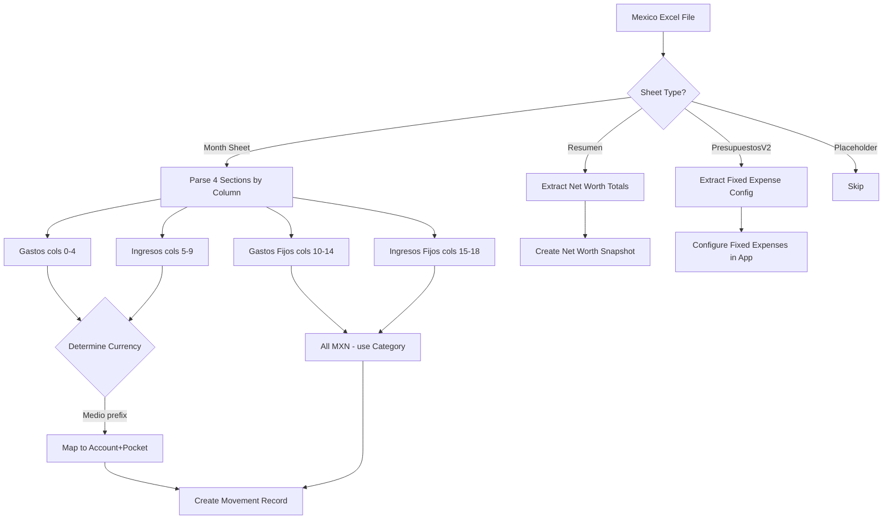

# Analysis: Presupuesto Mensual 2025 MEXICO.xlsx

## Executive Summary

This is the **Mexico transition file** (Oct–Nov 2025), representing the final months of Excel-based tracking before the finance app took over in December 2025. It is a **multi-currency** file (MXN primary + COP + USD) with 14 sheets, of which only **October and November** contain transaction data. September contains only initialization entries (VOO investment + cash balances).

**Key findings:**
- 4 sections per month sheet arranged **side-by-side in columns** (not stacked vertically)
- Each section has 4 columns: `Date | Amount | Description | Medio/Category`
- Currency is determined by the **Medio prefix** (e.g., `[NuMX]` = MXN, `[Nu]` = COP, `[Bancolombia]` = COP, `[BX]` = MXN)
- Amounts are in their **native currency units** (MXN pesos, COP pesos, USD dollars)
- Fixed expenses use a **category name** instead of a Medio (e.g., "TRANSPORTE", "RENTA")
- The Resumen sheet is a **dashboard** with multiple panels showing totals, account balances, and exchange rates
- Exchange rates stored: USD = 3679.59 COP, MXN = 212.41 COP

---

## File Overview

| Property | Value |
|----------|-------|
| Total sheets | 14 |
| Sheets with data | October, November, September (init only) |
| Empty placeholder sheets | January–August, December |
| Special sheets | Resumen (dashboard), PresupuestosV2 (budget planning) |
| Primary currency | MXN (Mexican Peso) |
| Secondary currencies | COP (Colombian Peso), USD (US Dollar) |

### Sheet Names (in order)
```
Resumen, PresupuestosV2, November, December, January, February, March, April, May, June, July, August, September, October
```

### Empty Sheets (1x1 placeholder)
- January, February, March, April, May, June, July, August

### Sheets with Structure but No Data
- December (has section headers but 0 data rows)

---

## Month Sheet Structure (October & November)

### Layout Pattern

All month sheets use the same **side-by-side column layout**:

```
Cols 0-4:   Gastos (Expenses)
Cols 5-9:   Ingresos (Income)
Cols 10-14: Gastos Fijos (Fixed Expenses)
Cols 15-18: Ingresos Fijos (Fixed Income)
```

Row 0: Empty
Row 1: Section headers ("Gastos", "Ingresos", "Gastos Fijos", "Ingresos Fijos")
Row 2: Empty (separator)
Row 3+: Data rows

### Column Schema Per Section

**Gastos & Ingresos (5 columns each):**
| Offset | Field | Type | Example |
|--------|-------|------|---------|
| 0 | Date | Excel serial number | 45962 (2025-11-01) |
| 1 | Amount | Number (native currency) | 467 |
| 2 | Description | String | "arreglo florar camiii" |
| 3 | Medio | String with [prefix] | "[NuMX] Para gastar" |
| 4 | (unused) | Always null | null |

**Gastos Fijos (5 columns):**
| Offset | Field | Type | Example |
|--------|-------|------|---------|
| 0 | Date | Excel serial number | 45964 |
| 1 | Amount | Number (MXN) | 60 |
| 2 | Description | String | "uber ofi" |
| 3 | Category | String (no brackets) | "TRANSPORTE" |
| 4 | (unused) | Always null | null |

**Ingresos Fijos (4 columns):**
| Offset | Field | Type | Example |
|--------|-------|------|---------|
| 0 | Date | Excel serial number | 45977 |
| 1 | Amount | Number (MXN) | 106 |
| 2 | Description | String | "diff" |
| 3 | Category | String (no brackets) | "RENTA" |

### Key Structural Difference: September

September uses a **different column offset** — sections start at column 2 instead of 0:
```
Cols 2-6:   Gastos
Cols 7-11:  Ingresos
Cols 12-16: Gastos Fijos
Cols 17:    Ingresos Fijos
```

This is because cols 0-1 contain a space character placeholder.

---

## October Data (2025-10-30 to 2025-10-31)

October is a **partial month** — only the last 2 days have data. This represents the initial setup/transition period.

### Gastos (1 row)
```
Date        Amount  Description       Medio
2025-10-31  5206    vuelo a bogota    [NuMX] Viajes
```

### Ingresos (6 rows)
```
Date        Amount      Description        Medio
2025-10-30  7778.4      quincena           [NuMX] Viajes
2025-10-30  5185.6      quincena           [NuMX] Para gastar
2025-10-30  29000000    Pago carro         [Bancolombia] Ahorros
2025-10-30  12329400    init               [Bancolombia]  Para gastar
2025-10-30  868800      init               [Nu] Ahorros
2025-10-31  10000000    pago carro         [Bancolombia] Ahorros
```

### Gastos Fijos (0 rows)
No fixed expense transactions in October.

### Ingresos Fijos (14 rows — all on 2025-10-30)
All entries are "quincena" (biweekly salary allocation to fixed expenses):
```
Date        Amount  Description  Category
2025-10-30  359     quincena     CELULAR
2025-10-30  700     quincena     INTERNET
2025-10-30  0       quincena     GYM
2025-10-30  140     quincena     LUZ
2025-10-30  175     quincena     AGUA
2025-10-30  150     quincena     GAS
2025-10-30  2050    quincena     TRANSPORTE
2025-10-30  290     quincena     PELUQUERIA
2025-10-30  1000    quincena     MERCADO
2025-10-30  360     quincena     LAVANDERIA
2025-10-30  0       quincena     CREMAS
2025-10-30  0       quincena     VERO
2025-10-30  75      quincena     RAPPI
2025-10-30  45      quincena     SPOTIFY
```

**Total fixed income allocation: 5,344 MXN/quincena**

---

## November Data (2025-11-01 to 2025-11-27)

November is the **most complete month** with full transaction data across all sections.

### Gastos (33 rows, 2025-11-01 to 2025-11-23)

Complete data:
```
Date        Amount      Description                  Medio
2025-11-01  467         arreglo florar camiii        [NuMX] Para gastar
2025-11-02  450         sonido puerta amazon         [NuMX] Para gastar
2025-11-02  289         uber donde cami              [NuMX] Para gastar
2025-11-02  270         uber a casita                [NuMX] Para gastar
2025-11-02  185900      olive garden                 [Nu] Ahorros          ← COP!
2025-11-02  33800       mercar                       [Nu] Ahorros          ← COP!
2025-11-02  166         mcdonalds                    [NuMX] Para gastar
2025-11-02  8400        calzoni aeropuerto           [Nu] Ahorros          ← COP!
2025-11-03  890         space heater                 [NuMX] Para gastar
2025-11-04  1210        vuelo cami dua lipa          [NuMX] Viajes
2025-11-03  106         al angel                     [NuMX] Para gastar
2025-11-03  161         del angel                    [NuMX] Para gastar
2025-11-04  778         vuelo yo a med               [NuMX] Viajes
2025-11-05  640000      diff                         [Nu] Ahorros          ← COP!
2025-11-05  660         acuario                      [NuMX] Para gastar
2025-11-12  1633        diff                         [NuMX] Para gastar
2025-11-12  584         medellin bogota              [NuMX] Viajes
2025-11-16  646         diff                         [NuMX] Para gastar
2025-11-16  225000      diff                         [Bancolombia]  Para gastar  ← COP!
2025-11-16  10000000    diff                         [Bancolombia] Ahorros       ← COP!
2025-11-16  460000      diffd                        [Bancolombia]  Para gastar  ← COP!
2025-11-18  1048000     a banamex                    (null)                ← COP transfer?
2025-11-19  20766       renta                        [BX] Ahorros          ← MXN
2025-11-21  99          prime                        [NuMX] Para gastar
2025-11-21  531         a banamex                    [NuMX] Para gastar
(no date)   1000000     a mexico                     [Bancolombia]  Para gastar  ← COP!
(no date)   5739        de gastar                    [BX] Para gastar      ← MXN
(no date)   1976        de ahorros                   [BX] Ahorros          ← MXN
2025-11-22  140         cine!                        [BX] Para gastar
2025-11-22  105         crispetas 1                  [BX] Para gastar
2025-11-22  115         crispetas 2 RECLAMAR         [BX] Para gastar
2025-11-23  834         meracdo                      [BX] Ahorros
2025-11-23  209         dominos                      [BX] Para gastar
```

### Ingresos (10 rows, 2025-11-01 to 2025-11-21)

Complete data:
```
Date        Amount      Description              Medio
2025-11-01  18500000    pago carro               [Bancolombia] Ahorros    ← COP!
2025-11-10  1094        extra de colombia XD     [NuMX] Para gastar
2025-11-16  40          lavanderia ayuda         [NuMX] Para gastar
2025-11-18  5000        ingreso inicial          [BX] Para gastar
2025-11-18  22742       quincena 1               [BX] Ahorros
2025-11-21  739         de nu + agua             [BX] Para gastar
2025-11-21  5000        a ahorros                [BX] Ahorros
2025-11-21  2714        para gastar              [BX] Para gastar
(no date)   834         de merado a ahorros      (null)
(no date)   48          diff                     [NuMX] Para gastar
```

### Gastos Fijos (44 rows, 2025-11-03 to 2025-11-27)

Categories found: TRANSPORTE, CELULAR, INTERNET, LAVANDERIA, MERCADO, PELUQUERIA, AGUA

Sample data (all amounts in MXN):
```
Date        Amount  Description    Category
2025-11-03  60      uber ofi       TRANSPORTE
2025-11-03  72      uber casa      TRANSPORTE
2025-11-04  79      ofi            TRANSPORTE
2025-11-04  83      ofi            TRANSPORTE
2025-11-05  90      ofi            TRANSPORTE
2025-11-05  73      ofi            TRANSPORTE
2025-11-06  63      ofi            TRANSPORTE
2025-11-06  58      ofi            TRANSPORTE
2025-11-06  343     ATT            CELULAR
2025-11-11  86      chedraui       MERCADO
2025-11-11  290     corte          PELUQUERIA
2025-11-12  449     telme          INTERNET
2025-11-12  251     diff           INTERNET
2025-11-13  908     chedraui       MERCADO
2025-11-16  360     lavanderia     LAVANDERIA
2025-11-19  170     agua           AGUA
... (plus ~25 more uber rides without category, just "uber" description)
```

**Note:** Later entries (rows 20-27+) have null category — they're uber rides that should be TRANSPORTE but weren't categorized.

### Ingresos Fijos (1 row)
```
Date        Amount  Description  Category
2025-11-16  106     diff         RENTA
```

---

## Multi-Currency Handling

### How Currency is Determined

Currency is **implicit from the Medio prefix** — there is NO separate currency column. The mapping:

| Medio Prefix | Currency | Bank/Account | Notes |
|-------------|----------|--------------|-------|
| `[NuMX]` | **MXN** | Nu Mexico (digital bank) | Primary MXN account |
| `[BX]` | **MXN** | Banamex | Secondary MXN account |
| `[MXN] Efectivo` | **MXN** | Cash | Physical MXN cash |
| `[Nu]` | **COP** | Nubank Colombia | COP account |
| `[Bancolombia]` | **COP** | Bancolombia | Primary COP account |
| `[COP] Efectivo` | **COP** | Cash | Physical COP cash |
| `[USD] Efectivo` | **USD** | Cash | Physical USD cash |
| `VOO` | **USD** | Investment | Vanguard S&P 500 ETF |

### Amount Ranges by Medio (confirms currency)

```
[NuMX] Para gastar:         40 – 5,186 MXN (typical daily expenses)
[NuMX] Viajes:              584 – 7,778 MXN (flights, travel)
[BX] Ahorros:               834 – 22,742 MXN (savings movements)
[BX] Para gastar:           105 – 5,739 MXN (spending)
[Nu] Ahorros:               8,400 – 868,800 COP (Colombian savings)
[Bancolombia] Ahorros:      10,000,000 – 29,000,000 COP (large COP amounts)
[Bancolombia]  Para gastar: 225,000 – 12,329,400 COP (spending in COP)
```

### Currency Determination Rules for Extraction

```
IF medio starts with "[NuMX]" → MXN
IF medio starts with "[BX]"   → MXN
IF medio starts with "[MXN]"  → MXN
IF medio starts with "[Nu]"   → COP
IF medio starts with "[Bancolombia]" → COP
IF medio starts with "[COP]"  → COP
IF medio starts with "[USD]"  → USD
IF medio == "VOO" or "VOO SHARES" → USD
IF medio is null → Ambiguous (check amount magnitude: >100,000 likely COP)
```

### Amounts Are in Native Currency Units

- MXN amounts: actual pesos (e.g., 467 MXN = ~$27 USD)
- COP amounts: actual pesos (e.g., 185,900 COP = ~$50 USD)
- USD amounts: actual dollars (e.g., 546 USD)
- **NOT in thousands** — all values are full amounts

### Exchange Rates (from Resumen sheet)

```
1 USD = 3,679.59 COP
1 MXN = 212.41 COP
(implied: 1 USD ≈ 17.32 MXN)
```

---

## Complete Medio Values (All Sheets)

### Sorted by Currency

**MXN Accounts:**
```
[NuMX] Ahorros        - Nu Mexico Savings
[NuMX] Viajes         - Nu Mexico Travel
[NuMX] Para gastar    - Nu Mexico Spending
[NuMX] Emergencias    - Nu Mexico Emergency
[NuMX] Regalos        - Nu Mexico Gifts
[NuMX] Fijos          - Nu Mexico Fixed Expenses
[BX] Ahorros          - Banamex Savings
[BX] Viajes           - Banamex Travel
[BX] Emergencias      - Banamex Emergency
[BX] Para gastar      - Banamex Spending
[BX] Fijos            - Banamex Fixed Expenses
[MXN] Efectivo        - MXN Cash
```

**COP Accounts:**
```
[Nu] Ahorros          - Nubank Colombia Savings
[Nu] Viajes           - Nubank Colombia Travel
[Nu] Emergencias      - Nubank Colombia Emergency
[Bancolombia] Ahorros      - Bancolombia Savings
[Bancolombia] Viajes       - Bancolombia Travel
[Bancolombia]  Para gastar - Bancolombia Spending (note: double space!)
[COP] Efectivo        - COP Cash
```

**USD Accounts:**
```
[USD] Efectivo        - USD Cash
```

**Special (non-bracket):**
```
Nequi                 - COP (Nequi digital wallet)
Tarjeta de Alimentacion - MXN (food card)
VOO                   - USD (investment)
VOO SHARES            - USD (share count, not money)
CDT                   - COP (certificate of deposit)
```

### Important Note: Double Space in Bancolombia

`[Bancolombia]  Para gastar` has a **double space** between `]` and `Para`. This must be handled in extraction scripts.

---

## Resumen Sheet (Dashboard)

The Resumen sheet is a **multi-panel dashboard** (Range: A1:AD1991, 30 cols). It is NOT a transaction sheet — it aggregates data.

### Panel Layout

```
Cols A-C (0-2):    Total balances by currency
Cols D-H (3-7):    Account/pocket breakdown with balances
Cols K-M (10-12):  Fixed expenses MXN (name, current balance, target)
Cols Q-V (16-21):  Ingresos/Gastos totals per account
Cols AC-AD (28-29): Exchange rates (USD, MXN → COP)
```

### Panel 1: Total Balances (cols 0-2)

```
Totales:        150,030,925.4 (in COP equivalent)
  COP:          58,145,100
  MXN:          1,448,291.467 (in COP equivalent = 6,818.3 MXN × 212.41)
  USD:          90,437,533.96 (in COP equivalent = 24,578.18 USD × 3,679.59)

Total COP:      58,145,100
  Bancolombia:  58,144,400
  Efectivo:     0
  Nubank:       700

Total MXN:      6,818.3 MXN
  Banco Mexico: 6,818.3
  Efectivo:     0

Total USD:      24,578.18 USD
  Inversiones:  24,032.18
  Efectivo:     546
```

### Panel 2: Account/Pocket Breakdown (cols 3-7)

Shows each bank with its pockets and balances. Col 5 = balance in native currency, Col 6 = balance in COP equivalent.

```
Nubank MX (MXN):     507.3 MXN total
  [NuMX] Ahorros:    0
  [NuMX] Viajes:     0.4 (84.96 COP)
  [NuMX] Fijos:      507.3 (107,756.81 COP)
  [NuMX] Para gastar: -0.4 (-84.96 COP)
  [NuMX] Emergencias: 0
  [NuMX] Regalos:    0

Banamex (MXN):       6,311 MXN total
  [BX] Ahorros:      4,166 (884,910.06 COP)
  [BX] Viajes:       0
  [BX] Fijos:        0
  [BX] Emergencias:  0
  [BX] Para gastar:  2,145 (455,624.60 COP)

Nubank Colombia (COP): 700 COP total
  [Nu] Ahorros:      700
  [Nu] Viajes:       0
  [Nu] Emergencias:  0

Bancolombia (COP):   58,144,400 COP total
  [Bancolombia] Ahorros:       47,500,000
  [Bancolombia] Viajes:        0
  [Bancolombia]  Para gastar:  10,644,400
```

### Panel 3: Fixed Expenses MXN (cols 10-12)

Format: `Name | Current Saved | Monthly Target`

```
RENTA:        106 saved / 19,079 target
CELULAR:      16 saved / 359 target
INTERNET:     0 saved / 450 target
LUZ:          140 saved / 280 target
AGUA:         5 saved / 300 target
GAS:          150 saved / 150 target
TRANSPORTE:   -35.7 saved / 2,000 target
PELUQUERIA:   0 saved / 870 target
MERCADO:      6 saved / 1,000 target
LAVANDERIA:   0 saved / 360 target
CREMAS:       0 saved / 0 target
VERO:         0 saved / 0 target
RAPPI:        75 saved / 75 target
SPOTIFY:      45 saved / 45 target

Total Fijos MXN: 507.3 saved
```

### Panel 4: Ingresos/Gastos Per Account (cols 16-21)

Shows total income and total expenses per account/pocket across all months.

### Panel 5: Exchange Rates (cols 28-29)

```
USD → COP: 3,679.58606
MXN → COP: 212.4124
```

---

## PresupuestosV2 Sheet (Budget Planning)

Range: B1:T43. This is a **planning/projection sheet**, not transaction data.

### Structure (3 sub-panels side by side)

**Left Panel (cols 0-6): Savings Projections**
```
                Hoy+Plazo  Valor      Plazo  Total
Ahorros         45839      7,250,000  12     87,000,000
Inversion       46531      0          12     0
Viajes          46350      5,075,000  6      30,450,000
Entretenimiento 46531      2,175,000  12     26,100,000
```

"Hoy + Plazo" = Excel date serial (target date). Values in COP.

**Budget Allocation (rows 13-25):**
```
Saldo inicial:    15,000,000 COP
Gastos fijos:     500,000 COP
Porcentaje total: 100%
  Ahorros:        50% → 7,250,000
  Inversiones:    0%  → 0
  Emergencia:     0%  → 0
  Viajes:         35% → 5,075,000
  Entretenimiento: 15% → 2,175,000
```

**Middle Panel (cols 8-10): Expense Categories**
```
Category        Total
Subscripciones  839
Carro           2,000
Salud           1,290
Otros           0
Clases          0
Renta           0
Servicios       450
Celular         0
```

**Right Panel (cols 12-18): Fixed Expenses Detail**
```
Name          Amount  Periodicity  Total   Cycle    Type              Enabled
RENTA         19,079  1           0       27/mes   Renta             false
CELULAR       359     1           359     2/mes    Subscripciones    true
INTERNET      450     1           450     3/mes    Servicios         true
LUZ           280     1           0       null     Servicios         false
AGUA          300     1           0       null     Servicios         false
GAS           150     1           0       null     Servicios         false
TRANSPORTE    2,000   1           2,000   null     Carro             true
PELUQUERIA    870     3           290     null     Salud             true
MERCADO       1,000   1           1,000   null     Salud             true
LAVANDERIA    360     1           360     null     Subscripciones    true
CREMAS        0       1           0       null     Salud             true
VERO          0       1           0       null     Otros             true
RAPPI         75      1           75      null     Subscripciones    true
SPOTIFY       45      1           45      null     Subscripciones    true
```

**Key fields:**
- `Amount`: Monthly target in MXN
- `Periodicity`: How many months between payments (1 = monthly, 3 = quarterly)
- `Total`: Amount per cycle (Amount / Periodicity for some)
- `Cycle`: Payment schedule description
- `Type`: Category grouping
- `Enabled`: true/false (col 18, boolean)

---

## Fixed Expenses: Mexico vs Colombia

### Mexico-Specific Fixed Expenses (NEW)
These do NOT exist in the Colombia files:
```
RENTA         19,079 MXN/month  (rent)
LUZ           280 MXN/month     (electricity)
AGUA          300 MXN/month     (water)
GAS           150 MXN/month     (natural gas)
MERCADO       1,000 MXN/month   (groceries)
LAVANDERIA    360 MXN/month     (laundry)
TRANSPORTE    2,000 MXN/month   (transportation/uber)
PELUQUERIA    870 MXN/3months   (haircut, quarterly)
CREMAS        0 MXN             (skincare, disabled)
VERO          0 MXN             (personal, disabled)
```

### Shared with Colombia
```
CELULAR       359 MXN/month     (phone - ATT Mexico vs Claro Colombia)
INTERNET      450 MXN/month     (internet - Telmex vs ETB)
RAPPI         75 MXN/month      (delivery subscription)
SPOTIFY       45 MXN/month      (music subscription)
GYM           0 MXN             (gym, currently 0)
```

### Key Differences from Colombia Files
1. **All fixed expenses are in MXN** (Colombia file has COP fixed expenses)
2. **Living expenses added**: RENTA, LUZ, AGUA, GAS, MERCADO, LAVANDERIA (Mexico living costs)
3. **TRANSPORTE is uber rides** (Colombia had different transport patterns)
4. **PELUQUERIA is quarterly** (periodicity = 3)
5. **Some are disabled** (enabled=false): RENTA, LUZ, AGUA, GAS — these may be paid differently

---

## September Sheet (Initialization Only)

September contains only **initialization entries** — no actual transactions:

### Ingresos Section (5 rows)
```
Date        Amount      Description    Medio/Category
2025-10-10  19,399      Invested init  VOO              ← USD investment value
2025-10-10  35.05533    Shares Init    VOO SHARES       ← share count
2025-10-10  0           init           [COP] Efectivo   ← COP cash = 0
2025-10-10  546         init           [USD] Efectivo   ← USD cash = 546
2025-10-02  0           init           [MXN] Efectivo   ← MXN cash = 0
```

These establish **starting balances** for the Mexico file. The dates are in October (not September) — the sheet is misnamed or represents the setup done in early October.

---

## Structural Differences: October vs November

| Aspect | October | November |
|--------|---------|----------|
| Column range | C1:U1000 (cols 0-18) | C1:U1000 (cols 0-18) |
| Section positions | Same | Same |
| Gastos rows | 1 | 33 |
| Ingresos rows | 6 | 10 |
| Gastos Fijos rows | 0 | 44 |
| Ingresos Fijos rows | 14 | 1 |
| Date range | Oct 30-31 | Nov 1-27 |
| Currencies used | MXN + COP | MXN + COP |
| Has null medios | No | Yes (3 rows) |
| Has null categories | No | Yes (later uber rides) |

**Key observation:** October's "Ingresos Fijos" has 14 rows (full quincena allocation), while November has only 1 row (a "diff" adjustment). This suggests the budget allocation happened once in October and November only tracked differences.

---

## Data Quality Issues

1. **Null Medios**: Some Gastos entries have null medio (e.g., "a banamex" with 1,048,000 — likely COP transfer)
2. **Null Categories**: Later Gastos Fijos entries (uber rides) lack category assignment
3. **Double space**: `[Bancolombia]  Para gastar` has inconsistent spacing
4. **Date gaps**: Some rows have no date (transfers/adjustments added later)
5. **"diff" descriptions**: Many entries just say "diff" — these are balance adjustments
6. **Mixed currencies in same section**: Gastos section contains both MXN and COP entries (determined by Medio)

---

## Extraction Script Requirements

### For Transaction Extraction:

1. **Read sheets**: October, November (skip September — init only)
2. **Parse sections by column offset**: Gastos(0-4), Ingresos(5-9), GastosFijos(10-14), IngresosFijos(15-18)
3. **Map section to movement type**:
   - Gastos → type: 'expense'
   - Ingresos → type: 'income'
   - Gastos Fijos → type: 'expense', is_fixed: true
   - Ingresos Fijos → type: 'income', is_fixed: true
4. **Determine currency from Medio** using prefix rules above
5. **Handle null dates**: Skip or flag for manual review
6. **Handle null medios**: Flag for manual assignment
7. **Convert Excel serial dates**: `new Date((serial - 25569) * 86400000)`
8. **Map Medio to account + pocket** in finance app

### For Net Worth Snapshot:

Use Resumen sheet Panel 1 totals:
- COP: 58,145,100
- MXN: 6,818.3
- USD: 24,578.18
- Snapshot date: End of November 2025 (last transaction: 2025-11-27)

### For Fixed Expenses Setup:

Use PresupuestosV2 right panel for:
- Expense names and monthly targets
- Category groupings (Type column)
- Periodicity
- Enabled/disabled status

---

## Mermaid: Data Flow for Extraction



---

## Summary Statistics

| Metric | Value |
|--------|-------|
| Total extractable movements (Oct+Nov) | ~64 |
| Gastos (expenses) | 34 |
| Ingresos (income) | 16 |
| Gastos Fijos (fixed expenses) | 44 |
| Ingresos Fijos (fixed income) | 15 |
| Unique accounts/medios | 20 |
| Currencies | 3 (MXN, COP, USD) |
| Date range | 2025-10-30 to 2025-11-27 |
| Fixed expense categories | 14 |
| Exchange rate USD→COP | 3,679.59 |
| Exchange rate MXN→COP | 212.41 |
