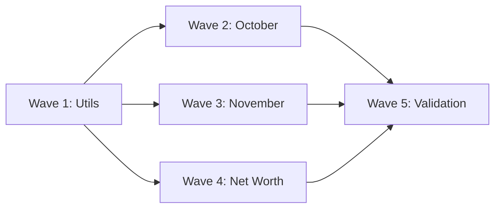

# Extraction Plan: File 4 — Presupuesto Mensual 2025 MEXICO.xlsx

## Summary

Extract ~109 movements (Oct + Nov 2025) and 1 net worth snapshot from the Mexico transition file. This is multi-currency (MXN/COP/USD) with currency determined by Medio prefix. Output: JSON files only, no database writes.

**Boundary rule**: Nothing after November 30, 2025. Last actual data point is Nov 27.

---

## 1. Months to Extract

| Month | Date Range | Rows | Notes |
|-------|-----------|------|-------|
| October | 2025-10-30 to 2025-10-31 | ~21 | Partial month, initialization + first transactions |
| November | 2025-11-01 to 2025-11-27 | ~88 | Full month of real data |

**Include**: ALL entries including "init", "quincena" allocations, "diff" adjustments, and zero-amount entries.

**Exclude**: September sheet (initialization-only, establishes starting balances for VOO/cash — not movements).

---

## 2. Account Mapping Proposal

### Excel Prefix → Supabase Account

| Excel Prefix | Currency | Supabase Account | Account ID |
|-------------|----------|-----------------|------------|
| `[NuMX]` | MXN | Nubank MXN | `ed3c9bb2` |
| `[BX]` | MXN | Banamex | `229129a7` |
| `[MXN] Efectivo` | MXN | MXN - Efectivo | `d43c394b` |
| `[Nu]` | COP | Nubank COP | `28c2305d` |
| `[Bancolombia]` | COP | Bancolombia | `da41fa99` |
| `[COP] Efectivo` | COP | COP - Efectivo | `69eae210` |
| `[USD] Efectivo` | USD | USD - Efectivo | `1ad6393a` |
| `Tarjeta de Alimentacion` | MXN | Tarjeta de Alimentos MXN | `35997ca6` |

### Pocket Mapping

| Excel Pocket | Supabase Pocket | Account |
|-------------|----------------|---------|
| `[NuMX] Viajes` | Viajes | Nubank MXN |
| `[NuMX] Para gastar` | *(no match — needs creation or map to Ahorros?)* | Nubank MXN |
| `[NuMX] Emergencias` | Emergencias | Nubank MXN |
| `[NuMX] Ahorros` | Ahorros | Nubank MXN |
| `[NuMX] Regalos` | *(no match — needs creation)* | Nubank MXN |
| `[NuMX] Fijos` | *(no match — fixed expenses pocket)* | Nubank MXN |
| `[BX] Ahorros` | Ahorros | Banamex |
| `[BX] Para gastar` | Para gastar | Banamex |
| `[BX] Viajes` | *(no match — needs creation)* | Banamex |
| `[BX] Emergencias` | Emergencias | Banamex |
| `[BX] Fijos` | *(no match — fixed expenses pocket)* | Banamex |
| `[Nu] Ahorros` | Ahorros | Nubank COP |
| `[Nu] Viajes` | *(no match — needs creation)* | Nubank COP |
| `[Nu] Emergencias` | *(no match — needs creation)* | Nubank COP |
| `[Bancolombia] Ahorros` | Ahorros | Bancolombia |
| `[Bancolombia] Para gastar` | Para gastar | Bancolombia |
| `[Bancolombia] Viajes` | *(no match — needs creation)* | Bancolombia |

**Note**: Pockets marked "no match" will be included in the JSON with their original names. The user decides whether to create them or remap before upload.

---

## 3. Currency Determination Rules

Priority-ordered rules applied to the `medio` field:

```
1. starts with "[NuMX]"         → MXN
2. starts with "[BX]"           → MXN
3. starts with "[MXN]"          → MXN
4. equals "Tarjeta de Alimentacion" → MXN
5. starts with "[Nu]"           → COP  (MUST check AFTER [NuMX])
6. starts with "[Bancolombia]"  → COP
7. starts with "[COP]"          → COP
8. equals "Nequi"              → COP
9. equals "CDT"                → COP
10. starts with "[USD]"         → USD
11. equals "VOO"               → USD
12. equals "VOO SHARES"        → USD (special: share count, not money)
13. medio is null              → UNKNOWN (flag for manual review)
```

**Critical**: Rule 5 (`[Nu]`) must be checked AFTER rule 1 (`[NuMX]`) to avoid false matches.

### Null Medio Handling

Three entries have null medio in November Gastos:
- `1,048,000 "a banamex"` — likely COP (amount magnitude confirms)
- `834 "de merado a ahorros"` — ambiguous (could be MXN)

Strategy: Output with `"currency": "UNKNOWN"` and `"needs_review": true` flag.

---

## 4. Section Handling

### Column Layout (October & November)

```
Section          | Col Start | Col End | Columns Used
-----------------+-----------+---------+-------------
Gastos           | 0         | 4       | date, amount, description, medio, (unused)
Ingresos         | 5         | 9       | date, amount, description, medio, (unused)
Gastos Fijos     | 10        | 14      | date, amount, description, category, (unused)
Ingresos Fijos   | 15        | 18      | date, amount, description, category
```

### Section → Movement Type Mapping

| Section | `type` | `is_fixed` | Currency Source |
|---------|--------|-----------|----------------|
| Gastos | `expense` | `false` | From medio prefix |
| Ingresos | `income` | `false` | From medio prefix |
| Gastos Fijos | `expense` | `true` | Always MXN (category-based, no medio) |
| Ingresos Fijos | `income` | `true` | Always MXN (category-based, no medio) |

### Row Parsing Rules

- Row 0: empty
- Row 1: section headers (skip)
- Row 2: empty separator (skip)
- Row 3+: data rows
- Stop when: all 4 fields in a row are null/empty
- A row with null date but valid amount/description: **include** (mark `date: null`)

---

## 5. Net Worth Snapshots

### Source: Resumen Sheet, Panel 1 (cols 0-2)

Extract one snapshot dated **2025-11-30** (end of November, the boundary month):

```json
{
  "date": "2025-11-30",
  "source_file": "Presupuesto Mensual 2025 MEXICO.xlsx",
  "source_sheet": "Resumen",
  "balances": {
    "COP": 58145100,
    "MXN": 6818.3,
    "USD": 24578.18
  },
  "exchange_rates": {
    "USD_to_COP": 3679.59,
    "MXN_to_COP": 212.41
  },
  "total_in_COP": 150030925.4,
  "breakdown": {
    "COP": {
      "Bancolombia": 58144400,
      "COP Efectivo": 0,
      "Nubank COP": 700
    },
    "MXN": {
      "Nubank MXN": 507.3,
      "Banamex": 6311,
      "MXN Efectivo": 0
    },
    "USD": {
      "Inversiones (VOO)": 24032.18,
      "USD Efectivo": 546
    }
  }
}
```

---

## 6. Boundary Rule

**Hard cutoff: November 30, 2025.**

- Last actual transaction in data: 2025-11-27
- No December data exists (sheet is empty placeholder)
- The finance app took over in December 2025
- Snapshot date set to 2025-11-30 as end-of-month marker

Validation check: reject any date >= 2025-12-01.

---

## 7. Data Quality Issues to Handle

| Issue | Occurrences | Strategy |
|-------|-------------|----------|
| Null medio | 3 rows in Nov Gastos/Ingresos | Set `currency: "UNKNOWN"`, add `needs_review: true` |
| Null date | ~4 rows in Nov | Include with `date: null`, add `needs_review: true` |
| Null category (Gastos Fijos) | ~25 uber rides in Nov | Infer `"TRANSPORTE"` from description containing "uber"/"ofi" |
| Double space `[Bancolombia]  Para gastar` | Multiple rows | Normalize: trim and collapse whitespace after `]` |
| Typos in descriptions | Various ("meracdo", "florar") | Preserve as-is (user can fix during review) |
| Zero-amount entries | GYM, CREMAS, VERO in Oct | Include (they represent allocated-but-unused categories) |
| "VOO SHARES" medio | 1 row in Sep | Skip (September excluded; this is share count not money) |

---

## 8. Output Format

### Movement JSON

```json
{
  "type": "expense|income",
  "amount": 467,
  "currency": "MXN|COP|USD|UNKNOWN",
  "description": "arreglo flores",
  "date": "2025-11-01",
  "category": null,
  "account_name": "[NuMX] Para gastar",
  "is_fixed": false,
  "source_sheet": "November",
  "source_section": "Gastos",
  "needs_review": false
}
```

For fixed expenses (Gastos Fijos / Ingresos Fijos):
```json
{
  "type": "expense",
  "amount": 60,
  "currency": "MXN",
  "description": "uber ofi",
  "date": "2025-11-03",
  "category": "TRANSPORTE",
  "account_name": null,
  "is_fixed": true,
  "source_sheet": "November",
  "source_section": "Gastos Fijos",
  "needs_review": false
}
```

### Output Files

```
.agents/resources/output/file4/
├── movements-october.json      # All October movements
├── movements-november.json     # All November movements
├── net-worth-snapshot.json     # End-of-Nov snapshot
├── validation-report.json      # Counts, flags, issues
└── account-mapping.json        # Proposed prefix → account mapping
```

---

## 9. Coder Task Breakdown

### Wave 1: Shared Utilities

**File**: `scripts/extract-file4/utils.ts`

**Scope**:
- Excel serial date → ISO string converter: `(serial - 25569) * 86400000`
- Currency determination function (the 13-rule priority list from Section 3)
- Medio normalizer (collapse double spaces, trim after `]`)
- Category inferrer for null-category Gastos Fijos (if description contains "uber" or "ofi" → "TRANSPORTE")
- Row parser: given a row array and column offset, extract {date, amount, description, medio_or_category}
- Section parser: given sheet data, section config (col start, col count, type), return parsed rows
- Validation: reject dates >= 2025-12-01, flag null dates/medios

**Dependencies**: `xlsx` package (already used in prior extraction scripts)

**Output**: No files — this is a library module imported by Waves 2-4.

---

### Wave 2: Extract October

**File**: `scripts/extract-file4/extract-october.ts`

**Scope**:
- Read `Presupuesto Mensual 2025 MEXICO.xlsx`, sheet "October"
- Parse all 4 sections using column offsets: Gastos(0-4), Ingresos(5-9), GastosFijos(10-14), IngresosFijos(15-18)
- Apply currency determination to each row
- Apply date validation (must be Oct 2025, reject anything else)
- Write `output/file4/movements-october.json`

**Expected output**: ~21 movements (1 gasto + 6 ingresos + 0 gastos fijos + 14 ingresos fijos)

**Key edge cases**:
- All Ingresos Fijos are "quincena" allocations on 2025-10-30 — include all, even zero-amount
- Large COP amounts in Ingresos (29M, 12.3M, 10M) — currency from `[Bancolombia]` prefix

---

### Wave 3: Extract November

**File**: `scripts/extract-file4/extract-november.ts`

**Scope**:
- Read same file, sheet "November"
- Parse all 4 sections (same column offsets as October)
- Apply currency determination
- Handle null medios: set `currency: "UNKNOWN"`, `needs_review: true`
- Handle null dates: include row, set `date: null`, `needs_review: true`
- Handle null categories in Gastos Fijos: infer "TRANSPORTE" where description matches uber/ofi pattern
- Normalize double-space in `[Bancolombia]  Para gastar`
- Write `output/file4/movements-november.json`

**Expected output**: ~88 movements (33 gastos + 10 ingresos + 44 gastos fijos + 1 ingreso fijo)

**Key edge cases**:
- Mixed currencies in Gastos section (MXN and COP entries interleaved)
- 3 null-medio entries need flagging
- ~4 null-date entries need flagging
- ~25 uber rides in Gastos Fijos with null category

---

### Wave 4: Net Worth Snapshot

**File**: `scripts/extract-file4/extract-net-worth.ts`

**Scope**:
- Read "Resumen" sheet
- Extract Panel 1 totals (cols 0-2): COP total, MXN total, USD total
- Extract Panel 2 breakdown (cols 3-7): per-account balances
- Extract Panel 5 exchange rates (cols 28-29): USD→COP, MXN→COP
- Compose snapshot object with date 2025-11-30
- Write `output/file4/net-worth-snapshot.json`

**Key details**:
- Resumen is a dashboard sheet (30 cols, ~1991 rows) — need to locate specific cells by scanning for known labels
- Panel 1 starts near row 0-1 with "Totales:" label
- Exchange rates are in cols 28-29 with labels "USD" and "MXN"
- All MXN values in Resumen are in native MXN (not converted)

---

### Wave 5: Validation

**File**: `scripts/extract-file4/validate.ts`

**Scope**:
- Read all output JSON files from `output/file4/`
- Count movements per month, per section, per currency
- Verify expected counts: Oct ~21, Nov ~88
- List all `needs_review: true` entries
- Check no dates >= 2025-12-01
- Check no negative amounts (except TRANSPORTE balance which is -35.7 in fixed expenses saved)
- Verify currency distribution makes sense (MXN amounts < 100,000; COP amounts can be millions)
- Write `output/file4/validation-report.json`

**Validation report format**:
```json
{
  "total_movements": 109,
  "by_month": {"October": 21, "November": 88},
  "by_section": {"Gastos": 34, "Ingresos": 16, "Gastos Fijos": 44, "Ingresos Fijos": 15},
  "by_currency": {"MXN": 70, "COP": 30, "USD": 0, "UNKNOWN": 9},
  "needs_review": [...],
  "date_violations": [],
  "warnings": [...]
}
```

Also write `output/file4/account-mapping.json` with the proposed mapping table from Section 2.

---

## 10. Execution Order



Waves 2, 3, 4 can run in parallel after Wave 1 completes. Wave 5 depends on all prior outputs.

---

## 11. Key Differences from Previous Files

| Aspect | Files 1-3 (Colombia) | File 4 (Mexico) |
|--------|---------------------|-----------------|
| Currency | Single (COP) | Multi (MXN+COP+USD) |
| Currency field in output | Not needed | Required |
| Fixed expenses currency | COP | Always MXN |
| Account prefixes | `[Nu]`, `[Bancolombia]` | `[NuMX]`, `[BX]`, `[Nu]`, `[Bancolombia]` |
| Prefix collision risk | None | `[Nu]` vs `[NuMX]` — order matters |
| Null medios | Rare | 3 occurrences |
| Double-space issue | No | `[Bancolombia]  Para gastar` |
| Months of data | 12+ months | 2 months only |
