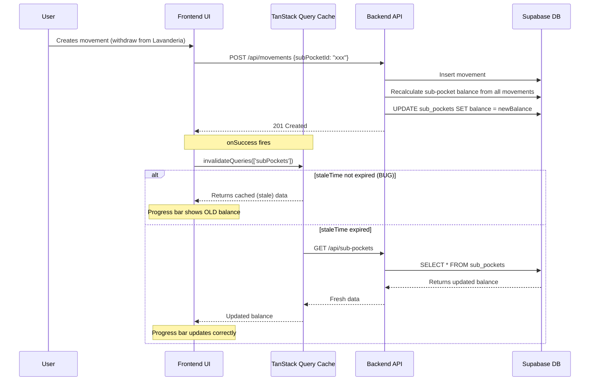

# Fixed Expense Progress Bug — Root Cause Analysis

## Summary

The fixed expense progress indicator doesn't update after movements because of **two compounding issues**:

1. **Frontend cache invalidation gaps** — `applyPendingMovement` and `markAsPending` mutations never invalidate `['subPockets']`, even though the backend correctly recalculates sub-pocket balances.
2. **Aggressive staleTime** — `useSubPocketsQuery` has a 10-minute `staleTime`, so even when invalidation fires correctly (e.g., `createMovement` with `subPocketId`), the UI may still serve stale data if the query was recently fetched.

The backend is correct. The bug is entirely frontend.

---

## Root Cause

### How progress is calculated

```
progress = (subPocket.balance / subPocket.valueTotal) * 100
isFullyFunded = subPocket.balance >= subPocket.valueTotal
```

Both `FixedExpensesSummary`, `FixedObligationsWidget`, and `StitchGroupCard` read `subPocket.balance` directly from the TanStack Query cache (`['subPockets']` key).

### How balance should update

When a movement targets a sub-pocket:
1. Backend `CreateMovementUseCase` recalculates balance from all movements and persists it to `sub_pockets.balance`
2. Frontend `useMovementMutations.createMovement.onSuccess` invalidates `['subPockets']` **only if `variables.subPocketId` is truthy**
3. `useSubPocketsQuery` refetches, gets new balance, UI updates

### Where it breaks

| Mutation | Invalidates `['subPockets']`? | Backend updates sub-pocket balance? |
|----------|-------------------------------|-------------------------------------|
| `createMovement` (with subPocketId) | Yes ✓ | Yes ✓ |
| `createMovement` (without subPocketId) | No | No (correct) |
| `updateMovement` (with subPocketId in updates) | Yes ✓ | Yes ✓ |
| `applyPendingMovement` | **No ✗** | **Yes** (if movement has subPocketId) |
| `markAsPending` | **No ✗** | **Yes** (if movement has subPocketId) |
| `deleteMovement` | Yes ✓ | Yes ✓ |
| `batchCreateMovements` | **Not via mutation hook** | Yes |

The primary bug path: **user creates a movement against a sub-pocket (e.g., withdraws from "Lavanderia"), the backend updates the balance, but the frontend doesn't refetch because:**

1. If the movement was created correctly with `subPocketId`, invalidation fires — but the 10-minute `staleTime` may prevent an actual refetch if the data was recently loaded.
2. If the user applies a pending movement or marks one as pending, `['subPockets']` is never invalidated.

**Most likely scenario for the reported bug**: The `staleTime: 1000 * 60 * 10` (10 minutes) on `useSubPocketsQuery` means that even after invalidation, TanStack Query considers the data "fresh" and doesn't refetch. This is the primary culprit.

---

## Data Flow Diagram



---

## The Fix

### Fix 1: Remove staleTime from useSubPocketsQuery (primary fix)

**File**: `frontend/src/hooks/queries/useSubPocketsQuery.ts`

The 10-minute staleTime is too aggressive. Sub-pocket balances change every time a movement is created. Remove it or reduce to 0 so invalidation always triggers a refetch.

```typescript
export const useSubPocketsQuery = () => {
    return useQuery({
        queryKey: ['subPockets'],
        queryFn: () => subPocketService.getAllSubPockets(),
        // Remove staleTime — balance changes with every movement
    });
};
```

### Fix 2: Add missing invalidation to applyPendingMovement and markAsPending

**File**: `frontend/src/hooks/queries/useMovementMutations.ts`

Both `applyPendingMovement` and `markAsPending` change balances on the backend (including sub-pocket balances if the movement has a `subPocketId`). Since we don't have the original movement payload in `onSuccess`, we should conservatively invalidate `['subPockets']`.

```typescript
// In applyPendingMovement onSuccess:
queryClient.invalidateQueries({ queryKey: ['subPockets'] });
broadcastInvalidation([['movements'], ['accounts'], ['pockets'], ['subPockets']]);

// In markAsPending onSuccess:
queryClient.invalidateQueries({ queryKey: ['subPockets'] });
broadcastInvalidation([['movements'], ['accounts'], ['pockets'], ['subPockets']]);
```

### Fix 3 (optional): Add subPockets invalidation to batch create

The `handleBatchSave` in `useMovementSubmit.ts` calls `movementService.batchCreateMovements` directly (not through a mutation hook), so no automatic invalidation happens. After batch save, the page should invalidate all relevant queries. This is a separate issue but worth fixing.

---

## Coder Task Breakdown

### Task 1: Remove staleTime from useSubPocketsQuery
- **File**: `frontend/src/hooks/queries/useSubPocketsQuery.ts`
- **Change**: Remove `staleTime: 1000 * 60 * 10` line
- **Risk**: Slightly more API calls, but sub-pockets are a small dataset
- **Test**: Verify `useSubPocketsQuery` test still passes without staleTime assertion

### Task 2: Add `['subPockets']` invalidation to applyPendingMovement and markAsPending
- **File**: `frontend/src/hooks/queries/useMovementMutations.ts`
- **Change**: Add `queryClient.invalidateQueries({ queryKey: ['subPockets'] })` and include `['subPockets']` in `broadcastInvalidation` for both mutations
- **Test**: Update `useMovementMutations.test.ts` to assert `['subPockets']` is invalidated by these mutations

### Task 3: Verify fix end-to-end
- Create a movement targeting a sub-pocket (e.g., EgresoFijo to Lavanderia)
- Confirm the progress bar in StitchGroupCard updates immediately
- Confirm FixedObligationsWidget on summary page also updates
- Test apply-pending and mark-as-pending flows

### Task 4 (optional): Add invalidation after batch create
- **File**: `frontend/src/hooks/actions/useMovementSubmit.ts`
- **Change**: After `movementService.batchCreateMovements`, manually invalidate `['movements']`, `['accounts']`, `['pockets']`, `['subPockets']` via queryClient
- **Test**: Batch create movements with subPocketId, verify progress updates

---

## Sources

- `frontend/src/hooks/queries/useSubPocketsQuery.ts` — staleTime: 10 minutes
- `frontend/src/hooks/queries/useMovementMutations.ts` — missing invalidation in applyPendingMovement/markAsPending
- `backend/src/modules/movements/application/useCases/CreateMovementUseCase.ts` — correctly recalculates sub-pocket balance
- `backend/src/modules/movements/application/useCases/ApplyPendingMovementUseCase.ts` — correctly recalculates sub-pocket balance
- `frontend/src/components/fixed-expenses/StitchGroupCard.tsx` — reads `expense.balance` for progress
- `frontend/src/utils/fixedExpenseUtils.ts` — `calculateProgress(balance, valueTotal)`
