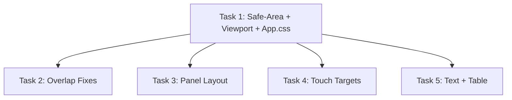

# Mobile Responsiveness — Task Breakdown

**Source**: `.agents/analysis/mobile-responsiveness-audit.md`  
**Date**: 2026-05-21  
**Total tasks**: 5  
**Dependency order**: Task 1 → Tasks 2-5 (parallel)

---

## Task 1: Safe-Area Foundation + Viewport + App.css Cleanup

**Problems addressed**: #1 (pb-safe undefined), #8 (no viewport-fit=cover), #9 (App.css boilerplate)

**Rationale**: The safe-area utility must exist before any component can use it. This task establishes the CSS foundation that all other tasks depend on.

### Files to modify

| File | Change |
|------|--------|
| `frontend/index.html` | Add `viewport-fit=cover` to viewport meta |
| `frontend/src/index.css` | Add safe-area utility classes via `@utility` |
| `frontend/src/App.css` | Delete entirely (confirmed unused — no imports found) |
| `frontend/src/components/layout/BottomNav.tsx` | Replace undefined `pb-safe` with the new utility |
| `frontend/src/components/Layout.tsx` | Adjust bottom padding to account for safe area |

### Implementation details

**index.html** — change the viewport meta to:
```html
<meta name="viewport" content="width=device-width, initial-scale=1.0, viewport-fit=cover" />
```

**index.css** — add at the end (Tailwind v4 `@utility` syntax):
```css
/* Safe area inset utilities for notched devices */
@utility pb-safe {
  padding-bottom: env(safe-area-inset-bottom, 0px);
}

@utility pt-safe {
  padding-top: env(safe-area-inset-top, 0px);
}

@utility mb-safe {
  margin-bottom: env(safe-area-inset-bottom, 0px);
}
```

**App.css** — delete the file. Verification: `grep -r "App.css" frontend/src/` returns zero results (already confirmed). The file contains only Vite template boilerplate (`#root { max-width: 1280px; margin: 0 auto; padding: 2rem; text-align: center; }`) that conflicts with the Layout component.

**BottomNav.tsx** — the bottom bar already uses `pb-safe`:
```tsx
// Line ~143: the class is already there, it just needs the utility to exist.
// No code change needed in this file IF the @utility above is added.
// But verify the class is applied: `pb-safe` on the outer bottom bar div.
```

**Layout.tsx** — the root div uses `pb-20 md:pb-0`. On notched devices the safe area adds extra space below the bottom nav, so content needs additional clearance. Change to:
```tsx
<div className="min-h-screen bg-gray-50 dark:bg-gray-900 transition-colors pb-24 md:pb-0 overflow-x-hidden">
```
(Increased from `pb-20` to `pb-24` to accommodate safe-area inset on top of the nav bar height.)

### Acceptance criteria

- [ ] `viewport-fit=cover` present in index.html meta tag
- [ ] `pb-safe` utility defined in index.css and produces `padding-bottom: env(safe-area-inset-bottom, 0px)` in compiled output
- [ ] `App.css` deleted from the repository
- [ ] No import of `App.css` exists anywhere in `frontend/src/`
- [ ] Bottom nav renders with safe-area padding on notched device (test in Chrome DevTools with iPhone 14 Pro emulation)
- [ ] `npm run build` succeeds with no errors

---

## Task 2: Fixed-Position Overlap Fixes (FloatingStatsBar + Toast)

**Problems addressed**: #2 (FloatingStatsBar overlaps bottom nav), #7 (Toast hidden behind header)

### Files to modify

| File | Change |
|------|--------|
| `frontend/src/components/summary/FloatingStatsBar.tsx` | Add mobile bottom offset to clear bottom nav |
| `frontend/src/components/ToastContainer.tsx` | Offset below mobile header |
| `frontend/src/components/movements/MovementList.tsx` | Verify its stats bar already has `bottom-24 md:bottom-6` (no change expected) |

### Implementation details

**FloatingStatsBar.tsx** — change `bottom-6` to `bottom-24 md:bottom-6`:
```tsx
// Current:
<div className="fixed bottom-6 left-1/2 transform -translate-x-1/2 ...">

// Change to:
<div className="fixed bottom-24 md:bottom-6 left-1/2 transform -translate-x-1/2 ...">
```
This places the bar at 96px from bottom on mobile (clearing the ~80px bottom nav + safe area) and 24px on desktop.

**ToastContainer.tsx** — change `top-4` to `top-20 md:top-4`:
```tsx
// Current:
<div className="fixed top-4 right-4 z-50 flex flex-col gap-2 pointer-events-none max-w-md">

// Change to:
<div className="fixed top-20 md:top-4 right-4 z-50 flex flex-col gap-2 pointer-events-none max-w-md">
```
This places toasts at 80px from top on mobile (clearing the 64px header) and 16px on desktop.

**MovementList.tsx** — read and confirm it already uses `bottom-24 md:bottom-6`. If it does, no change needed. If not, apply the same pattern.

### Acceptance criteria

- [ ] FloatingStatsBar does not overlap with bottom nav on mobile (visible gap between them)
- [ ] Toast notifications appear below the fixed header on mobile (top edge of first toast >= 80px from viewport top)
- [ ] On desktop, FloatingStatsBar remains at `bottom-6` and toasts at `top-4` (no regression)
- [ ] `npm run build` succeeds

---

## Task 3: MovementFormPanel + FloatingPanel Mobile Layout

**Problems addressed**: #3 (MovementFormPanel min-h unusable on short viewports), #6 (FloatingPanel overflows on mobile)

### Files to modify

| File | Change |
|------|--------|
| `frontend/src/components/movements/MovementFormPanel.tsx` | Remove `min-h` constraint, use `dvh` unit |
| `frontend/src/components/FloatingPanel.tsx` | Add max-width constraint and mobile full-screen behavior |

### Implementation details

**MovementFormPanel.tsx** — the form container currently uses:
```
min-h-[calc(100vh-6rem)] max-h-[calc(100vh-6rem)]
```

Change to just a max-height using `dvh` (dynamic viewport height, accounts for mobile browser chrome):
```tsx
// Current (line ~100 area):
className="bg-white dark:bg-gray-800 rounded-2xl shadow-2xl border border-gray-100 dark:border-gray-700 min-h-[calc(100vh-6rem)] max-h-[calc(100vh-6rem)] overflow-y-auto animate-modal-in flex flex-col"

// Change to:
className="bg-white dark:bg-gray-800 rounded-2xl shadow-2xl border border-gray-100 dark:border-gray-700 max-h-[calc(100dvh-6rem)] overflow-y-auto animate-modal-in flex flex-col"
```

Also change the outer wrapper padding for mobile. Currently `p-4 sm:p-6 pt-12`. On mobile the `pt-12` (48px) plus `p-4` (16px bottom) leaves only `100vh - 6rem - 48px` for the form. Reduce top padding on mobile:
```tsx
// Current:
<div className="fixed inset-0 z-50 flex items-start justify-center p-4 sm:p-6 pt-12">

// Change to:
<div className="fixed inset-0 z-50 flex items-start justify-center p-2 sm:p-6 pt-18 sm:pt-12">
```
(`pt-18` = 72px on mobile, clearing the 64px header + 8px breathing room; `p-2` gives tighter side margins on mobile.)

**FloatingPanel.tsx** — add `max-w-[calc(100vw-2rem)]` to prevent overflow on narrow screens:
```tsx
// Current:
className={`
  fixed top-20 ${positionClasses} ${width}
  max-h-[calc(100vh-6rem)]
  ...
`}

// Change to:
className={`
  fixed top-20 ${positionClasses} ${width}
  max-w-[calc(100vw-2rem)]
  max-h-[calc(100vh-6rem)]
  ...
`}
```

### Acceptance criteria

- [ ] MovementFormPanel is scrollable on short viewports (iPhone SE landscape, 375x667 portrait) without content being clipped below the fold
- [ ] Removing `min-h` does not cause the panel to collapse when content is short — it should still fill available space via flex
- [ ] FloatingPanel never exceeds viewport width on a 375px screen (no horizontal overflow)
- [ ] Both panels remain visually correct on desktop (no regression)
- [ ] `npm run build` succeeds

---

## Task 4: Touch Target Sizing

**Problems addressed**: #4 (checkboxes 16px, action buttons 28px, bottom nav 40px)

### Files to modify

| File | Change |
|------|--------|
| `frontend/src/components/layout/BottomNav.tsx` | Increase tap area on nav links |
| `frontend/src/components/movements/MovementList.tsx` | Increase checkbox and action button sizes |
| `frontend/src/components/movements/BulkActionsToolbar.tsx` | Verify button sizes (may need increase) |

### Implementation details

**BottomNav.tsx** — bottom bar links currently use `p-2` with `w-6 h-6` icons (~40px total). Increase to meet 44px minimum:
```tsx
// Current (each Link in the bottom bar):
className="flex flex-col items-center gap-1 p-2 rounded-lg ..."

// Change to:
className="flex flex-col items-center gap-0.5 px-3 py-2.5 rounded-lg ..."
```
This gives ~44px height (10px top + 24px icon + 10px bottom) and wider horizontal tap area.

Also for the Menu button at the bottom:
```tsx
// Current:
className="flex flex-col items-center gap-1 p-2 rounded-lg ..."

// Change to:
className="flex flex-col items-center gap-0.5 px-3 py-2.5 rounded-lg ..."
```

**MovementList.tsx** — find the checkbox rendering and increase its size:
```tsx
// Find instances of w-4 h-4 on checkboxes and change to:
className="w-5 h-5 min-w-[44px] min-h-[44px] ..."
// OR wrap in a larger tap target:
// The checkbox input itself can stay w-5 h-5 but wrap in a div with min-w-[44px] min-h-[44px] flex items-center justify-center
```

For action buttons (edit/delete icons), find `size="sm"` buttons with `w-4 h-4` icons:
```tsx
// Ensure the button wrapper has at least p-2.5 (giving 44px with a 20px icon):
className="p-2.5 rounded-lg ..." // with w-5 h-5 icons
```

**BulkActionsToolbar.tsx** — verify buttons meet 44px. If they use `size="sm"`, change to default size or add explicit padding.

### Acceptance criteria

- [ ] Bottom nav link tap targets are >= 44px in both dimensions (verify with Chrome DevTools element inspector)
- [ ] Checkboxes in MovementList have a tappable area >= 44x44px (the visual checkbox can be smaller, but the interactive area must meet the threshold)
- [ ] Edit/delete action buttons on movement rows have tappable area >= 44x44px
- [ ] No visual layout breakage — buttons should not look oversized or misaligned
- [ ] `npm run build` succeeds

---

## Task 5: Text Readability + Table Column Fix

**Problems addressed**: #5 (text-[10px] in 17 instances), #10 (FixedExpensesSummary columns compress)

### Files to modify

| File | Instances | Change |
|------|-----------|--------|
| `frontend/src/components/summary/FixedExpensesSummary.tsx` | 7 | Replace `text-[10px]` with `text-[11px]`; add `min-w` to table |
| `frontend/src/components/accounts/AccountCard.tsx` | 3 | Replace `text-[10px]` with `text-[11px]` |
| `frontend/src/components/layout/BottomNav.tsx` | 2 | Replace `text-[10px]` with `text-[11px]` |
| `frontend/src/components/reminders/MarkAsPaidModal.tsx` | 2 | Replace `text-[10px]` with `text-[11px]` |
| `frontend/src/components/accounts/CDAccountCard.tsx` | 1 | Replace `text-[10px]` with `text-[11px]` |
| `frontend/src/components/fixed-expenses/FixedExpenseGroupCard.tsx` | 1 | Replace `text-[10px]` with `text-[11px]` |
| `frontend/src/components/movements/AccountContextPanel.tsx` | 1 | Replace `text-[10px]` with `text-[11px]` |

### Implementation details

**All files** — global find-and-replace `text-[10px]` → `text-[11px]`.

Why `text-[11px]` and not `text-xs` (12px): These are badge labels, nav labels, and table metadata where `text-xs` would be too large and break layouts (badges would overflow, nav labels would wrap). 11px is the minimum readable size on mobile retina displays (effective 22px at 2x) and maintains the compact visual intent.

**FixedExpensesSummary.tsx** — additionally, add `min-w-[600px]` to the table to prevent column compression:
```tsx
// Current:
<table className="w-full">

// Change to:
<table className="w-full min-w-[600px]">
```
The parent already has `overflow-x-auto`, so this will trigger horizontal scroll on narrow screens rather than compressing columns to unreadable widths.

### Acceptance criteria

- [ ] Zero instances of `text-[10px]` remain in the codebase (verify with `grep -r "text-\[10px\]" frontend/src/`)
- [ ] All replaced text remains visually compact (badges don't overflow, nav labels don't wrap)
- [ ] FixedExpensesSummary table scrolls horizontally on screens < 600px wide instead of compressing columns
- [ ] Table columns maintain readable widths at all viewport sizes
- [ ] `npm run build` succeeds

---

## Execution Order



**Task 1** must complete first (establishes CSS utilities). Tasks 2-5 are independent and can run in parallel.

---

## Verification Checklist (Post-All-Tasks)

After all 5 tasks complete, verify holistically:

1. `npm run build` — clean build, no errors
2. Chrome DevTools → iPhone 14 Pro emulation → all pages render without overflow
3. Chrome DevTools → iPhone SE emulation → MovementFormPanel is scrollable and usable
4. Bottom nav has visible safe-area padding in notched device emulation
5. No horizontal scroll on any page at 375px width (except intentional table scroll)
6. All interactive elements pass 44px tap target audit (Lighthouse accessibility)
7. `grep -r "text-\[10px\]" frontend/src/` returns zero results
8. `grep -r "App.css" frontend/src/` returns zero results
