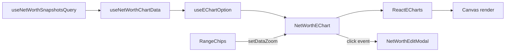

# Net Worth Timeline Widget — ECharts Rebuild Plan

## Summary

Replace the Recharts-based `NetWorthChart.tsx` with an ECharts-powered `NetWorthEChart.tsx`. The widget gains a dataZoom minimap, crosshair tooltip with delta, smart axis labels, conditional dot visibility, range preset chips, click-to-edit, multi-currency mode, and variation % mode — all via declarative ECharts config.

---

## Files to Create / Modify / Delete

| Action | Path | Purpose |
|--------|------|---------|
| **Create** | `frontend/src/components/net-worth/NetWorthEChart.tsx` | New ECharts chart component |
| **Create** | `frontend/src/components/net-worth/RangeChips.tsx` | Range preset chips (1Y, 2Y, All, Custom) |
| **Create** | `frontend/src/components/net-worth/useEChartOption.ts` | Hook that builds the ECharts option object from data |
| **Create** | `frontend/src/components/net-worth/echarts-theme.ts` | Dark theme config matching Tailwind palette |
| **Create** | `frontend/src/components/net-worth/__tests__/NetWorthEChart.test.tsx` | Component tests |
| **Create** | `frontend/src/components/net-worth/__tests__/useEChartOption.test.ts` | Option builder tests |
| **Modify** | `frontend/src/components/net-worth/NetWorthTimelineWidget.tsx` | Wire new chart, replace range controls |
| **Modify** | `frontend/src/hooks/useNetWorthChartData.ts` | Simplify — remove Recharts-specific formatting |
| **Modify** | `frontend/src/components/net-worth/index.ts` | Update exports |
| **Modify** | `frontend/package.json` | Add echarts + echarts-for-react |
| **Delete** | `frontend/src/components/net-worth/NetWorthChart.tsx` | Old Recharts chart |

---

## Data Flow



1. **Query**: `useNetWorthSnapshotsQuery` fetches all snapshots from Supabase
2. **Transform**: `useNetWorthChartData` filters by date range, computes per-currency values, handles variation % transform. Returns `ChartPoint[]` with `{ date: string (ISO), value: number, isAnchor: boolean, snapshotId: string, breakdown?: Record<string, number> }`
3. **Option build**: `useEChartOption` takes the points + view mode + theme and returns a complete ECharts `EChartsOption` object
4. **Render**: `NetWorthEChart` passes the option to `echarts-for-react`, handles events (click, dataZoom)
5. **Controls**: `RangeChips` calls `echartsRef.current.getEchartsInstance().dispatchAction()` to set dataZoom range programmatically

---

## ECharts Option Structure

```typescript
// useEChartOption.ts — full option shape

import type { EChartsOption } from 'echarts';

const buildOption = (params: {
  points: ChartPoint[];
  viewMode: 'total' | 'breakdown';
  currencies: string[];
  primaryCurrency: string;
  showVariation: boolean;
}): EChartsOption => ({

  // --- Grid: chart area with room for minimap below ---
  grid: {
    left: 70,
    right: 20,
    top: 16,
    bottom: 70, // room for dataZoom slider
    containLabel: false,
  },

  // --- X Axis: time type with smart auto-formatting ---
  xAxis: {
    type: 'time',
    axisLine: { lineStyle: { color: '#374151' } },       // gray-700
    axisTick: { lineStyle: { color: '#374151' } },
    axisLabel: {
      color: '#9ca3af',                                   // gray-400
      hideOverlap: true,
      // ECharts auto-formats time axis by zoom level:
      //   zoomed out → "2024", "2025"
      //   medium     → "Jan 2025", "Feb 2025"
      //   zoomed in  → "Jan 15", "Jan 22"
      // Override only if needed:
      formatter: '{MMM} {yyyy}', // default, overridden by dataZoom callback
    },
    splitLine: { show: false },
  },

  // --- Y Axis: value with currency/percentage formatting ---
  yAxis: {
    type: 'value',
    axisLine: { show: false },
    axisTick: { show: false },
    splitLine: { lineStyle: { color: '#1f2937', type: 'dashed' } }, // gray-800
    axisLabel: {
      color: '#9ca3af',
      formatter: (v: number) => {
        if (params.showVariation) return `${v.toFixed(0)}%`;
        if (Math.abs(v) >= 1_000_000) return `$${(v / 1_000_000).toFixed(1)}M`;
        if (Math.abs(v) >= 1_000) return `$${(v / 1_000).toFixed(0)}K`;
        return `$${v.toFixed(0)}`;
      },
    },
  },

  // --- Tooltip: axis trigger with crosshair ---
  tooltip: {
    trigger: 'axis',
    axisPointer: {
      type: 'line',
      lineStyle: { color: '#6b7280', type: 'dashed' },   // gray-500
      snap: true,
    },
    backgroundColor: '#1f2937',                           // gray-800
    borderColor: '#374151',                               // gray-700
    textStyle: { color: '#f3f4f6', fontSize: 13 },        // gray-100
    formatter: (params: any) => {
      // Custom: show date, value, delta from previous point
      const p = Array.isArray(params) ? params[0] : params;
      const idx = p.dataIndex;
      const current = p.value[1];
      const prev = idx > 0 ? points[idx - 1].value : current;
      const delta = current - prev;
      const deltaSign = delta >= 0 ? '+' : '';
      const deltaColor = delta >= 0 ? '#4ade80' : '#f87171';
      // ... build HTML string
    },
  },

  // --- DataZoom: minimap slider ---
  dataZoom: [
    {
      type: 'slider',
      xAxisIndex: 0,
      show: true,
      bottom: 8,
      height: 28,
      borderColor: '#374151',
      backgroundColor: '#111827',                         // gray-900
      fillerColor: 'rgba(59, 130, 246, 0.12)',
      handleStyle: { color: '#3b82f6', borderColor: '#3b82f6' },
      handleSize: '60%',
      dataBackground: {
        lineStyle: { color: '#4b5563' },                  // gray-600
        areaStyle: { color: 'rgba(75, 85, 99, 0.3)' },
      },
      selectedDataBackground: {
        lineStyle: { color: '#3b82f6' },
        areaStyle: { color: 'rgba(59, 130, 246, 0.15)' },
      },
      textStyle: { color: '#9ca3af', fontSize: 11 },
      // Disable mouse wheel zoom — only minimap handles
      zoomOnMouseWheel: false,
      moveOnMouseWheel: false,
      // Initial range: last 60%
      start: 40,
      end: 100,
    },
  ],

  // --- Series: line(s) with conditional dots ---
  series: buildSeries(params),
  // See below for series builder
});
```

### Series Builder

```typescript
function buildSeries(params): SeriesOption[] {
  const { points, viewMode, currencies, showVariation } = params;

  if (viewMode === 'total') {
    return [{
      type: 'line',
      name: 'Net Worth',
      smooth: 0.3,
      data: points.map(p => [p.date, showVariation ? p.variationPct : p.value]),
      lineStyle: { color: '#3b82f6', width: 2 },
      areaStyle: {
        color: {
          type: 'linear', x: 0, y: 0, x2: 0, y2: 1,
          colorStops: [
            { offset: 0, color: 'rgba(59, 130, 246, 0.15)' },
            { offset: 1, color: 'rgba(59, 130, 246, 0)' },
          ],
        },
      },
      // Conditional symbolSize: callback receives (value, params)
      // but we control visibility via dataZoom event handler (see below)
      showSymbol: true,
      symbolSize: 0, // default hidden, updated by dataZoom handler
      // Solid vs hollow: anchor (real snapshot) vs derived (interpolated)
      itemStyle: {
        color: (p: any) => points[p.dataIndex].isAnchor ? '#3b82f6' : 'transparent',
        borderColor: '#3b82f6',
        borderWidth: 2,
      },
      emphasis: {
        itemStyle: { borderWidth: 3, shadowBlur: 8, shadowColor: 'rgba(59,130,246,0.4)' },
      },
      // Enable triggerLineEvent for click detection on line (not just dots)
      triggerLineEvent: true,
    }];
  }

  // Breakdown mode: one line per currency
  const COLORS: Record<string, string> = {
    USD: '#22c55e', EUR: '#3b82f6', GBP: '#a855f7', MXN: '#f97316', COP: '#eab308',
  };

  return currencies.map(currency => ({
    type: 'line',
    name: currency,
    smooth: 0.3,
    data: points.map(p => [p.date, showVariation ? p.breakdownVariation?.[currency] : p.breakdown?.[currency] ?? 0]),
    lineStyle: { color: COLORS[currency] ?? '#8884d8', width: 2 },
    showSymbol: true,
    symbolSize: 0,
    itemStyle: {
      color: COLORS[currency] ?? '#8884d8',
      borderColor: COLORS[currency] ?? '#8884d8',
    },
    triggerLineEvent: true,
  }));
}
```

---

## Component API

### `NetWorthEChart`

```typescript
interface NetWorthEChartProps {
  points: ChartPoint[];
  viewMode: 'total' | 'breakdown';
  currencies: string[];
  primaryCurrency: string;
  showVariation: boolean;
  onPointClick: (snapshotId: string) => void;
  /** Ref exposed so parent can dispatch dataZoom actions */
  chartRef?: React.RefObject<EChartsReactCore | null>;
}
```

### `RangeChips`

```typescript
type RangePreset = '1Y' | '2Y' | 'All' | 'Custom';

interface RangeChipsProps {
  active: RangePreset;
  onChange: (preset: RangePreset) => void;
  /** For Custom: date picker popover */
  customRange?: { start: Date; end: Date };
  onCustomRangeChange?: (range: { start: Date; end: Date }) => void;
}
```

### `ChartPoint` (simplified hook output)

```typescript
interface ChartPoint {
  date: string;           // ISO date string (ECharts time axis parses this)
  value: number;          // net worth in primary currency
  variationPct?: number;  // % change from first visible point
  isAnchor: boolean;      // true = real snapshot, false = interpolated
  snapshotId: string;     // for click-to-edit lookup
  breakdown?: Record<string, number>;          // per-currency values (converted)
  breakdownVariation?: Record<string, number>; // per-currency % change
}
```

---

## echarts-for-react Usage

```typescript
import ReactECharts from 'echarts-for-react';
import type { EChartsReactProps } from 'echarts-for-react';
import * as echarts from 'echarts/core';
import { LineChart } from 'echarts/charts';
import {
  GridComponent,
  TooltipComponent,
  DataZoomComponent,
  LegendComponent,
} from 'echarts/components';
import { CanvasRenderer } from 'echarts/renderers';

// Tree-shake: only register what we use
echarts.use([LineChart, GridComponent, TooltipComponent, DataZoomComponent, LegendComponent, CanvasRenderer]);

// In component:
<ReactECharts
  echarts={echarts}
  option={option}
  style={{ height: '280px', width: '100%' }}
  onEvents={{
    click: handleClick,
    datazoom: handleDataZoom,
  }}
  opts={{ renderer: 'canvas' }}
  ref={chartRef}
/>
```

**Key echarts-for-react APIs used:**
- `ref.current.getEchartsInstance()` — get raw ECharts instance for `dispatchAction`
- `onEvents` prop — event handlers keyed by event name
- `option` prop — when this changes, wrapper calls `setOption` with merge
- `notMerge` prop — set to `true` when switching view modes to avoid stale series

---

## Edge Cases

| Case | Handling |
|------|----------|
| Empty data (0 snapshots) | Widget shows empty state (existing), chart never mounts |
| Single point | Chart renders one dot, minimap shows full bar, no delta in tooltip |
| All same value | Y-axis auto-pads ±5%, variation shows 0% flat line |
| Missing currency in some snapshots | Treat as 0 for that date, don't break the line |
| Custom date range with no data | Show "No data in selected range" message inside chart area |
| Very long date range (5+ years) | dataZoom starts at last 60%, user scrolls back |
| Rapid zoom events | Debounce symbolSize update (100ms) to avoid flicker |

---

## Wave Breakdown

### Wave 1: Install + Basic Chart + Minimap

**Files touched (3):**
1. `frontend/package.json` — add `echarts`, `echarts-for-react`
2. `frontend/src/components/net-worth/NetWorthEChart.tsx` — new component
3. `frontend/src/components/net-worth/NetWorthTimelineWidget.tsx` — swap import

**Scope:**
- `npm install echarts echarts-for-react`
- Create `NetWorthEChart.tsx` with:
  - Tree-shaken ECharts imports (LineChart, Grid, Tooltip, DataZoom, Canvas)
  - Basic option: `xAxis: { type: 'time' }`, `yAxis: { type: 'value' }`, single line series
  - `dataZoom: [{ type: 'slider' }]` with dark styling
  - Props: `points`, `viewMode` (only 'total' for now), `primaryCurrency`
  - Height: 280px (leaves room for header + controls + footer in h-96 card)
- In `NetWorthTimelineWidget.tsx`:
  - Replace `<NetWorthChart ... />` with `<NetWorthEChart ... />`
  - Pass existing `chartData` mapped to `ChartPoint[]` shape
  - Keep all existing controls (they still work, just chart rendering changes)

**ECharts keys used:**
- `xAxis.type: 'time'`
- `yAxis.type: 'value'`, `yAxis.axisLabel.formatter`
- `series[0].type: 'line'`, `.data`, `.lineStyle`, `.areaStyle`
- `dataZoom[0].type: 'slider'`, `.bottom`, `.height`, `.start`, `.end`, `.zoomOnMouseWheel: false`
- `grid.bottom: 70` (make room for slider)

**Verify:** Chart renders with real snapshot data, minimap slider is visible and draggable, no console errors.

---

### Wave 2: Crosshair + Tooltip + Click-to-Edit

**Files touched (2):**
1. `frontend/src/components/net-worth/NetWorthEChart.tsx` — add tooltip, click handler
2. `frontend/src/components/net-worth/NetWorthTimelineWidget.tsx` — wire `onPointClick`

**Scope:**
- Add to option:
  - `tooltip.trigger: 'axis'`
  - `tooltip.axisPointer: { type: 'line', lineStyle: { color, type: 'dashed' }, snap: true }`
  - `tooltip.backgroundColor`, `.borderColor`, `.textStyle` (dark theme colors)
  - `tooltip.formatter`: custom function showing date, formatted value, delta from previous point with color coding
- Add `onEvents.click` handler:
  - Extract `params.dataIndex` → look up `points[dataIndex].snapshotId`
  - Call `onPointClick(snapshotId)`
  - Also set `series[].triggerLineEvent: true` so clicking the line (not just dots) works
- In widget: `onPointClick` resolves snapshot by ID and opens `editModalRef.current?.open(snapshot)`

**ECharts keys used:**
- `tooltip.trigger`, `.axisPointer.type`, `.axisPointer.lineStyle`, `.axisPointer.snap`
- `tooltip.formatter` (function)
- `tooltip.backgroundColor`, `.borderColor`, `.textStyle`
- `series[].triggerLineEvent`
- Event: `'click'` with `params.dataIndex`

**Verify:** Hover shows vertical dashed line snapping to nearest point, tooltip card shows value + delta (green/red), clicking a point opens the edit modal with correct snapshot loaded.

---

### Wave 3: Smart Axis + Conditional Dots + Dark Theme

**Files touched (3):**
1. `frontend/src/components/net-worth/echarts-theme.ts` — dark theme constants
2. `frontend/src/components/net-worth/NetWorthEChart.tsx` — symbolSize callback, axis formatter, theme
3. `frontend/src/components/net-worth/useEChartOption.ts` — extract option builder to dedicated hook

**Scope:**
- Create `echarts-theme.ts`:
  ```typescript
  export const DARK_THEME = {
    bg: 'transparent',
    grid: { borderColor: '#374151' },
    axis: { lineColor: '#374151', labelColor: '#9ca3af', splitColor: '#1f2937' },
    tooltip: { bg: '#1f2937', border: '#374151', text: '#f3f4f6' },
    dataZoom: { bg: '#111827', filler: 'rgba(59,130,246,0.12)', handle: '#3b82f6', border: '#374151' },
    series: { primary: '#3b82f6', gradient: ['rgba(59,130,246,0.15)', 'rgba(59,130,246,0)'] },
  };
  ```
- Smart xAxis labels via `xAxis.axisLabel.formatter` callback:
  - Receives `(value: number)` (timestamp)
  - Determine visible range from dataZoom state
  - If range > 2 years → format as `'YYYY'`
  - If range > 6 months → format as `'MMM YYYY'`
  - Else → format as `'MMM D'`
  - Update formatter on `datazoom` event
- Conditional symbolSize via `datazoom` event handler:
  - Calculate visible point count from dataZoom `start`/`end` percentages
  - If visible points > 12 → `symbolSize: 0` (hidden)
  - If visible points ≤ 12 → `symbolSize: 8`
  - Call `chartInstance.setOption({ series: [{ symbolSize }] })` (merge)
  - Debounce 100ms to avoid flicker
- Solid vs hollow dots:
  - `itemStyle.color` callback: anchor points → solid fill, derived → `'transparent'`
  - `itemStyle.borderColor`: always the line color
  - `itemStyle.borderWidth: 2`
- Extract option building into `useEChartOption.ts` hook for testability

**ECharts keys used:**
- `xAxis.axisLabel.formatter` (function)
- `series[].symbolSize` (number, updated via setOption)
- `series[].itemStyle.color` (function callback)
- `series[].itemStyle.borderColor`, `.borderWidth`
- Event: `'datazoom'` with `params.start`, `params.end`
- `chartInstance.setOption()` for partial merge updates

**Verify:** Zoom out → labels show years/months, dots disappear. Zoom in → labels show dates, dots appear. Anchor dots are solid blue, derived dots are hollow rings. All colors match dark theme.

---

### Wave 4: Range Controls + View Modes

**Files touched (3):**
1. `frontend/src/components/net-worth/RangeChips.tsx` — range preset chips + custom date picker
2. `frontend/src/components/net-worth/NetWorthEChart.tsx` — multi-series support, variation mode
3. `frontend/src/components/net-worth/NetWorthTimelineWidget.tsx` — replace old range buttons with RangeChips, wire view modes

**Scope:**
- Create `RangeChips.tsx`:
  - Chips: `1Y`, `2Y`, `All`, `Custom`
  - Active chip gets `bg-blue-500 text-white`, inactive gets `bg-gray-700 text-gray-300`
  - `1Y` → dispatch `{ type: 'dataZoom', start: <calculated>, end: 100 }`
  - `2Y` → same with 2-year offset
  - `All` → `{ start: 0, end: 100 }`
  - `Custom` → show date picker popover (two date inputs), calculate start/end from dates relative to full data range
  - Programmatic dataZoom: `chartRef.current.getEchartsInstance().dispatchAction({ type: 'dataZoom', dataZoomIndex: 0, start, end })`
- By Currency mode (breakdown):
  - When `viewMode === 'breakdown'`, series array has one line per currency
  - Each line uses `CURRENCY_LINE_COLORS` palette
  - Add `legend` component (bottom of chart, above dataZoom) showing currency names
  - Legend config: `legend: { bottom: 44, textStyle: { color: '#9ca3af' }, itemWidth: 12 }`
- Variation % mode:
  - When `showVariation === true`, transform all values to `((current - firstVisible) / |firstVisible|) * 100`
  - Y-axis formatter switches to `${v.toFixed(0)}%`
  - Tooltip shows both percentage and absolute value
  - First visible point is recalculated on dataZoom change (not first in dataset)
  - Store `dataZoomRange` in component state, recompute variation baseline on change
- Update widget:
  - Remove old `dateRange` state and range buttons
  - Remove old `showVariation` checkbox
  - Add `RangeChips` above chart
  - Keep view mode toggle (Total / By Currency / Rates)
  - Add variation toggle as a small chip next to range chips

**ECharts keys used:**
- `chartInstance.dispatchAction({ type: 'dataZoom', dataZoomIndex: 0, start, end })`
- `legend.bottom`, `.textStyle`, `.itemWidth`
- Multiple `series[]` entries for breakdown mode
- `notMerge: true` on `ReactECharts` when switching between total/breakdown (different series count)

**Verify:** Clicking "1Y" chip zooms to last year, "All" shows everything. Custom opens date picker and zooms to selected range. By Currency shows multiple colored lines with legend. Variation % shows percentage axis and recalculates on zoom.

---

### Wave 5: Cleanup + Tests

**Files touched (4):**
1. `frontend/src/components/net-worth/NetWorthChart.tsx` — **DELETE**
2. `frontend/src/hooks/useNetWorthChartData.ts` — simplify
3. `frontend/src/components/net-worth/index.ts` — update exports
4. `frontend/src/components/net-worth/__tests__/NetWorthEChart.test.tsx` — new tests
5. `frontend/src/components/net-worth/__tests__/useEChartOption.test.ts` — new tests

**Scope:**
- Delete `NetWorthChart.tsx`
- Simplify `useNetWorthChartData.ts`:
  - Remove: `NetWorthTooltipFormatter` type, `tooltipFormatter` return value, Recharts-specific `NetWorthChartDatum` shape, `CHART_CURRENCY_FORMAT_OPTIONS`
  - Keep: date range filtering, currency discovery, variation calculation
  - Output shape becomes `ChartPoint[]` (simpler, ECharts-native)
  - Remove `date-fns/format` usage for chart labels (ECharts handles time formatting)
- Update `index.ts`:
  - Remove `NetWorthChart` export
  - Add `NetWorthEChart` and `RangeChips` exports
- Tests for `NetWorthEChart`:
  - Renders without crashing with empty points array
  - Renders with sample data (mock `ReactECharts` — canvas can't render in jsdom)
  - Click event calls `onPointClick` with correct snapshotId
  - View mode switch triggers `notMerge` re-render
- Tests for `useEChartOption`:
  - Returns valid option object for total mode
  - Returns multiple series for breakdown mode
  - Variation mode transforms values to percentages
  - Single-point data doesn't crash
  - symbolSize logic returns 0 for >12 points, 8 for ≤12

**Verify:** `npm run build` passes (no dead imports), `npm run test` passes, `npm run lint` passes.

---

## Updated Widget Layout (h-96 = 384px budget)

```
┌─────────────────────────────────────────────────┐
│ [TrendingUp] Net Worth Timeline    [Total|Currency|Rates] │  ← 40px header
├─────────────────────────────────────────────────┤
│ [1Y] [2Y] [All] [Custom]          [Δ% toggle]  │  ← 36px controls
├─────────────────────────────────────────────────┤
│                                                 │
│              ECharts Canvas                     │  ← 220px chart
│              (line + crosshair)                 │
│                                                 │
├─────────────────────────────────────────────────┤
│ ▐████████░░░░░░░░░░░░░░░░░░░░░░░░░░░░░░░░░░▌  │  ← 28px minimap
├─────────────────────────────────────────────────┤
│ Latest: May 2026              $45,230,000 COP   │  ← 36px footer
└─────────────────────────────────────────────────┘
                                          Total: ~360px
```

---

## Dependencies

```bash
npm install echarts echarts-for-react --save --prefix frontend
```

- `echarts`: ^5.6.0 (tree-shaken, ~100 kB gz for our imports)
- `echarts-for-react`: ^3.0.2 (thin React wrapper, ~3 kB gz)

Recharts stays for other charts (spending breakdown, budget donut). Only the net worth timeline uses ECharts.

---

## Risk Mitigation

| Risk | Mitigation |
|------|-----------|
| Full echarts bundle imported accidentally | ESLint rule: `no-restricted-imports` banning `import * from 'echarts'` — must use `echarts/core` |
| `echarts-for-react` stale with React 19 | It's a thin ref wrapper (~200 LOC). If issues arise, inline the wrapper. Canvas-based = no React DOM conflicts. |
| dataZoom event spam causing re-renders | Debounce symbolSize updates (100ms). Option object is memoized via `useMemo`. |
| Click handler fires on drag | Check `params.componentType === 'series'` before calling onPointClick |
| Variation baseline shifts on zoom | Recalculate from first *visible* point on every dataZoom event, store in state |
| jsdom can't render canvas in tests | Mock `ReactECharts` component in tests, test option builder separately |
