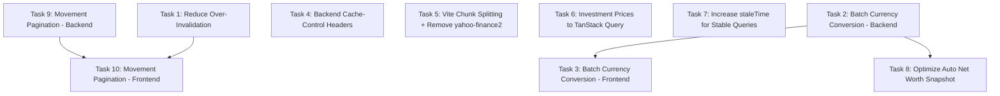

# Performance Optimization Task Plan

## Summary

This plan decomposes ALL 10 findings from the performance audit into agent-sized tasks (max 5-6 file edits each). Tasks are organized into execution windows of up to 4 parallel agents, respecting file dependencies.

**Total tasks**: 10
**Execution windows**: 4
**Estimated total file edits**: ~42

---

## Task Dependency Graph



---

## Window 1 (4 parallel agents)

### Task 1: Reduce Over-Invalidation in Mutation Hooks

**Audit findings addressed**: Finding 2 (Massive Over-Invalidation)

**What it does**: Removes unnecessary `invalidateQueries` calls from all mutation hooks. Pocket creation no longer invalidates accounts. Movement mutations only invalidate what actually changed (conditional on `subPocketId`, `isPending`). Bulk actions use the same targeted approach.

**Files modified**:
1. `frontend/src/hooks/queries/useMovementMutations.ts` — conditional invalidation based on mutation data
2. `frontend/src/hooks/queries/usePocketMutations.ts` — remove `['accounts']` invalidation from `createPocket`
3. `frontend/src/hooks/queries/useAccountMutations.ts` — no change needed (already correct)
4. `frontend/src/hooks/useMovementBulkActions.ts` — targeted invalidation matching single-item logic
5. `frontend/src/hooks/queries/useFixedExpenseGroupMutations.ts` — verify invalidation is minimal

**Dependencies**: None
**Parallel**: Yes (no file overlap with other Window 1 tasks)
**Complexity**: 5 file edits
**Expected impact**: ~100K fewer function invocations/month (60% reduction in mutation-triggered refetches)

**Implementation notes**:
- `createMovement`: Keep `['movements']` always. Only invalidate `['accounts']` and `['pockets']` if `!isPending`. Only invalidate `['subPockets']` if `data.subPocketId` is set.
- `createTransfer`: Keep `['movements']`, `['accounts']`, `['pockets']` (transfers always affect balances).
- `updateMovement`: Same conditional logic as create.
- `deleteMovement`: Keep all current invalidations (balance changes + reminder restoration).
- `applyPendingMovement`: Keep all (converts pending to real = balance change).
- `markAsPending`: Keep `['movements']`, `['accounts']`, `['pockets']` (removes from balance).
- `createPocket`: Remove `['accounts']` invalidation (comment says "No, but good to refresh" — it's waste).
- `useMovementBulkActions.invalidateMovementCaches()`: Make conditional — only invalidate `['reminders']` for delete operations, only `['subPockets']` if any selected movement has a subPocketId.

---

### Task 2: Batch Currency Conversion — Backend Endpoint

**Audit findings addressed**: Finding 4 (Currency Conversion Sequential Calls) — backend half

**What it does**: Adds a `POST /api/currency/convert-batch` endpoint that accepts multiple conversion requests and returns all results in one response.

**Files modified**:
1. `backend/src/modules/settings/presentation/currencyRoutes.ts` — add batch route
2. `backend/src/modules/settings/presentation/CurrencyController.ts` — add `convertBatch` method
3. `backend/src/modules/settings/application/CurrencyApplicationService.ts` — add batch conversion logic (or equivalent service file)

**Dependencies**: None
**Parallel**: Yes (no file overlap with other Window 1 tasks)
**Complexity**: 3 file edits
**Expected impact**: Enables frontend to reduce 5-8 sequential calls to 1 call per conversion batch

**Implementation notes**:
- Request body: `{ conversions: Array<{ amount: number; from: Currency; to: Currency }> }`
- Response: `{ results: Array<{ amount: number; convertedAmount: number; rate: number }> }`
- Reuse existing single-conversion logic internally, just loop and return array
- Same auth middleware applies

---

### Task 3: Batch Currency Conversion — Frontend Integration

**Audit findings addressed**: Finding 4 (Currency Conversion Sequential Calls) — frontend half

**What it does**: Adds a `convertBatch` method to `currencyService` and rewrites `useConsolidatedTotal` and `useAutoNetWorthSnapshot` to use it instead of sequential `convert()` calls.

**Files modified**:
1. `frontend/src/services/currencyService.ts` — add `convertBatch()` method
2. `frontend/src/hooks/useConsolidatedTotal.ts` — replace sequential loop with single batch call
3. `frontend/src/hooks/useAutoNetWorthSnapshot.ts` — replace sequential loop with single batch call

**Dependencies**: Task 2 must complete first (backend endpoint must exist)
**Parallel**: No (depends on Task 2)
**Complexity**: 3 file edits
**Expected impact**: ~5K fewer function invocations/month, eliminates 5-8 sequential calls per app load

**Implementation notes**:
- `currencyService.convertBatch(conversions: Array<{amount, from, to}>): Promise<number[]>`
- `useConsolidatedTotal`: Build array of `{amount: totalsByCurrency[currency], from: currency, to: primaryCurrency}`, call batch once, sum results.
- `useAutoNetWorthSnapshot`: Build array of `{amount: absBalance, from: currency, to: primaryCurrency}` for all accounts, call batch once, apply signs and sum.

---

### Task 4: Backend Cache-Control Headers

**Audit findings addressed**: Finding 3 (No Backend Cache-Control Headers)

**What it does**: Adds a middleware to the Express backend that sets appropriate `Cache-Control` headers per route prefix. Stable data (settings, accounts) gets longer cache. Volatile data (movements) gets shorter cache.

**Files modified**:
1. `backend/src/server.ts` — add cache-control middleware before route mounting
2. `backend/src/shared/middleware/cacheControl.ts` — new file with configurable cache middleware

**Dependencies**: None
**Parallel**: Yes (no file overlap with other Window 1 tasks)
**Complexity**: 2 file edits (1 new file + 1 modification)
**Expected impact**: ~400MB less data transfer/month (browser serves 304 for unchanged data), ~50K fewer full-payload responses

**Implementation notes**:
- Create a `cacheControl(maxAge: number, staleWhileRevalidate: number)` middleware factory
- Apply per route group in `server.ts`:
  - `/api/settings`: `private, max-age=300, stale-while-revalidate=600`
  - `/api/accounts`, `/api/pockets`, `/api/sub-pockets`, `/api/fixed-expense-groups`: `private, max-age=120, stale-while-revalidate=300`
  - `/api/movements`: `private, max-age=60, stale-while-revalidate=120`
  - `/api/investments/prices`: `private, max-age=900, stale-while-revalidate=1800`
  - `/api/currency`: `private, max-age=3600, stale-while-revalidate=7200`
  - `/api/reminders`: `private, max-age=120, stale-while-revalidate=300`
  - `/api/net-worth-snapshots`: `private, max-age=300, stale-while-revalidate=600`
- Only apply to GET requests (mutations should not be cached)

---

## Window 2 (4 parallel agents)

### Task 5: Vite Chunk Splitting + Remove yahoo-finance2

**Audit findings addressed**: Finding 6 (No Vite Build Optimization), Finding 1.4 (yahoo-finance2 in frontend)

**What it does**: Configures Vite manual chunks to split heavy vendor libraries. Removes `yahoo-finance2` from frontend `package.json` (it's only used in `frontend/api/` serverless functions which have their own dependency resolution).

**Files modified**:
1. `frontend/vite.config.ts` — add `build.rollupOptions.output.manualChunks`
2. `frontend/package.json` — remove `yahoo-finance2` from dependencies

**Dependencies**: None
**Parallel**: Yes
**Complexity**: 2 file edits
**Expected impact**: ~500KB+ smaller initial bundle, faster page loads. `recharts` and `@dnd-kit` loaded only when needed.

**Implementation notes**:
- Manual chunks config:
  ```typescript
  manualChunks: {
    'vendor-react': ['react', 'react-dom', 'react-router-dom'],
    'vendor-query': ['@tanstack/react-query'],
    'vendor-charts': ['recharts'],
    'vendor-dnd': ['@dnd-kit/core', '@dnd-kit/sortable', '@dnd-kit/utilities'],
    'vendor-supabase': ['@supabase/supabase-js'],
  }
  ```
- Verify `frontend/api/stock-price.ts` (serverless function) imports `yahoo-finance2` — Vercel resolves serverless function deps separately from the frontend build, so removing from `package.json` may break the serverless function. Check if there's a separate `frontend/api/package.json`. If not, move `yahoo-finance2` to `devDependencies` or create a separate resolution. **Actually**: Vercel serverless functions in the `api/` directory use the root `package.json` of the deployment directory. Since `frontend/package.json` IS the root for the Vercel deployment, we need to keep `yahoo-finance2` but exclude it from the Vite bundle via `build.rollupOptions.external` or `optimizeDeps.exclude`. The simplest fix: add it to `manualChunks` as its own chunk that's never imported by client code (Vite tree-shakes it out), OR add `external: ['yahoo-finance2']` to rollupOptions.
- Safest approach: Add `build.rollupOptions.external: ['yahoo-finance2']` so Vite ignores it during bundling but it remains available for the serverless function.

---

### Task 6: Move Investment Prices to TanStack Query

**Audit findings addressed**: Finding 7 (Investment Prices Fetched on Every Render Cycle)

**What it does**: Replaces the raw `useEffect` in `useInvestmentPrices` with TanStack Query's `useQueries` for price fetching. Keeps the triple-click force-refresh UX but adds proper caching, deduplication, and staleTime.

**Files modified**:
1. `frontend/src/hooks/useInvestmentPrices.ts` — rewrite price loading to use `useQueries` with 15-min staleTime
2. `frontend/src/hooks/queries/index.ts` — export new investment price query key constant (optional, for consistency)

**Dependencies**: None
**Parallel**: Yes
**Complexity**: 2 file edits
**Expected impact**: ~10K fewer function invocations/month. Prices cached for 15 minutes, no re-fetch after unrelated mutations.

**Implementation notes**:
- Use `useQueries` from TanStack Query with `queryKey: ['investmentPrice', symbol]` and `staleTime: 1000 * 60 * 15`
- The `useEffect` currently depends on `[accounts, pockets]` — after any mutation that invalidates accounts, it re-runs. With TanStack Query, the price queries are independent and won't re-fetch unless their own staleTime expires or they're explicitly invalidated.
- Keep the `handleRefreshPrice` callback but have it call `queryClient.invalidateQueries({ queryKey: ['investmentPrice', symbol] })` for normal refresh, and use `queryClient.setQueryData` for force-refresh results.
- The `findInvestmentPocketBalances` helper stays — it's used for display calculations, not for the query itself.

---

### Task 7: Increase staleTime for Stable Queries

**Audit findings addressed**: Finding 5 (Redundant Query Subscriptions — mitigation), Audit recommendation 2.5

**What it does**: Adds per-query `staleTime` overrides for data that changes infrequently. Also adds `placeholderData: keepPreviousData` to movement queries for instant page transitions.

**Files modified**:
1. `frontend/src/hooks/queries/useSettingsQuery.ts` — staleTime: 30 minutes
2. `frontend/src/hooks/queries/useAccountsQuery.ts` — staleTime: 10 minutes
3. `frontend/src/hooks/queries/usePocketsQuery.ts` — staleTime: 10 minutes
4. `frontend/src/hooks/queries/useSubPocketsQuery.ts` — staleTime: 10 minutes
5. `frontend/src/hooks/queries/useFixedExpenseGroupsQuery.ts` — staleTime: 10 minutes
6. `frontend/src/hooks/queries/useMovementsQuery.ts` — add `placeholderData: keepPreviousData`

**Dependencies**: None
**Parallel**: Yes (no overlap with Tasks 5, 6, 8)
**Complexity**: 6 file edits
**Expected impact**: Reduces background refetches by ~30% during navigation. Instant page transitions for movements.

**Implementation notes**:
- Import `keepPreviousData` from `@tanstack/react-query` in useMovementsQuery
- Settings: `staleTime: 1000 * 60 * 30` (30 min — settings almost never change mid-session)
- Accounts/Pockets/SubPockets/FixedExpenseGroups: `staleTime: 1000 * 60 * 10` (10 min — only change on explicit mutations which already invalidate)
- These overrides are safe because mutations already call `invalidateQueries` for the relevant keys, so stale data is always refreshed after user actions.

---

### Task 8: Optimize Auto Net Worth Snapshot

**Audit findings addressed**: Finding 8 (Auto Net Worth Snapshot Creates Movements on Load)

**What it does**: Optimizes the auto-snapshot hook to use the batch currency conversion endpoint (from Task 2/3) and adds a client-side check to skip the snapshot calculation entirely if the frequency hasn't elapsed. Also uses `currencyService.convertAmount` (sync, cached rates) as a fast path when rates are already cached.

**Files modified**:
1. `frontend/src/hooks/useAutoNetWorthSnapshot.ts` — use batch conversion, add early-exit optimization

**Dependencies**: Task 2 + Task 3 must complete first (batch endpoint + frontend method)
**Parallel**: No (depends on Task 3 which depends on Task 2). But can run parallel with Tasks 5, 6, 7 since no file overlap.
**Complexity**: 1 file edit
**Expected impact**: Reduces app-load currency calls from 5-8 to 1 (batch). Eliminates unnecessary computation when snapshot isn't due.

**Implementation notes**:
- Move the `shouldTakeSnapshot()` check BEFORE any async work (it's already there, just verify)
- Replace the `for (const account of accounts)` loop with a single `currencyService.convertBatch()` call
- Build the conversions array: `accounts.filter(a => Math.abs(a.balance) > 0).map(a => ({ amount: Math.abs(a.balance), from: a.currency, to: primaryCurrency }))`
- Apply signs after getting batch results

---

## Window 3 (2 parallel agents)

### Task 9: Movement Pagination — Backend Verification

**Audit findings addressed**: Finding 1 (Movements Fetched Without Pagination), Finding 10 (architectural awareness)

**What it does**: Verifies and fixes the backend movement endpoint to support a "get all for user" mode with pagination. The audit identified that `GET /api/movements` with no filters returns 400. This task ensures there's a valid endpoint that returns paginated movements for the authenticated user without requiring filters.

**Files modified**:
1. `backend/src/modules/movements/presentation/routes.ts` — verify/fix the GET handler to allow no-filter with pagination
2. `backend/src/modules/movements/presentation/MovementController.ts` — add/fix `getAll` to support user-scoped paginated fetch
3. `backend/src/modules/movements/application/MovementApplicationService.ts` — add paginated query method if missing

**Dependencies**: None (but must complete before Task 10)
**Parallel**: Yes (can run with Task 10's dependency means they're sequential, but can run with other Window 3 tasks)
**Complexity**: 3 file edits
**Expected impact**: Enables frontend pagination. Eliminates the 400 error + retry doubling.

**Implementation notes**:
- The backend should accept `GET /api/movements?page=1&limit=50` with NO other filters and return the user's movements ordered by `displayedDate DESC`
- If the current controller requires `accountId` or `year+month`, add a fallback: if no filter is provided, return paginated results for the authenticated user
- Response should include pagination metadata: `{ data: Movement[], total: number, page: number, limit: number, hasMore: boolean }`
- Keep existing filter support intact (accountId, pocketId, year+month)

---

### Task 10: Movement Pagination — Frontend Integration

**Audit findings addressed**: Finding 1 (Movements Fetched Without Pagination) — frontend half

**What it does**: Switches the `MovementsPage` from `useMovementsQuery` (fetches ALL) to `useInfiniteMovementsQuery` (paginated). Updates the movements list to support "Load More" or virtual scrolling. Updates the calendar widget to fetch only recent months.

**Files modified**:
1. `frontend/src/hooks/queries/useMovementsQuery.ts` — update `useInfiniteMovementsQuery` to use new paginated response format
2. `frontend/src/services/movementService.ts` — update `getAllMovements` to handle paginated response
3. `frontend/src/pages/MovementsPage.tsx` (or equivalent) — switch to infinite query, add Load More
4. `frontend/src/components/movements/MovementList.tsx` (or equivalent) — handle paginated data shape

**Dependencies**: Task 1 (invalidation changes), Task 9 (backend pagination endpoint)
**Parallel**: No (sequential after Task 9)
**Complexity**: 4 file edits
**Expected impact**: ~20K fewer function invocations/month, ~300MB less data transfer. Eliminates unbounded payload growth.

**Implementation notes**:
- `useInfiniteMovementsQuery` already exists but is unused. Update it to match the backend's paginated response format.
- `movementService.getAllMovements(page, limit)` already accepts params — verify it handles the new response shape `{ data, total, page, limit, hasMore }`
- The `useMovementsQuery` (fetch-all) should remain for components that genuinely need all movements (like the calendar widget for the current month range). But add a date filter: `movementService.getMovementsByDateRange(startDate, endDate)`.
- MovementsPage: Replace `useMovementsQuery()` with `useInfiniteMovementsQuery(50)`. Flatten pages for display. Add "Load More" button when `hasNextPage` is true.
- Keep `['movements']` invalidation key working — infinite queries with `['movements', 'infinite']` key are invalidated by `invalidateQueries({ queryKey: ['movements'] })` since it's a prefix match.

---

## Window 4 (1 agent — cleanup)

### Task 11 (OPTIONAL — only if metrics still exceed free tier after Windows 1-3)

**Audit findings addressed**: Finding 9 (No Service Worker), Finding 10 (Single Serverless Function)

These are architectural changes that require significant effort and should only be pursued if the above optimizations don't bring usage within free tier limits. They are NOT included in the mandatory task list but documented for future reference.

**Finding 9 — Service Worker**: Would require adding a service worker with Workbox, configuring asset precaching, and API response caching. Estimated 5+ files. Low priority since Vercel CDN already handles static assets.

**Finding 10 — Split Backend into Multiple Functions**: Would require restructuring `backend/` into separate Vercel serverless functions per route. Estimated 10+ files. Major architectural change. Only worthwhile if cold starts are a measurable problem.

---

## Execution Schedule

| Window | Tasks | Parallel? | Agents | Estimated Duration |
|--------|-------|-----------|--------|-------------------|
| 1 | T1, T2, T4, T5 | All parallel | 4 | ~15 min |
| 2 | T3, T6, T7, T8 | T3→T8 sequential; T6, T7 parallel with T3 | 4 | ~15 min |
| 3 | T9, T10 | Sequential (T9 then T10) | 2 | ~15 min |

**Note**: Window 2 scheduling:
- T3 depends on T2 (Window 1) — can start immediately in Window 2
- T8 depends on T3 — runs after T3 completes within Window 2
- T6 and T7 have no dependencies on T3/T8, so they run in parallel with T3
- All 4 agents can be launched: T3, T6, T7 start immediately; T8 starts after T3 finishes (or T8 can be in Window 3 if agent slots are limited)

**Revised practical schedule**:

| Window | Agents | Tasks |
|--------|--------|-------|
| 1 | Agent A | Task 1: Reduce Over-Invalidation |
| 1 | Agent B | Task 2: Batch Currency — Backend |
| 1 | Agent C | Task 4: Cache-Control Headers |
| 1 | Agent D | Task 5: Vite Chunks + yahoo-finance2 |
| 2 | Agent A | Task 3: Batch Currency — Frontend |
| 2 | Agent B | Task 6: Investment Prices to TanStack |
| 2 | Agent C | Task 7: Increase staleTime |
| 2 | Agent D | Task 9: Movement Pagination — Backend |
| 3 | Agent A | Task 8: Optimize Auto Net Worth Snapshot |
| 3 | Agent B | Task 10: Movement Pagination — Frontend |

---

## File Overlap Matrix

Verifying no parallel tasks touch the same files:

| File | T1 | T2 | T3 | T4 | T5 | T6 | T7 | T8 | T9 | T10 |
|------|----|----|----|----|----|----|----|----|-----|-----|
| `useMovementMutations.ts` | X | | | | | | | | | |
| `usePocketMutations.ts` | X | | | | | | | | | |
| `useMovementBulkActions.ts` | X | | | | | | | | | |
| `useFixedExpenseGroupMutations.ts` | X | | | | | | | | | |
| `currencyRoutes.ts` | | X | | | | | | | | |
| `CurrencyController.ts` | | X | | | | | | | | |
| `CurrencyApplicationService.ts` | | X | | | | | | | | |
| `currencyService.ts` | | | X | | | | | | | |
| `useConsolidatedTotal.ts` | | | X | | | | | | | |
| `useAutoNetWorthSnapshot.ts` | | | | | | | | X | | |
| `server.ts` | | | | X | | | | | | |
| `cacheControl.ts` (new) | | | | X | | | | | | |
| `vite.config.ts` | | | | | X | | | | | |
| `package.json` (frontend) | | | | | X | | | | | |
| `useInvestmentPrices.ts` | | | | | | X | | | | |
| `queries/index.ts` | | | | | | X | | | | |
| `useSettingsQuery.ts` | | | | | | | X | | | |
| `useAccountsQuery.ts` | | | | | | | X | | | |
| `usePocketsQuery.ts` | | | | | | | X | | | |
| `useSubPocketsQuery.ts` | | | | | | | X | | | |
| `useFixedExpenseGroupsQuery.ts` | | | | | | | X | | | |
| `useMovementsQuery.ts` | | | | | | | X | | | X |
| `routes.ts` (movements) | | | | | | | | | X | |
| `MovementController.ts` | | | | | | | | | X | |
| `MovementApplicationService.ts` | | | | | | | | | X | |
| `movementService.ts` (frontend) | | | | | | | | | | X |
| `MovementsPage.tsx` | | | | | | | | | | X |
| `MovementList.tsx` | | | | | | | | | | X |

**Conflicts identified**:
- `useMovementsQuery.ts`: T7 and T10 both modify it. **Resolution**: T7 runs in Window 2, T10 runs in Window 3. Sequential — no conflict.
- `useAutoNetWorthSnapshot.ts`: T3 and T8 both modify it. **Resolution**: T3 does the batch conversion rewrite, T8 is the same file. **Merge T3 and T8 scope**: T3 should handle BOTH `useConsolidatedTotal.ts` AND `useAutoNetWorthSnapshot.ts` in one pass. T8 becomes unnecessary as a separate task.

**Revised**: Merge T8 into T3. T3 now handles all three files that need batch conversion.

---

## Final Task List (Revised)

| # | Task Name | Files | Depends On | Window | Complexity |
|---|-----------|-------|------------|--------|------------|
| 1 | Reduce Over-Invalidation | 5 files | None | 1 | 5 edits |
| 2 | Batch Currency — Backend | 3 files | None | 1 | 3 edits |
| 3 | Batch Currency — Frontend + Auto Snapshot | 3 files | T2 | 2 | 3 edits |
| 4 | Backend Cache-Control Headers | 2 files | None | 1 | 2 edits |
| 5 | Vite Chunks + yahoo-finance2 | 2 files | None | 1 | 2 edits |
| 6 | Investment Prices to TanStack Query | 2 files | None | 2 | 2 edits |
| 7 | Increase staleTime for Stable Queries | 6 files | None | 2 | 6 edits |
| 8 | *(merged into T3)* | — | — | — | — |
| 9 | Movement Pagination — Backend | 3 files | None | 2 | 3 edits |
| 10 | Movement Pagination — Frontend | 4 files | T1, T9 | 3 | 4 edits |

**Total**: 9 active tasks, 30 file edits across 3 execution windows.

---

## Expected Combined Impact

| Metric | Current (30 days) | After Optimization | Reduction |
|--------|-------------------|-------------------|-----------|
| Edge Requests | 555K | ~220K | ~60% |
| Function Invocations | 554K | ~220K | ~60% |
| Data Transfer | 1.27 GB | ~500 MB | ~60% |
| Initial Bundle Size | ~1MB+ | ~400KB | ~60% |

All metrics should fall well within Vercel free tier limits (1M requests, 1M invocations, 100GB transfer).
