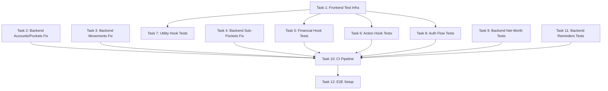

# Testing Gaps — Task Breakdown

**Created**: 2026-05-21
**Source**: `.agents/analysis/testing-gaps-audit.md`
**Total Tasks**: 12

---

## Task Dependency Graph



**Execution waves**:
- Wave 1 (parallel): Tasks 1, 2, 3, 4, 9, 11
- Wave 2 (parallel, depends on Task 1): Tasks 5, 6, 7, 8
- Wave 3 (depends on all above): Task 10
- Wave 4 (depends on Task 10): Task 12

---

## Task 1: Frontend Test Infrastructure Fix

**Priority**: P0 — Foundational (blocks all frontend test tasks)
**Files to modify** (5):
- `frontend/src/test/setup.ts`
- `frontend/src/test/testUtils.tsx`
- `frontend/src/test/__mocks__/apiClient.ts` (new)
- `frontend/src/test/__mocks__/supabase.ts` (new)
- `frontend/vitest.config.ts`

**Problem**: 5 test files crash because `apiClient.ts` imports `lib/supabase.ts` which throws `"Missing Supabase environment variables"` at module load time. The `testUtils.tsx` wrapper only provides `BrowserRouter` — no `QueryClientProvider` or `AuthContext`.

**Implementation**:

1. Create `frontend/src/test/__mocks__/supabase.ts` — mock the `supabase` export so `apiClient` never hits the env var check:
```typescript
export const supabase = {
  auth: {
    getSession: vi.fn().mockResolvedValue({ data: { session: { access_token: 'test-token' } } }),
    onAuthStateChange: vi.fn().mockReturnValue({ data: { subscription: { unsubscribe: vi.fn() } } }),
    signUp: vi.fn(),
    signInWithPassword: vi.fn(),
    signOut: vi.fn(),
  },
  from: vi.fn().mockReturnValue({
    select: vi.fn().mockReturnThis(),
    insert: vi.fn().mockReturnThis(),
    update: vi.fn().mockReturnThis(),
    delete: vi.fn().mockReturnThis(),
    eq: vi.fn().mockReturnThis(),
    single: vi.fn(),
  }),
};
```

2. Create `frontend/src/test/__mocks__/apiClient.ts` — mock the `apiClient` export with vi.fn() for all methods (get, post, put, delete, healthCheck).

3. Update `vitest.config.ts` — add module alias resolution so `../lib/supabase` resolves to the mock:
```typescript
resolve: {
  alias: {
    '../lib/supabase': path.resolve(__dirname, 'src/test/__mocks__/supabase.ts'),
  }
}
```
Or use `vi.mock` in setup.ts with a global auto-mock for `src/lib/supabase`.

4. Update `frontend/src/test/testUtils.tsx` — wrap with `QueryClientProvider` and `AuthContext`:
```typescript
import { QueryClient, QueryClientProvider } from '@tanstack/react-query';
import { AuthProvider } from '../contexts/AuthContext';

const createTestQueryClient = () => new QueryClient({
  defaultOptions: { queries: { retry: false, gcTime: 0 } },
});

const AllTheProviders = ({ children }) => {
  const queryClient = createTestQueryClient();
  return (
    <QueryClientProvider client={queryClient}>
      <AuthProvider>
        <BrowserRouter>{children}</BrowserRouter>
      </AuthProvider>
    </QueryClientProvider>
  );
};
```

5. Update `frontend/src/test/setup.ts` — add the global `vi.mock('../lib/supabase')` call and global fetch mock.

**Acceptance criteria**:
- `npx vitest run` passes all 13 existing test files (0 failures from env var crashes)
- `testUtils.tsx` exports a `render` that wraps with QueryClient + Auth + Router
- Importing `apiClient` in any test file does not throw
- The `Modal.test.tsx` assertion failure is fixed (backdrop click propagation)

---

## Task 2: Fix Backend Tests — Accounts & Pockets Module

**Priority**: P0
**Files to modify** (6-8):
- `backend/src/modules/accounts/application/mappers/AccountMapper.test.ts`
- `backend/src/modules/accounts/application/useCases/DeleteAccountCascadeUseCase.test.ts`
- `backend/src/modules/accounts/application/useCases/DeleteAccountCascadeUseCase.property.test.ts` (if exists)
- `backend/src/modules/pockets/application/useCases/CreatePocketUseCase.test.ts`
- Any other failing account/pocket test files

**Problem**: TypeScript compilation errors from code drift — `AccountMapper` mapping changes not reflected in tests, `DeleteAccountCascadeUseCase` has new dependencies not provided in test constructors, `CreatePocketUseCase` added `pocketRepo.existsFixedPocketInAccount` but tests don't mock it.

**Implementation**:

1. Read the current source for each failing class to identify the actual constructor signatures and method signatures.
2. Update `AccountMapper.test.ts` — align test assertions with current mapping logic (field names, transformations).
3. Update `DeleteAccountCascadeUseCase.test.ts` — add missing constructor dependencies (likely new repository injections). Mock all new methods.
4. Update `CreatePocketUseCase.test.ts` — add `existsFixedPocketInAccount` to the mock pocket repository. Test the new validation path (reject creating a second fixed pocket).

**Pattern** (from existing passing tests):
```typescript
const mockRepo = {
  findById: jest.fn(),
  findAll: jest.fn(),
  create: jest.fn(),
  update: jest.fn(),
  delete: jest.fn(),
  existsFixedPocketInAccount: jest.fn(), // ADD MISSING
};
const useCase = new CreatePocketUseCase(mockRepo, mockOtherDep);
```

**Acceptance criteria**:
- `npx jest --testPathPattern="modules/accounts|modules/pockets"` — all suites pass (0 TS errors, 0 assertion failures)
- No tests skipped that weren't already intentionally skipped
- All new mock methods match the current interface signatures

---

## Task 3: Fix Backend Tests — Movements Module

**Priority**: P0
**Files to modify** (6-8):
- `backend/src/modules/movements/presentation/MovementController.integration.test.ts`
- `backend/src/modules/movements/domain/Movement.test.ts`
- `backend/src/modules/movements/application/useCases/ApplyPendingMovementUseCase.property.test.ts`
- `backend/src/modules/movements/application/useCases/CreateMovementUseCase.property.test.ts`
- `backend/src/modules/movements/application/useCases/MarkAsPendingUseCase.property.test.ts`

**Problem**: 
- `MovementController.integration.test.ts` — constructor now takes 17 args, test provides 11. Need to identify the 6 new dependencies and mock them.
- `Movement.test.ts` — domain validation changed from rejecting "negative" to rejecting "non-positive" (or vice versa). Tests assert old behavior.
- Property tests — use case signatures changed, arbitraries generate data that no longer matches domain rules.

**Implementation**:

1. Read `MovementController.ts` constructor to identify all 17 dependencies. Update the integration test to provide mocks for all of them.
2. Read `Movement.ts` domain entity to understand current validation rules (what amounts are valid/invalid). Update `Movement.test.ts` assertions to match.
3. For each property test: read the corresponding use case, identify changed signatures, update the test's arbitrary generators and assertions.

**Key validation rule to check**: Does `Movement` reject `amount === 0`? Does it reject `amount < 0`? The test must match whichever rule is current.

**Acceptance criteria**:
- `npx jest --testPathPattern="modules/movements"` — all suites pass
- Property tests generate valid inputs per current domain rules
- Integration test instantiates controller with correct dependency count

---

## Task 4: Fix Backend Tests — Sub-Pockets Module

**Priority**: P0
**Files to modify** (3-4):
- `backend/src/modules/sub-pockets/presentation/FixedExpenseGroupController.integration.test.ts`
- Any other failing sub-pocket test files identified in the audit

**Problem**: `FixedExpenseGroupController` has dependency changes — test provides outdated constructor args.

**Implementation**:

1. Read `FixedExpenseGroupController.ts` to identify current constructor signature.
2. Update integration test to provide all required mocked dependencies.
3. Verify any new routes or methods are covered by existing test cases; add minimal tests for new endpoints if they exist.

**Acceptance criteria**:
- `npx jest --testPathPattern="modules/sub-pockets"` — all suites pass
- No TS compilation errors in test files

---

## Task 5: Frontend Hook Tests — Financial Hooks (Critical)

**Priority**: P1
**Depends on**: Task 1
**Files to create** (3):
- `frontend/src/hooks/__tests__/useConsolidatedTotal.test.ts`
- `frontend/src/hooks/__tests__/useBalanceDeltas.test.ts`
- `frontend/src/hooks/__tests__/useNetWorthChartData.test.ts`

**What to test**:

### useConsolidatedTotal
This hook computes per-currency totals and a consolidated total via async currency conversion. Test:
- Single currency (no conversion needed) — `consolidatedTotal` equals sum of account balances
- Multiple currencies — mocks `currencyService.convertBatch` and verifies conversion is applied
- Investment accounts — uses `investmentData` map for balance instead of `account.balance`
- CD accounts — calls `cdCalculationService.calculateCurrentValue` for balance
- Empty accounts array — returns 0 immediately, `isConsolidatedReady` is true
- Stale conversion race condition — verify the `ignore` flag prevents old async results from overwriting newer ones (render with accounts A, immediately re-render with accounts B, verify final total matches B)

### useBalanceDeltas
Pure computation hook (synchronous, no API calls). Test:
- Single form movement (income) — positive delta on account and pocket
- Single form movement (expense) — negative delta on account and pocket
- Batch mode — multiple rows accumulate deltas correctly
- Sub-pocket delta — only populated when `subPocketId` is provided
- Zero amount — no deltas generated
- Form hidden (`showForm: false`) — returns empty deltas

### useNetWorthChartData
Test:
- Transforms snapshot array into chart-compatible format
- Handles empty snapshots array
- Sorts by date correctly
- Currency breakdown is preserved

**Pattern for testing hooks**:
```typescript
import { renderHook, waitFor } from '@testing-library/react';
import { useConsolidatedTotal } from '../useConsolidatedTotal';

// Mock the services
vi.mock('../../services/currencyService', () => ({
  currencyService: {
    convertBatch: vi.fn().mockResolvedValue([{ convertedAmount: 100 }]),
  },
}));

describe('useConsolidatedTotal', () => {
  it('returns sum without conversion for single currency', async () => {
    const { result } = renderHook(() => useConsolidatedTotal({
      accounts: [mockAccount({ currency: 'USD', balance: 500 })],
      primaryCurrency: 'USD',
      investmentData: new Map(),
    }));
    await waitFor(() => expect(result.current.isConsolidatedReady).toBe(true));
    expect(result.current.consolidatedTotal).toBe(500);
  });
});
```

**Acceptance criteria**:
- All 3 test files pass
- `useConsolidatedTotal` has at least 6 test cases covering the scenarios above
- `useBalanceDeltas` has at least 5 test cases
- `useNetWorthChartData` has at least 3 test cases
- No flaky async tests (proper `waitFor` usage)

---

## Task 6: Frontend Hook Tests — Action Hooks

**Priority**: P1
**Depends on**: Task 1
**Files to create** (5):
- `frontend/src/hooks/__tests__/useAccountActions.test.ts`
- `frontend/src/hooks/__tests__/useMovementSubmit.test.ts`
- `frontend/src/hooks/__tests__/useMovementBulkActions.test.ts`
- `frontend/src/hooks/__tests__/usePocketActions.test.ts`
- `frontend/src/hooks/__tests__/useFixedExpenseActions.test.ts`

**What to test**:

### useAccountActions
- `createAccount` — calls mutation, invalidates queries on success, shows success toast
- `updateAccount` — calls mutation with correct payload
- `deleteAccount` — calls mutation, handles cascade confirmation
- Error handling — shows error toast on failure

### useMovementSubmit
- Submits single movement with correct payload shape
- Validates required fields before submission
- Resets form state after successful submit
- Handles pending movement flag

### useMovementBulkActions
- `deleteSelected` — calls delete for each selected ID
- `markAsPending` / `markAsActual` — batch status update
- Empty selection — no-ops gracefully

### usePocketActions
- `createPocket` — validates name, calls mutation
- `deletePocket` — handles cascade (movements in pocket)
- `reorderPockets` — sends new order array

### useFixedExpenseActions
- `createSubPocket` — validates target amount and periodicity
- `toggleEnabled` — flips enabled state
- `updateContribution` — recalculates monthly amount

**Pattern**: These hooks use TanStack Query mutations. Mock the underlying service, render the hook inside the test wrapper from `testUtils.tsx`, call the action, and assert the mutation was triggered with correct args.

```typescript
vi.mock('../../services/accountService', () => ({
  accountService: {
    createAccount: vi.fn().mockResolvedValue({ id: '1', name: 'Test' }),
  },
}));

it('creates account and invalidates cache', async () => {
  const { result } = renderHook(() => useAccountActions(), { wrapper: AllTheProviders });
  await act(async () => {
    await result.current.createAccount({ name: 'Test', currency: 'USD', color: '#3b82f6' });
  });
  expect(accountService.createAccount).toHaveBeenCalledWith(expect.objectContaining({ name: 'Test' }));
});
```

**Acceptance criteria**:
- All 5 test files pass
- Each hook has at least 3 test cases (happy path, error path, edge case)
- Mutations are verified to invalidate correct query keys
- Toast notifications are verified for success/error paths

---

## Task 7: Frontend Hook Tests — Utility Hooks

**Priority**: P2
**Depends on**: Task 1
**Files to create** (5):
- `frontend/src/hooks/__tests__/useToast.test.ts`
- `frontend/src/hooks/__tests__/useBulkSelection.test.ts`
- `frontend/src/hooks/__tests__/useConfirm.test.ts`
- `frontend/src/hooks/__tests__/useMovementsFilter.test.ts`
- `frontend/src/hooks/__tests__/useMovementsSort.test.ts`

**What to test**:

### useToast (Zustand store)
- `addToast` — adds toast with generated ID, correct type and duration
- `removeToast` — removes by ID
- `success/error/info/warning` — convenience methods set correct type
- Multiple toasts — accumulate in array

### useBulkSelection
- `toggle` — adds/removes ID from selection set
- `selectAll` — selects all provided IDs
- `clearSelection` — empties set
- `isSelected` — returns boolean for given ID

### useConfirm
- Returns `confirm` function and state
- Calling `confirm` sets pending state
- Resolving/rejecting clears state

### useMovementsFilter
- Filters by date range
- Filters by movement type
- Filters by account ID
- Combines multiple filters (AND logic)
- Empty filters return all movements

### useMovementsSort
- Sorts by date ascending/descending
- Sorts by amount ascending/descending
- Default sort order

**Acceptance criteria**:
- All 5 test files pass
- `useToast` has at least 4 test cases
- Filter/sort hooks have at least 4 test cases each testing different filter combinations
- No external API calls needed (these are pure client-side logic)

---

## Task 8: Frontend Auth Flow Tests

**Priority**: P1
**Depends on**: Task 1
**Files to create** (3):
- `frontend/src/contexts/__tests__/AuthContext.test.tsx`
- `frontend/src/pages/__tests__/LoginPage.test.tsx`
- `frontend/src/pages/__tests__/SignUpPage.test.tsx`

**What to test**:

### AuthContext
- Initial state: `loading: true`, `user: null`, `session: null`
- After session loads: `loading: false`, user/session populated from Supabase
- `signIn` — calls `supabase.auth.signInWithPassword`, returns error on failure
- `signOut` — calls `supabase.auth.signOut`, clears user/session state
- `signUp` — calls `supabase.auth.signUp`, creates default settings on success
- Auth state change listener — updates user/session when Supabase fires `onAuthStateChange`
- Cleanup — unsubscribes from auth listener on unmount

### LoginPage
- Renders email and password inputs
- Submit calls `signIn` with form values
- Displays error message on failed login
- Redirects on successful login (or shows success state)
- Disabled submit button while loading

### SignUpPage
- Renders email, password, confirm password inputs
- Validates password match before submission
- Submit calls `signUp` with form values
- Displays error message on failure
- Shows confirmation message on success

**Pattern**:
```typescript
import { render, screen, fireEvent, waitFor } from '../../test/testUtils';
import { AuthProvider, useAuth } from '../AuthContext';

// The supabase mock from Task 1 handles the underlying calls
describe('AuthContext', () => {
  it('provides user after session loads', async () => {
    const TestConsumer = () => {
      const { user, loading } = useAuth();
      if (loading) return <div>Loading</div>;
      return <div>{user?.email}</div>;
    };
    render(<TestConsumer />);
    await waitFor(() => expect(screen.queryByText('Loading')).not.toBeInTheDocument());
  });
});
```

**Acceptance criteria**:
- All 3 test files pass
- AuthContext tests cover all 7 scenarios listed above
- Login/SignUp page tests verify form interaction and error display
- No real Supabase calls made (all mocked)

---

## Task 9: Backend Net-Worth Module Tests

**Priority**: P1
**Files to create** (3):
- `backend/src/modules/net-worth/application/NetWorthSnapshotService.test.ts`
- `backend/src/modules/net-worth/interfaces/NetWorthSnapshotController.integration.test.ts`
- `backend/src/modules/net-worth/domain/NetWorthSnapshot.test.ts`

**What to test**:

### NetWorthSnapshot Domain (if validation exists, or test the interface contract)
- Valid snapshot structure — all required fields present
- `breakdown` sums should logically relate to `totalNetWorth` (document this as a business rule even if not enforced yet)
- `snapshotDate` format validation (YYYY-MM-DD)

### NetWorthSnapshotService
- `getAll` — delegates to repository, returns array
- `getLatest` — delegates to repository, returns single or null
- `createSnapshot` — passes userId and DTO to repository
- `updateSnapshot` — passes id and partial DTO
- `deleteSnapshot` — passes id to repository

### NetWorthSnapshotController (integration)
- `GET /` — returns 200 with array of snapshots
- `GET /latest` — returns 200 with single snapshot or null
- `POST /` — returns 201 with created snapshot
- `PUT /:id` — returns 200 with updated snapshot
- `DELETE /:id` — returns 204
- Error handling — returns 500 with error message on service failure
- Auth — verifies `req.user.id` is used (not a body field)

**Pattern** (matching existing backend integration tests):
```typescript
describe('NetWorthSnapshotController', () => {
  let controller: NetWorthSnapshotController;
  let mockService: jest.Mocked<NetWorthSnapshotService>;
  let mockReq: Partial<Request>;
  let mockRes: Partial<Response>;

  beforeEach(() => {
    mockService = { getAll: jest.fn(), getLatest: jest.fn(), createSnapshot: jest.fn(), updateSnapshot: jest.fn(), deleteSnapshot: jest.fn() } as any;
    controller = new NetWorthSnapshotController(mockService);
    mockReq = { user: { id: 'user-1' }, params: {}, body: {} };
    mockRes = { json: jest.fn(), status: jest.fn().mockReturnThis(), send: jest.fn() };
  });
});
```

**Acceptance criteria**:
- `npx jest --testPathPattern="modules/net-worth"` — all suites pass
- Service test covers all 5 methods
- Controller integration test covers all 5 endpoints + error paths
- At least 12 total test cases across the 3 files

---

## Task 10: CI Pipeline Setup (GitHub Actions)

**Priority**: P0
**Depends on**: Tasks 1-4 (all tests must pass first)
**Files to create** (3):
- `.github/workflows/ci.yml`
- `.github/workflows/test.yml` (or combined into ci.yml)
- `frontend/.env.test` (if not handled by vitest config mock approach)

**Implementation**:

Create `.github/workflows/ci.yml`:
```yaml
name: CI
on:
  push:
    branches: [main]
  pull_request:
    branches: [main]

jobs:
  lint:
    runs-on: ubuntu-latest
    steps:
      - uses: actions/checkout@v4
      - uses: actions/setup-node@v4
        with:
          node-version: 20
          cache: 'npm'
      - run: npm ci
      - run: npm run lint

  test-frontend:
    runs-on: ubuntu-latest
    steps:
      - uses: actions/checkout@v4
      - uses: actions/setup-node@v4
        with:
          node-version: 20
          cache: 'npm'
      - run: npm ci
      - run: npm run test -- --run
        working-directory: frontend

  test-backend:
    runs-on: ubuntu-latest
    steps:
      - uses: actions/checkout@v4
      - uses: actions/setup-node@v4
        with:
          node-version: 20
          cache: 'npm'
      - run: npm ci
      - run: npm run test
        working-directory: backend

  build:
    runs-on: ubuntu-latest
    needs: [lint, test-frontend, test-backend]
    steps:
      - uses: actions/checkout@v4
      - uses: actions/setup-node@v4
        with:
          node-version: 20
          cache: 'npm'
      - run: npm ci
      - run: npm run build:all
```

**Additional configuration**:
- Add `frontend/.env.test` with dummy values if the vitest mock approach in Task 1 doesn't fully eliminate the need
- Ensure `package.json` test scripts work in CI (no interactive mode, no watch mode)
- Backend tests should use `--forceExit` flag to prevent Jest hanging on open handles

**Acceptance criteria**:
- Pushing to a branch triggers the workflow
- All 4 jobs (lint, test-frontend, test-backend, build) pass on current main
- Failed tests block the build job
- Workflow completes in under 5 minutes
- No secrets required (tests use mocks, not real Supabase)

---

## Task 11: Backend Reminders Module Tests

**Priority**: P1
**Files to create** (3):
- `backend/src/modules/reminders/domain/Reminder.test.ts`
- `backend/src/modules/reminders/application/ReminderService.test.ts`
- `backend/src/modules/reminders/interfaces/ReminderController.integration.test.ts`

**What to test**:

### Reminder Domain
- Valid reminder structure with all recurrence types (once, daily, weekly, monthly, yearly, custom)
- `RecurrenceConfig` validation — weekly type requires `daysOfWeek`, `endType: 'after'` requires `endCount`, `endType: 'on_date'` requires `endDate`
- Edge cases: interval of 0, negative amounts

### ReminderService
- `getAllReminders` — delegates to repository with userId
- `createReminder` — passes userId and DTO
- `updateReminder` — passes id and DTO
- `deleteReminder` — passes id
- `markAsPaid` — updates with `isPaid: true` and optional `linkedMovementId`
- `createException` — delegates to repository
- `splitSeries` — the complex flow:
  - Fetches original reminder
  - Throws `NotFoundError` if not found
  - Throws if userId doesn't match (unauthorized)
  - Updates original to end before split date
  - Creates new series if `newDetails` provided
  - Returns nothing if no `newDetails` (delete action)

### ReminderController (integration)
- `GET /` — returns 200 with reminders array
- `POST /` — returns 201 with created reminder
- `PUT /:id` — returns 200 with updated reminder
- `DELETE /:id` — returns 204
- `PUT /:id/paid` — returns 200 with updated reminder
- `POST /:id/exceptions` — returns 201 with exception
- `POST /:id/split` — returns 200 with result or "Series ended" message
- Error paths — 500 responses with error messages

**Acceptance criteria**:
- `npx jest --testPathPattern="modules/reminders"` — all suites pass
- `splitSeries` has at least 4 test cases (not found, unauthorized, with newDetails, without newDetails)
- Controller test covers all 7 endpoints
- At least 18 total test cases across the 3 files

---

## Task 12: E2E Test Setup (Playwright)

**Priority**: P2
**Depends on**: Task 10 (CI must exist to run E2E)
**Files to create** (5):
- `playwright.config.ts` (root)
- `e2e/auth.setup.ts`
- `e2e/login.spec.ts`
- `e2e/accounts.spec.ts`
- `package.json` (update — add playwright dev dependency)

**Implementation**:

1. Install Playwright:
```bash
npm install -D @playwright/test
npx playwright install chromium
```

2. Create `playwright.config.ts`:
```typescript
import { defineConfig } from '@playwright/test';

export default defineConfig({
  testDir: './e2e',
  timeout: 30000,
  retries: 1,
  use: {
    baseURL: 'http://localhost:5173',
    trace: 'on-first-retry',
  },
  webServer: {
    command: 'npm run dev:all',
    port: 5173,
    reuseExistingServer: !process.env.CI,
  },
  projects: [
    { name: 'setup', testMatch: /.*\.setup\.ts/ },
    { name: 'chromium', use: { browserName: 'chromium' }, dependencies: ['setup'] },
  ],
});
```

3. Create `e2e/auth.setup.ts` — authenticate once and save storage state for reuse across tests.

4. Create `e2e/login.spec.ts`:
- Navigate to login page
- Fill email and password
- Submit form
- Verify redirect to dashboard/summary page
- Verify user session persists on reload

5. Create `e2e/accounts.spec.ts`:
- Create a new account (fill form, submit, verify it appears in list)
- Verify account balance displays correctly
- Delete account and verify removal

**Note**: E2E tests require a real (or local) Supabase instance. For CI, these should run in a separate workflow triggered manually or on release branches only. The initial setup focuses on local development E2E.

**Acceptance criteria**:
- `npx playwright test` runs successfully against local dev server
- Login flow test passes end-to-end
- Account creation test passes end-to-end
- Tests are not flaky (proper waits, no hardcoded timeouts)
- Playwright config includes `webServer` for automatic dev server startup
- Add `e2e` job to CI workflow (allowed to fail / manual trigger initially)

---

## Summary Table

| # | Task | Priority | Files | Depends On | Est. Complexity |
|---|------|----------|-------|------------|-----------------|
| 1 | Frontend test infra fix | P0 | 5 | None | Medium |
| 2 | Fix backend accounts/pockets tests | P0 | 6-8 | None | Medium |
| 3 | Fix backend movements tests | P0 | 5-6 | None | High |
| 4 | Fix backend sub-pockets tests | P0 | 3-4 | None | Low |
| 5 | Financial hook tests | P1 | 3 | Task 1 | High |
| 6 | Action hook tests | P1 | 5 | Task 1 | Medium |
| 7 | Utility hook tests | P2 | 5 | Task 1 | Low |
| 8 | Auth flow tests | P1 | 3 | Task 1 | Medium |
| 9 | Backend net-worth tests | P1 | 3 | None | Low |
| 10 | CI pipeline | P0 | 3 | Tasks 1-4 | Low |
| 11 | Backend reminders tests | P1 | 3 | None | Medium |
| 12 | E2E setup | P2 | 5 | Task 10 | Medium |

**Total new test files**: ~43
**Total test cases (minimum)**: ~150+
**Expected final state**: 0 failing tests, CI green, E2E for critical flows
