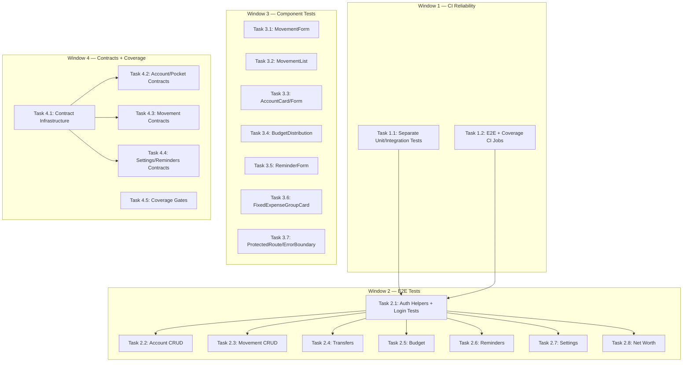

# Testing Infrastructure Task Breakdown

## Summary

22 tasks across 5 priority tiers, organized into 4 execution windows. Each task is scoped for a single coder sub-agent session (max 5-8 files). Tasks within the same window can run in parallel unless noted.

---

## Execution Windows

| Window | Priority | Tasks | Parallelism |
|--------|----------|-------|-------------|
| **Window 1** | 0.1 — CI Reliability | 2 tasks | Parallel |
| **Window 2** | 0.2 — E2E Critical Flows | 8 tasks | Parallel (after Window 1) |
| **Window 3** | 0.3 — Component Tests | 7 tasks | Parallel |
| **Window 4** | 0.4–0.5 — Contract Tests + Coverage | 5 tasks | Parallel |

---

## Window 1: CI Reliability (Priority 0.1)

### Task 1.1: Separate Unit and Integration Tests in Backend

**Goal**: Make `npm run test --workspace=backend` pass in CI without Supabase credentials by only running unit tests by default.

**Files to modify:**
- `backend/jest.config.js` — add a `testPathIgnorePatterns` for `*.integration.test.ts`
- `backend/package.json` — add `test:unit` and `test:integration` scripts
- `.github/workflows/ci.yml` — change `test-backend` job to use `test:unit`

**What to do:**
1. In `jest.config.js`, add `testPathIgnorePatterns: ['integration\\.test\\.ts$']` to the default config
2. Add scripts to `backend/package.json`:
   - `"test:unit": "jest --testPathIgnorePatterns='integration\\.test\\.ts$'"` 
   - `"test:integration": "jest --testPathPattern='integration\\.test\\.ts$'"`
   - Keep `"test": "jest"` running everything (for local dev with credentials)
3. Update `.github/workflows/ci.yml` `test-backend` job to run `npm run test:unit --workspace=backend -- --forceExit`
4. Verify: run `npm run test:unit --workspace=backend` locally — should pass without any env vars

**Scenarios to verify:**
- `test:unit` runs only non-integration tests (17 integration files excluded)
- `test:integration` runs only integration tests (requires env vars)
- `test` still runs everything (backward compatible)
- CI workflow uses `test:unit` and passes without Supabase credentials

**Dependencies:** None  
**Parallel:** Yes, with Task 1.2

---

### Task 1.2: Add E2E and Coverage CI Jobs

**Goal**: Add CI jobs for E2E tests (with proper server setup) and coverage reporting.

**Files to modify:**
- `.github/workflows/ci.yml` — add `test-e2e` and `coverage` jobs
- `frontend/playwright.config.ts` — add CI-specific settings (timeout, retries)

**What to do:**
1. Update `frontend/playwright.config.ts`:
   - Add `timeout: 30000` and `retries: process.env.CI ? 2 : 0`
   - Add `reporter: process.env.CI ? 'github' : 'html'`
   - Keep existing `webServer` config (starts frontend dev server)
   - Add a second webServer entry for backend: `{ command: 'npm run dev --workspace=backend', port: 3001, reuseExistingServer: !process.env.CI }`
2. Add `test-e2e` job to CI workflow:
   ```yaml
   test-e2e:
     runs-on: ubuntu-latest
     env:
       VITE_SUPABASE_URL: http://localhost:54321
       VITE_SUPABASE_ANON_KEY: test-key
       SUPABASE_URL: http://localhost:54321
       SUPABASE_SERVICE_KEY: test-key
     steps:
       - uses: actions/checkout@v4
       - uses: actions/setup-node@v4
         with: { node-version: 18, cache: npm }
       - run: npm ci
       - run: npx playwright install --with-deps chromium
       - run: npm run test:e2e --workspace=frontend
   ```
   Note: E2E tests will initially only run the smoke test. As Window 2 adds tests, they'll automatically be picked up.
3. Add coverage reporting step to existing `test-frontend` job:
   ```yaml
   - run: npm run test:coverage --workspace=frontend -- --run
   ```

**Scenarios to verify:**
- E2E job installs Playwright browsers and runs tests
- Frontend coverage report is generated
- Both jobs pass with the existing smoke test

**Dependencies:** None  
**Parallel:** Yes, with Task 1.1

---

## Window 2: E2E Critical Flows (Priority 0.2)

> **Prerequisite**: Window 1 must be complete (CI can run E2E tests).
> 
> **Important context**: E2E tests need both frontend (port 5173) and backend (port 3001) running. The Playwright config's `webServer` handles this. Tests authenticate against a real or mocked Supabase — for CI, tests should use a test account with known credentials stored as GitHub secrets, OR mock auth at the Supabase level. For now, write tests assuming a test user can log in with `TEST_EMAIL` / `TEST_PASSWORD` env vars.

### Task 2.1: E2E Auth Helpers + Login/Signup Tests

**Goal**: Create shared E2E utilities and test the authentication flows.

**Files to create:**
- `frontend/e2e/helpers/auth.ts` — login helper, test user credentials from env
- `frontend/e2e/helpers/selectors.ts` — common selectors and page object helpers
- `frontend/e2e/auth.spec.ts` — login, signup, logout tests

**What to test:**
1. **Login flow**: Navigate to `/`, enter credentials, verify redirect to dashboard
2. **Login validation**: Empty fields show errors, wrong password shows error
3. **Signup flow**: Navigate to signup, fill form, verify account creation (or mock)
4. **Logout**: Click logout, verify redirect to login page
5. **Protected routes**: Unauthenticated user redirected to login

**Auth helper pattern:**
```typescript
// e2e/helpers/auth.ts
export async function login(page: Page) {
  await page.goto('/');
  await page.fill('[name="email"]', process.env.TEST_EMAIL || 'test@example.com');
  await page.fill('[name="password"]', process.env.TEST_PASSWORD || 'testpass123');
  await page.click('button[type="submit"]');
  await page.waitForURL('**/dashboard**');
}
```

**Dependencies:** None (extends existing smoke.spec.ts pattern)  
**Parallel:** Yes, with all other Window 2 tasks

---

### Task 2.2: E2E Account CRUD

**Goal**: Test the full account lifecycle.

**Files to create:**
- `frontend/e2e/accounts.spec.ts`

**What to test:**
1. **Create account**: Open form, fill name/color/currency, submit, verify appears in list
2. **Create investment account**: Select investment type, fill stock symbol, verify
3. **Edit account**: Click edit, change name, save, verify updated
4. **Delete account**: Click delete, confirm cascade dialog, verify removed
5. **Reorder accounts**: Drag and drop (or verify reorder API if drag is complex)
6. **Account with pockets**: Create account, add pocket, verify pocket appears

**Dependencies:** Task 2.1 (needs auth helper)  
**Parallel:** Yes

---

### Task 2.3: E2E Movement CRUD

**Goal**: Test movement creation, editing, and deletion.

**Files to create:**
- `frontend/e2e/movements.spec.ts`

**What to test:**
1. **Create income movement**: Fill form (type, amount, account, pocket, date, notes), submit
2. **Create expense movement**: Same flow with expense type
3. **Inline edit amount**: Click amount, change value, verify updated
4. **Delete movement**: Select, delete, confirm, verify removed
5. **Movement filters**: Filter by date range, by type, by account — verify list updates
6. **Pending movement**: Create pending movement, verify it doesn't affect balance
7. **Movement from template**: Use saved template to create movement

**Dependencies:** Task 2.1 (needs auth helper), assumes at least one account exists  
**Parallel:** Yes

---

### Task 2.4: E2E Transfers

**Goal**: Test money transfer between accounts/pockets.

**Files to create:**
- `frontend/e2e/transfers.spec.ts`

**What to test:**
1. **Transfer between pockets**: Select source pocket, destination pocket, amount, execute
2. **Transfer between accounts**: Select source account, destination account, amount
3. **Transfer validation**: Insufficient balance shows error, same source/dest blocked
4. **Balance updates**: After transfer, both source and destination balances update correctly

**Dependencies:** Task 2.1, requires at least 2 accounts with pockets  
**Parallel:** Yes

---

### Task 2.5: E2E Budget Generation

**Goal**: Test the budget page workflow.

**Files to create:**
- `frontend/e2e/budget.spec.ts`

**What to test:**
1. **Set income**: Enter total income amount
2. **Fixed expenses deduction**: Verify fixed expenses are auto-subtracted
3. **Percentage distribution**: Set percentages for pockets, verify amounts calculate
4. **Generate budget**: Click generate, verify movements are created
5. **Validation**: Percentages exceeding 100% show error

**Dependencies:** Task 2.1, requires accounts with pockets and fixed expenses configured  
**Parallel:** Yes

---

### Task 2.6: E2E Reminders

**Goal**: Test reminder creation and management.

**Files to create:**
- `frontend/e2e/reminders.spec.ts`

**What to test:**
1. **Create reminder**: Fill name, amount, due date, recurrence, submit
2. **Edit reminder**: Change amount and due date
3. **Mark as paid**: Click paid, verify status updates
4. **Disable/enable**: Toggle reminder active state
5. **Delete reminder**: Remove and verify gone from list
6. **Recurrence display**: Monthly reminder shows correct next due date

**Dependencies:** Task 2.1  
**Parallel:** Yes

---

### Task 2.7: E2E Settings

**Goal**: Test settings page functionality.

**Files to create:**
- `frontend/e2e/settings.spec.ts`

**What to test:**
1. **Change theme**: Toggle dark/light mode, verify persists on reload
2. **Change primary currency**: Select different currency, verify totals update
3. **Account card display**: Switch compact/detailed, verify layout changes
4. **Save settings**: Modify preferences, reload page, verify persisted

**Dependencies:** Task 2.1  
**Parallel:** Yes

---

### Task 2.8: E2E Net Worth

**Goal**: Test net worth page and snapshot functionality.

**Files to create:**
- `frontend/e2e/net-worth.spec.ts`

**What to test:**
1. **View net worth page**: Chart renders with existing data
2. **Create manual snapshot**: Click create, verify new point appears
3. **Currency breakdown**: Verify per-currency totals display
4. **Historical data**: Navigate date range, verify chart updates
5. **Delete snapshot**: Remove a snapshot, verify chart updates

**Dependencies:** Task 2.1, requires accounts with balances  
**Parallel:** Yes

---

## Window 3: Component Tests (Priority 0.3)

> **Prerequisite**: None (can run after Window 1, parallel with Window 2).
> 
> **Context**: Test infrastructure already exists — `testUtils.tsx` provides `render` with all providers (QueryClient, AuthProvider, BrowserRouter). Mock data in `mockData.ts`. API client is globally mocked via vitest aliases.

### Task 3.1: MovementForm Component Tests

**Goal**: Test the most complex form component (14KB, handles income/expense/transfer/fixed).

**Files to create:**
- `frontend/src/components/movements/__tests__/MovementForm.test.tsx`

**Files to read (for context):**
- `frontend/src/components/movements/MovementForm.tsx`
- `frontend/src/test/testUtils.tsx`
- `frontend/src/test/mockData.ts`

**What to test:**
1. **Renders with default state**: Form fields visible, submit button disabled until valid
2. **Income type selection**: Shows account/pocket selectors, amount field
3. **Expense type selection**: Same fields, different validation
4. **Transfer type**: Shows source AND destination selectors
5. **Fixed expense type**: Shows sub-pocket selector
6. **Form validation**: Required fields show errors on submit attempt
7. **Amount validation**: Negative amounts rejected, zero rejected
8. **Successful submission**: Fills all fields, submits, calls mutation
9. **Edit mode**: Pre-fills form with existing movement data
10. **Date picker**: Default to today, can change date

**Dependencies:** None  
**Parallel:** Yes, with all Window 3 tasks

---

### Task 3.2: MovementList + InlineEdit Component Tests

**Goal**: Test the main data display component with bulk actions and inline editing.

**Files to create:**
- `frontend/src/components/movements/__tests__/MovementList.test.tsx`

**Files to read:**
- `frontend/src/components/movements/MovementList.tsx` (or equivalent list component)
- Any inline edit component

**What to test:**
1. **Renders movement list**: Shows movements with correct amounts, dates, notes
2. **Empty state**: Shows appropriate message when no movements
3. **Bulk selection**: Select multiple, bulk actions appear
4. **Bulk delete**: Select items, click delete, confirmation dialog appears
5. **Inline amount edit**: Click amount, input appears, save updates value
6. **Sorting**: Click column header, list reorders
7. **Pagination/infinite scroll**: If applicable, loads more on scroll
8. **Movement type badges**: Income shows green, expense shows red

**Dependencies:** None  
**Parallel:** Yes

---

### Task 3.3: AccountCard + AccountForm Component Tests

**Goal**: Test account display and creation/edit form.

**Files to create:**
- `frontend/src/components/accounts/__tests__/AccountCard.test.tsx`
- `frontend/src/components/accounts/__tests__/AccountForm.test.tsx`

**Files to read:**
- Relevant account components in `frontend/src/components/accounts/`

**What to test (AccountCard):**
1. **Renders account info**: Name, balance, currency, color indicator
2. **Investment account**: Shows stock symbol, gain/loss
3. **CD account**: Shows maturity date, interest rate
4. **Click opens details**: Clicking card navigates or expands
5. **Compact vs detailed mode**: Renders differently based on setting

**What to test (AccountForm):**
1. **Create mode**: Empty form, all fields available
2. **Edit mode**: Pre-filled with account data
3. **Type switching**: Selecting "investment" shows stock fields
4. **Validation**: Duplicate name+currency shows error
5. **Submit**: Calls create/update mutation with correct data

**Dependencies:** None  
**Parallel:** Yes

---

### Task 3.4: BudgetDistribution Component Tests

**Goal**: Test the budget allocation UI with percentage calculations.

**Files to create:**
- `frontend/src/components/budget/__tests__/BudgetDistribution.test.tsx`

**Files to read:**
- Budget-related components in `frontend/src/components/budget/`

**What to test:**
1. **Renders with income input**: Shows total income field
2. **Fixed expenses deduction**: Displays auto-calculated fixed expense total
3. **Remaining amount**: Shows income minus fixed expenses
4. **Percentage inputs**: Each pocket has a percentage input
5. **Amount calculation**: Changing percentage updates calculated amount
6. **Over 100% warning**: Shows error when percentages exceed 100%
7. **Generate button**: Enabled only when valid, calls generation function
8. **Account selection**: Can select which accounts to distribute to

**Dependencies:** None  
**Parallel:** Yes

---

### Task 3.5: ReminderForm Component Tests

**Goal**: Test the reminder creation/edit form with recurrence logic.

**Files to create:**
- `frontend/src/components/reminders/__tests__/ReminderForm.test.tsx`

**Files to read:**
- Reminder components in `frontend/src/components/reminders/`

**What to test:**
1. **Create mode**: Empty form with all fields
2. **Edit mode**: Pre-filled with reminder data
3. **Recurrence selection**: Daily/weekly/monthly/yearly options
4. **Due date picker**: Can select future date
5. **Amount field**: Accepts positive numbers only
6. **Validation**: Name required, amount required, date required
7. **Submit**: Calls create/update mutation
8. **Enable/disable toggle**: Toggle state reflected in form

**Dependencies:** None  
**Parallel:** Yes

---

### Task 3.6: FixedExpenseGroupCard Component Tests

**Goal**: Test the fixed expense display with progress tracking.

**Files to create:**
- `frontend/src/components/fixed-expenses/__tests__/FixedExpenseGroupCard.test.tsx`

**Files to read:**
- Fixed expense components

**What to test:**
1. **Renders group info**: Name, total target, current balance
2. **Progress bar**: Shows percentage filled correctly
3. **Monthly contribution**: Displays calculated monthly amount
4. **Sub-pocket list**: Shows individual expenses within group
5. **Disabled expense**: Grayed out, excluded from calculations
6. **Add expense button**: Opens form for new sub-pocket
7. **Edit/delete actions**: Buttons present and functional

**Dependencies:** None  
**Parallel:** Yes

---

### Task 3.7: ProtectedRoute + ErrorBoundary Component Tests

**Goal**: Test auth guard and error recovery components.

**Files to create:**
- `frontend/src/components/__tests__/ProtectedRoute.test.tsx`
- `frontend/src/components/__tests__/ErrorBoundary.test.tsx`

**Files to read:**
- `frontend/src/components/ProtectedRoute.tsx` (or wherever it lives)
- `frontend/src/components/ErrorBoundary.tsx`

**What to test (ProtectedRoute):**
1. **Authenticated user**: Renders children
2. **Unauthenticated user**: Redirects to login
3. **Loading state**: Shows loading indicator while checking auth

**What to test (ErrorBoundary):**
1. **No error**: Renders children normally
2. **Child throws**: Catches error, shows fallback UI
3. **Recovery**: Reset button clears error state
4. **Error info**: Displays useful error message

**Dependencies:** None  
**Parallel:** Yes

---

## Window 4: API Contract Tests + Coverage Gates (Priority 0.4–0.5)

> **Prerequisite**: None strictly, but best after Windows 1-3 establish the test patterns.

### Task 4.1: API Contract Test Infrastructure

**Goal**: Set up the contract testing approach — validate that frontend service calls match backend Zod schemas.

**Approach**: Export Zod schemas from backend as a shared dependency. In frontend tests, validate that the request payloads sent by service methods conform to the backend schemas. This catches shape mismatches (like the settings bug) at test time.

**Files to create:**
- `backend/src/shared/contracts/index.ts` — re-exports all presentation schemas
- `backend/src/shared/contracts/response-schemas.ts` — Zod schemas for response shapes (derived from existing types)
- `frontend/src/test/contracts/setup.ts` — helper to import and validate against backend schemas

**Files to modify:**
- `backend/package.json` — add `"exports"` field pointing to contracts
- Root `package.json` or `tsconfig` — allow frontend tests to import from backend contracts

**What to do:**
1. Create `backend/src/shared/contracts/index.ts` that re-exports all schemas from each module's `presentation/schemas.ts`
2. Create response schemas for the main entities (Account, Movement, Pocket, etc.) — these define what the backend returns
3. Create `frontend/src/test/contracts/setup.ts` with a helper:
   ```typescript
   import { createAccountSchema } from '../../../../backend/src/shared/contracts';
   export function validateRequest(schema: ZodSchema, data: unknown) {
     return schema.safeParse(data);
   }
   ```
4. Configure path alias in `vitest.config.ts`: `'@contracts': path.resolve(__dirname, '../../backend/src/shared/contracts')`

**Dependencies:** None  
**Parallel:** Yes, with Tasks 4.2-4.5

---

### Task 4.2: Account + Pocket Contract Tests

**Goal**: Validate frontend account/pocket service methods send correct request shapes.

**Files to create:**
- `frontend/src/services/__tests__/accountService.contract.test.ts`
- `frontend/src/services/__tests__/pocketService.contract.test.ts`

**What to test:**
1. `accountService.createAccount(data)` — payload matches `createAccountSchema`
2. `accountService.updateAccount(id, data)` — payload matches `updateAccountSchema`
3. `accountService.cascadeDelete(id, opts)` — payload matches `cascadeDeleteSchema`
4. `accountService.reorderAccounts(ids)` — payload matches `reorderAccountsSchema`
5. `pocketService.createPocket(data)` — payload matches pocket create schema
6. `pocketService.updatePocket(id, data)` — payload matches pocket update schema

**Pattern:**
```typescript
test('createAccount sends valid payload', () => {
  const payload = { name: 'Test', color: '#fff', currency: 'USD' };
  const result = createAccountSchema.safeParse(payload);
  expect(result.success).toBe(true);
});
```

Also verify that the apiClient mock was called with the correct endpoint and method.

**Dependencies:** Task 4.1 (needs contract infrastructure)  
**Parallel:** Yes, with Tasks 4.3-4.5

---

### Task 4.3: Movement + Template Contract Tests

**Goal**: Validate movement and template service request shapes.

**Files to create:**
- `frontend/src/services/__tests__/movementService.contract.test.ts`
- `frontend/src/services/__tests__/movementTemplateService.contract.test.ts`

**What to test:**
1. `movementService.createMovement(data)` — matches movement create schema
2. `movementService.updateMovement(id, data)` — matches movement update schema
3. `movementService.batchCreate(movements)` — each item matches schema
4. `movementTemplateService.createTemplate(data)` — matches template schema
5. Edge cases: pending flag, optional fields, date formats

**Dependencies:** Task 4.1  
**Parallel:** Yes

---

### Task 4.4: Settings + Reminders + SubPockets Contract Tests

**Goal**: Validate remaining service contract shapes.

**Files to create:**
- `frontend/src/services/__tests__/settingsService.contract.test.ts`
- `frontend/src/services/__tests__/reminderService.contract.test.ts`
- `frontend/src/services/__tests__/subPocketService.contract.test.ts`

**What to test:**
1. `settingsService.updateSettings(data)` — matches settings schema (catches the `accountCardDisplay` object-vs-string bug)
2. `reminderService.createReminder(data)` — matches reminder create schema
3. `reminderService.updateReminder(id, data)` — matches reminder update schema
4. `subPocketService.createSubPocket(data)` — matches sub-pocket schema
5. `subPocketService.updateSubPocket(id, data)` — matches sub-pocket update schema

**Dependencies:** Task 4.1  
**Parallel:** Yes

---

### Task 4.5: Coverage Gates

**Goal**: Add coverage thresholds to prevent regression.

**Files to modify:**
- `frontend/vitest.config.ts` — add coverage thresholds
- `backend/jest.config.js` — add coverage thresholds
- `.github/workflows/ci.yml` — add coverage enforcement step

**What to do:**
1. In `frontend/vitest.config.ts`, add to `test.coverage`:
   ```typescript
   thresholds: {
     statements: 30,
     branches: 25,
     functions: 30,
     lines: 30,
   }
   ```
   (Start low — these are floors that only go up as tests are added)

2. In `backend/jest.config.js`, add:
   ```javascript
   coverageThreshold: {
     global: {
       statements: 40,
       branches: 30,
       functions: 40,
       lines: 40,
     }
   }
   ```

3. Update CI workflow:
   - Frontend job: change test command to `npm run test:coverage --workspace=frontend -- --run`
   - Backend job: add `--coverage` flag to test:unit command
   - Both will fail if coverage drops below thresholds

4. Add a comment in each config explaining: "Increase these thresholds as coverage improves. Never lower them."

**Dependencies:** None  
**Parallel:** Yes

---

## Dependency Graph



---

## Execution Plan

### Window 1 (2 parallel tasks)
Run Tasks 1.1 and 1.2 simultaneously. Both modify CI but in different jobs — no conflict.

### Window 2 (up to 8 parallel tasks)
After Window 1 merges, run Task 2.1 first (creates shared helpers), then Tasks 2.2–2.8 in parallel. Alternatively, run all 8 in parallel if each task includes its own inline auth helper (less DRY but faster).

**Recommended**: Run 2.1 alone first, then 2.2–2.8 as a wave of 7.

### Window 3 (7 parallel tasks)
No dependencies on other windows. Can run alongside Window 2. All 7 tasks are fully independent.

### Window 4 (5 tasks, 1 then 4)
Run Task 4.1 first (infrastructure), then Tasks 4.2–4.5 in parallel. Task 4.5 (coverage gates) has no dependencies and can run with 4.1.

---

## Realistic Constraints

### E2E Tests in CI
- E2E tests need both frontend and backend servers running
- The Playwright `webServer` config handles starting them
- **BUT**: Backend needs `SUPABASE_URL` and `SUPABASE_SERVICE_KEY` to start
- **Options for CI**:
  - Store test Supabase credentials as GitHub secrets (simplest, recommended)
  - Use Supabase CLI local instance in CI (complex but no external dependency)
  - Skip E2E in CI, run only locally (defeats the purpose)
- **Recommendation**: Use GitHub secrets with a dedicated test Supabase project. The free tier supports this.

### Component Tests
- Already have working infrastructure (`testUtils.tsx`, mocked apiClient, mocked supabase)
- No blockers — these can run immediately

### Contract Tests
- Backend schemas are already defined in Zod
- The challenge is importing backend code from frontend tests
- Solution: Use relative path imports in tests (not a runtime dependency, just test-time)
- Alternative: Copy schemas to a `shared/` workspace (more work, cleaner long-term)

### Coverage Thresholds
- Start LOW (30-40%) to avoid blocking PRs
- Ratchet up as each window adds tests
- Never lower thresholds once set

---

## Task Count Summary

| Window | Tasks | Max Parallelism | Estimated Agent Sessions |
|--------|-------|-----------------|--------------------------|
| 1 | 2 | 2 | 2 |
| 2 | 8 | 7 (after 2.1) | 8 |
| 3 | 7 | 7 | 7 |
| 4 | 5 | 4 (after 4.1) | 5 |
| **Total** | **22** | | **22 sessions** |
