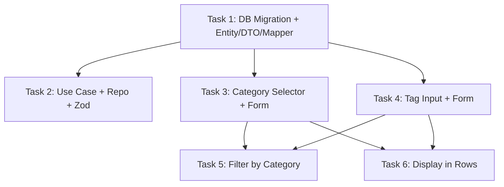

# Tier 1: Categories & Tags on Movements — Task Breakdown

## Summary

Add category and tag support to movements. This enables answering "how much did I spend on food this month?" — the single most impactful missing feature.

**Design decisions:**
- `category`: single value per movement, TEXT column, nullable (backward-compatible)
- `tags`: multiple values per movement, TEXT[] (PostgreSQL array), nullable
- Predefined categories stored as a constant (not a DB table) — simpler, no extra queries
- Users can type custom categories beyond the predefined list
- Tags are fully free-form, no predefined list

**Predefined categories:**
`Food`, `Transport`, `Bills`, `Entertainment`, `Shopping`, `Health`, `Education`, `Salary`, `Investment`, `Gifts`, `Subscriptions`, `Other`

---

## Current State Analysis

### Database (`movements` table)
- No `category` or `tags` columns exist
- Next migration number: `029`
- Columns use snake_case; mapping to camelCase happens in application layer

### Backend Domain (`Movement.ts`)
- Constructor takes positional params (id, type, accountId, pocketId, amount, displayedDate, notes, subPocketId, isPending, isOrphaned, orphanedAccountName, orphanedAccountCurrency, orphanedPocketName)
- Has `update()` method that accepts optional fields
- Has `validate()` for invariants
- Has `toJSON()` for serialization

### Backend DTOs (`MovementDTO.ts`)
- `CreateMovementDTO`: type, accountId, pocketId, amount, displayedDate, notes?, subPocketId?, isPending?
- `UpdateMovementDTO`: all optional fields
- `MovementResponseDTO`: full response shape

### Backend Mapper (`MovementMapper.ts`)
- `toPersistence(movement, userId)` → DB row (snake_case)
- `toDomain(row)` → Movement entity
- `toDTO(movement)` → response DTO

### Backend Zod Schemas (`presentation/schemas.ts`)
- `createMovementSchema`: validates create payload
- `updateMovementSchema`: validates update payload
- `batchMovementSchema`: validates batch create

### Frontend Types (`types/index.ts`)
- `Movement` interface: id, type, accountId, pocketId, subPocketId?, amount, notes?, displayedDate, createdAt, isPending?, isOrphaned?, orphaned* fields

### Frontend Form (`MovementForm.tsx`)
- Uses react-hook-form with `MovementFormData` interface
- Has type, date, account/pocket selector, amount, notes, isPending, transfer mode, template save
- No category or tag fields

### Frontend Filters (`useMovementsFilter.ts` + `MovementFilters.tsx`)
- Filters: account, pocket, type, dateRange, search (notes), amount range, pending status
- No category or tag filter

### Frontend List (`MovementList.tsx`)
- `MovementRow` renders: icon, notes (as title), type badge, pending badge, date, account, pocket, amount
- No category or tag display

---

## Task Breakdown

### Task 1: DB Migration + Backend Entity/DTO/Mapper

**Files to modify:**
- `backend/migrations/029_add_categories_tags.sql` (CREATE)
- `backend/src/modules/movements/domain/Movement.ts`
- `backend/src/modules/movements/application/dtos/MovementDTO.ts`
- `backend/src/modules/movements/application/mappers/MovementMapper.ts`
- `backend/src/shared/types/index.ts`

**Migration SQL:**
```sql
-- Migration: 029_add_categories_tags.sql
-- Add category and tags columns to movements table.
-- Both nullable for backward compatibility (existing movements get NULL).

ALTER TABLE movements ADD COLUMN category TEXT;
ALTER TABLE movements ADD COLUMN tags TEXT[];

-- Index for filtering by category
CREATE INDEX idx_movements_category ON movements (user_id, category) WHERE category IS NOT NULL;

-- GIN index for array containment queries on tags
CREATE INDEX idx_movements_tags ON movements USING GIN (tags) WHERE tags IS NOT NULL;
```

**Domain entity changes:**
- Add `category?: string` and `tags?: string[]` to constructor params (after `orphanedPocketName`)
- Add to `update()` method signature
- Add to `toJSON()` output
- No validation needed (both optional, free-form)

**Shared types changes:**
- Add `export type MovementCategory = 'Food' | 'Transport' | 'Bills' | 'Entertainment' | 'Shopping' | 'Health' | 'Education' | 'Salary' | 'Investment' | 'Gifts' | 'Subscriptions' | 'Other' | string;`
- This is a union type that allows predefined + custom values

**DTO changes:**
- `CreateMovementDTO`: add `category?: string`, `tags?: string[]`
- `UpdateMovementDTO`: add `category?: string | null`, `tags?: string[] | null`
- `MovementResponseDTO`: add `category?: string`, `tags?: string[]`

**Mapper changes:**
- `toPersistence`: map `movement.category` → `category`, `movement.tags` → `tags`
- `toDomain`: map `row.category` → entity, `row.tags` → entity
- `toDTO`: map entity fields to response DTO
- Update `MovementRow` interface to include `category?: string`, `tags?: string[]`

---

### Task 2: Backend Use Case + Repository + Zod Schema

**Files to modify:**
- `backend/src/modules/movements/presentation/schemas.ts`
- `backend/src/modules/movements/application/useCases/CreateMovementUseCase.ts`
- `backend/src/modules/movements/infrastructure/SupabaseMovementRepository.ts`
- `backend/src/modules/movements/infrastructure/IMovementRepository.ts`

**Zod schema changes:**
- `createMovementSchema`: add `category: z.string().max(50).optional()`, `tags: z.array(z.string().max(30)).max(10).optional()`
- `updateMovementSchema`: add `category: z.string().max(50).nullable().optional()`, `tags: z.array(z.string().max(30)).max(10).nullable().optional()`
- `batchMovementSchema`: add same fields to the inner object

**CreateMovementUseCase changes:**
- Pass `dto.category` and `dto.tags` to the Movement constructor
- No additional validation needed beyond Zod (category is free-form, tags are free-form)

**Repository changes:**
- `MovementFilters` interface: add `category?: string`, `tags?: string[]`
- `applyFilters()`: add category exact match filter, add tags array overlap filter (`@>` operator via `.contains()` or `.overlaps()`)
- `findAll()`: no structural changes needed, filters handle it

**IMovementRepository changes:**
- Update `MovementFilters` interface with new fields

---

### Task 3: Frontend — Category Selector Component + MovementForm Integration

**Files to create:**
- `frontend/src/constants/categories.ts`
- `frontend/src/components/movements/CategorySelector.tsx`

**Files to modify:**
- `frontend/src/types/index.ts`
- `frontend/src/components/movements/MovementForm.tsx`

**Constants file (`categories.ts`):**
```typescript
export const PREDEFINED_CATEGORIES = [
  'Food', 'Transport', 'Bills', 'Entertainment', 'Shopping',
  'Health', 'Education', 'Salary', 'Investment', 'Gifts',
  'Subscriptions', 'Other',
] as const;

export type PredefinedCategory = typeof PREDEFINED_CATEGORIES[number];
```

**CategorySelector component:**
- Combobox-style: dropdown with predefined options + free-text input for custom
- Shows predefined categories as selectable options
- Allows typing a custom category not in the list
- Optional (can be left empty)
- Props: `value: string`, `onChange: (value: string) => void`, `label?: string`

**Frontend types changes:**
- `Movement` interface: add `category?: string`, `tags?: string[]`

**MovementForm changes:**
- Add `category: string` to `MovementFormData`
- Add `CategorySelector` between the notes field and isPending checkbox
- Default value: `initialData?.category ?? ''`
- Pass through to onSubmit

---

### Task 4: Frontend — Tag Input Component + MovementForm Integration

**Files to create:**
- `frontend/src/components/movements/TagInput.tsx`

**Files to modify:**
- `frontend/src/components/movements/MovementForm.tsx`

**TagInput component:**
- Chip-style multi-value input
- Type text → press Enter or comma to add tag
- Click X on chip to remove
- Max 10 tags, max 30 chars per tag
- Lowercase normalization, trim whitespace, deduplicate
- Props: `value: string[]`, `onChange: (tags: string[]) => void`, `label?: string`, `maxTags?: number`

**MovementForm changes:**
- Add `tags: string[]` to `MovementFormData` (as `string[]`, not comma-separated)
- Add `TagInput` component after CategorySelector
- Default value: `initialData?.tags ?? []`
- Pass through to onSubmit

---

### Task 5: Frontend — Filter by Category in Movements List

**Files to modify:**
- `frontend/src/hooks/useMovementsFilter.ts`
- `frontend/src/components/movements/MovementFilters.tsx`

**useMovementsFilter changes:**
- Add `filterCategory` state: `string` (default `'all'`)
- Add `filterTags` state: `string[]` (default `[]`)
- Add to filter logic:
  - Category: if not 'all', match `movement.category === filterCategory`
  - Tags: if array not empty, match `movement.tags?.some(t => filterTags.includes(t))`
- Export new filter state and setters
- Add to `activeFiltersCount` calculation

**MovementFilters changes:**
- Add category dropdown (Select with 'All Categories' + predefined list + any custom categories found in current movements)
- Add tag filter (multi-select or chip input showing tags found in current movements)
- Wire up to filter state
- Include in clearFilters reset

---

### Task 6: Frontend — Category/Tag Display in Movement Rows

**Files to modify:**
- `frontend/src/components/movements/MovementList.tsx`

**MovementRow changes:**
- After the type badge and pending badge, render:
  - Category badge: small colored pill showing `movement.category` (if present)
  - Tag chips: small gray pills for each tag in `movement.tags` (if present, max 3 shown + "+N more")
- Category badge color: derive from a simple hash of the category name to pick from a palette
- Tags: subtle gray/neutral styling to differentiate from category

**Layout:**
- Category and tags go in the existing badge row (after type badge, before pending badge)
- On mobile: category shows, tags collapse to "+N tags" indicator

---

## Dependency Graph



**Parallelization:**
- Wave 1: Task 1 (must go first — everything depends on schema + entity)
- Wave 2: Tasks 2, 3, 4 (all depend only on Task 1, independent of each other)
- Wave 3: Tasks 5, 6 (depend on frontend types from Tasks 3/4)

---

## Testing Considerations

- **Migration**: Run against local Supabase, verify existing movements get NULL for both columns
- **Backend**: Unit test Movement entity with category/tags, test Zod validation (max length, max tags count), test repository filter with category/tags
- **Frontend**: Test CategorySelector renders predefined options and accepts custom input, test TagInput add/remove/max behavior, test filter logic includes category/tag matching, test MovementRow renders badges correctly

## Backward Compatibility

- All existing movements will have `category = NULL` and `tags = NULL`
- All new fields are optional in DTOs and Zod schemas
- Frontend gracefully handles missing category/tags (no badge rendered)
- No breaking changes to existing API contracts
