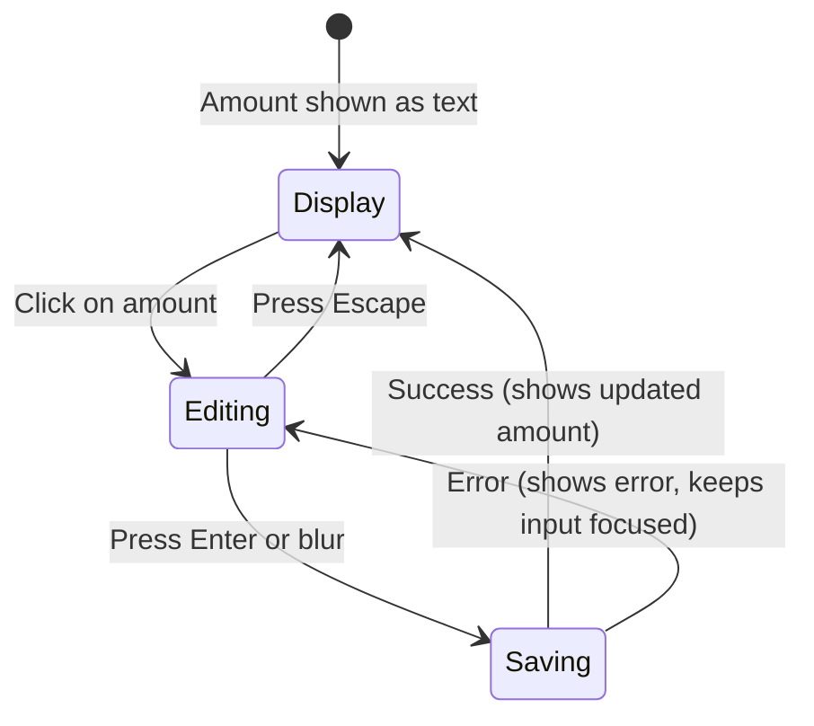

# Inline Amount Editing — Task Breakdown

## Summary

Enable clicking a movement's amount directly in the list to edit it inline, without opening the full edit modal.

## Current State

### Amount Display (MovementList.tsx, line ~130)

The amount is rendered as a plain `<span>` inside `MovementRow`:

```tsx
<span className={`text-lg font-bold ${isIncome ? 'text-green-600 ...' : 'text-red-600 ...'}`}>
    {isIncome ? '+' : '-'}${movement.amount.toLocaleString()}
</span>
```

Key observations:
- Does NOT use the `CurrencyAmount` component — just raw `toLocaleString()` with a hardcoded `$` prefix
- No currency awareness (always shows `$`)
- The amount cell lives inside a flex container alongside action buttons (Edit, Delete, Apply)

### Update Mutation (useMovementMutations.ts)

The `updateMovement` mutation already supports partial updates:

```tsx
const updateMovement = useMutation({
    mutationFn: (data: {
        id: string;
        updates: Partial<{
            type: MovementType;
            accountId: string;
            pocketId: string;
            subPocketId: string;
            amount: number;
            notes: string;
            displayedDate: string;
            isPending: boolean;
        }>;
    }) => movementService.updateMovement(data.id, data.updates),
    ...
});
```

This means we can call `updateMovement.mutate({ id: movement.id, updates: { amount: newAmount } })` directly — no new API work needed.

### Service Layer (movementService.ts)

```tsx
async updateMovement(
    id: string,
    updates: Partial<Pick<Movement, 'type' | 'accountId' | 'pocketId' | 'subPocketId' | 'amount' | 'notes' | 'displayedDate'>>
): Promise<Movement> {
    return await apiClient.put<Movement>(`/api/movements/${id}`, updates);
}
```

Fully supports partial `{ amount }` updates. No backend changes required.

### CurrencyAmount Component (ui/CurrencyAmount.tsx)

A memoized display-only component using `Intl.NumberFormat`. Props: `amount`, `currency`, `locale`, `className`, fraction digit overrides. Not interactive — purely presentational.

### MovementRow Props

`MovementRow` receives `onEdit: (movement: Movement) => void` for the full modal edit. The inline edit is a separate interaction that doesn't need to go through `onEdit`.

## Design

### Interaction Flow



### Component: `InlineEditableAmount`

A self-contained component that:
1. **Display mode**: Renders the amount as a clickable span (styled like current amount display)
2. **Edit mode**: Replaces the span with a number input, pre-filled with current amount
3. **Save**: On Enter/blur, calls `onSave(newAmount)` if value changed
4. **Cancel**: On Escape, reverts to display mode without saving
5. **Loading**: Shows a subtle spinner/opacity change while the mutation is in-flight
6. **Error**: Reverts to edit mode with the input focused if save fails

### Props Interface

```tsx
interface InlineEditableAmountProps {
    amount: number;
    isIncome: boolean;
    onSave: (newAmount: number) => Promise<void>;
    isSaving?: boolean;
}
```

### Integration Point

In `MovementRow`, replace the current amount `<span>` with `<InlineEditableAmount>`. The `onSave` callback calls `updateMovement.mutateAsync({ id: movement.id, updates: { amount } })`.

This requires:
- Adding `updateMovement` mutation access to `MovementRow` (either passed as prop from parent, or the row calls `useMovementMutations` directly — prop is better since the parent already has access via the page)
- Adding an `onUpdateAmount` prop to `MovementRow` and `MovementList`

## Tasks

### Task 1: Create `InlineEditableAmount` component and wire into MovementRow

**Files to create:**
- `frontend/src/components/ui/InlineEditableAmount.tsx`

**Files to modify:**
- `frontend/src/components/movements/MovementList.tsx`

**Implementation details:**

1. **Create `InlineEditableAmount`** in `frontend/src/components/ui/InlineEditableAmount.tsx`:
   - State: `isEditing` (boolean), `inputValue` (string)
   - Display mode: clickable span with cursor-pointer, same styling as current amount (color based on `isIncome`, font-bold, text-lg)
   - Edit mode: `<input type="number" step="0.01" min="0">` with auto-focus, pre-filled with current amount
   - Handlers:
     - `onClick` on span → enter edit mode
     - `onKeyDown` on input: Enter → save, Escape → cancel
     - `onBlur` on input → save (if value changed) or cancel (if unchanged)
     - `onSave` validates (must be > 0, must be a valid number), then calls prop callback
   - Loading state: reduce opacity + disable input while `isSaving` is true
   - Style the input to match the surrounding text size (no full Input component — too heavy for inline use)

2. **Modify `MovementRow`** in `MovementList.tsx`:
   - Add `onUpdateAmount: (id: string, amount: number) => Promise<void>` to `MovementRowProps`
   - Replace the amount `<span>` with `<InlineEditableAmount>`
   - Pass `movement.amount`, income flag, and a callback that calls `onUpdateAmount(movement.id, newAmount)`

3. **Modify `MovementList`** component:
   - Add `onUpdateAmount: (id: string, amount: number) => Promise<void>` to `MovementListProps`
   - Thread it through to each `MovementRow`

4. **Modify the page that renders `MovementList`** (likely the movements page):
   - Use `useMovementMutations()` to get `updateMovement`
   - Pass `onUpdateAmount` as: `(id, amount) => updateMovement.mutateAsync({ id, updates: { amount } })`

**Acceptance criteria:**
- Clicking the amount in any movement row opens an inline input
- Typing a new value and pressing Enter saves it (amount updates in the list after refetch)
- Pressing Escape cancels without saving
- Blurring the input saves if value changed, cancels if unchanged
- Invalid values (0, negative, non-numeric) are rejected with no save attempt
- A brief loading indicator appears during save
- The sign prefix (+/-) remains visible during editing
- Works on both desktop and mobile (input is large enough to tap)

**Estimated complexity:** Low-medium. Single new component + prop threading through 2-3 files.
