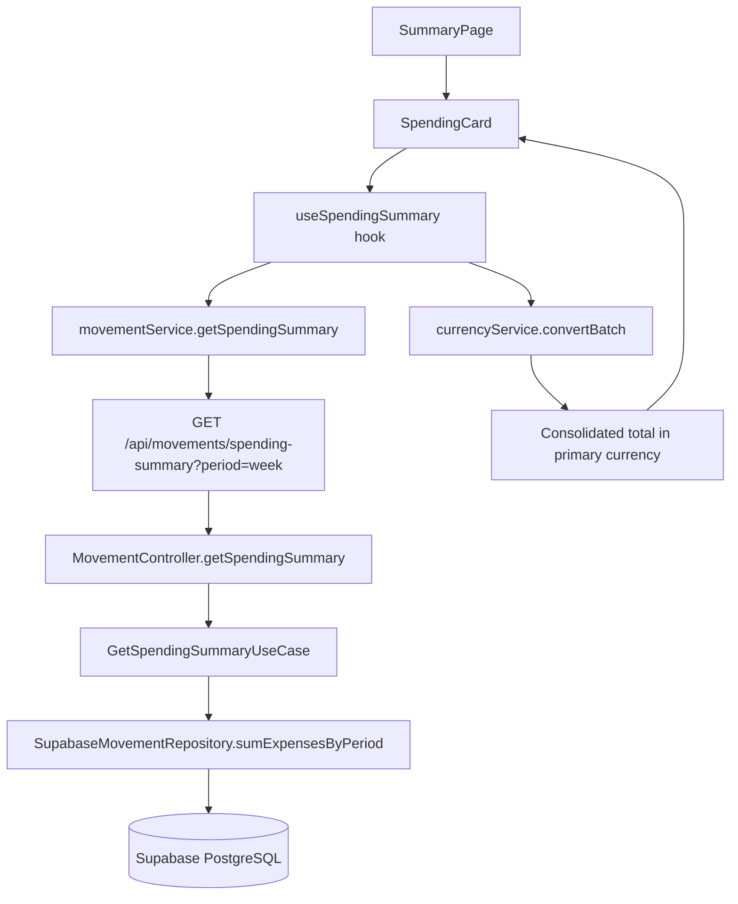

# Tier 1: Spending Summary Card — Research & Task Breakdown

## Summary

Add a "Spending This Week / Today" card to the SummaryPage that gives users an at-a-glance view of their recent spending. Requires a **dedicated backend endpoint** because movements are paginated (max 200/page) and the existing `useMovementsQuery` hook fetches up to 1000 rows client-side — neither guarantees complete data for accurate aggregation. A server-side `SUM` query is both correct and efficient (single DB round-trip, no data transfer overhead).

---

## Current State Analysis

### SummaryPage (`frontend/src/pages/SummaryPage.tsx`)

The page renders:
1. `TotalsSummary` — consolidated net worth across currencies
2. `CurrencyBreakdownSection` — per-currency account cards
3. `FinancialCalendarWidget` — calendar heatmap of daily income/expenses
4. `NetWorthTimelineWidget` — historical net worth chart
5. `RemindersWidget` — upcoming reminders
6. `FixedExpensesSummary` — recurring bills progress

**Gap**: No quick "how much have I spent today/this week/this month" indicator. The calendar widget shows per-day dots but requires visual scanning and doesn't show totals.

### Movement Data Access

| Layer | Current Capability |
|-------|-------------------|
| **Frontend service** | `getAllMovementsPaginated(page, limit)` — max 200/page. `getActiveMovements()` fetches up to 1000 rows. |
| **Frontend hook** | `useMovementsQuery()` — fetches all active movements (up to 1000). `useInfiniteMovementsQuery()` — paginated infinite scroll. |
| **Backend use case** | `GetAllMovementsUseCase` — paginated fetch with `findAll` + `count`. |
| **Repository** | `findAll(userId, filters, pagination)` — supports `startDate`/`endDate` filters. `count(userId, filters)` — supports same filters. |

**Key insight**: The repository already supports `startDate`/`endDate` filtering. We can add a `sumExpenses` method that uses Supabase's aggregate capabilities or a simple filtered query + sum.

### Movement Types

Expense types: `'EgresoNormal'` and `'EgresoFijo'` (from `MovementType`).
Income types: `'IngresoNormal'` and `'IngresoFijo'`.

### Multi-Currency Handling

Movements don't store currency directly — currency is derived from the movement's `accountId` → `Account.currency`. The spending summary endpoint must join with accounts to group by currency, then the frontend converts to primary currency using `currencyService.convertBatch()`.

---

## Design Decision: Backend Endpoint

**Why not client-side?**
1. `useMovementsQuery()` caps at 1000 rows — users with high transaction volume will get incorrect totals
2. Fetching all movements just to sum a subset is wasteful (bandwidth, memory, Vercel free tier limits)
3. A SQL `SUM` with date filter is O(1) network + O(n) DB scan (indexed on `user_id` + `displayed_date`)

**Endpoint design:**

```
GET /api/movements/spending-summary
Query params:
  - period: 'today' | 'week' | 'month' (required)
Response:
  {
    period: 'week',
    startDate: '2026-05-18T00:00:00.000Z',
    endDate: '2026-05-21T23:59:59.999Z',
    totals: {
      // Per-currency expense sums (only currencies with expenses in period)
      "MXN": 1250.50,
      "USD": 45.00
    },
    count: 12,  // number of expense movements in period
    // Comparison data (previous equivalent period)
    previousTotals: {
      "MXN": 980.00,
      "USD": 60.00
    },
    previousCount: 9
  }
```

This gives the frontend everything it needs in a single request: current period totals, previous period for comparison, and counts for context.

---

## Architecture



---

## Task Breakdown

### Task 1: Backend — Spending Summary Endpoint

**Scope**: New use case, repository method, route, and controller action.

**Files to create/modify:**

| Action | File |
|--------|------|
| Create | `backend/src/modules/movements/application/useCases/GetSpendingSummaryUseCase.ts` |
| Create | `backend/src/modules/movements/application/dtos/SpendingSummaryDTO.ts` |
| Modify | `backend/src/modules/movements/infrastructure/IMovementRepository.ts` — add `sumExpensesByPeriod` method |
| Modify | `backend/src/modules/movements/infrastructure/SupabaseMovementRepository.ts` — implement `sumExpensesByPeriod` |
| Modify | `backend/src/modules/movements/presentation/MovementController.ts` — add `getSpendingSummary` action |
| Modify | `backend/src/modules/movements/presentation/routes.ts` — add `GET /spending-summary` route |
| Modify | `backend/src/modules/movements/di/container.ts` (or wherever DI registration happens) — register new use case |

**Implementation details:**

1. **Repository method** `sumExpensesByPeriod(userId, startDate, endDate)`:
   - Query: select `account_id`, `SUM(amount)` from movements where `user_id = ?` AND `type IN ('EgresoNormal', 'EgresoFijo')` AND `displayed_date BETWEEN ? AND ?` AND `is_pending = false` AND `is_orphaned = false`, grouped by `account_id`
   - Join with accounts table to get currency per account_id
   - Return: `Record<Currency, number>` (sum per currency) + count

2. **Use case** `GetSpendingSummaryUseCase`:
   - Accept `period` param, compute `startDate`/`endDate` for current and previous period
   - Period logic:
     - `today`: midnight today → now; previous = yesterday
     - `week`: Monday 00:00 → now; previous = last Monday → last Sunday
     - `month`: 1st of month 00:00 → now; previous = same range in prior month
   - Call repository twice (current + previous period) in parallel
   - Return `SpendingSummaryDTO`

3. **Route**: `GET /api/movements/spending-summary` — placed BEFORE the `/:id` param route to avoid conflict

**Acceptance criteria:**
- Returns correct expense sums grouped by currency for the requested period
- Excludes pending and orphaned movements
- Includes previous period comparison data
- Validates `period` query param (400 if invalid)
- Handles zero-movement periods gracefully (empty totals object)

---

### Task 2: Frontend — SpendingCard Component + Integration

**Scope**: New service method, query hook, component, and SummaryPage integration.

**Files to create/modify:**

| Action | File |
|--------|------|
| Modify | `frontend/src/services/movementService.ts` — add `getSpendingSummary` method |
| Create | `frontend/src/hooks/queries/useSpendingSummaryQuery.ts` |
| Modify | `frontend/src/hooks/queries/index.ts` — export new hook |
| Create | `frontend/src/components/summary/SpendingCard.tsx` |
| Modify | `frontend/src/components/summary/index.ts` — export SpendingCard |
| Modify | `frontend/src/pages/SummaryPage.tsx` — add SpendingCard to layout |

**Implementation details:**

1. **Service method** `movementService.getSpendingSummary(period)`:
   - Calls `GET /api/movements/spending-summary?period=${period}`
   - Returns typed response

2. **Query hook** `useSpendingSummaryQuery(period)`:
   - TanStack Query with key `['movements', 'spending-summary', period]`
   - `staleTime: 1000 * 60 * 2` (2 minutes — spending changes frequently)
   - `refetchOnWindowFocus: true` for fresh data when user returns

3. **SpendingCard component**:
   - Displays "Spent this week: $X" as primary metric (converted to primary currency)
   - Secondary line: "Today: $Y"
   - Comparison badge: "↑ 15% vs last week" or "↓ 8% vs last week" with color coding
   - Daily average: total this month / days elapsed
   - Period toggle (today / week / month) — small pill buttons
   - Loading skeleton while fetching
   - Uses `currencyService.convertBatch()` to consolidate multi-currency totals into primary currency
   - Matches existing card styling (uses `Card` component from `components/ui/Card`)

4. **SummaryPage integration**:
   - Place SpendingCard between `TotalsSummary` and the grid layout
   - Wrap in `ErrorBoundary`
   - Pass `primaryCurrency` from settings

**Acceptance criteria:**
- Shows consolidated spending in primary currency
- Period toggle switches between today/week/month
- Comparison percentage shows increase/decrease vs previous period
- Handles multi-currency conversion correctly
- Loading state shows skeleton
- Error state shows `QueryErrorCard`
- Responsive: full width on mobile, appropriate sizing on desktop

---

## Dependency Order

```
Task 1 (Backend) → Task 2 (Frontend)
```

Task 2 depends on Task 1's endpoint being available. These cannot run in parallel.

---

## Risk Assessment

| Risk | Mitigation |
|------|-----------|
| Supabase doesn't support `SUM` aggregation natively in JS client | Use `.rpc()` with a simple SQL function, OR fetch filtered rows and sum in JS (still efficient since we only fetch amount + account_id columns) |
| Date timezone issues (user in Mexico City vs UTC storage) | Use `displayed_date` which is user-assigned; compute period boundaries in UTC on backend |
| Large number of movements in period slows query | The query only selects `amount` and `account_id` with date filter — should be fast. Add index on `(user_id, displayed_date, type)` if needed |
| Vercel free tier cold starts | Endpoint is lightweight (single aggregation query); cold start is acceptable for dashboard load |

---

## Future Enhancements (Out of Scope)

- Budget vs actual comparison ("You've spent 60% of your weekly budget")
- Category breakdown within the spending card
- Spending trend sparkline chart
- Push notifications when spending exceeds threshold
