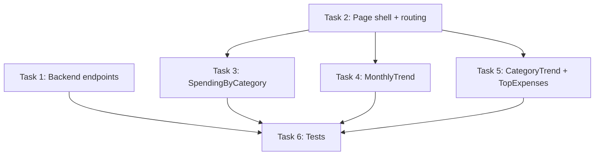

# Tier 2: Reports & Analytics Page — Design + Task Breakdown

## Summary

New `/reports` page providing visual spending analytics using the existing `category` field on movements. Four views: Spending by Category (donut chart + table), Monthly Trend (bar chart), Category Trend (line chart), and Top Expenses (ranked list). Requires 3 new backend endpoints and a new frontend page with Recharts (already a dependency).

## Current State Analysis

### Movement Type (relevant fields)
```typescript
interface Movement {
  id: string;
  type: MovementType; // 'IngresoNormal' | 'EgresoNormal' | 'IngresoFijo' | 'EgresoFijo'
  amount: number;
  displayedDate: string; // ISO date
  category?: string;     // Added in Tier 1
  tags?: string[];       // Added in Tier 1
  isPending?: boolean;
  isOrphaned?: boolean;
  accountId: string;
  pocketId: string;
}
```

### Predefined Categories (13 total)
`Food`, `Transport`, `Bills`, `Entertainment`, `Shopping`, `Health`, `Education`, `Salary`, `Investment`, `Gifts`, `Subscriptions`, `Transfer`, `Other`

Each has a color defined in `CATEGORY_COLORS` and a helper `getCategoryColor(category)`.

### Existing Patterns
- **Backend**: Clean architecture — `domain/` → `application/useCases/` → `infrastructure/` → `presentation/`
- **DI**: `tsyringe` with `@injectable()` and `@inject('MovementRepository')`
- **Routes**: Express Router, `authMiddleware`, Zod validation via `validateBody()`
- **Frontend queries**: TanStack Query with `useQuery`/`useInfiniteQuery`, 5-min stale time
- **Charts**: Recharts already used in `NetWorthChart.tsx`
- **Navigation**: `NAV_ITEMS` array in `Layout.tsx`, `BOTTOM_NAV_ITEMS` for mobile
- **Pages**: Lazy-loaded via `React.lazy()` in `App.tsx`
- **Route mounting**: `app.use('/api/<resource>', cacheMiddleware, routes)` in `server.ts`

---

## Architecture Design

### Backend: New Reports Module

Create a dedicated `reports` module following existing patterns:

```
backend/src/modules/reports/
├── presentation/
│   ├── routes.ts
│   ├── ReportsController.ts
│   └── schemas.ts
├── application/
│   ├── useCases/
│   │   ├── GetSpendingByCategoryUseCase.ts
│   │   ├── GetMonthlyTrendUseCase.ts
│   │   └── GetCategoryTrendUseCase.ts
│   └── dtos/
│       └── ReportsDTO.ts
└── infrastructure/
    ├── IReportsRepository.ts
    └── SupabaseReportsRepository.ts
```

### API Endpoints

#### `GET /api/reports/spending-by-category`
Query params: `startDate` (ISO), `endDate` (ISO)

Response:
```typescript
{
  data: Array<{
    category: string;
    total: number;
    count: number;
    percentage: number; // pre-calculated server-side
  }>;
  totalExpenses: number;
  currency: string; // primary currency from settings
}
```

SQL approach: Group by `category` where `type IN ('EgresoNormal', 'EgresoFijo')`, `is_pending = false`, `is_orphaned = false`, within date range. Join accounts for currency filtering (primary currency only, or group by currency).

#### `GET /api/reports/monthly-trend`
Query params: `months` (number, default 6, max 24)

Response:
```typescript
{
  data: Array<{
    month: string;      // 'YYYY-MM'
    income: number;
    expenses: number;
    net: number;        // income - expenses
  }>;
  currency: string;
}
```

SQL approach: Group by `date_trunc('month', displayed_date)`, sum income types vs expense types separately.

#### `GET /api/reports/category-trend`
Query params: `category` (string), `months` (number, default 6, max 24)

Response:
```typescript
{
  data: Array<{
    month: string;  // 'YYYY-MM'
    total: number;
    count: number;
  }>;
  category: string;
  currency: string;
}
```

SQL approach: Filter by category, group by month, sum amounts.

### Frontend: Reports Page Structure

```
frontend/src/
├── pages/ReportsPage.tsx                    # Page shell with tab navigation
├── components/reports/
│   ├── SpendingByCategory.tsx               # Donut chart + breakdown table
│   ├── MonthlyTrend.tsx                     # Bar chart (income vs expenses)
│   ├── CategoryTrend.tsx                    # Line chart for single category
│   ├── TopExpenses.tsx                      # Ranked list of largest movements
│   └── PeriodSelector.tsx                   # Shared date range picker
├── services/reportService.ts                # API client methods
└── hooks/queries/useReportsQueries.ts       # TanStack Query hooks
```

### Period Selector Options
- This month (default)
- Last month
- Last 3 months
- Last 6 months
- Year to date
- Custom range (date pickers)

---

## UI Wireframe (text)

```
┌─────────────────────────────────────────────────────────┐
│ Reports & Analytics                    [Period Selector] │
├─────────────────────────────────────────────────────────┤
│ [By Category] [Monthly Trend] [Category Trend] [Top]    │
├─────────────────────────────────────────────────────────┤
│                                                         │
│  ┌──────────────────┐  ┌─────────────────────────────┐ │
│  │   Donut Chart    │  │  Category    Amount    %     │ │
│  │                  │  │  ─────────────────────────── │ │
│  │   Total: $X,XXX  │  │  Food        $450    32%    │ │
│  │                  │  │  Transport   $200    14%    │ │
│  │                  │  │  Bills       $180    13%    │ │
│  └──────────────────┘  │  ...                        │ │
│                         └─────────────────────────────┘ │
└─────────────────────────────────────────────────────────┘
```

---

## Task Breakdown

### Task 1: Backend — Reports Module + Endpoints
**Scope**: 7 files (new module)
**Dependencies**: None

Files to create:
1. `backend/src/modules/reports/infrastructure/IReportsRepository.ts` — interface
2. `backend/src/modules/reports/infrastructure/SupabaseReportsRepository.ts` — Supabase queries
3. `backend/src/modules/reports/application/dtos/ReportsDTO.ts` — response types
4. `backend/src/modules/reports/application/useCases/GetSpendingByCategoryUseCase.ts`
5. `backend/src/modules/reports/application/useCases/GetMonthlyTrendUseCase.ts`
6. `backend/src/modules/reports/application/useCases/GetCategoryTrendUseCase.ts`
7. `backend/src/modules/reports/presentation/schemas.ts` — Zod validation for query params
8. `backend/src/modules/reports/presentation/ReportsController.ts` — controller
9. `backend/src/modules/reports/presentation/routes.ts` — Express router

Files to modify:
1. `backend/src/server.ts` — mount `/api/reports` with `cacheMovements` middleware

**Implementation notes**:
- Repository queries use raw Supabase `.rpc()` or `.from('movements').select()` with aggregation
- All queries filter: `is_pending = false`, `is_orphaned = false`, user_id match
- For multi-currency: filter to primary currency (from settings) OR return per-currency breakdowns
- Register repository in DI container (check existing pattern in `container.ts` or similar)

---

### Task 2: Frontend — ReportsPage Shell + Routing + Navigation
**Scope**: 5 files
**Dependencies**: None (can run in parallel with Task 1 using mock data)

Files to create:
1. `frontend/src/pages/ReportsPage.tsx` — page shell with tab navigation between views
2. `frontend/src/services/reportService.ts` — API client methods for 3 endpoints
3. `frontend/src/hooks/queries/useReportsQueries.ts` — TanStack Query hooks
4. `frontend/src/components/reports/PeriodSelector.tsx` — shared period picker component

Files to modify:
1. `frontend/src/App.tsx` — add lazy import + route for `/reports`
2. `frontend/src/components/layout/Layout.tsx` — add to `NAV_ITEMS` (icon: `BarChart3` from lucide)
3. `frontend/src/pages/index.ts` — export ReportsPage
4. `frontend/src/hooks/queries/index.ts` — export new hooks

**Implementation notes**:
- Use `BarChart3` icon from lucide-react for nav
- Add to `NAV_ITEMS` between Templates and Settings
- Don't add to `BOTTOM_NAV_ITEMS` (keep mobile bottom bar minimal, accessible via Menu)
- PeriodSelector returns `{ startDate: string, endDate: string }` — compute from preset or custom
- Tab state managed with local `useState` or URL search params

---

### Task 3: Frontend — SpendingByCategory View
**Scope**: 2 files
**Dependencies**: Task 2 (needs hooks + PeriodSelector)

Files to create:
1. `frontend/src/components/reports/SpendingByCategory.tsx`

**Implementation notes**:
- Recharts `PieChart` with `Pie` (donut via `innerRadius`)
- Use `CATEGORY_COLORS` from `constants/categories.ts` for consistent colors
- Center label showing total expenses
- Table below chart: category name (with color dot), amount, percentage, count
- Sort by amount descending
- Handle empty state (no expenses in period)
- Responsive: chart stacks above table on mobile

---

### Task 4: Frontend — MonthlyTrend View
**Scope**: 1 file
**Dependencies**: Task 2 (needs hooks)

Files to create:
1. `frontend/src/components/reports/MonthlyTrend.tsx`

**Implementation notes**:
- Recharts `BarChart` with two `Bar` components (income = green, expenses = red)
- `Line` overlay for net (income - expenses) in blue
- X-axis: month labels (e.g., "Jan", "Feb")
- Y-axis: currency-formatted amounts
- Tooltip showing all three values
- Legend at top
- Month selector: 6 or 12 months toggle
- Responsive container

---

### Task 5: Frontend — CategoryTrend + TopExpenses Views
**Scope**: 2 files
**Dependencies**: Task 2 (needs hooks)

Files to create:
1. `frontend/src/components/reports/CategoryTrend.tsx`
2. `frontend/src/components/reports/TopExpenses.tsx`

**CategoryTrend implementation**:
- Dropdown to select category (from `PREDEFINED_CATEGORIES`)
- Recharts `LineChart` showing spending in that category over time
- Area fill with category color
- Month selector: 6 or 12 months

**TopExpenses implementation**:
- Ranked list of largest individual expense movements in selected period
- Show: rank, amount, notes/description, category badge, date
- Optional category filter dropdown
- Limit to top 10-20 items
- Uses existing `useInfiniteMovementsQuery` with category filter OR a dedicated query
- Can be computed client-side from movements data (no new endpoint needed)

---

### Task 6: Tests
**Scope**: 4-5 files
**Dependencies**: Tasks 1-5

Files to create:
1. `backend/src/modules/reports/presentation/ReportsController.integration.test.ts`
2. `backend/src/modules/reports/application/useCases/GetSpendingByCategoryUseCase.test.ts`
3. `backend/src/modules/reports/application/useCases/GetMonthlyTrendUseCase.test.ts`
4. `frontend/src/pages/__tests__/ReportsPage.test.tsx`
5. `frontend/src/components/reports/__tests__/PeriodSelector.test.tsx`

**Test coverage**:
- Backend: unit tests for use cases with mocked repository, integration test for routes
- Frontend: render tests for page shell, period selector interaction, mock API responses
- Edge cases: empty data, single month, all categories null

---

## Execution Order



- **Wave 1** (parallel): Task 1 + Task 2
- **Wave 2** (parallel, after Task 2): Task 3 + Task 4 + Task 5
- **Wave 3** (after all): Task 6

---

## Technical Decisions

| Decision | Choice | Rationale |
|----------|--------|-----------|
| Separate module vs extend movements | New `reports` module | Clean separation, reports are read-only analytics |
| Single endpoint vs multiple | 3 separate endpoints | Each has different params and response shapes |
| Multi-currency handling | Filter to primary currency | Simplifies charts; user sets primary in settings |
| Chart library | Recharts | Already in use for net worth charts |
| Top Expenses data source | Client-side from movements query | Avoids new endpoint; movements already fetched |
| Period selector | Presets + custom range | Covers 90% of use cases with presets, custom for power users |
| Tab navigation | URL search params (`?view=category`) | Shareable links, browser back works |
| Cache strategy | `cacheMovements` (60s/120s) | Reports are derived from movements, same volatility |

---

## Dependencies & Prerequisites

- Categories must be populated on movements (Tier 1 complete)
- Recharts already in `frontend/package.json`
- No new npm packages needed
- No database migrations needed (queries existing `movements` table)
- DI container registration needed for new repository
