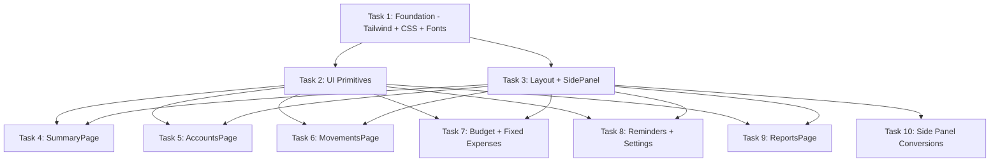

# Tier 2: UI Overhaul — "Luminous Ledger" Design System Implementation

## Summary

Full visual redesign of the finance app from the current light/dark generic Tailwind theme to the "Luminous Ledger" cyber-minimalist glassmorphism design system. Dark obsidian backgrounds, glass cards with backdrop-blur, JetBrains Mono for all numbers, teal primary accent, side panel instead of modals for forms.

**Total tasks**: 10
**Estimated sessions**: 10 (sequential dependency for Tasks 1-3, then 4-10 can run in parallel waves)

---

## Dependency Graph



**Execution order**:
- Wave 1: Task 1 (foundation — everything depends on this)
- Wave 2: Tasks 2 + 3 (can run in parallel — primitives and layout are independent)
- Wave 3: Tasks 4-10 (all page restyling can run in parallel after Wave 2)

---

## Task 1: Foundation — Tailwind Config + Global CSS + Font Imports

### Files to Modify
1. `frontend/src/index.css` — complete rewrite of global styles
2. `frontend/index.html` — add Google Fonts link tags (Inter + JetBrains Mono)
3. `frontend/postcss.config.js` — no change needed (already uses @tailwindcss/postcss)

### Changes

**`index.html`** — Add font imports in `<head>`:
```html
<link rel="preconnect" href="https://fonts.googleapis.com">
<link rel="preconnect" href="https://fonts.gstatic.com" crossorigin>
<link href="https://fonts.googleapis.com/css2?family=Inter:wght@400;500;600;700&family=JetBrains+Mono:wght@400;500;600&display=swap" rel="stylesheet">
```

**`index.css`** — Replace entirely with:
- `@import "tailwindcss"` directive
- `@theme` block defining all custom CSS variables:
  - Surface palette: `--color-surface-base: #0e1416`, `--color-surface-container-low: #171d1e`, `--color-surface-container: #1b2122`, `--color-surface-container-high: #252b2d`, `--color-surface-container-highest: #303638`
  - Text: `--color-on-surface: #dee3e6`, `--color-on-surface-variant: #bcc9cd`, `--color-outline: #869397`, `--color-outline-variant: #3d494c`
  - Accent primary: `--color-primary: #4cd7f6`, `--color-primary-container: #06b6d4`, `--color-on-primary: #003640`
  - Accent secondary: `--color-secondary: #adc6ff`, `--color-secondary-container: #0566d9`
  - Accent tertiary: `--color-tertiary: #ffb873`, `--color-tertiary-container: #e89337`
  - Semantic: `--color-success: #34d399`, `--color-error: #ffb4ab`, `--color-error-container: #93000a`
  - Font families: `--font-display: 'Inter', sans-serif`, `--font-body: 'Inter', sans-serif`, `--font-mono: 'JetBrains Mono', monospace`
  - Border radius: `--radius-card: 12px`, `--radius-button: 8px`, `--radius-pill: 9999px`
- Glass card utility classes:
  ```css
  .glass-card {
    background: rgba(27, 33, 34, 0.8);
    backdrop-filter: blur(12px);
    border: 1px solid rgba(255, 255, 255, 0.08);
    border-radius: 12px;
  }
  .glass-panel {
    background: rgba(37, 43, 45, 0.9);
    backdrop-filter: blur(20px);
    border: 1px solid rgba(255, 255, 255, 0.1);
    border-radius: 16px;
  }
  ```
- Existing animations (toast, slide-in, modal, backdrop) — keep but update easing to `cubic-bezier(0.4, 0, 0.2, 1)`
- Custom scrollbar updated to match obsidian theme
- Remove all `dark:` conditional logic — this is dark-mode-only now (light mode toggle removed for initial launch)

### Acceptance Criteria
- [ ] Fonts load correctly (Inter for text, JetBrains Mono for numbers)
- [ ] CSS variables are accessible via `var(--color-*)` and Tailwind classes
- [ ] `glass-card` and `glass-panel` utility classes work with backdrop-blur
- [ ] Page background is `#0e1416` by default
- [ ] No `dark:` prefixes needed — everything is dark mode
- [ ] App still renders without visual breakage (components will look wrong but not crash)
- [ ] Build passes (`npm run build`)

### Dependencies
None — this is the foundation.

---

## Task 2: UI Primitives Restyle

### Files to Modify
1. `frontend/src/components/ui/Button.tsx`
2. `frontend/src/components/ui/Card.tsx`
3. `frontend/src/components/ui/Input.tsx`
4. `frontend/src/components/ui/Select.tsx`
5. `frontend/src/components/ui/ProgressBar.tsx`
6. `frontend/src/components/ui/AnimatedProgressBar.tsx`
7. `frontend/src/components/ui/PageHeader.tsx`
8. `frontend/src/components/ui/EmptyState.tsx`

### Changes

**Button.tsx**:
- Primary: `bg-gradient-to-r from-primary-container to-primary text-on-primary` with cyan glow on hover (`shadow-[0_0_20px_rgba(76,215,246,0.3)]`)
- Secondary/Ghost: transparent with `border border-primary/30 text-primary` hover brightens border
- Danger: `bg-error/10 text-error border border-error/20`
- Remove all `dark:` prefixes
- Border radius: `rounded-lg` (8px)
- Hover: `hover:scale-[1.02]` transition
- Press: `active:scale-[0.98]`

**Card.tsx**:
- Default: glass-card effect (`bg-surface-container/80 backdrop-blur-[12px] border border-white/[0.08] rounded-xl`)
- Interactive: same + `hover:bg-surface-container-high/80 hover:scale-[1.01]`
- Highlighted: `border-primary/40 bg-primary/5`
- Danger: `border-error/40 bg-error/5`
- Remove shadow-sm, remove all `dark:` prefixes

**Input.tsx**:
- Background: `bg-surface-container-highest`
- Border: `border-outline-variant` → focus: `border-primary ring-2 ring-primary/20`
- Text: `text-on-surface`
- Label: `text-on-surface-variant uppercase text-xs tracking-wider font-semibold`
- Error: `border-error ring-error/20`
- Border radius: `rounded-lg` (8px)
- Remove all `dark:` prefixes

**Select.tsx**:
- Same treatment as Input
- Custom arrow color: `text-on-surface-variant`

**ProgressBar.tsx + AnimatedProgressBar.tsx**:
- Track: `bg-surface-container-highest rounded-full h-1.5`
- Fill: `bg-gradient-to-r from-primary-container to-primary rounded-full`
- Danger variant: `from-error-container to-error`

**PageHeader.tsx**:
- Title: `text-on-surface font-display font-semibold text-2xl tracking-tight`
- Remove gradient text effects

**EmptyState.tsx**:
- Icon: `text-on-surface-variant/50`
- Title: `text-on-surface`
- Description: `text-on-surface-variant`

### Acceptance Criteria
- [ ] All primitives use the new color palette (no gray-*, blue-*, etc.)
- [ ] No `dark:` prefixes remain in these files
- [ ] Glass card effect visible with backdrop-blur
- [ ] Buttons have teal gradient for primary, glow on hover
- [ ] Inputs have darker background than cards
- [ ] Progress bars use teal gradient fill
- [ ] Build passes, existing tests pass (update snapshots if needed)

### Dependencies
Task 1 (CSS variables and font families must exist)

---

## Task 3: Layout + SidePanel Component

### Files to Modify
1. `frontend/src/components/layout/Layout.tsx`
2. `frontend/src/components/layout/Sidebar.tsx`
3. `frontend/src/components/layout/BottomNav.tsx`
4. `frontend/src/components/ui/FloatingPanel.tsx` — rename/rework into `SidePanel.tsx`
5. `frontend/src/components/ui/index.ts` — export SidePanel

### Changes

**Layout.tsx**:
- Background: `bg-surface-base` (remove `bg-gray-50 dark:bg-gray-900`)
- Main content: `md:ml-60` (sidebar is 240px)
- Remove `dark:` prefixes

**Sidebar.tsx** — Major restyle:
- Background: `bg-surface-container-low/90 backdrop-blur-xl border-r border-white/[0.06]`
- Width: `w-60` (240px)
- Logo: Replace green gradient with teal gradient (`from-primary-container to-primary`), app name in `text-on-surface`
- Remove "Manage your money" subtitle
- Nav items:
  - Active: vertical teal pill on left (`before:absolute before:left-0 before:top-1/2 before:-translate-y-1/2 before:h-6 before:w-1 before:rounded-full before:bg-primary`) + `bg-primary/10 text-primary`
  - Inactive: `text-on-surface-variant hover:text-on-surface hover:bg-surface-container-high/50`
  - Remove gradient active state, remove scale transforms
- Icons: 20px, consistent
- Footer: `border-t border-white/[0.06]`, email in `text-on-surface-variant text-sm`
- Remove theme toggle (dark-only for now)
- Remove all `dark:` prefixes

**BottomNav.tsx** — Restyle:
- Header: `bg-surface-container-low/95 backdrop-blur-xl border-b border-white/[0.06]`
- Bottom bar: same glass treatment
- Active item: `text-primary` with pill indicator
- Drawer: glass panel background
- Remove theme toggle
- Remove all `dark:` prefixes

**SidePanel.tsx** (new, replaces FloatingPanel concept):
- Fixed right panel, `w-[400px]` on desktop, full-screen bottom sheet on mobile
- Background: `glass-panel` class (blur-20, elevated surface)
- Slide-in from right: `translateX(100%) → translateX(0)`, 300ms, Material easing
- Header: title + close button, thin bottom border (`border-white/[0.06]`)
- Backdrop overlay on mobile (semi-transparent)
- Focus trap and Escape to close
- Props: `isOpen`, `onClose`, `title`, `children`, `width?`
- Mobile (<768px): becomes full-width bottom sheet sliding up from bottom

### Acceptance Criteria
- [ ] Sidebar has obsidian glass background with teal active indicators
- [ ] No green gradients remain — all teal/cyan
- [ ] Active nav item has vertical teal pill on left edge
- [ ] SidePanel slides in from right at 400px width
- [ ] SidePanel becomes bottom sheet on mobile
- [ ] SidePanel has focus trap and Escape-to-close
- [ ] Layout background is `#0e1416`
- [ ] No `dark:` prefixes in any layout file
- [ ] Build passes

### Dependencies
Task 1 (CSS variables, glass utilities, animations)

---

## Task 4: SummaryPage Restyle

### Files to Modify
1. `frontend/src/pages/SummaryPage.tsx`
2. `frontend/src/components/summary/TotalsSummary.tsx`
3. `frontend/src/components/summary/SpendingCard.tsx`
4. `frontend/src/components/summary/AccountSummaryCard.tsx`
5. `frontend/src/components/summary/AccountSummaryCardCompact.tsx`
6. `frontend/src/components/summary/CurrencySection.tsx`
7. `frontend/src/components/summary/FloatingStatsBar.tsx`

### Changes

- **TotalsSummary**: Large net worth number in `font-mono text-3xl font-semibold text-on-surface`, currency pill badges with `bg-primary/10 text-primary font-mono text-sm rounded-full px-3 py-1`
- **SpendingCard**: Glass card, sparkline chart themed with teal, comparison percentages in `font-mono` with `text-success` or `text-error`
- **AccountSummaryCard**: Glass card with colored left border (user color), balance in `font-mono text-xl`, pocket list with `text-on-surface-variant`
- **CurrencySection**: Section headers in `text-on-surface-variant uppercase text-xs tracking-wider font-semibold`
- **FloatingStatsBar**: `glass-panel` sticky at bottom, stats in `font-mono`
- All amounts: `font-mono` class
- All cards: use `<Card>` component (which now has glass effect)
- Remove all `dark:` prefixes and gray-* colors

### Acceptance Criteria
- [ ] All financial numbers use JetBrains Mono
- [ ] Cards have glass effect with subtle borders
- [ ] Currency badges are pill-shaped with teal tint
- [ ] Spending comparison uses green/red semantic colors
- [ ] No `dark:` prefixes remain
- [ ] Page renders correctly with real data
- [ ] Build passes

### Dependencies
Tasks 2 + 3

---

## Task 5: AccountsPage Restyle

### Files to Modify
1. `frontend/src/pages/AccountsPage.tsx`
2. `frontend/src/components/accounts/AccountCard.tsx`
3. `frontend/src/components/accounts/CDAccountCard.tsx`
4. `frontend/src/components/accounts/PocketCard.tsx`
5. `frontend/src/components/accounts/AccountDetailPanel.tsx`
6. `frontend/src/components/accounts/PocketManagementSection.tsx`

### Changes

- **AccountCard**: Glass card with colored top border (3px, user-assigned color), balance in `font-mono text-xl text-on-surface`, currency badge as pill, pocket list with subtle dividers (`border-white/[0.06]`)
- **CDAccountCard**: Same glass treatment, maturity progress bar with teal fill, interest rate in `font-mono text-primary`
- **PocketCard**: Lighter glass variant, balance in `font-mono`, inline edit styling
- **AccountsPage**: Grid layout with `gap-4`, "Add Account" button uses primary variant
- **AccountDetailPanel**: Will use SidePanel in Task 10, for now just restyle colors
- **PocketManagementSection**: Dividers use `border-white/[0.06]`, add/edit buttons ghost style
- Remove all `dark:` prefixes, replace gray-* with surface palette

### Acceptance Criteria
- [ ] Account cards have glass effect with colored top border
- [ ] All balances in JetBrains Mono
- [ ] Currency shown as pill badge
- [ ] CD cards show progress bar with teal gradient
- [ ] No `dark:` prefixes remain
- [ ] Build passes

### Dependencies
Tasks 2 + 3

---

## Task 6: MovementsPage Restyle

### Files to Modify
1. `frontend/src/pages/MovementsPage.tsx`
2. `frontend/src/components/movements/MovementList.tsx`
3. `frontend/src/components/movements/MovementFilters.tsx`
4. `frontend/src/components/movements/QuickAddMovement.tsx`
5. `frontend/src/components/movements/CategorySelector.tsx`
6. `frontend/src/components/movements/TagInput.tsx`
7. `frontend/src/components/ui/InlineEditableAmount.tsx`

### Changes

- **MovementsPage**: Page background inherits from layout, section spacing with `gap-4`
- **MovementList**: Table rows with `border-b border-white/[0.06]`, hover: `bg-surface-container-high/50`, amounts in `font-mono` with `text-success` (income) / `text-error` (expense), date column in `font-mono text-on-surface-variant`, category as pill badge
- **MovementFilters**: Glass card container, filter inputs use restyled Input/Select, active filters as teal pills
- **QuickAddMovement**: Glass card strip, amount input large `font-mono text-2xl`, type toggle with teal active state
- **CategorySelector**: Grid of category pills with low-opacity colored backgrounds
- **TagInput**: Tags as pills with `bg-primary/10 text-primary rounded-full`
- **InlineEditableAmount**: `font-mono`, edit mode uses `bg-surface-container-highest border-primary`
- Pending movements: `opacity-60 border-dashed border-outline-variant`
- Orphaned movements: subtle `bg-tertiary/5 border-l-2 border-tertiary` indicator

### Acceptance Criteria
- [ ] All amounts in JetBrains Mono with correct semantic colors
- [ ] Table rows have subtle horizontal dividers only
- [ ] Hover state brightens row background
- [ ] Category badges are pill-shaped with category color
- [ ] Pending movements visually distinct (dashed, muted)
- [ ] No `dark:` prefixes remain
- [ ] Build passes

### Dependencies
Tasks 2 + 3

---

## Task 7: BudgetPage + FixedExpensesPage Restyle

### Files to Modify
1. `frontend/src/pages/BudgetPlanningPage.tsx`
2. `frontend/src/components/budget/BudgetEntryRow.tsx`
3. `frontend/src/components/budget/BudgetSummaryCard.tsx`
4. `frontend/src/components/budget/BudgetIncomeSection.tsx`
5. `frontend/src/components/budget/DonutChart.tsx`
6. `frontend/src/pages/FixedExpensesPage.tsx`
7. `frontend/src/components/fixed-expenses/FixedExpenseGroupCard.tsx`
8. `frontend/src/components/fixed-expenses/FixedExpensesList.tsx`

### Changes

**Budget**:
- Income input: large `font-mono text-2xl` in glass card
- Distributable amount: highlighted in `text-primary font-mono font-semibold`
- Entry rows: percentage in `font-mono`, calculated amount in `font-mono text-on-surface-variant`, color dot indicator
- Summary card: glass card with donut chart
- DonutChart: teal/blue/purple palette, dark background, white labels

**Fixed Expenses**:
- Group cards: glass card, collapsible with chevron, total in `font-mono`
- Individual expense: name in `text-on-surface`, target in `font-mono text-on-surface-variant`, progress bar (teal gradient), contribution in `font-mono text-primary`
- Enable/disable toggle: teal when active
- Overall progress: large progress bar at group level

- Remove all `dark:` prefixes, replace color palette

### Acceptance Criteria
- [ ] All financial numbers in JetBrains Mono
- [ ] Progress bars use teal gradient
- [ ] Donut chart uses design system palette
- [ ] Glass cards throughout
- [ ] Distributable amount highlighted in teal
- [ ] No `dark:` prefixes remain
- [ ] Build passes

### Dependencies
Tasks 2 + 3

---

## Task 8: RemindersWidget + SettingsPage Restyle

### Files to Modify
1. `frontend/src/components/reminders/RemindersWidget.tsx`
2. `frontend/src/components/reminders/ReminderCard.tsx`
3. `frontend/src/components/reminders/MonthSection.tsx`
4. `frontend/src/pages/SettingsPage.tsx`
5. `frontend/src/components/settings/PreferencesSection.tsx`
6. `frontend/src/components/settings/DefaultAccountsSection.tsx`
7. `frontend/src/components/settings/DangerZoneSection.tsx`

### Changes

**Reminders**:
- Widget container: glass card
- Reminder cards: subtle glass with left border colored by urgency (teal=upcoming, amber=soon, red=overdue)
- Due dates in `font-mono text-on-surface-variant`
- Amounts in `font-mono`
- "Pay Now" button: primary style, "Dismiss": ghost style
- Month section headers: `text-on-surface-variant uppercase text-xs tracking-wider`

**Settings**:
- Page: vertical stack of glass card sections with `gap-6`
- Section headers: `text-on-surface font-semibold text-lg`
- Dividers: `border-white/[0.06]`
- Inputs/selects: use restyled primitives
- Danger zone: `border-error/30 bg-error/5` card with red-tinted content
- Toggle switches: teal when active (`bg-primary`), dark track when inactive

### Acceptance Criteria
- [ ] Reminder urgency indicated by left border color
- [ ] All dates and amounts in JetBrains Mono
- [ ] Settings sections are distinct glass cards
- [ ] Danger zone visually distinct with red tint
- [ ] No `dark:` prefixes remain
- [ ] Build passes

### Dependencies
Tasks 2 + 3

---

## Task 9: ReportsPage Restyle (Charts)

### Files to Modify
1. `frontend/src/pages/ReportsPage.tsx`
2. `frontend/src/components/reports/MonthlyTrend.tsx`
3. `frontend/src/components/reports/SpendingByCategory.tsx`
4. `frontend/src/components/reports/CategoryTrend.tsx`
5. `frontend/src/components/reports/TopExpenses.tsx`
6. `frontend/src/components/reports/PeriodSelector.tsx`

### Changes

- **ReportsPage**: Glass card containers for each chart section
- **All Recharts components**: Apply theme:
  - Background: transparent (sits on glass card)
  - Grid lines: `stroke: rgba(255,255,255,0.06)`
  - Axis labels: `fill: var(--color-on-surface-variant)`, `fontFamily: 'Inter'`
  - Axis tick values: `fill: var(--color-on-surface-variant)`, `fontFamily: 'JetBrains Mono'`
  - Line charts: `stroke: var(--color-primary)`, area fill with teal gradient (0.3 → 0 opacity)
  - Bar charts: `fill: var(--color-primary-container)`
  - Pie/donut: palette of `[primary, secondary, tertiary, success, error]`
  - Tooltip: glass-panel style background, `font-mono` for values
- **PeriodSelector**: Pill-shaped toggle buttons, active = `bg-primary/10 text-primary border-primary/30`
- **TopExpenses**: List with amounts in `font-mono`, category pills
- Remove all `dark:` prefixes

### Acceptance Criteria
- [ ] Charts use teal/cyan as primary color
- [ ] Grid lines are subtle (6% white)
- [ ] Tooltips have glass effect
- [ ] All numeric labels in JetBrains Mono
- [ ] Period selector uses pill-shaped active state
- [ ] No `dark:` prefixes remain
- [ ] Build passes

### Dependencies
Tasks 2 + 3

---

## Task 10: Modal → Side Panel Conversions + Forms Restyle

### Files to Modify
1. `frontend/src/components/movements/MovementFormPanel.tsx` — convert to use SidePanel
2. `frontend/src/components/movements/MovementForm.tsx` — restyle form fields
3. `frontend/src/components/accounts/AccountForm.tsx` — restyle + use SidePanel
4. `frontend/src/components/accounts/PocketForm.tsx` — restyle
5. `frontend/src/components/fixed-expenses/FixedExpenseForm.tsx` — restyle + use SidePanel
6. `frontend/src/components/fixed-expenses/FixedExpenseGroupForm.tsx` — restyle
7. `frontend/src/components/reminders/ReminderForm.tsx` — restyle + use SidePanel
8. `frontend/src/components/ui/Modal.tsx` — keep for confirmations only, restyle to glass

### Changes

**Modal → SidePanel conversions**:
- MovementFormPanel already exists as a panel concept — rewire to use new SidePanel component
- AccountForm: wrap in SidePanel (triggered from AccountsPage "Add Account" / edit actions)
- FixedExpenseForm: wrap in SidePanel
- ReminderForm: wrap in SidePanel
- Update parent pages to pass `isOpen`/`onClose` to SidePanel wrappers

**Form restyling** (all forms):
- Labels: `text-on-surface-variant uppercase text-xs tracking-wider font-semibold mb-1`
- Inputs: already restyled in Task 2, just ensure usage
- Amount inputs: add `font-mono` class
- Form sections: separated by `border-b border-white/[0.06] pb-4 mb-4`
- Submit buttons: primary style at bottom
- Cancel: ghost style

**Modal.tsx** (kept for ConfirmDialog, ColorPicker, etc.):
- Backdrop: `bg-black/60 backdrop-blur-sm`
- Content: `glass-panel` class, `rounded-2xl`
- Remove `bg-white dark:bg-gray-800`, use surface palette
- Remove all `dark:` prefixes

### Acceptance Criteria
- [ ] All create/edit forms open in SidePanel (right slide-in, 400px)
- [ ] Forms have consistent label styling (uppercase, small, muted)
- [ ] Amount inputs use JetBrains Mono
- [ ] Modal component still works for confirmations with glass styling
- [ ] SidePanel becomes bottom sheet on mobile
- [ ] No `dark:` prefixes remain in any modified file
- [ ] Build passes
- [ ] Forms are still fully functional (create, edit, submit)

### Dependencies
Tasks 2 + 3 (SidePanel component must exist, primitives must be restyled)

---

## Global Rules for All Tasks

1. **No `dark:` prefixes** — the app is dark-mode-only for this redesign
2. **All numbers use `font-mono`** — amounts, dates, percentages, counts
3. **No drop shadows** — use glass/blur for depth
4. **No pure black (`#000`) or pure white (`#fff`)** — use the surface/on-surface palette
5. **Teal (`--color-primary`) for interactive elements only** — don't use it for static decoration
6. **Income = `text-success`**, **Expense = `text-error`**, **Pending = `text-tertiary`**
7. **Border radius**: cards 12px (`rounded-xl`), buttons/inputs 8px (`rounded-lg`), badges/pills full (`rounded-full`)
8. **Transitions**: 150-200ms for micro-interactions, `cubic-bezier(0.4, 0, 0.2, 1)`
9. **Build must pass** after each task — run `npm run build`
10. **Update test snapshots** if tests fail due to class name changes — but don't break test logic

---

## Notes

- The existing `FloatingPanel.tsx` is a small positioned panel (not a full side panel). Task 3 creates a proper `SidePanel.tsx` that replaces it for form use cases. The old FloatingPanel can remain for non-form floating UI (like the account context panel).
- The `ColorPickerModal` and `ConfirmDialog` should remain as modals (centered overlay) — only form-heavy flows move to side panel.
- Light mode toggle is removed for initial launch. Can be re-added later as a separate task.
- The `QuickActionsFAB` component should also get teal styling but is low priority — can be done in any page task that touches it.
