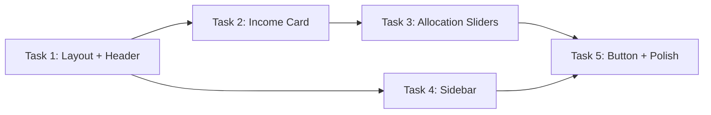

# UI Rebuild: Budget Planning Page

## Summary

Structural rebuild of the Budget Planning page to match the Stitch design reference (`.agents/design/reference/stitch-budget-page.html`). The current page is a single-column vertical stack; the target is a two-column layout with a rich sidebar, slider-based allocation, and new stat widgets.

## Current State

**Page**: `frontend/src/pages/BudgetPlanningPage.tsx`
**Components**: `frontend/src/components/budget/`

Current structure (top-to-bottom single column):
1. PageHeader + AccountPocketSelector + "Create Movements" button
2. `BudgetIncomeSection` — plain number input in a Card
3. `ScenarioSection` — grid of scenario cards with toggle/edit/delete
4. `BudgetSummaryCard` — initial amount, fixed expenses bar, "Safe to Spend" indicator
5. `BudgetDistribution` — table-style entry rows with edit/save inline, donut chart above table
6. Empty state for missing fixed pocket
7. Modals: ScenarioForm, BatchMovementForm

## Target State (Stitch Design)

```mermaid
graph TD
    subgraph Header
        A[Title: Budget Planning + subtitle]
        B[Scenario Tabs: Normal Month | Holiday | Crisis Mode | + Add]
    end

    subgraph MainContent["Main Area (col-span-8)"]
        C[Income Card: Monthly Income input + Fixed Expenses deduction + Distributable result]
        D[Allocation Strategy Card: entry rows with colored dot + name + percentage + slider + dollar amount]
        E[Generate Movements Button: full-width teal gradient]
    end

    subgraph Sidebar["Sidebar (col-span-4)"]
        F[Portfolio Distribution: SVG donut chart with total in center]
        G[Stats: Savings Rate + Burn Rate cards]
        H[Historical Accuracy: progress bars]
        I[Scenario Advisor: decorative card]
    end

    Header --> MainContent
    Header --> Sidebar
```

### Key Structural Differences

| Aspect | Current | Target |
|--------|---------|--------|
| Layout | Single column `space-y-6` | 12-col grid: `col-span-8` main + `col-span-4` sidebar |
| Header | PageHeader + selector + button | Title/subtitle left + scenario tab bar right |
| Income | Standalone input card | Combined card: income input + fixed deduction + distributable result |
| Allocation | Table grid with edit/save mode | Slider rows: colored dot, name, percentage text, range input |
| Chart | Inside BudgetDistribution, above table | Sidebar standalone card with SVG donut + center total |
| Stats | None | Savings Rate + Burn Rate stat cards in sidebar |
| Generate button | Top-right secondary button | Full-width teal gradient at bottom of allocation card |
| Scenarios | Grid of toggleable cards | Tab bar in header (pill buttons) |

---

## Task Breakdown

### Task 1: Page Layout + Header with Scenario Tabs

**Files to modify:**
- `frontend/src/pages/BudgetPlanningPage.tsx` (major restructure)
- `frontend/src/components/budget/BudgetScenarioTabs.tsx` (new)

**What to do:**
1. Replace the top-level `<div className="space-y-6">` with a two-section layout:
   - Header section: flex row with title/subtitle on left, scenario tab bar on right
   - Body: `grid grid-cols-12 gap-4` with main (`col-span-12 lg:col-span-8`) and sidebar (`col-span-12 lg:col-span-4`)
2. Create `BudgetScenarioTabs` component:
   - Renders a glass-card pill container with scenario buttons
   - Active scenario gets `bg-primary/10 text-primary font-bold` styling
   - Inactive gets `text-on-surface-variant hover:bg-white/5`
   - Divider + "add" icon button at end
   - Props: `scenarios`, `activeId`, `onSelect`, `onCreate`
3. Remove the old `PageHeader` + `AccountPocketSelector` from the header area
   - Move `AccountPocketSelector` into a settings/config area or keep as a small dropdown inside the income card
4. The page skeleton/loading state should match the new two-column layout

**Stitch reference classes:**
- Header: `flex flex-col md:flex-row md:items-end justify-between gap-6 mb-8`
- Tab bar: `glass-card p-1.5 rounded-xl` with buttons `px-4 py-2 rounded-lg`
- Grid: `grid grid-cols-12 gap-gutter`
- Main: `col-span-12 lg:col-span-8 flex flex-col gap-gutter`
- Sidebar: `col-span-12 lg:col-span-4 flex flex-col gap-gutter`

**Dependencies:** None (foundational task)

---

### Task 2: Income / Distributable Card Rebuild

**Files to modify:**
- `frontend/src/components/budget/BudgetIncomeCard.tsx` (new, replaces `BudgetIncomeSection` + `BudgetSummaryCard`)

**What to do:**
1. Create a single `BudgetIncomeCard` component that combines:
   - Left half: "Monthly Income" label (uppercase small caps) + large `$` prefix + editable amount input (headline-xl size, transparent bg, no border)
   - Divider: `h-px md:h-16 w-full md:w-px bg-white/10`
   - Right half: "Fixed Expenses" line with red amount + "Distributable" highlighted box with primary color amount
2. Layout: `glass-card rounded-2xl p-card-padding flex flex-col md:flex-row items-center gap-8`
3. The input should be styled as a large transparent field (no visible border, just the number)
4. Fixed expenses value comes from `totalFixedExpenses` prop
5. Distributable = initialAmount - totalFixedExpenses, shown in a `bg-primary/10 border border-primary/20 rounded-lg p-3` box

**Props interface:**
```typescript
interface BudgetIncomeCardProps {
  initialAmount: number;
  onAmountChange: (value: number) => void;
  totalFixedExpenses: number;
  distributable: number;
  currency: string;
}
```

**Replaces:** `BudgetIncomeSection` + the top portion of `BudgetSummaryCard`
**Keep:** The "over budget" warning from BudgetSummaryCard can be a conditional inside this card or a separate small alert

**Dependencies:** Task 1 (needs to be placed in the main column)

---

### Task 3: Allocation Strategy Section with Slider Entries

**Files to modify:**
- `frontend/src/components/budget/AllocationStrategy.tsx` (new, replaces `BudgetDistribution`)
- `frontend/src/components/budget/AllocationSliderRow.tsx` (new, replaces `BudgetEntryRow`)

**What to do:**

1. **AllocationStrategy** (container card):
   - Header: "Allocation Strategy" title + allocation status badge (`100% Allocated` with pulsing dot, or warning if != 100%)
   - Body: vertical list of `AllocationSliderRow` entries
   - Footer: "Generate Movements" button (full-width teal gradient) — moved here from the page header
   - Add entry button (small, in header or below list)
   - Glass card styling: `glass-card rounded-2xl p-card-padding`

2. **AllocationSliderRow** (each entry):
   - Top line: colored dot (3x3 rounded-full) + entry name (semibold) + right-aligned percentage text + dollar amount
   - Below: full-width `<input type="range">` slider
   - Layout per row:
     ```
     [dot] [name]                    [XX%]  [$X,XXX.XX]
     [==========slider==========]
     ```
   - Slider styling: custom thumb (primary color, glow shadow), thin track (4px, white/10 bg)
   - Interaction: dragging slider updates percentage + recalculates dollar amount in real-time
   - Each entry gets a color from a predefined palette (same colors used in donut chart)

3. **Editing behavior change:**
   - Current: click edit -> inline form with text inputs -> save/cancel
   - Target: entries are always "live" — slider adjusts percentage directly, name is editable on click/double-click or via a small edit icon
   - Consider: keep a minimal edit mode for name/pocket-linking, but percentage is always slider-controlled

4. **Color palette** (from Stitch):
   ```typescript
   const ALLOCATION_COLORS = [
     '#4cd7f6', '#f64c72', '#a29bfe', '#fab1a0', '#00b894',
     '#ffeaa7', '#74b9ff', '#fd79a8', '#55efc4', '#e17055'
   ];
   ```

5. **Generate Movements button** at bottom of this card:
   - Full width, `py-4 rounded-xl` with teal gradient background
   - Icon (bolt/zap) + "Generate Movements" text
   - `hover:scale-[1.02] active:scale-[0.98] transition-all`
   - Shadow: `shadow-lg shadow-primary/20`

**Props interface:**
```typescript
interface AllocationStrategyProps {
  entries: DistributionEntry[];
  distributable: number;
  currency: string;
  totalPercentage: number;
  onEntriesChange: (entries: DistributionEntry[]) => void;
  onGenerateMovements: () => void;
  generateDisabled: boolean;
  pockets: Pocket[];
  accounts: Account[];
}
```

**Replaces:** `BudgetDistribution` + `BudgetEntryRow`
**Note:** The `DistributionEntry` type stays the same. The pocket-linking feature should remain accessible (maybe via a small link icon on each row that opens a dropdown).

**Dependencies:** Task 1 (placed in main column, below income card)

---

### Task 4: Sidebar Widgets (Donut Chart + Stats Cards)

**Files to modify:**
- `frontend/src/components/budget/BudgetSidebar.tsx` (new, orchestrator)
- `frontend/src/components/budget/PortfolioDonutChart.tsx` (new, replaces `DonutChart.tsx`)
- `frontend/src/components/budget/BudgetStatsCards.tsx` (new)

**What to do:**

1. **BudgetSidebar** — wrapper that stacks the sidebar widgets vertically with `flex flex-col gap-4`

2. **PortfolioDonutChart** — glass card containing:
   - Label: "PORTFOLIO DISTRIBUTION" (uppercase small caps, on-surface-variant)
   - SVG donut chart (viewBox 0 0 36 36, radius 15.9, strokeWidth 3) — matches Stitch exactly
   - Center overlay: total allocated amount + "Total Allocated" label
   - Chart segments use `stroke-dasharray` and `stroke-dashoffset` for each entry
   - Size: `w-64 h-64` centered in card
   - Min height: `min-h-[400px]`

   SVG structure per segment:
   ```html
   <circle cx="18" cy="18" r="15.9" fill="transparent"
     stroke="{color}" stroke-dasharray="{percentage} 100"
     stroke-dashoffset="{-cumulativeOffset}" stroke-width="3" />
   ```

3. **BudgetStatsCards** — two stat cards in a 2-col grid below the donut:
   - "SAVINGS RATE" card: percentage value in primary color
     - Calculation: (investment + emergency entries) / total income * 100
   - "BURN RATE" card: percentage value in error color
     - Calculation: fixed expenses / total income * 100
   - Styling: `p-4 rounded-xl bg-surface-container-low border border-white/5`
   - Label: `text-[10px] text-on-surface-variant uppercase mb-1`
   - Value: `font-data-lg text-data-lg`

4. **Optional (decorative, low priority):**
   - "Historical Accuracy" card with progress bars (vs Last Month, Scenario Variance)
   - "Scenario Advisor" card (purely decorative/placeholder for future AI feature)
   - These can be stubbed with placeholder data or omitted in first pass

**Props:**
```typescript
interface BudgetSidebarProps {
  entries: DistributionEntry[];
  distributable: number;
  totalIncome: number;
  totalFixedExpenses: number;
  currency: string;
  colors: string[];
}
```

**Replaces:** The inline `DonutChart` + legend currently inside `BudgetDistribution`

**Dependencies:** Task 1 (placed in sidebar column), Task 3 (shares color palette)

---

### Task 5: Generate Movements Button Styling + Final Polish

**Files to modify:**
- `frontend/src/components/budget/GenerateMovementsButton.tsx` (new)
- `frontend/src/components/budget/index.ts` (update exports)
- `frontend/src/pages/BudgetPlanningPage.tsx` (final wiring)

**What to do:**

1. **GenerateMovementsButton** — extracted component:
   - Full-width button with teal gradient: `bg-gradient-to-r from-[#06b6d4] to-[#22d3ee]`
   - Text: bold, headline-md size, white/dark text
   - Icon: Zap or bolt icon left of text
   - Hover: `hover:scale-[1.02]`, Active: `active:scale-[0.98]`
   - Shadow: `shadow-lg shadow-primary/20`
   - Disabled state: reduced opacity, no hover effects
   - `py-4 rounded-xl` padding

2. **Update `index.ts`** exports to reflect new components:
   - Remove: `BudgetIncomeSection`, `BudgetSummaryCard`, `BudgetDistribution`, `BudgetEntryRow`
   - Add: `BudgetIncomeCard`, `AllocationStrategy`, `AllocationSliderRow`, `BudgetSidebar`, `PortfolioDonutChart`, `BudgetStatsCards`, `BudgetScenarioTabs`, `GenerateMovementsButton`

3. **Final page wiring** in `BudgetPlanningPage.tsx`:
   - Ensure all new components are imported and placed in correct grid positions
   - Verify data flow: page still owns state (initialAmount, entries, scenarios) via `useBudgetPersistence`
   - Modals (ScenarioForm, BatchMovementForm) remain at page level
   - Loading skeleton matches new two-column layout

4. **CSS/Tailwind additions** (if needed):
   - `glass-card` utility class (if not already global): `bg-[rgba(26,29,39,0.7)] backdrop-blur-[12px] border-t border-l border-white/[0.08] border-r border-b border-white/[0.04]`
   - Range input styling (custom thumb + track) — add to global CSS or as a Tailwind plugin
   - Ensure `teal-gradient` class or inline gradient is available

**Dependencies:** Tasks 1-4 (this is the integration/polish pass)

---

## Execution Order



- **Wave 1:** Task 1 (foundational layout)
- **Wave 2:** Tasks 2 + 4 (parallel — main column income card + sidebar widgets)
- **Wave 3:** Task 3 (allocation section, depends on income card for distributable value)
- **Wave 4:** Task 5 (integration, exports, final wiring)

## Notes

- **Do NOT delete old components yet** — keep them until new ones are verified working. The old files can be removed in a cleanup pass after testing.
- **Preserve all business logic** — the hooks (`useBudgetPersistence`, `useBudgetActions`) and data flow remain unchanged. This is purely a UI structural rebuild.
- **Slider behavior**: When a slider is dragged, it should update the entry's percentage. If total exceeds 100%, show a warning badge. Do NOT auto-normalize other sliders (user controls each independently).
- **Pocket linking**: Keep the feature but make it less prominent — a small link icon per row that opens a dropdown/popover, rather than a full inline form.
- **Mobile**: The two-column layout collapses to single column on mobile (`col-span-12` default, `lg:col-span-8/4` on desktop). Sidebar stacks below main content.
- **AccountPocketSelector**: Move to inside the Generate Movements flow (modal or inline before generation) rather than cluttering the header. It's a "where to send" concern, not a "planning" concern.
