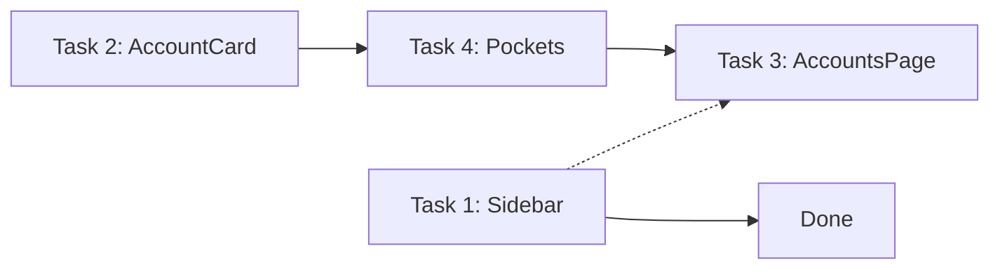

# UI Rebuild: Layout + Sidebar + Accounts Page

## Summary

Structural rebuild of the app shell and accounts page to match the Stitch design reference (`stitch-accounts-page.html`). The previous attempt only swapped colors — this rebuild targets the actual component hierarchy, layout patterns, and interaction models.

---

## Structural Comparison

### Sidebar: Current vs Stitch

| Aspect | Current | Stitch Target |
|--------|---------|---------------|
| **Width** | `w-60` (240px) | `w-[260px]` |
| **Logo** | Icon in rounded-xl box + "Finance App" text | Gradient text logo (`bg-gradient-to-r from-primary-container to-primary bg-clip-text text-transparent`) + subtitle "Institutional Grade" in uppercase tracking-widest |
| **Nav item layout** | `px-4 py-2.5 rounded-lg` with absolute left pill indicator | `px-6 py-3` with `border-l-4 border-primary` active state (no rounded pill) |
| **Active state** | `bg-primary/10 text-primary` + absolute `w-1 h-6 rounded-full bg-primary` pill | `border-l-4 border-primary bg-primary/10 text-primary font-bold` + filled icon variant |
| **Inactive state** | `text-on-surface-variant hover:bg-surface-container-high/50` | `text-on-surface-variant hover:text-primary hover:bg-white/5` |
| **Icon style** | Lucide icons, same weight always | Material Symbols with FILL toggle on active (we keep Lucide but add weight/fill differentiation) |
| **Spacing** | `space-y-1` between items | `space-y-1` (same) |
| **User profile** | Bottom: email text + logout button, minimal | Bottom: avatar image + name + "Lvl 4 Investor" subtitle in `rounded-xl bg-white/5` card |
| **Footer actions** | Just logout | Dark mode toggle + help button row below profile card |
| **Background** | `bg-surface-container-low/90 backdrop-blur-xl border-r border-white/[0.06]` | `bg-surface-container/80 backdrop-blur-xl border-r border-white/10 shadow-2xl` |
| **Padding** | `p-6` logo, `px-3` nav | `px-6` logo area, `px-6` nav items, `py-8` vertical |

### Accounts Page: Current vs Stitch

| Aspect | Current | Stitch Target |
|--------|---------|---------------|
| **Layout** | 2-column grid: left = account list, right = detail panel | Full-width 3-column grid of cards (`grid-cols-1 md:grid-cols-2 xl:grid-cols-3`) — no detail panel split |
| **Page header** | `PageHeader` component with title + "New Account" button | Title + subtitle ("Manage your global liquidity...") + outlined "Add Account" button with border-2 |
| **Search/filter** | None | Search input with icon + filter chip buttons (All, Investment, Cash) |
| **Account cards** | List items with `border-l-4`, horizontal layout (icon + name + balance inline) | Standalone cards with `border-t-4`, vertical layout, glass-card styling |
| **Card structure** | Flat row: icon circle → name/badges → balance → edit/delete | Stacked: header (icon+name+type) → currency badge → large balance → pockets section |
| **Balance display** | Inline `font-mono text-sm sm:text-lg` | Dedicated block: `font-data-lg text-[28px]` in JetBrains Mono, colored per account |
| **Currency badge** | Small inline pill next to color dot | Standalone `px-2 py-0.5 rounded bg-primary/10` badge above balance |
| **Type label** | Inline pills ("Investments", "Fixed Expenses") | Uppercase `text-[10px] tracking-widest` below account name |
| **Edit/Delete** | Always-visible `EditDeleteActions` component | `opacity-0 group-hover:opacity-100` — hidden until hover, includes drag handle |
| **Pockets** | Shown in separate detail panel (right column) | Inline collapsible section within each card, toggle with chevron |
| **Pocket toggle** | N/A (always visible in panel) | Button: "POCKETS (N)" + `expand_more` icon, `max-h-0` → `max-h-[500px]` transition |
| **Pocket items** | Full `PocketCard` with icons, type labels, action buttons | Simple `flex justify-between` rows in `bg-white/5 rounded p-2` |
| **Add pocket** | Button in detail panel header | Dashed border button at bottom of pocket list within card |
| **Card hover** | `hover:bg-surface-container-high/80` | `hover:scale-[1.01] hover:shadow-primary/5` with transition-transform |
| **Selection model** | Click card → shows detail panel on right | No selection/detail panel — all info is self-contained in card |

### Mobile Bottom Nav: Current vs Stitch

| Aspect | Current | Stitch Target |
|--------|---------|---------------|
| **Container** | `bg-surface-container-low/90 border-t border-white/[0.06]` | `bg-surface-container-highest/90 rounded-t-xl border-t border-white/10 shadow-[0_-10px_20px_rgba(0,0,0,0.4)]` |
| **Height** | Compact `p-2` | Taller `h-20` with more breathing room |
| **Active icon** | Color change only | Filled icon variant + color |
| **Labels** | `text-[11px]` | Uppercase `font-label-caps` style |

---

## Task Breakdown

### Task 1: Sidebar Structural Rebuild

**Files to modify:**
1. `frontend/src/components/layout/Sidebar.tsx` — full rewrite
2. `frontend/src/components/layout/Layout.tsx` — update sidebar width reference (`md:ml-60` → `lg:ml-[260px]`)
3. `frontend/src/components/layout/BottomNav.tsx` — update mobile header to match Stitch mobile app bar

**Structural changes:**
- **Logo section**: Replace icon-in-box with gradient text heading (`bg-gradient-to-r from-primary-container to-primary bg-clip-text text-transparent`) + uppercase subtitle
- **Nav items**: Remove absolute pill indicator. Use `border-l-4 border-primary` for active state. Change padding to `px-6 py-3`. Add `font-bold` to active item text.
- **Active icon differentiation**: Since we use Lucide (not Material Symbols), use `strokeWidth={2.5}` or a filled variant for active items where available
- **Hover state**: Change to `hover:text-primary hover:bg-white/5`
- **User profile section**: Replace email+logout with a card (`rounded-xl bg-white/5 p-3`) containing user avatar placeholder (initials circle), display name (from email), and subtitle
- **Footer row**: Add dark mode toggle button + help button below profile card
- **Background**: Change to `bg-surface-container/80 backdrop-blur-xl border-r border-white/10 shadow-2xl`
- **Breakpoint**: Change from `md:flex` to `lg:flex` (sidebar hidden below `lg`)
- **Width**: `w-[260px]`
- **Vertical padding**: `py-8` on the flex-col container

**Acceptance criteria:**
- Sidebar renders at 260px width on `lg+` screens
- Active nav item has left border indicator (not pill)
- Logo is gradient text, not icon-in-box
- User profile shows as a card with avatar + name at bottom
- Dark mode + help buttons render below profile
- Hover states use `hover:text-primary hover:bg-white/5`
- Layout main content offset matches new sidebar width

---

### Task 2: AccountCard Component Rebuild

**Files to modify:**
1. `frontend/src/components/accounts/AccountCard.tsx` — full structural rewrite
2. `frontend/src/components/accounts/CDAccountCard.tsx` — same structural pattern
3. `frontend/src/components/accounts/index.ts` — no change needed
4. `frontend/src/components/ui/ActionButtons.tsx` — may need hover-reveal variant

**Structural changes:**
- **Card container**: Replace `border-l-4` horizontal layout with `border-t-4` vertical card using `glass-card rounded-xl overflow-hidden` + `hover:scale-[1.01] hover:shadow-{color}/5 shadow-xl`
- **Border color**: Top border uses account's color (dynamic via style prop)
- **Header section**: `flex justify-between items-start mb-4` with:
  - Left: icon in `w-10 h-10 rounded-lg bg-{color}/20` + name (bold) + type label (uppercase `text-[10px] tracking-widest`)
  - Right: hover-reveal action buttons (`opacity-0 group-hover:opacity-100`) — drag handle + edit + delete
- **Balance section**: `mb-6` block with:
  - Currency badge: `inline-block px-2 py-0.5 rounded bg-{color}/10 text-{color} font-mono text-[10px] tracking-widest`
  - Balance: `font-mono text-[28px] text-{color} tracking-tight` (JetBrains Mono via `font-data-lg` class or direct)
- **Remove**: Selection state highlighting (no more `isSelected` visual), inline badges, horizontal layout
- **Keep**: `onSelect` prop for potential future use, `memo` wrapper, account color dynamic styling

**Props changes:**
- Remove `isSelected` visual styling (keep prop for click handler)
- Add `pockets: Pocket[]` prop (pockets now render inside the card)
- Add `onAddPocket?: () => void` prop

**Acceptance criteria:**
- Card is vertical with colored top border
- Icon + name + type in header row
- Currency badge above large monospace balance
- Edit/delete/drag buttons only visible on hover
- Card has subtle scale-up on hover
- No horizontal row layout remains

---

### Task 3: AccountsPage Layout Rebuild

**Files to modify:**
1. `frontend/src/pages/AccountsPage.tsx` — major restructure
2. `frontend/src/components/accounts/AccountDetailPanel.tsx` — remove from page flow (keep component for potential modal/drawer use)
3. `frontend/src/components/ui/PageHeader.tsx` — may need subtitle support

**Structural changes:**
- **Remove 2-column grid**: Eliminate the `grid-cols-1 md:grid-cols-2` split between list and detail panel
- **Page header**: Title "Accounts" + subtitle "Manage your global liquidity and asset distribution." + outlined "Add Account" button (`border-2 border-primary-container text-primary-fixed font-bold rounded-lg hover:bg-primary/5`)
- **Add search bar**: Full-width input with search icon (`relative flex-1 min-w-[200px]`) in `bg-surface-container-low border-none rounded-lg pl-10`
- **Add filter chips**: Row of buttons — "All" (active: `bg-primary/10 text-primary border border-primary/20`), account types (inactive: `bg-white/5 text-on-surface-variant border border-white/5`)
- **Cards grid**: `grid grid-cols-1 md:grid-cols-2 xl:grid-cols-3 gap-6`
- **Pass pockets to cards**: Each AccountCard receives its own pockets array
- **Remove**: `SortableList`/`SortableItem` wrapper (drag handled via hover buttons on cards), detail panel column, mobile show/hide logic for list vs detail
- **Keep**: Account form modal, CD form modal, cascade delete dialog, loading skeleton

**New state:**
- `searchQuery: string` — filters accounts by name
- `activeFilter: 'all' | 'investment' | 'cash' | 'normal'` — filters by account type

**Acceptance criteria:**
- Page shows search bar + filter chips above the grid
- Accounts render in a responsive 1/2/3 column grid
- No detail panel split — all info is in cards
- Filtering by type works
- Search filters accounts by name (case-insensitive)
- "Add Account" button has outlined style matching Stitch

---

### Task 4: Pockets Collapsible Section Within Account Cards

**Files to modify:**
1. `frontend/src/components/accounts/AccountCard.tsx` — add collapsible pockets section
2. `frontend/src/components/accounts/CDAccountCard.tsx` — same pattern if applicable
3. `frontend/src/components/accounts/CollapsiblePockets.tsx` — **new component**
4. `frontend/src/components/accounts/InlinePocketRow.tsx` — **new component**
5. `frontend/src/components/accounts/index.ts` — export new components

**Structural changes:**

**CollapsiblePockets** (new):
- Container: `border-t border-white/5 pt-4` at bottom of card
- Toggle button: `w-full flex justify-between items-center text-on-surface-variant hover:text-on-surface mb-2`
  - Left: `text-[12px] font-bold tracking-wider` showing "POCKETS (N)"
  - Right: Chevron icon with `transition-transform duration-300` (rotates 180deg when open)
- List container: `space-y-2` with `max-h-0 overflow-hidden transition-all duration-300` → `max-h-[500px]` when expanded
- "Add Pocket" button at bottom: `w-full py-2 border border-dashed border-white/20 rounded text-[11px] font-bold text-on-surface-variant hover:border-primary hover:text-primary`

**InlinePocketRow** (new):
- Simple: `flex justify-between items-center p-2 rounded bg-white/5`
- Left: pocket name in `text-body-md`
- Right: balance in `font-mono` (JetBrains Mono)
- No action buttons (keep it minimal inside the card)

**State:**
- `isExpanded: boolean` — local state per card, default `false`
- Animate via `max-height` transition (CSS-only, no JS measurement needed)

**Acceptance criteria:**
- Pockets section appears at bottom of each account card
- Collapsed by default showing "POCKETS (N)" with chevron
- Click toggles open/closed with smooth height animation
- Open state shows pocket rows (name + balance) in simple rows
- "Add Pocket" dashed button at bottom of expanded list
- Empty state shows "No pockets defined" text
- Chevron rotates on toggle

---

## Implementation Notes

### Shared Patterns
- **glass-card class**: Already exists in the codebase. Verify it matches Stitch definition: `background: rgba(26, 29, 39, 0.6); backdrop-filter: blur(12px); border: 1px solid rgba(255, 255, 255, 0.08)`
- **JetBrains Mono**: Check if already imported in the app's font stack. If not, add to `index.html` or Tailwind config. Used for all balance/number displays.
- **Hover-reveal pattern**: `opacity-0 group-hover:opacity-100 transition-opacity` on action button containers. Parent card needs `group` class.
- **Account color theming**: Each card uses the account's color for border-top, icon background, currency badge, and balance text. Use inline `style` props for dynamic colors.

### What NOT to Change
- Keep Lucide icons (don't switch to Material Symbols)
- Keep existing form modals (AccountForm, CDAccountForm)
- Keep existing hooks and data fetching logic
- Keep existing type definitions
- Keep SortableList for drag-and-drop (but move drag handle into hover-reveal buttons)

### Dependencies Between Tasks
- Task 1 (Sidebar) is independent
- Task 2 (AccountCard) must complete before Task 4 (Pockets) since pockets render inside the card
- Task 3 (AccountsPage) depends on Task 2 (new card structure) and Task 4 (pockets in cards)
- **Recommended order**: Task 1 + Task 2 in parallel → Task 4 → Task 3

### Testing Considerations
- Sidebar: verify active state renders correctly for each route
- AccountCard: snapshot tests need updating for new structure
- Pockets: test expand/collapse toggle, empty state, pocket count display
- AccountsPage: test search filtering, type filter chips, grid rendering
