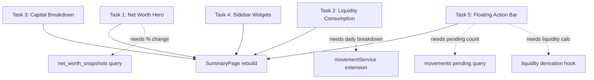

# UI Rebuild: Summary/Dashboard Page — Structural Task Breakdown

## Executive Summary

The current Summary page is a functional but structurally flat layout that doesn't match the Stitch reference design. The Stitch design introduces a clear visual hierarchy: a full-width hero banner, a full-width spending card with mini bar chart, a 7/5 two-column grid (accounts left, widgets right), and a persistent floating action bar. The current implementation uses a simpler grid with no hero section, no bar chart visualization, and a floating bar that only appears on selection.

This is a **structural rebuild**, not a reskin. The component tree, layout grid, data presentation, and interaction patterns all change.

---

## Structural Comparison

### Current Architecture

```
SummaryPage
├── PageHeader ("Summary")
├── TotalsSummary (grid of cards: 1 hero + N currency cards)
├── SpendingCard (single compact card with period toggle)
├── Grid 1x2 (lg:grid-cols-2)
│   ├── CurrencyBreakdownSection → CurrencySection → AccountCards
│   └── Sidebar stack:
│       ├── FinancialCalendarWidget
│       ├── NetWorthTimelineWidget
│       ├── RemindersWidget
│       └── FixedExpensesSummary
└── FloatingStatsBar (selection-only, shows sum/avg/count)
```

### Target Architecture (Stitch)

```
SummaryPage
├── NetWorthHero (full-width glass banner)
│   ├── Label: "PORTFOLIO TOTAL NET WORTH"
│   ├── Giant monospace number ($1,248,502.64) with dimmed decimals
│   ├── % change badge (green arrow + "since last month")
│   ├── Subtitle: "Across N accounts in M currencies"
│   └── Currency breakdown pills (USD, MXN, COP inline)
├── LiquidityConsumptionCard (full-width glass card, 2-column)
│   ├── Left 1/3: "LIQUIDITY CONSUMPTION" label, Spend Today + Spend This Week, progress bar, % comparison
│   └── Right 2/3: Mini bar chart (7 bars for days of week, hover tooltips)
├── Grid 12-col (lg:grid-cols-12)
│   ├── Left (col-span-7): Capital Breakdown
│   │   ├── Header: "Capital Breakdown" + "VIEW ALL ACCOUNTS" link
│   │   ├── AccountCard (normal): icon + name + subtitle + balance + pocket count dot
│   │   ├── AccountCard (investment): icon + name + stock badges (AAPL: 140 sh) + balance + gain %
│   │   ├── AccountCard (CD): icon + name + maturity date + balance + APY + maturity progress bar
│   │   └── AccountCard (foreign): icon + name + bank + balance in local + USD equivalent
│   └── Right (col-span-5): Widget stack
│       ├── MovementCalendar (glass card, 7-col grid, dot indicators)
│       ├── NetWorthTimeline (glass card, 6-bar chart with month labels)
│       ├── PendingReminders (glass card, scrollable list with action buttons)
│       └── FixedObligations (glass card, grouped progress bars with % reached)
└── FloatingActionBar (always visible, fixed bottom)
    ├── Total Liquidity stat
    ├── Daily Burn Rate stat
    ├── Pending movements count + pulse dot
    └── "NEW ENTRY" gradient button
```

---

## Key Structural Differences

| Aspect | Current | Stitch Target |
|--------|---------|---------------|
| Net worth display | Grid of separate cards | Single full-width hero banner with all info inline |
| Currency breakdown | Separate cards per currency | Inline pills within hero |
| Spending card | Compact, no chart | Full-width with 7-day mini bar chart |
| Grid layout | `grid-cols-2` equal | `grid-cols-12` with 7/5 split |
| Account cards | Type-specific full components (detailed/compact modes) | Unified card structure with type-specific inner content |
| Floating bar | Selection-only (sum/avg) | Always-visible with liquidity/burn/pending + action button |
| Visual style | Rounded cards with borders | Glass morphism cards with gradient accents and left border colors |
| Typography | Standard sizes | Label-caps headers, JetBrains Mono for data, large hero number |

---

## Task Breakdown

### Task 1: Net Worth Hero Section

**Component**: `NetWorthHero.tsx` (replaces `TotalsSummary.tsx`)

**What changes structurally**:
- Current: Grid of N+1 cards (1 consolidated + N per-currency)
- Target: Single full-width glass card with all data inline

**Structure to build**:
```tsx
<section className="glass-card rounded-2xl p-8 relative overflow-hidden">
  {/* Decorative blur orb top-right */}
  <div className="relative z-10">
    <p className="label-caps tracking-[0.2em] text-primary">PORTFOLIO TOTAL NET WORTH</p>
    <div className="flex flex-col md:flex-row md:items-end gap-4 md:gap-8">
      <h2 className="font-mono text-[48px] font-bold">
        $1,248,502<span className="opacity-50 font-normal">.64</span>
      </h2>
      <div className="flex items-center gap-2">
        {/* % change badge: green bg pill with arrow icon */}
        <span className="text-on-surface-variant">since last month</span>
      </div>
    </div>
    <p className="text-on-surface-variant mt-4">Across {N} accounts in {M} currencies</p>
    {/* Currency pills row */}
    <div className="flex flex-wrap gap-3 mt-6">
      {currencies.map(c => (
        <div className="bg-surface-container-highest px-3 py-1.5 rounded-lg border border-white/5">
          <span className="text-[10px] font-bold text-on-surface-variant">{c}</span>
          <span className="font-mono text-sm text-on-surface">{formatted}</span>
        </div>
      ))}
    </div>
  </div>
</section>
```

**Data requirements** (already available from current hooks):
- `consolidatedTotal` + `primaryCurrency` for the big number
- `totalsByCurrency` for currency pills
- `accounts.length` for subtitle
- NEW: % change since last month (needs net worth snapshot comparison — query `net_worth_snapshots` for previous month)

**Files to create/modify**:
- Create: `frontend/src/components/summary/NetWorthHero.tsx`
- Modify: `frontend/src/pages/SummaryPage.tsx` (swap TotalsSummary for NetWorthHero)
- Modify or keep: `TotalsSummary.tsx` can be deleted or kept as legacy

**Estimated complexity**: Medium — mostly layout/styling, one new data derivation (% change)

---

### Task 2: Liquidity Consumption Card

**Component**: `LiquidityConsumptionCard.tsx` (replaces `SpendingCard.tsx`)

**What changes structurally**:
- Current: Compact card with period toggle (today/week/month), single number, % comparison text
- Target: Full-width 2-column card — left side shows both today AND week simultaneously, right side has a 7-day bar chart

**Structure to build**:
```tsx
<section className="glass-card rounded-2xl p-6 flex flex-col md:flex-row gap-8 items-center">
  {/* Left 1/3 */}
  <div className="w-full md:w-1/3">
    <p className="label-caps tracking-[0.2em] text-primary">LIQUIDITY CONSUMPTION</p>
    <div className="space-y-4 mt-4">
      <div className="flex justify-between items-end">
        <div>
          <p className="text-xs text-on-surface-variant">Spend Today</p>
          <p className="font-mono text-lg text-on-surface">{todayFormatted}</p>
        </div>
        <div className="text-right">
          <p className="text-xs text-on-surface-variant">Spend This Week</p>
          <p className="font-mono text-lg text-on-surface">{weekFormatted}</p>
        </div>
      </div>
      {/* Progress bar: week spend vs budget or average */}
      <div className="bg-surface-container-highest h-2 rounded-full overflow-hidden">
        <div className="bg-gradient-to-r from-primary-container to-primary h-full" style={{width: `${pct}%`}} />
      </div>
      {/* % comparison */}
      <div className="flex items-center gap-2 text-xs">
        <span className="text-error font-bold">+12%</span>
        <span className="text-on-surface-variant">relative to previous 7-day average</span>
      </div>
    </div>
  </div>
  {/* Right 2/3: Mini bar chart */}
  <div className="w-full md:w-2/3 h-24 flex items-end justify-between gap-2 px-2">
    {dailySpending.map((day, i) => (
      <div
        key={i}
        className="w-full bg-primary/20 hover:bg-primary rounded-t-sm transition-colors cursor-help"
        style={{ height: `${day.pct}%` }}
        title={`${day.label}: ${day.formatted}`}
      />
    ))}
  </div>
</section>
```

**Data requirements**:
- `useSpendingSummaryQuery()` already provides today/thisWeek/lastWeek
- NEW: Daily breakdown for the 7-day bar chart — needs a new query or service method that returns per-day spending for the current week
- NEW: Progress bar percentage (week spend relative to some baseline — could be budget or rolling average)

**Files to create/modify**:
- Create: `frontend/src/components/summary/LiquidityConsumptionCard.tsx`
- Modify: `frontend/src/pages/SummaryPage.tsx`
- Possibly modify: `movementService.ts` to add daily breakdown endpoint/method
- Possibly modify: backend route for daily spending aggregation

**Estimated complexity**: Medium-High — new data requirement (daily breakdown), chart rendering logic

---

### Task 3: Capital Breakdown Section

**Component**: Refactor `CurrencyBreakdownSection.tsx` + account cards

**What changes structurally**:
- Current: Grouped by currency with separate CurrencySection headers, each account has a full detailed card with expand/collapse
- Target: Flat list under a single "Capital Breakdown" header with "VIEW ALL ACCOUNTS" link, unified card shape with type-specific inner content, no currency grouping visible

**Card layouts per type**:

**Normal account**:
```
[icon 48px] [Name + subtitle]                    [Balance]
                                                  [dot + "N Sub-pockets active"]
```
- Left border: `border-l-4 border-l-primary`
- Icon: Material icon in colored bg circle

**Investment account**:
```
[icon 48px] [Name]                               [Balance]
            [stock badges: AAPL: 140 sh, TSLA: 25 sh]  [+14.2% Overall Gain]
```
- Left border: `border-l-4 border-l-tertiary`
- Stock badges: small pills with symbol + shares

**CD account**:
```
[icon 48px] [Name]                               [Balance]
            [Matures Sep 2024]                    [5.25% APY]
[Maturity Progress bar: label + % + bar]
```
- Left border: `border-l-4 border-l-secondary`
- Extra row: progress bar spanning full width

**Foreign/multi-currency account**:
```
[icon 48px] [Name]                               [Balance in local currency]
            [Bank name]                           [≈ $X USD equivalent]
```

**Data requirements** (all already available):
- `accounts`, `pockets`, `investmentData` from existing hooks
- Pocket count per account (derived from pockets array)
- Stock symbols/shares from account data
- CD maturity from account data

**Files to create/modify**:
- Create: `frontend/src/components/summary/CapitalBreakdown.tsx` (section wrapper with header)
- Create: `frontend/src/components/summary/AccountCard.tsx` (unified card with type switch)
- Modify: `frontend/src/pages/SummaryPage.tsx` (replace CurrencyBreakdownSection)
- Existing cards (`AccountSummaryCard`, `InvestmentCard`, `CDSummaryCard`) can be deprecated or refactored into the unified card

**Estimated complexity**: Medium — mostly restructuring existing data into new layout, no new queries

---

### Task 4: Right Sidebar Widgets

**Components**: Refactor existing widgets to match Stitch glass-card style

**What changes structurally**:

#### 4a. Movement Calendar
- Current: `FinancialCalendarWidget` — already exists with calendar grid
- Target: Glass card with "MOVEMENT CALENDAR" label-caps header, month label on right, 7-col grid with colored dot indicators (primary/tertiary/error for different movement types)
- Change: Mostly styling — add glass-card wrapper, label-caps header, colored dots per movement type

#### 4b. Net Worth Timeline
- Current: `NetWorthTimelineWidget` — exists, likely uses Recharts line chart
- Target: Glass card with "NET WORTH TIMELINE (6M)" label-caps header, simple 6-bar chart (not line), month labels below, gradient on current month bar
- Change: Replace line chart with simple bar visualization, 6 bars with opacity gradient

#### 4c. Pending Reminders
- Current: `RemindersWidget` — exists with reminder list
- Target: Glass card with "PENDING REMINDERS" label-caps header, scrollable list (max-h-48), each item has name + due date + amount, action buttons (pay + dismiss)
- Change: Restyle items to match Stitch layout, add action buttons, add scroll container

#### 4d. Fixed Obligations
- Current: `FixedExpensesSummary` — exists with grouped progress bars
- Target: Glass card with "FIXED OBLIGATIONS" label-caps header + "64% REACHED" stat on right, grouped progress bars with name + amount/target + thin bar
- Change: Simplify to summary view (not full detail), add overall % header, thin bars instead of thick

**Grid change**: Column goes from `lg:col-span-1` (in a 2-col grid) to `lg:col-span-5` (in a 12-col grid)

**Files to create/modify**:
- Modify: `frontend/src/components/summary/FinancialCalendarWidget.tsx` (restyle)
- Create or modify: `frontend/src/components/summary/NetWorthTimelineBar.tsx` (new bar-based widget replacing line chart)
- Modify: `frontend/src/components/reminders/RemindersWidget.tsx` (restyle + action buttons)
- Create: `frontend/src/components/summary/FixedObligationsWidget.tsx` (simplified version of FixedExpensesSummary)
- Modify: `frontend/src/pages/SummaryPage.tsx` (update grid to 12-col, swap components)

**Estimated complexity**: Medium — mostly restyling existing components, one new bar chart widget

---

### Task 5: Bottom Floating Action Bar

**Component**: `FloatingActionBar.tsx` (replaces `FloatingStatsBar.tsx`)

**What changes structurally**:
- Current: Only appears when items are selected, shows count/sum/average + clear button
- Target: Always visible, shows Total Liquidity + Daily Burn Rate + Pending count + "NEW ENTRY" button

**Structure to build**:
```tsx
<div className="hidden lg:flex fixed bottom-8 left-1/2 -translate-x-1/2 w-max gap-12 bg-surface-container/90 backdrop-blur-2xl border border-white/10 rounded-full px-10 py-4 shadow-2xl z-50 items-center">
  <div className="flex flex-col">
    <span className="text-[10px] text-on-surface-variant font-bold uppercase tracking-widest">Total Liquidity</span>
    <span className="font-mono text-sm text-on-surface">{liquidityFormatted}</span>
  </div>
  <div className="h-8 w-px bg-white/10" />
  <div className="flex flex-col">
    <span className="text-[10px] text-on-surface-variant font-bold uppercase tracking-widest">Daily Burn Rate</span>
    <span className="font-mono text-sm text-error">{burnRateFormatted}</span>
  </div>
  <div className="h-8 w-px bg-white/10" />
  <div className="flex flex-col">
    <span className="text-[10px] text-on-surface-variant font-bold uppercase tracking-widest">Pending</span>
    <div className="flex items-center gap-1.5">
      <span className="font-mono text-sm">{pendingCount} Movements</span>
      <span className="w-2 h-2 rounded-full bg-primary animate-pulse" />
    </div>
  </div>
  <button className="ml-4 bg-gradient-to-r from-primary-container to-primary px-6 py-2 rounded-full text-surface font-bold hover:scale-105 active:scale-95 transition-all">
    NEW ENTRY
  </button>
</div>
```

**Data requirements**:
- Total Liquidity: sum of non-investment, non-CD account balances (liquid assets only) — derivable from existing accounts data
- Daily Burn Rate: today's spending from `useSpendingSummaryQuery()`
- Pending count: count of pending movements — needs `useMovementsQuery` with pending filter or a dedicated count query
- NEW ENTRY button: opens movement creation modal/form

**Mobile behavior**: On mobile, this becomes a bottom nav bar (handled by app shell, not this component)

**Files to create/modify**:
- Create: `frontend/src/components/summary/FloatingActionBar.tsx`
- Modify: `frontend/src/pages/SummaryPage.tsx` (swap FloatingStatsBar for FloatingActionBar)
- Keep: `FloatingStatsBar.tsx` can remain for selection behavior (or merge into new bar)
- Possibly create: hook `useLiquidityStats()` to compute liquidity/burn rate

**Estimated complexity**: Medium — new data derivations, always-visible positioning, action button wiring

---

## Dependency Graph



Tasks 1-5 are **independent of each other** and can run in parallel. The final SummaryPage.tsx integration is a thin orchestration layer that imports the new components into the correct grid positions.

## Execution Order Recommendation

1. **Wave 1** (parallel): Tasks 1, 2, 3, 4, 5 — all independent structural work
2. **Wave 2** (sequential): SummaryPage.tsx integration — wire all new components into the 12-col grid layout, remove old imports, verify data flow

Each task should:
- Create the new component(s)
- Include unit tests
- Export from the summary index
- NOT modify SummaryPage.tsx (that's the integration wave)

## Shared Utilities Needed

Before or during Wave 1, ensure these exist:
- `glass-card` CSS class (or Tailwind utility) — already in global styles or add to `index.css`
- `label-caps` typography class — map to `text-[11px] leading-4 tracking-[0.06em] font-bold uppercase`
- `font-mono` / JetBrains Mono — verify font is loaded in the app
- Material Symbols icon font OR equivalent lucide-react icons (current app uses lucide)

## Notes

- The current `SelectionProvider` + `FloatingStatsBar` selection behavior should be preserved as a secondary overlay that appears ON TOP of the new FloatingActionBar when items are selected
- The Stitch design uses Material Symbols icons; the current app uses lucide-react. Keep lucide-react for consistency — map equivalent icons
- The Stitch design has a side navbar and mobile bottom nav — those are app-shell concerns, NOT part of this summary page rebuild
