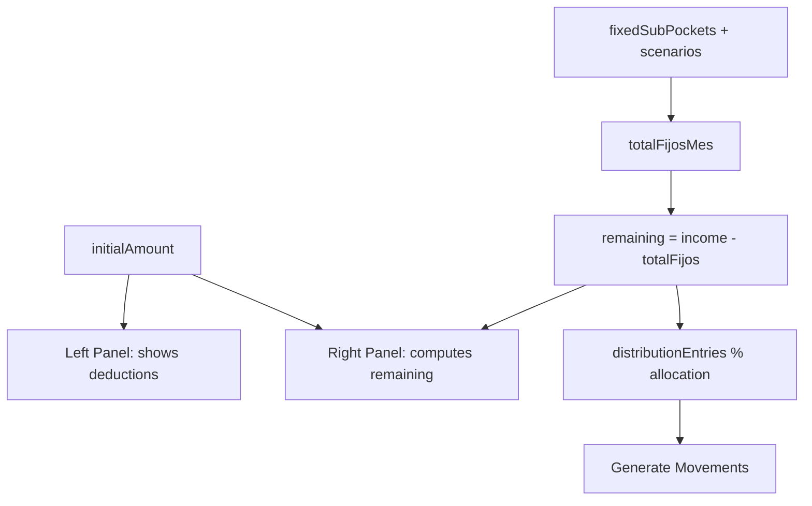

# Unified Budget Page — Implementation Plan

## Summary

Replace the separate `BudgetPlanningPage` and `FixedExpensesPage` with a single `UnifiedBudgetPage` using a split-panel layout: left 45% for Fixed Obligations, right 55% for Distribution. Both panels share the income input and scroll independently.

---

## A) Component Map

### Left Panel — Fixed Obligations (45%)

| Stitch Section | Implementation | Notes |
|---|---|---|
| Panel header (title + count badge + total) | **NEW**: `ObligationsHeader` | Combines info from `FixedExpensesHeader` into a compact panel header |
| Income input field | **REUSE (modify)**: `BudgetIncomeCard` | Already has the split income/deductions layout. Remove the "Distributable" section (that moves to right panel header). Keep income input + fixed expenses deduction display. |
| Collapsible group cards | **REUSE**: `FixedExpenseGroupCard` | Already has collapse, toggle, edit, delete, progress bars. No changes needed. |
| Group list (sortable) | **REUSE**: `FixedExpensesList` | Already renders sortable groups with `SortableList`. No changes needed. |
| Footer buttons (Add Group, Add Expense, Bulk Generate) | **NEW**: `ObligationsFooter` | Sticky footer with 3 action buttons |

### Right Panel — Distribution (55%)

| Stitch Section | Implementation | Notes |
|---|---|---|
| Panel header ("Available to Distribute" + amount + allocation % badge) | **NEW**: `DistributionHeader` | Shows remaining amount prominently + total allocation percentage warning badge |
| Scenario tabs row | **REUSE (modify)**: `BudgetScenarioTabs` | Already renders tab buttons + "+" button. Add edit/delete actions per tab. |
| Distribution entry cards (name + % + $ + progress bar) | **REUSE (modify)**: `AllocationSliderRow` | Already has inline % and $ editing + slider. Add a thin progress bar below the slider showing % of total. |
| Donut chart + legend | **REUSE**: `PortfolioDonutChart` | Already renders Recharts donut with center label. No changes needed. |
| Footer buttons (Cancel Changes, Generate Movements) | **NEW**: `DistributionFooter` | Sticky footer with cancel + generate buttons |

### Shared / Page-Level

| Section | Implementation | Notes |
|---|---|---|
| Page container + split layout | **NEW**: `UnifiedBudgetPage` | The page component orchestrating both panels |
| Scenario form modal | **REUSE**: `ScenarioForm` | No changes needed |
| Fixed expense form modal | **REUSE**: `FixedExpenseForm` | No changes needed |
| Fixed expense group form modal | **REUSE**: `FixedExpenseGroupForm` | No changes needed |
| Batch movement modal | **REUSE**: `BatchMovementForm` | No changes needed |

---

## B) Page Structure — Component Tree

```
UnifiedBudgetPage
├── PageHeader (title="Budget")
│
├── <div className="flex gap-6 h-[calc(100vh-<header>)] overflow-hidden">
│   │
│   ├── {/* LEFT PANEL — 45% */}
│   │   <div className="w-[45%] flex flex-col overflow-hidden border-r border-gray-700">
│   │   ├── ObligationsHeader
│   │   │     props: { enabledCount, totalCount, totalMonthly, currency }
│   │   │
│   │   ├── <div className="flex-1 overflow-y-auto p-4 space-y-4">
│   │   │   ├── BudgetIncomeCard (income input + fixed deductions display)
│   │   │   │     props: { initialAmount, onAmountChange, totalFixedExpenses, distributable, currency }
│   │   │   │
│   │   │   ├── FixedExpensesList
│   │   │   │     props: { groups, fixedSubPockets, pocketAccountMap, currency, ... all action handlers }
│   │   │   │
│   │   │   └── (empty state if no fixed pockets)
│   │   │
│   │   └── ObligationsFooter
│   │         props: { onAddGroup, onAddExpense, onBulkGenerate, bulkDisabled }
│   │
│   └── {/* RIGHT PANEL — 55% */}
│       <div className="w-[55%] flex flex-col overflow-hidden">
│       ├── DistributionHeader
│       │     props: { distributable, currency, totalPercentage }
│       │
│       ├── <div className="flex-1 overflow-y-auto p-4 space-y-4">
│       │   ├── BudgetScenarioTabs
│       │   │     props: { scenarios, activeIds, onToggle, onCreate }
│       │   │
│       │   ├── AllocationStrategy
│       │   │     props: { entries, distributable, currency, totalPercentage, onEntriesChange, onGenerateMovements, generateDisabled }
│       │   │
│       │   └── PortfolioDonutChart
│       │         props: { entries, distributable, currency, colors }
│       │
│       └── DistributionFooter
│             props: { onCancel, onGenerate, generateDisabled, hasChanges }
│
├── Modal: ScenarioForm
├── Modal: FixedExpenseForm
├── Modal: FixedExpenseGroupForm
└── Modal: BatchMovementForm
```

---

## C) State Management

### Shared State (page-level, feeds both panels)

```typescript
// From useBudgetPersistence (localStorage-backed)
const {
  initialAmount, setInitialAmount,
  distributionEntries, setDistributionEntries,
  scenarios, setScenarios,
  defaultAccountId, setDefaultAccountId,
  defaultPocketId, setDefaultPocketId,
} = useBudgetPersistence();
```

### Left Panel State

- `fixedSubPockets`, `fixedPockets`, `fixedExpenseGroups` — from queries
- `useFixedExpenseActions` hook — owns CRUD, collapse, toggle, batch generation
- Income input writes to `initialAmount` (shared)

### Right Panel State

- `useBudgetActions` hook — owns scenario toggling, remaining calculation, distribution batch
- Reads `initialAmount` and `fixedSubPockets` to compute `totalFijosMes` and `remaining`
- `distributionEntries` — the allocation rows

### Data Flow Diagram



### Key Interaction: Scenario Toggle Affects Both Panels

When a scenario is toggled in the right panel's `BudgetScenarioTabs`:
1. `activeScenarioIds` updates (right panel state via `useBudgetActions`)
2. `totalFijosMes` recalculates based on active scenario's expense subset
3. `remaining` updates → distribution amounts update
4. Left panel visually highlights which expenses are "active" in the current scenario (stretch goal)

---

## D) Reuse vs New vs Delete

### Reuse As-Is (no modifications)

| Component | Path |
|---|---|
| `FixedExpenseGroupCard` | `components/fixed-expenses/FixedExpenseGroupCard.tsx` |
| `FixedExpensesList` | `components/fixed-expenses/FixedExpensesList.tsx` |
| `FixedExpenseForm` | `components/fixed-expenses/FixedExpenseForm.tsx` |
| `FixedExpenseGroupForm` | `components/fixed-expenses/FixedExpenseGroupForm.tsx` |
| `PortfolioDonutChart` | `components/budget/PortfolioDonutChart.tsx` |
| `BudgetStatsCards` | `components/budget/BudgetStatsCards.tsx` |
| `ScenarioForm` | `components/budget/ScenarioForm.tsx` |
| `BatchMovementForm` | `components/movements/BatchMovementForm.tsx` |
| `DonutChart` | `components/budget/DonutChart.tsx` |
| `useBudgetPersistence` | `hooks/useBudgetPersistence.ts` |
| `useBudgetActions` | `hooks/actions/useBudgetActions.ts` |
| `useFixedExpenseActions` | `hooks/actions/useFixedExpenseActions.ts` |

### Modify

| Component | Modification |
|---|---|
| `BudgetIncomeCard` | Remove the "Distributable" display from the right side (that info moves to `DistributionHeader`). Keep income input + fixed expenses deduction. |
| `BudgetScenarioTabs` | Add optional `onEdit` and `onDelete` callbacks per tab for inline scenario management. |
| `AllocationStrategy` | Remove the "Generate Movements" button from inside (moves to `DistributionFooter`). Accept `generateDisabled` removal. |

### New Components to Create

| Component | Path | Purpose |
|---|---|---|
| `UnifiedBudgetPage` | `pages/UnifiedBudgetPage.tsx` | Main page component |
| `ObligationsHeader` | `components/budget/ObligationsHeader.tsx` | Left panel header with title, count badge, total |
| `ObligationsFooter` | `components/budget/ObligationsFooter.tsx` | Left panel sticky footer with action buttons |
| `DistributionHeader` | `components/budget/DistributionHeader.tsx` | Right panel header with "Available to Distribute" amount + allocation badge |
| `DistributionFooter` | `components/budget/DistributionFooter.tsx` | Right panel sticky footer with Cancel + Generate buttons |

### Files to Delete After Migration

| File | Reason |
|---|---|
| `pages/BudgetPlanningPage.tsx` | Replaced by UnifiedBudgetPage |
| `pages/FixedExpensesPage.tsx` | Replaced by UnifiedBudgetPage |
| `pages/__tests__/BudgetPlanningPage.test.tsx` | Replaced by new page test |
| `pages/__tests__/FixedExpensesPage.test.tsx` | Replaced by new page test |
| `components/budget/BudgetIncomeSection.tsx` | Superseded by BudgetIncomeCard |
| `components/budget/BudgetSummaryCard.tsx` | Functionality absorbed into DistributionHeader |
| `components/budget/BudgetDistribution.tsx` | Superseded by AllocationStrategy (which has slider UX) |
| `components/budget/BudgetEntryRow.tsx` | Superseded by AllocationSliderRow |
| `components/budget/BudgetSidebar.tsx` | Layout no longer uses a sidebar pattern |
| `components/fixed-expenses/FixedExpensesHeader.tsx` | Replaced by ObligationsHeader |
| `components/budget/ScenarioSection.tsx` | Scenarios now rendered via BudgetScenarioTabs in the right panel |

### Update (not delete)

| File | Change |
|---|---|
| `components/budget/index.ts` | Update exports: remove deleted, add new |
| `components/fixed-expenses/index.ts` | Remove `FixedExpensesHeader` export |

---

## E) Route Changes

### Before

```typescript
// App.tsx
<Route path="/fixed-expenses" element={guard(<FixedExpensesPage />)} />
<Route path="/budget-planning" element={guard(<BudgetPlanningPage />)} />
```

### After

```typescript
// App.tsx
<Route path="/budget" element={guard(<UnifiedBudgetPage />)} />
// Redirects for old URLs:
<Route path="/fixed-expenses" element={<Navigate to="/budget" replace />} />
<Route path="/budget-planning" element={<Navigate to="/budget" replace />} />
```

### Navigation Updates

In `components/layout/Layout.tsx`:

**Before:**
```typescript
{ path: '/fixed-expenses', label: 'Fixed Expenses', icon: Target },
{ path: '/budget-planning', label: 'Budget', icon: Calendar },
```

**After:**
```typescript
{ path: '/budget', label: 'Budget', icon: Calendar },
```

Remove the `Target` icon import if no longer used elsewhere.

---

## F) Implementation Waves

### Wave 0 — Prerequisites (1 task, sequential)

| # | Task | Files | What it does | Dependencies | Tests |
|---|---|---|---|---|---|
| 0.1 | Modify `BudgetIncomeCard` | `components/budget/BudgetIncomeCard.tsx` | Remove the "Distributable" section from the right half. Keep income input + fixed expenses deduction display. Add optional `className` prop. | None | Update snapshot if exists |

### Wave 1 — New Panel Components (4 tasks, parallel)

| # | Task | Files | What it does | Dependencies | Tests |
|---|---|---|---|---|---|
| 1.1 | Create `ObligationsHeader` | `components/budget/ObligationsHeader.tsx` | Renders: title "Fixed Obligations", count badge (`{enabled}/{total}`), total monthly amount. Compact single-row layout. | None | Unit test: renders count and amount correctly |
| 1.2 | Create `ObligationsFooter` | `components/budget/ObligationsFooter.tsx` | Sticky footer with 3 buttons: "Add Group", "Add Expense", "Bulk Generate". All receive onClick + disabled props. | None | Unit test: buttons render, disabled state works |
| 1.3 | Create `DistributionHeader` | `components/budget/DistributionHeader.tsx` | Large "Available to Distribute" amount display. Allocation percentage badge (green if 100%, yellow/red otherwise). | None | Unit test: renders amount, badge color logic |
| 1.4 | Create `DistributionFooter` | `components/budget/DistributionFooter.tsx` | Sticky footer with "Cancel Changes" (secondary) and "Generate Movements" (primary) buttons. Generate disabled when no entries or 0 amount. | None | Unit test: buttons render, disabled logic |

### Wave 2 — Modify Existing Components (4 tasks, parallel)

| # | Task | Files | What it does | Dependencies | Tests |
|---|---|---|---|---|---|
| 2.1 | Modify `BudgetScenarioTabs` | `components/budget/BudgetScenarioTabs.tsx` | Add optional `onEdit?: (id: string) => void` and `onDelete?: (id: string) => void` props. When provided, render small edit/delete icons on each tab (visible on hover). | None | Update existing test to cover new props |
| 2.2 | Modify `AllocationStrategy` | `components/budget/AllocationStrategy.tsx` | Remove the "Generate Movements" button at the bottom. The `onGenerateMovements` and `generateDisabled` props become optional/removed. The footer handles this now. | None | Update existing test |
| 2.3 | Update `components/budget/index.ts` | `components/budget/index.ts` | Add exports for `ObligationsHeader`, `ObligationsFooter`, `DistributionHeader`, `DistributionFooter`. Keep all existing exports for now (cleanup in Wave 4). | Wave 1 | None |
| 2.4 | Update `components/fixed-expenses/index.ts` | `components/fixed-expenses/index.ts` | No changes yet — `FixedExpensesHeader` still exported (removed in Wave 4 after page deletion). | None | None |

### Wave 3 — Main Page + Route Wiring (4 tasks, parallel)

| # | Task | Files | What it does | Dependencies | Tests |
|---|---|---|---|---|---|
| 3.1 | Create `UnifiedBudgetPage` — left panel | `pages/UnifiedBudgetPage.tsx` | Create the page file with full left panel: queries, `useFixedExpenseActions`, `ObligationsHeader`, `BudgetIncomeCard`, `FixedExpensesList`, `ObligationsFooter`, modals for expense/group forms + batch. Right panel placeholder div. | Waves 0-2 | Smoke test: renders without crash |
| 3.2 | Create `UnifiedBudgetPage` — right panel | `pages/UnifiedBudgetPage.tsx` | Complete the right panel: `useBudgetActions`, `useBudgetPersistence`, `DistributionHeader`, `BudgetScenarioTabs`, `AllocationStrategy`, `PortfolioDonutChart`, `DistributionFooter`, scenario form modal, batch modal. | 3.1 (same file) | Smoke test: renders without crash |
| 3.3 | Update routes in `App.tsx` | `App.tsx` | Replace old routes with `/budget` + redirects. Update lazy import. | 3.1 + 3.2 | Manual verification |
| 3.4 | Update navigation in `Layout.tsx` | `components/layout/Layout.tsx` | Replace two nav items with single "Budget" item at `/budget`. Update `BOTTOM_NAV_ITEMS` if needed. | 3.3 | Manual verification |

**Note:** Tasks 3.1 and 3.2 are on the same file — they must be done sequentially by one agent. Group them as a single task for one coder agent.

### Wave 4 — Cleanup + Tests (4 tasks, parallel)

| # | Task | Files | What it does | Dependencies | Tests |
|---|---|---|---|---|---|
| 4.1 | Delete old pages | `pages/BudgetPlanningPage.tsx`, `pages/FixedExpensesPage.tsx`, `pages/__tests__/BudgetPlanningPage.test.tsx`, `pages/__tests__/FixedExpensesPage.test.tsx` | Remove old page files. | Wave 3 | Verify build passes |
| 4.2 | Delete superseded components | `BudgetIncomeSection.tsx`, `BudgetSummaryCard.tsx`, `BudgetDistribution.tsx`, `BudgetEntryRow.tsx`, `BudgetSidebar.tsx`, `FixedExpensesHeader.tsx`, `ScenarioSection.tsx` + their test files | Remove components no longer imported anywhere. Update `index.ts` exports. | Wave 3 | Verify build passes |
| 4.3 | Write `UnifiedBudgetPage` integration test | `pages/__tests__/UnifiedBudgetPage.test.tsx` | Test: renders both panels, income input updates remaining, scenario toggle changes deductions, distribution entries render. Mock all queries. | Wave 3 | This IS the test |
| 4.4 | Write panel component unit tests | `components/budget/__tests__/ObligationsHeader.test.tsx`, `...Footer.test.tsx`, `DistributionHeader.test.tsx`, `DistributionFooter.test.tsx` | Unit tests for all 4 new components. | Wave 1 | These ARE the tests |

---

## G) Styling Rules

**CRITICAL — All coder agents must follow these rules:**

### DO use:
```
bg-gray-900        — page/panel background
bg-gray-800        — card/section background
bg-gray-800/50     — subtle card variant
bg-gray-700        — input backgrounds, hover states
bg-gray-700/50     — row hover, subtle fills
border-gray-700    — primary borders
border-gray-600    — input borders, subtle dividers
text-gray-100      — primary text
text-gray-400      — secondary/muted text
text-gray-500      — tertiary text (labels)
text-blue-400      — accent text, links, active states
text-red-400       — error/danger text
text-green-400     — success text
bg-blue-500/10     — active/selected background tint
border-blue-500    — active border
ring-1 ring-blue-500 — focus/active ring
```

### DO NOT use:
```
bg-surface-container, bg-surface-container-high, bg-surface-container-low
text-on-surface, text-on-surface-variant
border-outline, border-outline-variant
bg-primary, text-on-primary
bg-secondary-container, text-on-secondary-container
bg-error-container, text-on-error-container
```

These are Stitch design tokens that do NOT exist in our Tailwind config.

### Layout Patterns:
- Split panel: `flex` with `w-[45%]` and `w-[55%]`
- Independent scroll: `overflow-y-auto` on each panel's content area
- Sticky headers/footers: `sticky top-0 z-10` / `sticky bottom-0 z-10` with `bg-gray-900` to prevent content bleed-through
- Panel divider: `border-r border-gray-700` on left panel
- Card spacing: `space-y-4` between cards, `p-4` or `p-5` inside cards
- Responsive: On screens < `lg`, stack panels vertically (left on top, right below) with `flex-col lg:flex-row`

### Component Patterns:
- Use existing `Card` component for card containers
- Use existing `Button` component for all buttons
- Use existing `Modal` component for all modals
- Use `lucide-react` for all icons
- Use `CurrencyAmount` component for formatted currency display where available

---

## H) Props Interfaces (New Components)

```typescript
// ObligationsHeader.tsx
interface ObligationsHeaderProps {
  enabledCount: number;
  totalCount: number;
  totalMonthly: number;
  currency: string;
}

// ObligationsFooter.tsx
interface ObligationsFooterProps {
  onAddGroup: () => void;
  onAddExpense: () => void;
  onBulkGenerate: () => void;
  bulkDisabled: boolean;
}

// DistributionHeader.tsx
interface DistributionHeaderProps {
  distributable: number;
  currency: string;
  totalPercentage: number; // 0-100+, used for badge color
}

// DistributionFooter.tsx
interface DistributionFooterProps {
  onCancel: () => void;
  onGenerate: () => void;
  generateDisabled: boolean;
  hasChanges: boolean; // controls Cancel button visibility/enabled
}
```

---

## I) Responsive Behavior

- **Desktop (lg+):** Side-by-side split panels, both scroll independently
- **Tablet/Mobile (<lg):** Stack vertically — left panel (obligations) on top, right panel (distribution) below. Both get full width. Remove fixed height constraint; let content flow naturally with the page scroll.

```typescript
// Container class
className="flex flex-col lg:flex-row gap-6 lg:gap-0 lg:h-[calc(100vh-theme(spacing.20))] overflow-hidden"

// Left panel
className="w-full lg:w-[45%] flex flex-col lg:overflow-hidden lg:border-r border-gray-700"

// Right panel
className="w-full lg:w-[55%] flex flex-col lg:overflow-hidden"
```

---

## J) Migration Checklist

After all waves complete, verify:

- [ ] `/budget` renders the unified page
- [ ] `/fixed-expenses` redirects to `/budget`
- [ ] `/budget-planning` redirects to `/budget`
- [ ] Navigation sidebar shows single "Budget" item
- [ ] Income input updates both panels' calculations
- [ ] Scenario toggle changes fixed expense deductions and remaining amount
- [ ] Fixed expense CRUD (add/edit/delete/toggle/reorder) works
- [ ] Group CRUD (add/edit/delete/toggle/reorder) works
- [ ] Distribution entries CRUD works (add/edit % and $/delete)
- [ ] "Bulk Generate" creates batch movements from enabled fixed expenses
- [ ] "Generate Movements" creates batch movements from distribution entries
- [ ] Donut chart updates as entries change
- [ ] Both panels scroll independently on desktop
- [ ] Mobile layout stacks vertically
- [ ] All existing tests pass (run full suite)
- [ ] No references to deleted files remain in imports
