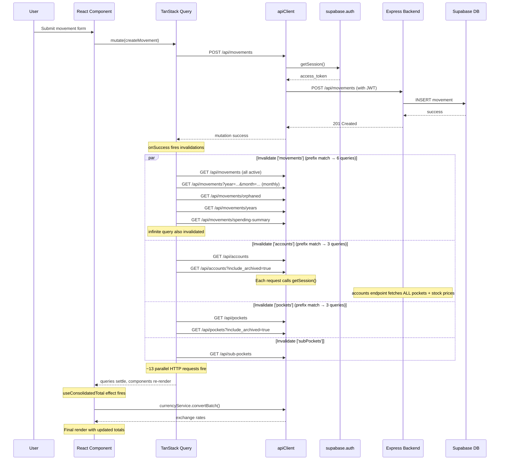

# Data Flow & Network Layer Performance Analysis

## Executive Summary

The post-mutation slowness stems from **three compounding issues**:

1. **Broad cache invalidation via prefix matching** — a single `invalidateQueries({ queryKey: ['movements'] })` invalidates 5+ distinct queries (monthly, orphaned, years, spending-summary, infinite) because TanStack Query uses prefix matching by default.
2. **`staleTime: 0` on critical queries** — accounts, pockets, settings, fixedExpenseGroups, netWorthSnapshots, and movementYears all override the global 2-minute staleTime to 0, meaning they refetch on *every* mount/navigation, not just on invalidation.
3. **Per-request session lookup** — every API call awaits `supabase.auth.getSession()` before firing, adding a round-trip to the Supabase auth layer on each request.

---

## 1. Invalidation Cascade After Mutations

### Movement Create (non-pending, with subPocket)

**File**: `frontend/src/hooks/queries/useMovementMutations.ts` (lines 59–70)

```
invalidateQueries({ queryKey: ['movements'] })   → prefix-matches 5 queries
invalidateQueries({ queryKey: ['accounts'] })    → prefix-matches 3 queries
invalidateQueries({ queryKey: ['pockets'] })     → prefix-matches 3 queries
invalidateQueries({ queryKey: ['subPockets'] })  → 1 query
broadcastInvalidation(...)                       → repeats all above in other tabs
```

**Queries matched by `['movements']` prefix:**
| Query Key | File | staleTime |
|-----------|------|-----------|
| `['movements']` | useMovementsQuery.ts:32 | 5 min |
| `['movements', 'infinite', ...]` | useMovementsQuery.ts:57 | 5 min |
| `['movements', 'monthly', year, month, page, limit, filters]` | useMonthlyMovementsQuery.ts:12 | 5 min |
| `['movements', 'orphaned']` | useOrphanedMovementsQuery.ts:6 | default (2 min) |
| `['movements', 'years']` | useMovementYearsQuery.ts:6 | 0 |
| `['movements', 'spending-summary']` | useSpendingSummaryQuery.ts:9 | 5 min |

**Queries matched by `['accounts']` prefix:**
| Query Key | File | staleTime |
|-----------|------|-----------|
| `['accounts']` | useAccountsQuery.ts:11 | 0 |
| `['accounts', 'include-archived']` | useAccountsQuery.ts:27 | 0 |
| `['accounts', accountId]` | useAccountsQuery.ts:39 | 0 |

**Queries matched by `['pockets']` prefix:**
| Query Key | File | staleTime |
|-----------|------|-----------|
| `['pockets']` | usePocketsQuery.ts:11 | 0 |
| `['pockets', 'include-archived']` | usePocketsQuery.ts:31 | 0 |
| `['pockets', 'account', accountId]` | usePocketsQuery.ts:43 | 0 |

### Total HTTP requests triggered by a single movement create (worst case):

**Up to 12 parallel refetches** from a single `createMovement` mutation on a page that subscribes to all these queries.

### Movement Delete

**File**: `frontend/src/hooks/queries/useMovementMutations.ts` (lines 155–163)

Invalidates **5 top-level keys**: `movements`, `accounts`, `pockets`, `subPockets`, `reminders`. This is the broadest invalidation — conservatively invalidates everything because the deleted movement's metadata isn't available in `onSuccess`.

### Account Delete Cascade

**File**: `frontend/src/hooks/queries/useAccountMutations.ts` (lines 100–111)

Invalidates **4 top-level keys**: `accounts`, `pockets`, `subPockets`, `movements`. With prefix matching, this fans out to ~14 actual query refetches.

---

## 2. Redundant Queries on Page Navigation

### Problem: `staleTime: 0` defeats caching

The following queries set `staleTime: 0`:
- `useAccountsQuery` — `frontend/src/hooks/queries/useAccountsQuery.ts:11`
- `useAccountsWithArchived` — `frontend/src/hooks/queries/useAccountsQuery.ts:27`
- `usePocketsQuery` — `frontend/src/hooks/queries/usePocketsQuery.ts:11`
- `usePocketsWithArchived` — `frontend/src/hooks/queries/usePocketsQuery.ts:31`
- `useSettingsQuery` — `frontend/src/hooks/queries/useSettingsQuery.ts:11`
- `useFixedExpenseGroupsQuery` — `frontend/src/hooks/queries/useFixedExpenseGroupsQuery.ts:8`
- `useNetWorthSnapshotsQuery` — `frontend/src/hooks/queries/useNetWorthSnapshotQueries.ts:16`
- `useMovementYearsQuery` — `frontend/src/hooks/queries/useMovementYearsQuery.ts:8`

**Effect**: The global default `staleTime` is 2 minutes (`queryClient.ts:33`), but these overrides mean data is *immediately stale* after fetching. Any component mount or `refetchOnWindowFocus` triggers a new network request even if the data was fetched 1 second ago.

### SummaryPage query load on mount

**File**: `frontend/src/pages/SummaryPage.tsx` (lines 1–50)

The SummaryPage mounts these queries at the top level:
1. `useAccountsQuery()` — line 37
2. `usePocketsQuery()` — line 43
3. `useSettingsQuery()` — line 49
4. `useSubPocketsQuery()` — line 55
5. `useFixedExpenseGroupsQuery()` — line 61

Plus child components add:
6. `useNetWorthSnapshotsQuery()` — via `NetWorthTimelineWidget`
7. `useRemindersQuery()` — via `RemindersWidget`
8. `useAccountsQuery()` — via `ExchangeRateTrend` (duplicate, shared cache)
9. `useMovementsQuery()` — via `MarkAsPaidModal` (lazy, only on open)
10. `useInvestmentPrices` → `useQueries` per symbol — via `useInvestmentPrices`

**On every navigation to Summary**: queries 1–5 all have `staleTime: 0`, so they refetch unconditionally. That's **5 guaranteed HTTP requests** just from mounting the page, even if you were on it 2 seconds ago.

### MovementsPage query load on mount

**File**: `frontend/src/pages/MovementsPage.tsx` (lines 1–50)

1. `usePocketsQuery()` — staleTime: 0
2. `useSubPocketsQuery()` — default (2 min)
3. `useSettingsQuery()` — staleTime: 0
4. `useMovementYearsQuery()` — staleTime: 0
5. `useMonthlyMovementsQuery(...)` — staleTime: 5 min
6. `useMovementTemplatesQuery()` — default
7. `useOrphanedMovementsQuery()` — default

**3 guaranteed refetches** on every mount (pockets, settings, movementYears).

---

## 3. Supabase Client & Session Handling

### Supabase client init

**File**: `frontend/src/lib/supabase.ts`

```typescript
export const supabase = createClient(supabaseUrl, supabaseAnonKey);
```

**Finding**: Clean — no extra options, no `autoRefreshToken` override, no `persistSession` override. Uses defaults (session persisted in localStorage, auto-refresh enabled). No latency added at init.

### Per-request session lookup (the real cost)

**File**: `frontend/src/services/apiClient.ts` (lines 30–33)

```typescript
private async getAuthToken(): Promise<string | null> {
    const { data: { session } } = await supabase.auth.getSession();
    return session?.access_token ?? null;
}
```

**Finding**: `supabase.auth.getSession()` is called on **every single API request**. In Supabase JS v2, `getSession()` reads from the in-memory store (fast, ~0ms) but in some edge cases (first call after page load, after token expiry) it may trigger a network call to refresh the token.

However, the **real cost** is that `buildHeaders()` is `async` and awaited before every fetch. This serializes the auth check with the actual request. If the session is expired, the 401 retry path (`apiClient.ts:107–120`) adds:
1. `supabase.auth.refreshSession()` — network call to Supabase auth
2. Retry of the original request

This means a single expired-token scenario turns one request into **3 sequential network calls** (original → refresh → retry).

### 401 retry on every request in a batch

When multiple queries fire in parallel after invalidation and the token happens to be expired, **each request independently** hits the 401 path and calls `refreshSession()`. There's no deduplication — N parallel requests = N refresh attempts (though Supabase client may internally deduplicate, the retry logic doesn't).

---

## 4. Backend Route Analysis

### Account routes — eager loading of pockets

**File**: `backend/src/modules/accounts/application/useCases/GetAllAccountsUseCase.ts` (lines 50–60)

```typescript
const allPockets = await this.pocketRepo.findAllByUserId(userId, includeArchived);
```

**Finding**: The `GET /api/accounts` endpoint **always fetches all pockets** for the user to calculate account balances. This means:
- When the frontend invalidates `['accounts']`, the backend re-fetches all pockets internally
- When the frontend *also* invalidates `['pockets']` in the same mutation, the pockets are fetched **twice** — once by the accounts endpoint (server-side) and once by the pockets endpoint (client-side)

### Investment price fetching in accounts endpoint

**File**: `backend/src/modules/accounts/application/useCases/GetAllAccountsUseCase.ts` (lines 65–75)

```typescript
if (!skipInvestmentPrices && account.stockSymbol) {
    const stockPrice = await this.stockPriceService.execute(account.stockSymbol);
}
```

**Finding**: Unless `?skipInvestmentPrices=true` is passed, the accounts endpoint fetches live stock prices for every investment account. The frontend's `accountService.getAllAccounts()` does NOT pass this flag — so every accounts refetch hits the stock price API.

The frontend service call (`frontend/src/services/accountService.ts:10`):
```typescript
async getAllAccounts(includeArchived: boolean = false): Promise<Account[]> {
    const path = includeArchived ? '/api/accounts?include_archived=true' : '/api/accounts';
    return await apiClient.get<Account[]>(path);
}
```

No `skipInvestmentPrices` parameter is ever sent from the default query.

---

## 5. Sequential Fetch Chains (useEffect waterfalls)

### useConsolidatedTotal — async currency conversion after accounts load

**File**: `frontend/src/hooks/useConsolidatedTotal.ts` (lines 115–165)

```typescript
useEffect(() => {
    const calculate = async () => {
        const results = await currencyService.convertBatch(conversions);
        // ...
    };
    calculate();
}, [accounts, primaryCurrency, sortedCurrencies, totalsByCurrency]);
```

**Finding**: This creates a **sequential dependency chain**:
1. `useAccountsQuery` fetches accounts (HTTP request)
2. Component renders with accounts data
3. `useConsolidatedTotal` effect fires
4. `currencyService.convertBatch()` makes another HTTP request for exchange rates
5. State updates, component re-renders

This is a 2-step waterfall: accounts must complete before currency conversion starts.

### useInvestmentPrices — parallel queries per symbol, but dependent on accounts

**File**: `frontend/src/hooks/useInvestmentPrices.ts`

Uses `useQueries` (parallel) but only fires after `accounts` data is available. This creates another waterfall:
1. Accounts load → 2. Investment price queries fire (one per unique symbol)

### No useEffect-based sequential fetch chains in pages

**Finding**: The page components do NOT have `useEffect` chains that trigger sequential fetches. All queries at the page level fire in parallel on mount. The waterfalls exist only in derived hooks (`useConsolidatedTotal`, `useInvestmentPrices`).

---

## 6. Complete Data Flow: Movement Create → UI Update



---

## 7. Summary of Identified Issues

| # | Issue | Location | Impact |
|---|-------|----------|--------|
| 1 | Prefix-match invalidation fans out `['movements']` to 6 queries | useMovementMutations.ts:59 | 6 HTTP requests per movement mutation |
| 2 | Prefix-match invalidation fans out `['accounts']` to 3 queries | useMovementMutations.ts:62 | 3 HTTP requests, each fetching all pockets server-side |
| 3 | Prefix-match invalidation fans out `['pockets']` to 3 queries | useMovementMutations.ts:63 | 3 HTTP requests (data already fetched by accounts endpoint) |
| 4 | `staleTime: 0` on accounts/pockets/settings causes refetch on every mount | useAccountsQuery.ts:11, usePocketsQuery.ts:11, useSettingsQuery.ts:11 | Redundant fetches on page navigation |
| 5 | `GET /api/accounts` always fetches all pockets + stock prices server-side | GetAllAccountsUseCase.ts:50,65 | Accounts endpoint is expensive; pockets fetched twice (server + client) |
| 6 | `supabase.auth.getSession()` called per-request with no deduplication | apiClient.ts:31 | Adds async overhead to every request; N parallel requests = N session lookups |
| 7 | Currency conversion is a sequential waterfall after accounts load | useConsolidatedTotal.ts:130 | Adds 1 extra HTTP round-trip after accounts settle |
| 8 | `deleteMovement` conservatively invalidates 5 top-level keys | useMovementMutations.ts:155–163 | Up to ~16 refetches from a single delete |
| 9 | `broadcastInvalidation` duplicates all invalidations to other tabs | crossTabSync.ts:20 | Other open tabs also fire the full refetch cascade |
| 10 | No `exact: true` on any invalidation call | All mutation hooks | Every invalidation uses prefix matching, maximizing fan-out |

---

## 8. Where the Time Goes (Estimated Breakdown)

For a typical `createMovement` on the SummaryPage:

| Phase | Estimated Time | Requests |
|-------|---------------|----------|
| Mutation POST | 200–400ms | 1 |
| Auth session lookup (per request) | 5–50ms × 13 | — |
| Parallel refetches (13 requests) | 300–800ms (limited by slowest) | 13 |
| Accounts endpoint (fetches pockets + stock prices) | 500–2000ms | included above |
| Currency conversion waterfall | 200–500ms | 1 |
| React re-renders (multiple state updates) | 50–100ms | — |
| **Total perceived delay** | **~1–3 seconds** | **~14 HTTP requests** |

The February 2025 baseline was likely faster because:
- Fewer query keys existed (no monthly, years, spending-summary, orphaned, include-archived variants)
- The accounts endpoint may not have had stock price fetching
- Fewer pages/widgets were subscribing to the same cache keys
