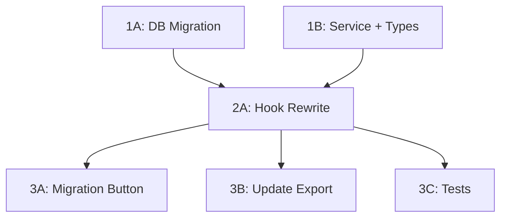

# Budget Allocations + Scenarios — Persist to DB

## Summary

Budget allocations and scenarios are currently stored in `localStorage` via `useBudgetPersistence.ts`. The data shape is well-defined and self-contained. The cleanest approach is a **new `budget_planning` table** with a single JSONB column for the full state blob (rather than adding to `settings`), plus a direct Supabase read on the frontend (matching the existing pattern for settings reads).

There's already an unused `budget_entries` table in the schema — it's a legacy artifact and should be ignored (different shape, no code references).

---

## Current State

### Data Shape (`BudgetPlanningData`)

```typescript
interface BudgetPlanningData {
  initialAmount: number;
  distributionEntries: DistributionEntry[];  // allocation rows
  scenarios: PlanningScenario[];             // what-if scenarios
  defaultAccountId: string;
  defaultPocketId: string;
  budgetCurrency: string;                    // '' = auto-detect
}

interface DistributionEntry {
  id: string;
  name: string;
  percentage: number;
  pocketId?: string;
  accountId?: string;
}

interface PlanningScenario {
  id: string;
  name: string;
  expenseIds: string[];  // sub_pocket IDs included in this scenario
}
```

### Where It Lives Now

| File | Role |
|------|------|
| `frontend/src/hooks/useBudgetPersistence.ts` | Load/save to localStorage, debounced writes (500ms) |
| `frontend/src/hooks/actions/useBudgetActions.ts` | Scenario CRUD, batch movement generation (consumes persistence state) |
| `frontend/src/hooks/actions/useSettingsActions.ts` | Reads localStorage for JSON export only |

### Key Behaviors
- Loaded once on mount from `localStorage.getItem('finance_app_budget_planning')`
- Debounced writes (500ms) on any state change
- Scenarios are CRUD'd via `setScenarios` (React state setter passed through)
- No backend involvement at all today

---

## Proposed DB Schema

**New table: `budget_planning`** (one row per user, JSONB blob)

```sql
-- Migration: 033_budget_planning_table.sql
CREATE TABLE IF NOT EXISTS budget_planning (
    id        UUID PRIMARY KEY DEFAULT gen_random_uuid(),
    user_id   UUID NOT NULL UNIQUE REFERENCES auth.users(id) ON DELETE CASCADE,
    data      JSONB NOT NULL DEFAULT '{}'::jsonb,
    updated_at TIMESTAMPTZ NOT NULL DEFAULT NOW()
);

ALTER TABLE budget_planning ENABLE ROW LEVEL SECURITY;

CREATE POLICY "Users can read own budget planning"
    ON budget_planning FOR SELECT
    USING (auth.uid() = user_id);

CREATE POLICY "Users can insert own budget planning"
    ON budget_planning FOR INSERT
    WITH CHECK (auth.uid() = user_id);

CREATE POLICY "Users can update own budget planning"
    ON budget_planning FOR UPDATE
    USING (auth.uid() = user_id);
```

**Why JSONB blob instead of normalized columns:**
- The data is a single logical unit always read/written together
- Schema matches the existing `account_card_display` JSONB pattern in `settings`
- Avoids needing separate tables for entries + scenarios + join tables
- The data is small (< 10KB typically) and doesn't need relational queries

---

## Architecture Decision: Direct Supabase (no backend module)

The app already reads settings directly from Supabase on the frontend (`settingsService.getSettings()` → `supabase.from('settings').select('*').single()`). Budget planning should follow the same pattern:

- **Read**: Direct Supabase query from frontend service
- **Write**: Direct Supabase upsert from frontend service (no backend API needed)
- **Rationale**: Budget planning is simple user-scoped CRUD with no business logic validation needed server-side. RLS handles auth.

---

## Task Breakdown

### Wave 1 — Foundation (parallel, no dependencies between tasks)

#### Task 1A: DB Migration
**Files**: `backend/migrations/033_budget_planning_table.sql`

- Create `budget_planning` table with JSONB `data` column
- Enable RLS with user-scoped policies (SELECT, INSERT, UPDATE)
- Run migration: `supabase db push`

#### Task 1B: Frontend Service + Types
**Files**: `frontend/src/services/budgetPlanningService.ts`, `frontend/src/services/mappers.ts`

- Create `budgetPlanningService` with:
  - `getBudgetPlanning(): Promise<BudgetPlanningData>` — direct Supabase read
  - `saveBudgetPlanning(data: BudgetPlanningData): Promise<void>` — upsert
- Add `mapBudgetPlanningRow()` to mappers (trivial: just extract `.data` from row)
- Export from `services/index.ts`

---

### Wave 2 — Hook Rewrite (depends on Wave 1)

#### Task 2A: Rewrite `useBudgetPersistence` to use DB
**Files**: `frontend/src/hooks/useBudgetPersistence.ts`, `frontend/src/hooks/queries/useBudgetPlanningQueries.ts` (new)

- Create TanStack Query hook: `useBudgetPlanningQuery()` (read) and `useUpdateBudgetPlanning()` (mutation)
- Rewrite `useBudgetPersistence` to:
  - Load from TanStack Query (Supabase) instead of localStorage
  - Debounced save via mutation instead of `localStorage.setItem`
  - Keep the same public interface (`UseBudgetPersistenceResult`) so consumers don't change
  - Fallback: if DB returns empty, check localStorage for migration-pending data
- Query key: `['budget-planning']`

---

### Wave 3 — Migration UI + Cleanup (depends on Wave 2)

#### Task 3A: One-Time Migration Button in Settings
**Files**: `frontend/src/pages/SettingsPage.tsx` (or relevant settings section), `frontend/src/hooks/actions/useSettingsActions.ts`

- Add "Migrate Budget Data" button (only visible when localStorage has data AND DB is empty)
- On click: read localStorage → call `budgetPlanningService.saveBudgetPlanning(data)` → clear localStorage key → invalidate query → show success toast
- After migration completes, button disappears

#### Task 3B: Update Export to Read from DB
**Files**: `frontend/src/hooks/actions/useSettingsActions.ts`

- Change `readBudgetPlanning()` in export handler to call `budgetPlanningService.getBudgetPlanning()` instead of reading localStorage
- Make `handleExport` async-aware of the new source

#### Task 3C: Tests
**Files**: `frontend/src/hooks/__tests__/useBudgetPersistence.test.ts` (update), `frontend/src/hooks/__tests__/useBudgetPlanningQueries.test.ts` (new)

- Update existing persistence tests to mock Supabase instead of localStorage
- Add integration test for migration flow (localStorage → DB → localStorage cleared)

---

## Dependency Graph



---

## Notes

- The existing `budget_entries` table in `000_initial_schema.sql` is dead code — never referenced in frontend or backend. Leave it alone (or drop in a future cleanup migration).
- `useBudgetActions.ts` doesn't need changes — it consumes state from `useBudgetPersistence` via props, so swapping the persistence layer is transparent to it.
- The debounce strategy (500ms) should be kept for the DB write path to avoid excessive upserts during rapid editing (typing amounts, dragging sliders).
