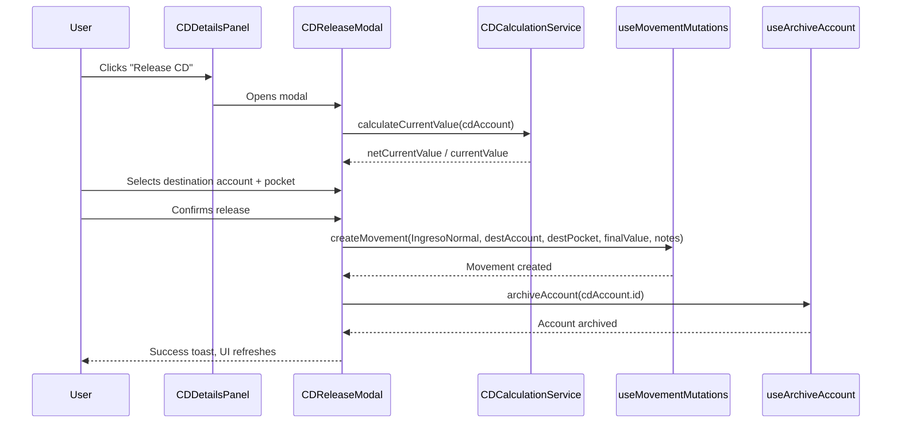

# CD Maturation / Release Feature — Research & Task Breakdown

## Summary

When a CD matures, user clicks "Release" on the CD account card or details panel. This opens a modal to select a destination account + pocket, creates an income movement for the CD's net final value, and archives the CD account. The archived account itself serves as the historical record (all fields are preserved).

All infrastructure already exists:
- `CDCalculationService` computes net final value (including withholding tax)
- `useArchiveAccount` hook handles soft-delete
- `useMovementMutations().createMovement` creates income movements
- `AccountPocketSelector` is a reusable destination picker
- `CDDetailsPanel` already shows a "matured" banner where the Release button naturally belongs

No new DB tables, migrations, or backend changes are needed.

---

## Architecture



---

## Key Decisions

| Decision | Choice | Rationale |
|----------|--------|-----------|
| Where to store CD history? | Archived account (no new table) | CD accounts already have `principal`, `interestRate`, `termMonths`, `maturityDate`, `compoundingFrequency`, `withholdingTaxRate`. Archiving preserves all fields. |
| What amount to release? | `netCurrentValue` (after withholding tax) | This is what the user actually receives. The movement notes capture the breakdown. |
| What if CD hasn't matured yet? | Show "Release" only when `isMatured === true` | Early withdrawal is a separate feature (penalty calculation exists but UX is different). |
| Movement notes format | Structured text with CD summary | e.g., "CD Matured: 12-month, COP 30,000,000 principal, 12% APY, Net value: COP 33,200,000" |
| Where does the button go? | `CDDetailsPanel` matured banner + `CDAccountCard` (conditional) | Details panel is primary; card gets a small action button when matured. |

---

## Existing Code Inventory

### Types (`frontend/src/types/index.ts`)
- `CDInvestmentAccount` — has `principal`, `interestRate`, `termMonths`, `maturityDate`, `compoundingFrequency`, `withholdingTaxRate`, `cdCreatedAt`
- `CDCalculationResult` — has `netCurrentValue`, `isMatured`, `netInterest`, `withholdingTax`
- `Movement` — `type: 'IngresoNormal'`, `notes`, `accountId`, `pocketId`

### Services
- `cdCalculationService.calculateCurrentValue(account)` → `CDCalculationResult` with `netCurrentValue`, `isMatured`
- `cdCalculationService.generateCDSummary(account)` → status, netCurrentValue, daysToMaturity
- `movementService.createMovement(type, accountId, pocketId, amount, notes, displayedDate)` → `Movement`

### Hooks
- `useArchiveAccount()` — mutation calling `accountService.archiveAccount(id)`, invalidates `['accounts']`
- `useMovementMutations().createMovement` — mutation with full cache invalidation

### Components
- `CDDetailsPanel` — shows matured banner ("Consider reinvesting or withdrawing funds"), ideal place for Release button
- `CDAccountCard` — card with edit/archive actions; can add conditional Release action
- `AccountPocketSelector` — reusable cascading account → pocket dropdown (already used in movement forms, restore modal, settings)

---

## Task Breakdown

### Wave 1 — Core Release Logic (hook + modal)

#### Task 1.1: `useCDRelease` hook
Create a custom hook that orchestrates the release flow.

**File**: `frontend/src/hooks/actions/useCDRelease.ts`

**Responsibilities**:
- Accept a `CDInvestmentAccount`
- Calculate final net value via `cdCalculationService`
- Expose `releaseMutation` that:
  1. Creates income movement on destination
  2. Archives the CD account
- Handle sequential mutation (movement first, then archive)
- Generate structured notes string
- Return `{ release, isReleasing, finalValue, notes }`

**Size**: Small

---

#### Task 1.2: `CDReleaseModal` component
Modal that asks user for destination and confirms release.

**File**: `frontend/src/components/accounts/CDReleaseModal.tsx`

**Responsibilities**:
- Show CD summary (name, principal, net final value, term, rate)
- `AccountPocketSelector` for destination (exclude the CD account itself and other CD/investment accounts)
- Confirm button triggers `useCDRelease.release()`
- Loading state while mutations execute
- Success closes modal, shows toast

**Size**: Medium

---

### Wave 2 — UI Integration (buttons + conditional display)

#### Task 2.1: Add Release button to `CDDetailsPanel`
Modify the existing matured banner to include a "Release CD" button.

**File**: `frontend/src/components/accounts/CDDetailsPanel.tsx`

**Changes**:
- Add `onRelease?: (account: CDInvestmentAccount) => void` prop
- In the matured alert section, add a primary button "Release CD"
- Only show when `calculation.isMatured === true`

**Size**: Small

---

#### Task 2.2: Add Release action to `CDAccountCard`
Show a small "Release" action button on matured CD cards.

**File**: `frontend/src/components/accounts/CDAccountCard.tsx`

**Changes**:
- Add `onRelease?: (account: CDInvestmentAccount) => void` prop
- Add conditional action button (only when matured) next to edit/archive
- Use a distinct icon (e.g., `Unlock` or `ArrowUpRight` from lucide)

**Size**: Small

---

#### Task 2.3: Wire modal into accounts page
Connect the modal to the parent page/container that renders CD cards.

**File**: Whichever parent renders `CDAccountCard` and `CDDetailsPanel` (likely `AccountsPage.tsx` or similar)

**Changes**:
- Add `releasingCD` state
- Pass `onRelease` callbacks to CDAccountCard and CDDetailsPanel
- Render `CDReleaseModal` when `releasingCD` is set

**Size**: Small

---

### Wave 3 — Polish & Tests

#### Task 3.1: Archived CD display enhancement
Show CD-specific info in the archived section so users can see their CD history.

**File**: `frontend/src/components/accounts/ArchivedSection.tsx`

**Changes**:
- Detect `type === 'cd'` accounts in archived list
- Show inline badge with term, rate, and maturity date
- e.g., "12-month • 12% APY • Matured Jan 2026"

**Size**: Small

---

#### Task 3.2: Tests for `useCDRelease` hook
Unit tests for the release orchestration logic.

**File**: `frontend/src/hooks/__tests__/useCDRelease.test.ts`

**Coverage**:
- Calculates correct net value
- Creates movement with correct params (type, account, pocket, amount, notes)
- Archives account after movement succeeds
- Handles movement failure (does not archive)
- Generates correct notes string

**Size**: Small

---

#### Task 3.3: Tests for `CDReleaseModal`
Component tests for the modal.

**File**: `frontend/src/components/accounts/__tests__/CDReleaseModal.test.tsx`

**Coverage**:
- Renders CD summary correctly
- Account selector excludes CD/investment accounts
- Confirm button disabled until destination selected
- Calls release with correct destination
- Shows loading state during mutation

**Size**: Small

---

## Wave Summary

| Wave | Tasks | Total Size |
|------|-------|-----------|
| 1 — Core logic | 1.1 hook, 1.2 modal | 1 small + 1 medium |
| 2 — UI integration | 2.1 details button, 2.2 card button, 2.3 wiring | 3 small |
| 3 — Polish & tests | 3.1 archived display, 3.2 hook tests, 3.3 modal tests | 3 small |

**Total**: 8 tasks (1 medium, 7 small)

---

## Movement Notes Format

When a CD is released, the income movement's `notes` field should contain:

```
CD Released: {account.name}
Term: {termMonths}-month, {interestRate}% APY ({compoundingFrequency})
Principal: {formatted principal}
Net Interest: {formatted netInterest}
Withholding Tax: {formatted withholdingTax}
Final Amount: {formatted netCurrentValue}
Matured: {formatted maturityDate}
```

This gives a full audit trail in the movement itself, while the archived account preserves the raw data.
