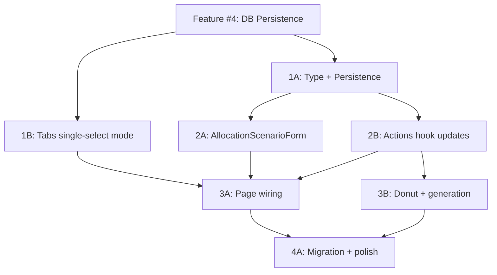

# Research: Allocation Scenarios (CRUD, Independent from Fixed Expense Scenarios)

## Summary

Allocation scenarios are a new concept: named sets of distribution entries (each with name + percentage + optional pocket link). Currently, distribution entries live as a flat array in `useBudgetPersistence` (localStorage). Fixed expense scenarios (`PlanningScenario`) already have full CRUD with tabs UI — the pattern is directly reusable for allocation scenarios with minor adaptations.

**Key difference**: Fixed expense scenarios select *which expenses* to include (checkbox list of SubPockets). Allocation scenarios define *how to distribute* the remainder (a set of named percentage entries). The form UI is completely different, but the tabs + CRUD shell is identical.

## Current State Analysis

### Distribution Entries (what becomes "allocation scenario content")

```typescript
// frontend/src/components/budget/BudgetEntryRow.tsx
interface DistributionEntry {
  id: string;
  name: string;
  percentage: number;
  pocketId?: string;   // linked pocket
  accountId?: string;  // linked account
}
```

Currently stored as a single flat array in `useBudgetPersistence` → localStorage key `finance_app_budget_planning`. There's no concept of multiple named sets.

### Fixed Expense Scenario Pattern (to reuse)

```
ScenarioForm.tsx       → form for creating/editing (checkbox list of expenses)
BudgetScenarioTabs.tsx → tab bar with toggle, edit, delete, create buttons
useBudgetActions.ts    → CRUD handlers (saveScenario, deleteScenario, toggleScenario)
useBudgetPersistence   → localStorage persistence (scenarios array)
UnifiedBudgetPage      → modal state + wiring
```

The tabs component is generic enough to reuse with different content. The form needs a completely new implementation (percentage entries instead of expense checkboxes).

### How Generation Works

`useBudgetActions.prepareUnifiedBatch()` combines:
1. **Distribution rows** — from `distributionEntries` (the active allocation)
2. **Fixed expense rows** — from `relevantFixedSubPockets` (filtered by active fixed expense scenarios)

After this feature, step 1 will read from the *selected allocation scenario's entries* instead of the single flat `distributionEntries` array.

## Design Decisions

| Question | Answer |
|----------|--------|
| Can we reuse `BudgetScenarioTabs`? | **Yes** — it's generic (name + toggle + edit/delete). Just needs different total calculation (sum of percentages vs monthly cost). |
| Can we reuse `ScenarioForm`? | **No** — completely different content (percentage sliders vs expense checkboxes). Need new `AllocationScenarioForm`. |
| Selection model? | **Single-select** for allocation (only one active at a time) vs multi-select for fixed expenses. Tabs component needs a `singleSelect` mode. |
| What happens to the current flat entries? | They become the "default" scenario, or migrate into the first named scenario on first load. |
| Persistence? | localStorage initially (same as current). DB persistence is feature #4 prerequisite. |

## New Type

```typescript
interface AllocationScenario {
  id: string;
  name: string;
  entries: DistributionEntry[];  // the percentage allocations
}
```

## Task Breakdown

### Prerequisites
- Feature #4 (DB persistence) must be done first for scenarios to persist across devices

---

### Wave 1: Type + Persistence Layer (parallelizable)

#### Task 1A: Define AllocationScenario type + update persistence
**Files**: `frontend/src/types/budget.ts` (new), `frontend/src/hooks/useBudgetPersistence.ts`
**Work**:
- Create `AllocationScenario` type (id, name, entries: DistributionEntry[])
- Add `allocationScenarios: AllocationScenario[]` and `activeAllocationScenarioId: string | null` to `BudgetPlanningData`
- Add corresponding state + setters to `useBudgetPersistence`
- Migration logic: if `allocationScenarios` is empty but `distributionEntries` has items, create a "Default" scenario from them

#### Task 1B: Add single-select mode to BudgetScenarioTabs
**Files**: `frontend/src/components/budget/BudgetScenarioTabs.tsx`
**Work**:
- Add optional `singleSelect?: boolean` prop
- When `singleSelect=true`, `onToggle` deselects others (radio behavior instead of checkbox)
- Add optional `subtitle` render prop or `getSubtitle?: (scenario) => string` for custom tab subtitles (percentage total vs monthly cost)
- Keep backward-compatible (existing fixed expense usage unchanged)

---

### Wave 2: Form + Actions (depends on Wave 1)

#### Task 2A: AllocationScenarioForm component
**Files**: `frontend/src/components/budget/AllocationScenarioForm.tsx` (new)
**Work**:
- Form with scenario name input
- Embedded mini version of AllocationStrategy (add/remove/edit entries with name + percentage)
- Reuse `AllocationSliderRow` for each entry
- Shows total percentage with validation (warn if ≠ 100%)
- Save/Cancel buttons
- Props: `initialData?: AllocationScenario`, `onSave`, `onCancel`

#### Task 2B: Allocation scenario actions in useBudgetActions
**Files**: `frontend/src/hooks/actions/useBudgetActions.ts`
**Work**:
- Add params: `allocationScenarios`, `setAllocationScenarios`, `activeAllocationScenarioId`, `setActiveAllocationScenarioId`
- Add handlers: `saveAllocationScenario`, `deleteAllocationScenario`, `selectAllocationScenario`
- Derive `activeDistributionEntries` from selected scenario (or empty if none selected)
- Update `prepareUnifiedBatch` to use `activeDistributionEntries` instead of raw `distributionEntries`
- Update `remaining` calculation and `convertedAmounts` to use active scenario entries

---

### Wave 3: Page Integration (depends on Wave 2)

#### Task 3A: Wire allocation scenario tabs into UnifiedBudgetPage
**Files**: `frontend/src/pages/UnifiedBudgetPage.tsx`
**Work**:
- Add allocation scenario tabs in right panel (above or replacing current AllocationStrategy header)
- Add modal state for `AllocationScenarioForm` (showAllocationScenarioForm, editingAllocationScenario)
- Pass allocation scenarios to a second `BudgetScenarioTabs` instance (with `singleSelect`)
- `AllocationStrategy` now reads entries from the active allocation scenario
- Wire create/edit/delete/select handlers

#### Task 3B: Update donut chart + generation to use active allocation scenario
**Files**: `frontend/src/components/budget/PortfolioDonutChart.tsx`, `frontend/src/pages/UnifiedBudgetPage.tsx`
**Work**:
- `PortfolioDonutChart` entries prop now comes from active allocation scenario
- Verify `prepareUnifiedBatch` correctly uses active scenario entries
- Verify empty state: no allocation scenario selected → distribution section shows "select or create a scenario" prompt
- Ensure "Generate Movements" button disabled state accounts for no active allocation scenario

---

### Wave 4: Polish (depends on Wave 3)

#### Task 4A: Migration UX + empty states
**Files**: `frontend/src/hooks/useBudgetPersistence.ts`, `frontend/src/components/budget/AllocationStrategy.tsx`
**Work**:
- On first load with existing entries but no scenarios: auto-create "Default" scenario, auto-select it
- Empty state in AllocationStrategy when no scenario selected: "Select or create an allocation scenario"
- Empty state in tabs when no scenarios exist: "Create your first allocation scenario"

---

## Dependency Graph



## Parallelism

- **Wave 1**: 1A and 1B are fully parallel
- **Wave 2**: 2A and 2B are fully parallel (2A is pure UI, 2B is pure logic)
- **Wave 3**: 3A and 3B can be partially parallel (3B only needs 2B, not 2A)
- **Wave 4**: Sequential, depends on everything above

## Notes

- The existing `BudgetScenarioTabs` shows monthly cost as subtitle. For allocation scenarios, subtitle should show "X entries, Y% allocated" or similar.
- Fixed expense scenarios use multi-select (toggle multiple active). Allocation scenarios must be single-select (only one distribution plan active at a time).
- The `AllocationStrategy` component currently owns add/delete/edit of entries inline. With scenarios, inline editing still works but edits the *active scenario's entries* (auto-saved to the scenario).
