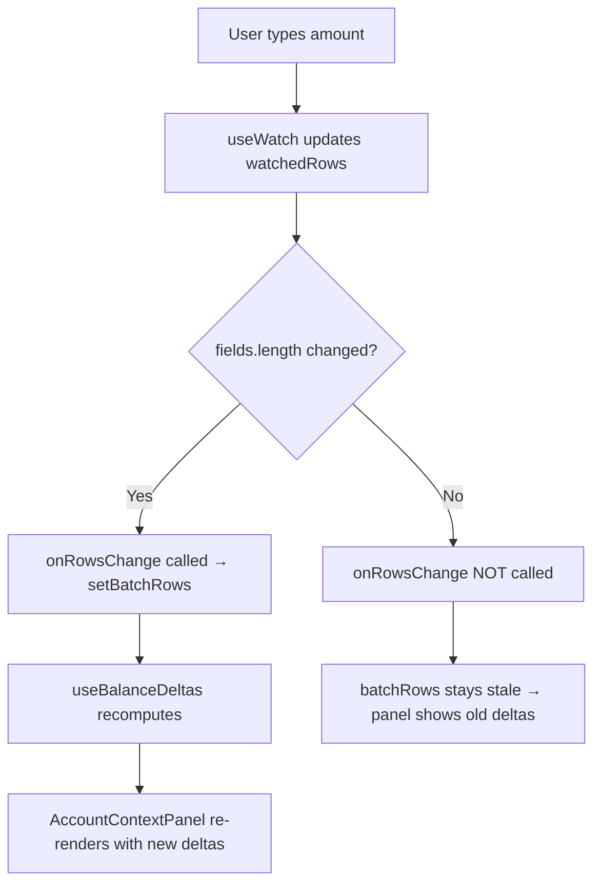

# Research: Batch Movement Modal Issues

## Summary

Two issues in the batch movement modal: (1) balance deltas don't update live on amount/field edits — only on row add/remove, (2) row add/remove has no animation. Both are straightforward fixes. Issue 1 is a logic bug in callback gating; Issue 2 needs CSS keyframes (no library needed, project already has custom animations).

---

## Issue 1: Account Details Panel Doesn't Update Live on Amount Change

### Root Cause

In `BatchMovementForm.tsx`, the `onRowsChange` callback is **gated behind a length check**:

```typescript
// BatchMovementForm.tsx, lines ~70-75
const prevLengthRef = useRef(fields.length);
useEffect(() => {
  if (fields.length !== prevLengthRef.current) {  // ← PROBLEM: only fires on add/remove
    prevLengthRef.current = fields.length;
    onRowsChangeRef.current?.(watchedRows);
  }
}, [fields.length, watchedRows]);
```

In `MovementsPage.tsx`, the side-panel deltas are computed by `useBalanceDeltas({ formState, showBatchForm, batchRows })`. The `batchRows` state is only set via `setBatchRows` which is wired to `onBatchRowsChange` — which maps to the gated callback above.

**Result**: `batchRows` state in MovementsPage is always stale (only reflects the rows array at the moment of last add/remove). When a user types an amount, `watchedRows` updates inside the form but **never propagates** to the parent's `batchRows` → deltas never recalculate.

The `onFocusRow` callback DOES fire on watched row changes (second `useEffect` in the form), but it only updates `activeAccountId`/`activePocketId` for the panel selection highlight — it doesn't update the `batchRows` array that feeds delta computation.

### Data Flow Diagram



### Proposed Fix

Remove the length gate. Always propagate `watchedRows` to the parent when they change:

```typescript
// Replace the length-gated effect with:
useEffect(() => {
  onRowsChangeRef.current?.(watchedRows);
}, [watchedRows]);
```

This is safe because `onRowsChangeRef` is a stable ref and `watchedRows` changes on any field edit (react-hook-form's `useWatch` returns a new array reference when any nested value changes).

**Concern**: Performance — `useBalanceDeltas` uses `useMemo` with `batchRows` in deps. Since `setBatchRows` replaces state with a new array every keystroke, the memo will recompute. The computation is O(n) where n = number of rows (typically <20) — negligible. If needed, debounce with 100ms.

### Task Breakdown

| # | File | Change |
|---|------|--------|
| 1 | `frontend/src/components/movements/BatchMovementForm.tsx` | Remove the `fields.length` guard from the `onRowsChange` useEffect. Keep it unconditional on `watchedRows` changes. Remove `prevLengthRef`. |
| 2 | (optional) Same file | If perf is a concern, add a 100ms debounce on `onRowsChangeRef.current?.(watchedRows)` using a `setTimeout`/`useRef` pattern. |
| 3 | `frontend/src/hooks/__tests__/useBalanceDeltas.test.ts` | Verify existing tests still pass (they test the hook directly with row data). |

### Complexity: Low

Single-line logic change. No API/state architecture changes. Existing tests cover the hook itself.

---

## Issue 2: Adding/Removing Rows Is Visually Abrupt

### Current State

- **No animation library** in `package.json` (no framer-motion, react-spring, etc.)
- Project uses **custom CSS `@keyframes`** in `index.css` for toasts, slides, and backdrop (`animate-toast-enter`, `animate-toast-exit`, `slide-in-right`, `slide-in-left`, `backdrop-in`)
- Rows are rendered via `fields.map()` from `useFieldArray` — standard react-hook-form pattern
- The row container is: `<div className="space-y-3 max-h-[60vh] overflow-y-auto">`

### Animation Approach Options

| Option | Pros | Cons |
|--------|------|------|
| **CSS @keyframes + classes** | Zero deps, consistent with project | No exit animation (element removed from DOM instantly) |
| **framer-motion AnimatePresence** | Proper enter+exit, battle-tested | New 30KB dep, overkill for this |
| **CSS @keyframes + delayed removal** | Exit animation possible, no deps | Requires manual state management for removing rows |

### Recommended: CSS @keyframes for enter + delayed removal for exit

Since the project already uses custom keyframes and no animation library, stay consistent:

1. **Enter**: Apply a `animate-row-enter` class (fade-in + slide-down) to new rows
2. **Exit**: Before calling `remove(index)`, add a `animate-row-exit` class, wait for animation to complete (~200ms), then remove

This avoids adding a dependency while giving both enter and exit animations.

### Proposed Implementation

**New keyframes** (in `index.css`):
```css
@keyframes row-enter {
  from { opacity: 0; transform: translateY(-8px); max-height: 0; }
  to { opacity: 1; transform: translateY(0); max-height: 200px; }
}
@keyframes row-exit {
  from { opacity: 1; transform: translateY(0); max-height: 200px; }
  to { opacity: 0; transform: translateY(-8px); max-height: 0; }
}
.animate-row-enter { animation: row-enter 0.2s ease-out forwards; }
.animate-row-exit { animation: row-exit 0.2s ease-in forwards; }
```

**Logic change** in `BatchMovementForm.tsx`:
- Track a `Set<string>` of "exiting" row IDs
- On remove, add to exiting set → CSS class applies → `setTimeout(200ms)` → call `remove(index)` → remove from exiting set
- New rows get `animate-row-enter` class (detect via tracking "just-added" IDs for one render cycle)

### Task Breakdown

| # | File | Change |
|---|------|--------|
| 1 | `frontend/src/index.css` | Add `row-enter` and `row-exit` keyframes + utility classes |
| 2 | `frontend/src/components/movements/BatchMovementForm.tsx` | Add `exitingIds` state (Set). Modify `handleRemove` to animate before removing. Wrap row div with conditional animation class. |
| 3 | Same file | Track newly added row IDs (via `append` callback or comparing fields) to apply enter animation class. |

### Complexity: Low-Medium

CSS is trivial. The delayed-removal logic needs care to avoid stale closures and race conditions (user spamming remove), but it's ~20 lines of code.

---

## Combined Estimate

| Issue | Complexity | Files Touched | Time |
|-------|-----------|---------------|------|
| 1 – Live delta updates | Low | 1 file (BatchMovementForm.tsx) | ~15 min |
| 2 – Row animations | Low-Medium | 2 files (index.css + BatchMovementForm.tsx) | ~30 min |
| **Total** | **Low-Medium** | **2 files** | **~45 min** |
