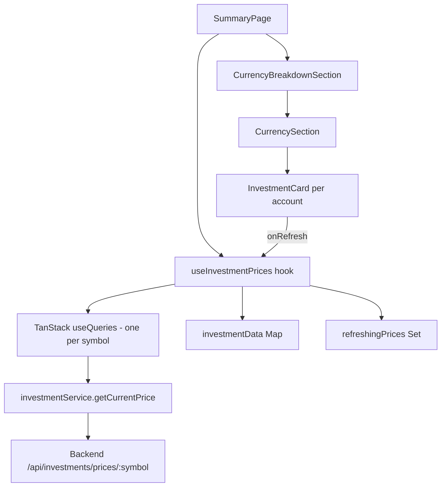
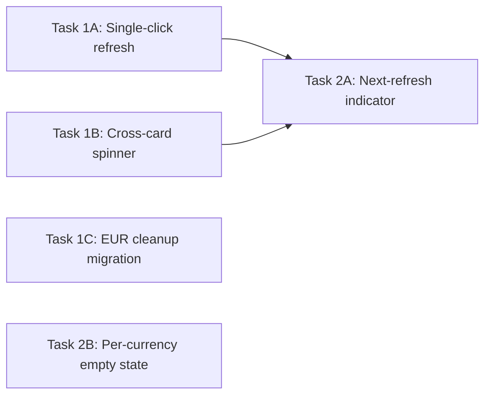

# Research: Exchange Rate Trends & Investment Refresh Systems

## Executive Summary

Three improvements needed: (1) ExchangeRateTrend widget already filters by user accounts — no code change needed for filtering, but EUR orphan data needs cleanup; (2) Investment refresh UX needs simplification from triple-click to single-click with cooldown, plus cross-card spinner sync; (3) Exchange rate saving is already proactive via `saveRate` → `recordHistory` with 1-hour dedup.

---

## Part 1: Exchange Rate Trend Widget

### Current Implementation

**File**: `frontend/src/components/net-worth/ExchangeRateTrend.tsx`

**How it decides currencies**: Already correct. It:
1. Fetches user's accounts via `useAccountsQuery()`
2. Extracts unique currencies from those accounts
3. Filters out the primary currency (from settings, defaults to `COP`)
4. Result: only currencies the user actually holds

```typescript
const targetCurrencies = useMemo(() => {
  if (!accounts) return [];
  const unique = [...new Set(accounts.map((a) => a.currency))];
  return unique.filter((c) => c !== primaryCurrency) as Currency[];
}, [accounts, primaryCurrency]);
```

**Data source**: Backend endpoint `/api/reports/exchange-rate-history?base=X&target=Y&days=N` → queries `exchange_rate_history` table, groups by day, returns latest rate per day.

**Display**: Recharts `LineChart` with % change from baseline. Shows all currencies on same graph (matches user preference). Day range selector: 30/90/180/365 days.

### Finding: No filtering bug exists

The widget already only shows currencies from user accounts. If user has MXN, USD, COP accounts with COP as primary → it shows MXN→COP and USD→COP. EUR won't appear unless user has a EUR account.

### Remaining issue: Orphaned EUR data in `exchange_rate_history`

The `exchange_rate_history` table may contain EUR rows from past conversions. These don't affect the widget (filtered out), but are dead data. Cleanup is optional/cosmetic.

---

## Part 2: Investment Refresh UX

### Current Implementation

**Files**:
- `frontend/src/hooks/useInvestmentPrices.ts` — price fetching, triple-click logic
- `frontend/src/components/summary/InvestmentCard.tsx` — UI, refresh button
- `frontend/src/services/investmentService.ts` — API calls, local cache

### Architecture



### Problem 1: Triple-click is unintuitive

Current flow in `handleRefreshPrice`:
- Click 1: toast "2 more clicks to force refresh"
- Click 2: toast "1 more click to force refresh"
- Click 3: actually refreshes (with 60s cooldown)

The `invalidateQueries` call on click 3 triggers a refetch. But clicks 1-2 also call `invalidateQueries` — they just don't have the "force" semantics. Actually looking closer, **every click invalidates the query** regardless of click count. The triple-click only gates the toast messaging and cooldown tracking.

**Root cause**: The code always invalidates on any click. The triple-click gate is cosmetic — it only controls the "Forcing refresh..." toast and cooldown enforcement. This means single-click already works for refreshing, but the UX messaging is confusing.

### Problem 2: Cross-card spinner not syncing

`refreshingPrices` is a `Set<string>` keyed by **account ID**, not symbol. When user clicks refresh on VOO account A:
- `refreshingPrices.add(accountA.id)` → spinner shows on card A
- `invalidateQueries({ queryKey: ['investmentPrice', 'VOO'] })` → refetches for ALL VOO accounts
- But `refreshingPrices` never adds `accountB.id` → card B shows no spinner

The data updates correctly (shared query key), but the visual feedback is wrong.

### Problem 3: No next-refresh indicator

The `lastUpdated` timestamp shows when price was last fetched. No indicator of when the next auto-poll happens (every 5 min via `PRICE_STALE_TIME_MS`).

### Backend cache dynamics

Backend: `cacheHours = Math.ceil(symbolCount * 24 / 25)`. With 1 symbol (VOO) = ~1 hour cache. Frontend polls every 5 minutes but gets cached response until backend cache expires.

---

## Part 3: Proactive Exchange Rate Saving

### Current Implementation

**File**: `backend/src/modules/settings/infrastructure/SupabaseExchangeRateRepository.ts`

`saveRate()` already calls `recordHistory()` which:
1. Checks if a record exists for this pair within the last hour
2. If not, inserts a new row into `exchange_rate_history`

This means: every time a currency conversion happens (which calls `saveRate`), the rate is automatically recorded with 1-hour dedup. **This is already working correctly.**

### What's missing

Nothing functionally. The system already saves rates proactively on every conversion. The only gap is the orphaned EUR data mentioned in Part 1.

---

## Task Breakdown

### Wave 1 (Parallel — no dependencies)

#### Task 1A: Single-click refresh with cooldown
**Files**: `frontend/src/hooks/useInvestmentPrices.ts`
**Scope**:
- Remove triple-click state (`clickCounts`, `CLICK_TIMEOUT`, `FORCE_CLICK_THRESHOLD`)
- Replace with single-click that immediately refreshes
- Keep 60s cooldown per symbol (not per account) using `lastForceRefresh` keyed by symbol
- On click within cooldown: toast with seconds remaining
- On click outside cooldown: invalidate query, show spinner

#### Task 1B: Cross-card spinner sync (symbol-based refreshing state)
**Files**: `frontend/src/hooks/useInvestmentPrices.ts`, `frontend/src/components/summary/CurrencySection.tsx`
**Scope**:
- Change `refreshingPrices` from `Set<accountId>` to tracking by symbol
- When refreshing VOO, mark ALL accounts with `stockSymbol === 'VOO'` as refreshing
- Expose a helper: `isRefreshing(accountId)` that checks if that account's symbol is currently refreshing
- CurrencySection already passes `refreshingPrices.has(account.id)` — this will work if we populate the set with all matching account IDs

#### Task 1C: Clean up orphaned EUR exchange rate history
**Files**: New migration file `backend/migrations/XXX_cleanup_eur_history.sql`
**Scope**:
- Delete rows from `exchange_rate_history` where `base_currency = 'EUR'` or `target_currency = 'EUR'`
- One-time migration, no code change needed

### Wave 2 (Depends on Wave 1A/1B)

#### Task 2A: Next-refresh countdown indicator
**Files**: `frontend/src/components/summary/InvestmentCard.tsx`, `frontend/src/hooks/useInvestmentPrices.ts`
**Scope**:
- Expose `nextRefreshAt` per symbol from the hook (based on `lastForceRefresh` + cooldown, or TanStack Query's `dataUpdatedAt` + `PRICE_STALE_TIME_MS`)
- In InvestmentCard, show subtle text under "Last updated": "Auto-refresh in Xm" or "Refresh available"
- When cooldown active, refresh button shows disabled with remaining seconds tooltip

#### Task 2B: (Optional) ExchangeRateTrend — add "no data yet" per-currency messaging
**Files**: `frontend/src/components/net-worth/ExchangeRateTrend.tsx`
**Scope**:
- If a currency has accounts but zero history rows, show a note like "MXN: collecting data..."
- Currently shows generic "Collecting rate data..." for all — could be per-line

### Dependency Graph



### Summary Table

| Task | Files | Effort | Priority |
|------|-------|--------|----------|
| 1A: Single-click refresh | `useInvestmentPrices.ts` | Small | High |
| 1B: Cross-card spinner | `useInvestmentPrices.ts` | Small | High |
| 1C: EUR cleanup | New migration SQL | Trivial | Low |
| 2A: Next-refresh indicator | `InvestmentCard.tsx`, `useInvestmentPrices.ts` | Medium | Medium |
| 2B: Per-currency empty state | `ExchangeRateTrend.tsx` | Small | Low |

---

## Key Findings

1. **ExchangeRateTrend already filters correctly** — no code change needed for the "only show user's currencies" requirement. It's already implemented.
2. **Rate saving is already proactive** — `saveRate` → `recordHistory` with 1-hour dedup handles this automatically on every conversion.
3. **The real work is in investment refresh UX** — simplifying triple-click to single-click and fixing cross-card spinner sync.
4. **Tasks 1A and 1B can be combined** into a single refactor of `handleRefreshPrice` since they both modify the same function and state.
