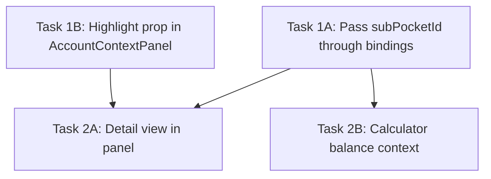

# Research: Fixed Expenses in Account Details Panel

## Summary

The Account Details panel (right side of movement modal) currently shows account info and lists pockets/sub-pockets with balance deltas, but **does not highlight or show detailed info for the selected sub-pocket**. The `subPocketId` is already tracked in `liveValues` and batch rows, and balance deltas already compute per-sub-pocket — but the panel never receives `selectedSubPocketId` and has no expanded detail view for sub-pockets.

## Current State

### Data Flow

```
MovementForm → onValuesChange({ type, accountId, pocketId, subPocketId, amount })
    ↓
MovementsPage → formState.setLiveValues(values)
    ↓
useBalanceDeltas → computes subPocketDeltas[subPocketId]
    ↓
MovementFormPanel → passes to AccountContextPanel:
    - accountId ✅
    - selectedPocketId ✅
    - deltas (includes subPocketDeltas) ✅
    - selectedSubPocketId ❌ NOT PASSED
```

### AccountContextPanel (`AccountContextPanel.tsx`)

**Props received:**
- `accountId` — drives which account to show
- `selectedPocketId` — highlights the selected pocket with blue styling + checkmark
- `deltas` — shows projected balance changes (already includes `subPocketDeltas`)

**Current sub-pocket rendering:**
- Lists sub-pockets under fixed-type pockets
- Shows name + balance with delta preview
- **No highlight** for selected sub-pocket
- **No detail info** (target amount, monthly contribution, progress)

### SubPocket Type (available fields)

```typescript
interface SubPocket {
  id: string;
  pocketId: string;
  name: string;
  valueTotal: number;       // Target amount
  periodicityMonths: number; // Months to divide over
  balance: number;          // Current balance
  groupId?: string;
  displayOrder?: number;
}
```

Derived values:
- `monthlyContribution = valueTotal / periodicityMonths`
- `progress = balance / valueTotal` (clamped 0-1)

### SidePanelBindings (MovementFormPanel.tsx)

```typescript
interface SidePanelBindings {
  activeAccountId: string;
  activePocketId: string;
  balanceDeltas: BalanceDeltas;
  selectedPocketBalance: number | null;
  onUseCalculatorAmount: (amount: number) => void;
}
```

Missing: `activeSubPocketId` is not passed through.

### MovementsPage (where bindings are constructed)

- Single form: `activeAccountId = formState.liveValues.accountId`, `activePocketId = formState.liveValues.pocketId`
- Batch form: `activeAccountId = batchActiveAccountId`, `activePocketId = batchActivePocketId`
- **Neither path extracts `subPocketId`** for the side panel

## What Needs to Change

1. **Pass `selectedSubPocketId` through the chain** (MovementsPage → SidePanelBindings → AccountContextPanel)
2. **Highlight selected sub-pocket** in the panel (same pattern as pocket highlight)
3. **Show sub-pocket detail info** when selected: name, target, monthly contribution, progress bar, balance

---

## Task Breakdown

### Wave 1 — Plumbing (parallel)

#### Task 1A: Pass `selectedSubPocketId` through bindings

**Files:**
- `frontend/src/components/movements/MovementFormPanel.tsx` — add `activeSubPocketId` to `SidePanelBindings`
- `frontend/src/pages/MovementsPage.tsx` — extract subPocketId from `liveValues` / batch row, pass in sidePanel

**Changes:**
- Add `activeSubPocketId: string` to `SidePanelBindings` interface
- In MovementsPage: `const activeSubPocketId = showBatchForm ? batchActiveSubPocketId : formState.liveValues.subPocketId`
- Add `batchActiveSubPocketId` state + set it in `handleBatchRowFocus`
- Pass `activeSubPocketId` in the `sidePanel` prop

#### Task 1B: Add `selectedSubPocketId` prop to AccountContextPanel

**Files:**
- `frontend/src/components/movements/AccountContextPanel.tsx` — add prop, highlight selected sub-pocket

**Changes:**
- Add `selectedSubPocketId?: string | null` to `AccountContextPanelProps`
- Apply highlight styling (purple border/bg, checkmark) to matching sub-pocket — same pattern as pocket highlight but purple-themed
- Pass prop from `MovementFormPanel.tsx`

---

### Wave 2 — Detail View (depends on Wave 1)

#### Task 2A: Sub-pocket detail section in AccountContextPanel

**Files:**
- `frontend/src/components/movements/AccountContextPanel.tsx` — add detail section when sub-pocket selected

**Changes:**
- When `selectedSubPocketId` is set and matches a sub-pocket, render a detail card at the top (below account header, above pockets list) showing:
  - Sub-pocket name
  - Target amount (`valueTotal`) formatted with currency
  - Monthly contribution (`valueTotal / periodicityMonths`) formatted
  - Progress bar (`balance / valueTotal`)
  - Current balance vs target (e.g., "45,000 / 100,000 COP")
- Auto-scroll to the selected sub-pocket in the list

#### Task 2B: Update `selectedPocketBalance` for calculator context

**Files:**
- `frontend/src/pages/MovementsPage.tsx` — when subPocketId is selected, use sub-pocket balance for calculator

**Changes:**
- Update `selectedPocketBalance` memo: if `activeSubPocketId` is set, find the sub-pocket and use its balance; otherwise fall back to pocket balance
- This lets the Quick Calculator show the sub-pocket's remaining target as context

---

### Dependency Graph



### Estimated Scope

| Task | Size | Files Changed |
|------|------|---------------|
| 1A | Small | MovementFormPanel.tsx, MovementsPage.tsx |
| 1B | Small | AccountContextPanel.tsx, MovementFormPanel.tsx |
| 2A | Medium | AccountContextPanel.tsx |
| 2B | Small | MovementsPage.tsx |
