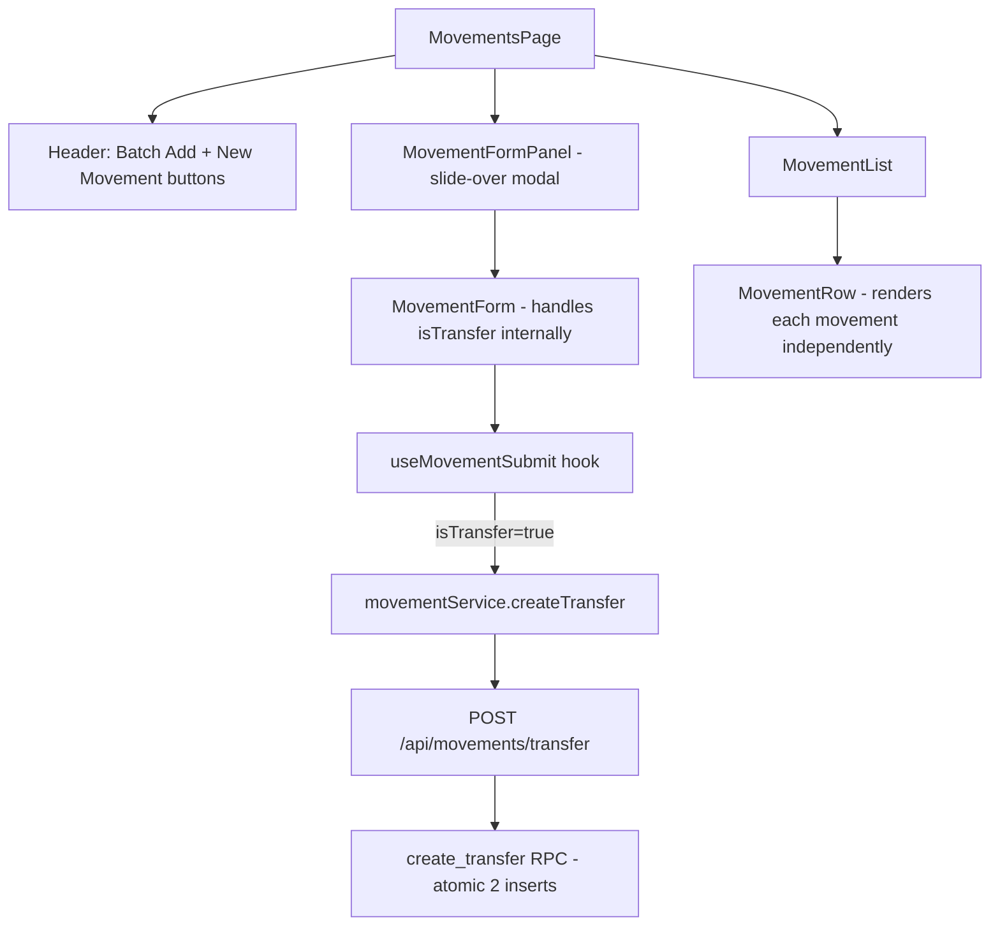
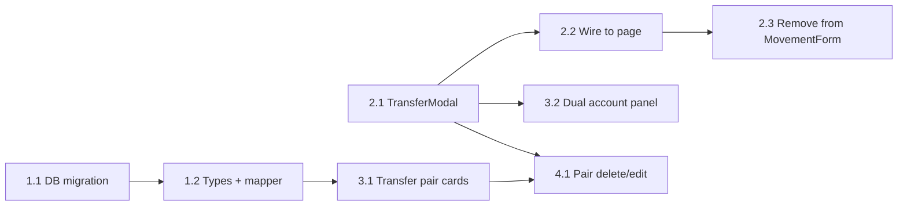

# Transfer UX Rethink — Task Breakdown

## Summary

Transfers currently live inside the generic MovementForm as a "Transfer" option in the type dropdown. The backend creates two atomic movements (expense + income) via `create_transfer` RPC. **There is no `transfer_id` or linking column** — transfer pairs are only identifiable by matching notes (`"Transfer to target: ..."` / `"Transfer from source: ..."`) and identical `created_at` timestamps.

### Key Findings

| Aspect | Current State |
|--------|--------------|
| UI entry point | "Transfer" option in type dropdown inside MovementForm |
| Modal | Reuses MovementForm with `isTransfer` state toggle |
| Backend | `POST /api/movements/transfer` → `create_transfer` RPC (atomic, two inserts) |
| DB linking | **None** — no `transfer_pair_id` column. Pairs share `created_at` + note prefix |
| Movement list | Transfer movements render as two independent rows |
| Account details panel | Exists (`AccountContextPanel`) but only shows source account |

### Architecture Diagram

---

## Task Breakdown

### Wave 1 — DB + Service Layer (no UI changes)

#### Task 1.1: Add `transfer_pair_id` column to movements table
- **Files**: `backend/migrations/0XX_transfer_pair_id.sql`
- **Work**: 
  - Add nullable `transfer_pair_id UUID` column to `movements` table
  - Update `create_transfer` RPC to generate a shared UUID and set it on both movements
  - Backfill existing transfers by matching `created_at` + note prefix pattern
- **Dependencies**: None
- **Size**: Small

#### Task 1.2: Expose `transferPairId` in frontend types + mapper
- **Files**: `frontend/src/types/index.ts`, `frontend/src/services/mappers.ts`
- **Work**:
  - Add `transferPairId?: string` to `Movement` interface
  - Map `transfer_pair_id` in `mapMovementRow`
- **Dependencies**: Task 1.1
- **Size**: Small

---

### Wave 2 — Transfer Modal (parallel tasks)

#### Task 2.1: Create dedicated TransferModal component
- **Files**: `frontend/src/components/movements/TransferModal.tsx`, `frontend/src/components/movements/TransferForm.tsx`
- **Work**:
  - Source → Target layout with account/pocket selectors on each side
  - Swap button (↔) that flips source/target
  - Balance preview for both source and target pockets (current → projected)
  - Auto-generated notes field: `"Transfer from {SourceAccount}/{SourcePocket} to {TargetAccount}/{TargetPocket}"`
  - Date picker, amount input, optional custom notes suffix
  - Reuse `AccountPocketSelector` component for each side
- **Dependencies**: None (can use existing `movementService.createTransfer`)
- **Size**: Medium

#### Task 2.2: Add Transfer button to MovementsPage header + wire modal
- **Files**: `frontend/src/pages/MovementsPage.tsx`
- **Work**:
  - Add "Transfer" button between existing "Batch Add" and "New Movement" buttons (use `ArrowLeftRight` icon from lucide)
  - Add `showTransferModal` state
  - Render `TransferModal` conditionally
  - On success: invalidate queries, show toast
- **Dependencies**: Task 2.1
- **Size**: Small

#### Task 2.3: Remove Transfer from MovementForm type dropdown
- **Files**: `frontend/src/components/movements/MovementForm.tsx`
- **Work**:
  - Remove `MOVEMENT_TYPE_OPTIONS_WITH_TRANSFER` constant
  - Remove `isTransfer` state and all conditional transfer UI (target account/pocket selectors)
  - Remove `isTransfer` from `MovementFormData` interface
  - Clean up `onFormSubmit` — no more transfer branch
  - Update `useMovementSubmit` to remove `isTransfer` handling (transfer now goes through TransferModal directly)
- **Dependencies**: Task 2.2 (transfer button must exist first)
- **Size**: Small

---

### Wave 3 — Movement List Visual Distinction

#### Task 3.1: Group transfer pairs in MovementList
- **Files**: `frontend/src/components/movements/MovementList.tsx`, `frontend/src/components/movements/TransferCard.tsx`
- **Work**:
  - Pre-process movements array: group by `transferPairId` into pairs
  - Create `TransferCard` component that renders a combined card:
    - Shows source → target with arrow
    - Single amount (not duplicated)
    - Both account/pocket names
    - Edit/delete actions affect the pair
  - Non-transfer movements render as before (`MovementRow`)
  - Handle edge case: orphaned half-transfers (one side deleted) — render as normal row
- **Dependencies**: Task 1.2
- **Size**: Medium

#### Task 3.2: Account details panel for transfers
- **Files**: `frontend/src/components/movements/TransferModal.tsx` (update), `frontend/src/components/movements/AccountContextPanel.tsx` (minor)
- **Work**:
  - In TransferModal, show dual account context: source balance on left, target balance on right
  - Show projected balances (source - amount, target + amount) with delta indicators
  - Handle cross-currency transfers: show converted amount on target side
- **Dependencies**: Task 2.1
- **Size**: Small

---

### Wave 4 — Polish

#### Task 4.1: Transfer pair delete/edit behavior
- **Files**: `frontend/src/hooks/actions/useMovementRowActions.ts`, `frontend/src/services/movementService.ts`
- **Work**:
  - When deleting a transfer movement, prompt "Delete both sides of this transfer?"
  - If yes, delete both movements by `transferPairId`
  - Add `deleteTransferPair(transferPairId: string)` to service (deletes both)
  - Edit opens TransferModal pre-filled with pair data
- **Dependencies**: Tasks 3.1, 2.1
- **Size**: Small

---

## Dependency Graph

**Parallelism**: Wave 1 and Wave 2 (Tasks 2.1) can run in parallel. Wave 3 tasks can run in parallel with each other once their deps are met.

## Notes

- The `create_transfer` RPC currently hardcodes note prefixes (`"Transfer to target"` / `"Transfer from source"`). The new modal should pass meaningful notes like `"Transfer from Savings/USD to Checking/COP"` and the RPC should use them directly (or the note generation moves to frontend).
- Cross-currency transfers: the current RPC uses the same `amount` for both sides. If source is USD and target is COP, the UI should show the converted amount but the backend stores raw amounts. This is existing behavior — no change needed now, but the TransferModal should display the conversion for clarity.
- The backfill migration (Task 1.1) should match pairs by: same `user_id`, same `created_at` (exact match), one `EgresoNormal` + one `IngresoNormal`, notes starting with `"Transfer"`.
